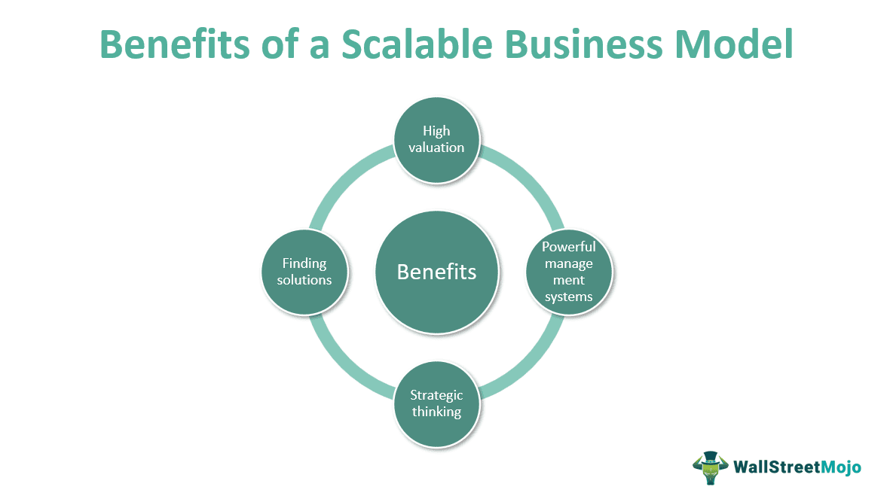

Scalability is a pivotal concept in modern business operations, particularly within today's rapidly evolving global market. It enables companies to expand their capacity and enter new markets with minimal impact on operational costs, ensuring that growth does not lead to disproportionate expenses or resource constraints. This is achieved by implementing strategies that allow businesses to accommodate increased demand seamlessly, which is essential for maintaining competitive advantage.

In this article, we examine the essence of scalability, providing examples of companies that have successfully harnessed this principle. We'll also address the specific application of scalability in algorithmic trading, a sector that exemplifies the benefits of scalability by efficiently managing large trade volumes through advanced technology. Algorithmic trading leverages computational power to execute trades quickly and accurately, optimizing operations without the need for proportional increases in workforce or infrastructure.



Scalability's importance is particularly pronounced in financial markets, where it allows firms to respond adeptly to fluctuations and capitalize on new opportunities. By exploring the role of scalability, particularly in algorithmic trading, we aim to shed light on how businesses can achieve sustainable growth and enhanced operational efficiency.

## Table of Contents

## What is Scalability?

Scalability refers to the capacity of a company to grow seamlessly without being constrained by its organizational structure or available resources when production demands increase. This attribute allows businesses to adapt to higher workloads or market demands without encountering performance bottlenecks or diminished revenue. A central aspect of scalability is the implementation of streamlined processes that facilitate efficient growth. Companies often employ automated systems to reduce manual intervention, thereby enhancing operational efficiency.

A scalable business model typically incorporates strategies designed to support growth and maintain efficiency. These strategies may include refining supply chains, optimizing resource allocation, and leveraging technology to automate business functions. This approach not only aids in the smooth handling of increased demands but also ensures that costs do not rise in direct proportion to growth. Instead, the goal is to achieve significant expansion while maintaining or even reducing operational expenses relative to revenue growth.

In practice, scalability enables companies to enhance profitability by expanding their market reach and operational capabilities. For example, by utilizing automated systems, a company can manage more extensive operations with the same or fewer resources, thus driving up profit margins. Moreover, scalable operations are often better equipped to adapt to changing market conditions, providing a competitive edge and facilitating long-term growth.

Scalability, therefore, is a foundational principle for businesses aiming to achieve sustained growth and efficiency. By focusing on streamlined processes and automation, companies can prepare themselves to handle future demands and capitalize on new market opportunities without being hindered by existing operational constraints.

## Business Examples of Scalability

Scalability is a crucial characteristic that defines the success of businesses, particularly in technology and finance sectors. In technology, scalability is exemplified by the ability of companies to expand their operations globally, efficiently handling increased demand without a significant rise in operational costs. Google, Amazon, and Netflix are prime examples of companies that have mastered this art. Through strategic infrastructure investments and innovative technological solutions, these companies have managed to serve expanding user bases across diverse geographical regions while maintaining cost-effectiveness.

Google's scalability is evident through its vast server farms and data centers that power its search engine, cloud services, and various applications. Google employs advanced algorithms to optimize data processing and storage, ensuring quick response times for millions of users worldwide. This ability to handle drastic increases in demand without compromising service quality underscores its scalability.

Similarly, Amazon's journey from a small online bookstore to a global e-commerce leader exemplifies scalability. Amazon Web Services (AWS), its cloud computing division, plays an essential role in this growth by providing scalable cloud solutions to businesses and individuals. This infrastructure allows Amazon to adjust its resource allocation dynamically subject to fluctuating demands, thereby optimizing performance and cost.

Netflix's scalability story revolves around its efficient content delivery network. By investing in distributed data servers and utilizing advanced data analytics, Netflix efficiently streams content to millions of global subscribers. This scalability ensures that as its subscriber base grows, it can continue to provide seamless viewing experiences without incurring proportional increases in cost.

In the gig economy, companies like Airbnb and Uber have exhibited remarkable scalability by leveraging technology to expand services across multiple cities without possessing significant physical assets. Rather than scaling traditional infrastructure, these platforms depend on digital architecture to connect users and providers efficiently over vast networks.

Airbnb facilitates a global network of accommodations through a digital platform, enabling travelers to find and book stays in different locations without Airbnb needing to own these properties. This model allows scalable expansion with minimal direct investment in properties, resulting in operational flexibility and reduced costs.

Similarly, Uber's scalability lies in its platform-based approach, connecting drivers with passengers through a robust mobile application. By relying on a network of independent contractors rather than a fleet of company-owned vehicles, Uber can quickly scale operations into new markets, adapting to local regulations and demand without heavy physical investment.

These tech companies' success stories are underpinned by their ability to leverage digital platforms and data-driven strategies, efficiently managing operations and growth. Such scalability allows them to stay competitive in rapidly evolving markets, sustaining profitability and market reach on a global scale.

## Scalable Companies in Algorithmic Trading

Algorithmic trading firms exemplify scalability by executing large volumes of trades with precision and speed. These firms leverage technological advancements to process vast quantities of market data, enabling them to execute trades and strategies that maximize efficiency and effectiveness. One of the most prominent examples of such a firm is Renaissance Technologies, renowned for producing exceptional returns. Renaissance Technologies achieves this through highly scalable trading models, powered by sophisticated algorithms and significant computational resources. This scalability is fundamental to handling high trading volumes and employing complex strategies without a decline in performance.

The success of scalable companies in [algorithmic trading](/wiki/algorithmic-trading) is largely attributed to their use of advanced computational power and data analysis techniques. Technologies such as [artificial intelligence](/wiki/ai-artificial-intelligence) and [machine learning](/wiki/machine-learning) allow these companies to swiftly optimize market inefficiencies. For instance, by analyzing historical market data and trading patterns, these firms can identify profitable trading opportunities and execute trades at speeds far beyond human capability.

The importance of scalability in algorithmic trading is underscored by its ability to accommodate increasing volumes and complexity of trades. A scalable trading system can handle multiple trading strategies concurrently, ensuring operational efficiency and enhancing profitability. Key to this capability is the firm's infrastructure, which often includes high-speed computing systems capable of processing vast datasets and executing trades in microseconds.

In practice, algorithmic trading firms use code to develop and test trading algorithms. For example, a basic Python script might be utilized to analyze market data and execute trades autonomously. Below is a simple example of how such a script might be structured:

```python
import numpy as np
import pandas as pd
from trading_platform import execute_trade

# Load historical market data
market_data = pd.read_csv('market_data.csv')

# Define trading strategy
def trading_strategy(market_data):
    signals = []
    for i in range(1, len(market_data)):
        # Simple moving average strategy
        if market_data['price'][i] > np.mean(market_data['price'][:i]):
            signals.append('buy')
        else:
            signals.append('sell')
    return signals

# Execute trades based on strategy
trade_signals = trading_strategy(market_data)
execute_trade(trade_signals)
```

This code provides a simplified framework for implementing a trading strategy that uses past price data to inform buy and sell decisions. A scalable algorithmic trading system would build upon this concept, utilizing far more sophisticated algorithms and high-frequency data to process and execute trades efficiently.

Overall, scalability in algorithmic trading firms allows for substantial market participation without proportional increases in operational costs, thereby ensuring competitiveness and sustained profitability. The ability to process vast amounts of data at high speeds without compromising accuracy or efficiency is a significant competitive advantage in today's fast-paced financial markets.

## Key Factors Making a Company Scalable

Streamlined and efficient operations are essential for achieving scalability in business. Companies that can grow rapidly while maintaining costs benefit from a competitive advantage. This efficiency is often realized through the implementation of advanced technologies such as cloud computing, automation, and data analytics.

Cloud computing is a pivotal technology that supports scalability by providing businesses with expansive and flexible computing resources. Companies can scale their IT infrastructure up or down based on demand, ensuring they only pay for what they use. This elasticity allows businesses to handle increased workloads without investing in physical hardware, thereby reducing costs and improving operational efficiency. 

Automation is another crucial component in fostering scalability. By automating repetitive and time-consuming tasks, companies can increase productivity and reduce the potential for human error. Automated systems ensure that operations continue seamlessly even as demand grows, enabling businesses to allocate resources more effectively and focus on strategic initiatives. 

Data analytics plays a significant role in scalable growth by providing insights that help businesses make informed decisions. By analyzing vast amounts of data, companies can identify trends, optimize processes, and predict customer behavior. This data-driven approach allows businesses to adapt their strategies in real-time, enhancing their capacity to scale efficiently.

Leadership and a clear strategic vision are fundamental in guiding scalable growth. Leaders must be adept at identifying opportunities for scaling and align the company's resources and efforts towards achieving those goals. A strategic vision provides a roadmap that informs daily operations and long-term planning, ensuring that all organizational levels support scalable growth.

Finally, a robust business model that can easily adapt and evolve with market changes is crucial. A flexible business model allows companies to pivot swiftly in response to new opportunities or challenges, maintaining their scalability. This adaptability ensures that businesses can sustain growth while continuing to provide value to their customers and stakeholders.

## Scalability in Algorithmic Trading: A Detailed Look

Algorithmic trading utilizes sophisticated computer programs to execute trading strategies based on predefined criteria without human intervention. This automation enables firms to operate efficiently in fast-paced financial markets. Scalability plays a pivotal role in this efficiency, allowing trading systems to process numerous complex strategies concurrently, thereby enhancing both efficiency and profitability.

### Scalable Trading Systems

Scalable trading systems are designed to handle large volumes of transactions and execute multiple strategies simultaneously. This capability is crucial in algorithmic trading, where milliseconds can determine the success of a trade. These systems employ advanced computational power, which facilitates the quick execution of complex algorithms. For instance, a trading system could deploy various strategies such as statistical [arbitrage](/wiki/arbitrage), [market making](/wiki/market-making), or [trend following](/wiki/trend-following), all at once, and across different asset classes and markets.

### Key Technologies Supporting Scalability

Several core technologies underpin the scalability of algorithmic trading systems:

1. **High-Speed Computing**: The ability to perform calculations at lightning speed is fundamental. High-frequency trading firms invest heavily in cutting-edge hardware and optimized software to minimize latency and increase throughput. This ensures that orders are executed at the optimal price, enhancing trading efficiency.

2. **Artificial Intelligence (AI)**: AI and machine learning algorithms are increasingly integrated into trading systems to analyze complex data sets and identify patterns that might not be apparent to human traders. This allows for the development of adaptive strategies that can optimize themselves over time, further enhancing system scalability.

3. **Real-Time Data Analysis**: Access to real-time data feeds is critical for algorithmic trading. Systems are designed to ingest, process, and analyze vast amounts of data from global stock exchanges continuously. This real-time analysis enables trading systems to quickly adapt to market conditions and execute trades with precision.

### Expanding Market Reach and Transaction Volumes

Scalability in algorithmic trading not only pertains to processing power but also to the capability to expand operational reach. A scalable system can effortlessly extend its trading activities across global markets, accommodating a larger number of asset types and instruments. Moreover, it can handle increased transaction volumes without compromising performance, a critical [factor](/wiki/factor-investing) for firms aiming to maximize their market impact.

For example, consider a Python script used to simulate a basic scalable trading strategy:

```python
import numpy as np

def execute_trade_strategy(prices, buy_threshold, sell_threshold):
    positions = []
    for price in prices:
        if price < buy_threshold:
            positions.append("Buy")
        elif price > sell_threshold:
            positions.append("Sell")
        else:
            positions.append("Hold")
    return positions

# Simulating with random price data
np.random.seed(42)
price_data = np.random.normal(100, 10, 1000)  # Random price data
buy_threshold = 95
sell_threshold = 105
trades = execute_trade_strategy(price_data, buy_threshold, sell_threshold)
print(trades[:10])  # Display first 10 trade decisions
```

In this example, the script quickly processes a stream of price data to determine the appropriate trading actions based on predefined thresholds. Such automation is key to managing high transaction volumes efficiently.

### Conclusion

Scalability in algorithmic trading is critical for maintaining competitive advantage in dynamic financial markets. By leveraging high-speed computing, AI, and real-time data analysis, trading firms can process complex strategies, expand into new markets, and manage significant transaction volumes effectively. This not only maximizes profitability but also positions firms for sustained growth and success.

## Conclusion

Scalability remains a cornerstone for modern businesses striving for efficient growth and market expansion. The ability to grow with minimal incremental costs allows companies to harness new opportunities and effectively respond to evolving market demands. This capability is particularly crucial in sectors such as technology and finance, where rapid changes and intense competition are constants. Tech giants and financial institutions leverage scalability to maintain a competitive edge and drive profitability, often utilizing advances in digital platforms and data analytics to achieve these aims.

In algorithmic trading, scalability plays a pivotal role in enabling firms to navigate dynamic market conditions successfully. By harnessing scalable trading systems, companies can seamlessly process high volumes of transactions and rapidly adjust to market fluctuations, thereby optimizing performance and enhancing returns. Technologies like high-speed computing, artificial intelligence, and real-time data analysis exemplify the tools that support such scalable practices.

Understanding and implementing scalability is essential for any enterprise aiming to succeed in today's global economy. Companies that prioritize scalable strategies can dynamically adapt their operations, ensuring sustained growth and resilience against market [volatility](/wiki/volatility-trading-strategies). By embedding scalability into their core operations, businesses can unlock new levels of efficiency and innovation, positioning themselves favorably in the competitive landscape of the modern marketplace.

## References & Further Reading

[1]: Bergstra, J., Bardenet, R., Bengio, Y., & Kégl, B. (2011). ["Algorithms for Hyper-Parameter Optimization."](https://papers.nips.cc/paper/4443-algorithms-for-hyper-parameter-optimization) Advances in Neural Information Processing Systems 24.

[2]: ["Advances in Financial Machine Learning"](https://www.amazon.com/Advances-Financial-Machine-Learning-Marcos/dp/1119482089) by Marcos Lopez de Prado

[3]: Aronson, D. (2007). ["Evidence-Based Technical Analysis: Applying the Scientific Method and Statistical Inference to Trading Signals."](https://www.amazon.com/Evidence-Based-Technical-Analysis-Scientific-Statistical/dp/0470008741) John Wiley & Sons.

[4]: Jansen, S. (2020). ["Machine Learning for Algorithmic Trading."](https://github.com/stefan-jansen/machine-learning-for-trading) Packt Publishing.

[5]: Chan, E. P. (2008). ["Quantitative Trading: How to Build Your Own Algorithmic Trading Business."](https://github.com/ftvision/quant_trading_echan_book) John Wiley & Sons.

[6]: Luckow, A., Weiland, M., Djerekarov, E., & Grunzke, R. (2010). ["Service-oriented computing for high performance computing."](https://www.academia.edu/122974805/A_Study_on_the_Performance_of_Reproducible_Computations) IEEE Computer Society.

[7]: Iyengar, N. (2009). ["Achieving Scalability in Cloud Computing."](https://www.mega.com/blog/what-is-scalability-in-cloud-computing) Springer.

[8]: Kearns, M., & Nevmyvaka, Y. (2013). ["Machine Learning for Market Microstructure and High Frequency Trading."](https://www.cis.upenn.edu/~mkearns/papers/KearnsNevmyvakaHFTRiskBooks.pdf) Springer.