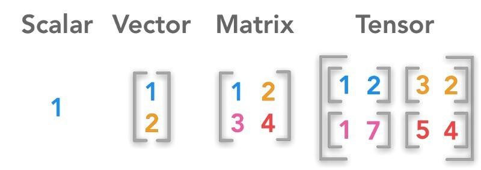

## Table of Contents

## What is scalar in the context of machine learning?

In the context of machine learning, a scalar is a single numerical value, like a number you can write down or type into a calculator. Think of it as a simple piece of data that doesn't have any direction or extra parts to it. For example, if you're measuring the temperature outside, the number you get, like 25 degrees Celsius, is a scalar. It's just one number that tells you something about the world.

Scalars are important in machine learning because they are used in many calculations and algorithms. For instance, when you're trying to predict a house's price, the final prediction is often a single number, which is a scalar. In formulas, scalars are usually represented by lowercase letters, like $$a$$ or $$b$$. They can be added, subtracted, multiplied, or divided just like regular numbers, making them fundamental building blocks in more complex mathematical operations used in machine learning models.

## How does a scalar differ from other data types in machine learning?

A scalar is the simplest type of data in machine learning. It's just one number, like 5 or 3.14. Think of it as a single piece of information that doesn't have any direction or extra parts. For example, if you're measuring the height of a person, the number you get, like 175 cm, is a scalar. In math, scalars are often represented by lowercase letters, like $$a$$ or $$b$$. They can be used in basic operations like addition, subtraction, multiplication, and division.

In contrast, other data types in machine learning can be more complex. A vector, for instance, is a list of numbers that can represent things like directions or multiple measurements. If you're tracking the position of a car, you might use a vector with three numbers to show its x, y, and z coordinates. A matrix is like a grid of numbers and can be used to represent more complicated relationships, like the connections in a neural network. Tensors are even more general and can have any number of dimensions, making them useful for advanced machine learning models. While scalars are simple and easy to work with, these other data types allow for more detailed and complex representations of data.

## Can you explain the role of scalars in basic mathematical operations used in machine learning?

In machine learning, scalars play a crucial role in basic mathematical operations. They are the building blocks for more complex calculations. For example, when you're training a model, you often need to calculate the error between your prediction and the actual value. This error is usually a scalar, like the difference between two numbers. If your prediction is 10 and the actual value is 8, the error is $$10 - 8 = 2$$. Scalars are also used in operations like scaling features, where you multiply each feature by a scalar to adjust its importance or range. This can be important for algorithms that are sensitive to the scale of the input data.

Scalars are also essential in operations like dot products and matrix multiplications, which are common in machine learning. For instance, when you compute the dot product of two vectors, you multiply each pair of corresponding elements and then sum up these products to get a single scalar result. This scalar can tell you things like how similar two vectors are. In neural networks, the weights connecting neurons are often scalars, and they are multiplied by the input values to compute the output of a neuron. So, even though machine learning deals with complex data structures, scalars are always there, helping to perform the basic math that makes everything work.

## What are some common examples of scalar values used in machine learning models?

In machine learning models, scalar values are everywhere. One common example is the loss or error value, which is a single number that tells you how well your model is doing. When you train a model, you want to make this number as small as possible. For instance, if you're predicting house prices, the difference between your prediction and the actual price is a scalar, like $$100000 - 95000 = 5000$$. This scalar helps guide the model to learn and improve.

Another example of a scalar in machine learning is the weight of a feature in a model. If you're using a simple linear regression model to predict something, each feature has a weight, which is a scalar. For example, if you're predicting a person's weight based on their height, the weight for the height feature might be a scalar like 0.7. This scalar tells you how much the height affects the predicted weight. Scalars are also used in operations like scaling or normalizing data, where you might multiply each feature by a scalar to make all the features have a similar range, which can help some algorithms work better.

## How are scalars used in loss functions and optimization algorithms?

In machine learning, scalars play a key role in loss functions and optimization algorithms. A loss function measures how well your model is doing by comparing its predictions to the actual values. This comparison results in a single number, a scalar, which tells you the error or loss. For example, if you're predicting house prices, the loss might be the difference between your prediction and the actual price, like $$100000 - 95000 = 5000$$. This scalar value guides the model to learn and improve by showing how far off the predictions are. The goal is to make this scalar as small as possible, which means the model is getting better at making accurate predictions.

Optimization algorithms use these scalar loss values to adjust the model's parameters. For instance, in gradient descent, which is a common optimization method, the algorithm calculates the gradient of the loss function, which is a vector showing the direction of the steepest increase in loss. But the key part is the learning rate, which is a scalar that determines how big of a step the algorithm takes in the opposite direction of the gradient. If the learning rate is too big, the algorithm might overshoot the best solution; if it's too small, it might take too long to find it. By carefully choosing this scalar, you can help the model find the best parameters to minimize the loss and improve its performance.

## What is the importance of scalar normalization in feature preprocessing?

Scalar normalization is really important in feature preprocessing because it helps make sure all your data is on the same scale. Imagine you're trying to predict house prices, and you have features like the number of bedrooms (which might range from 1 to 5) and the size of the house in square feet (which could range from 1000 to 5000). If you don't normalize these features, the size of the house might have a much bigger impact on your predictions just because the numbers are larger. By normalizing, you turn these features into scalars that are on a similar scale, usually between 0 and 1 or with a mean of 0 and a standard deviation of 1. This makes it easier for your machine learning model to learn from the data and can improve its performance.

Normalization helps a lot with certain types of machine learning algorithms, like those that use gradient descent for optimization. These algorithms work better when all the features are on the same scale because it helps them move more smoothly towards the best solution. If one feature is much larger than the others, it might cause the algorithm to take big jumps in that direction, making it hard to find the right answer. By turning all features into scalars with similar ranges, you help the algorithm learn more effectively and reach better predictions. For example, if you're using a neural network, normalizing the inputs can make training faster and more stable, leading to better results.

## How do scalars impact the performance of neural networks?

Scalars play a big role in how well neural networks work. When you're training a neural network, you use scalars like the weights of the connections between neurons. These weights are just single numbers that you adjust to make the network better at its job. If the weights are too big or too small, it can make the network learn slowly or even mess up the learning process. So, getting these scalars right is important for the network to learn quickly and accurately. For example, if you're using a learning rate, which is a scalar that tells the network how big of a step to take when learning, a good choice can make training faster and more stable.

Another way scalars affect neural networks is through loss functions. The loss function gives you a single number, a scalar, that tells you how well the network is doing. If this scalar is high, it means the network's predictions are far off from the real answers, and you need to keep training. If it's low, the network is doing a good job. By using this scalar to guide the training, you can help the network find the best weights to make accurate predictions. For example, if you're trying to predict house prices, the difference between your prediction and the actual price, like $$100000 - 95000 = 5000$$, is a scalar that helps the network learn to do better.

## What are scalar-valued functions and their applications in machine learning?

Scalar-valued functions in machine learning are functions that take in some input and give you back a single number, a scalar. Think of them like a recipe that you follow to get one final result. In machine learning, these functions are super important because they help us measure how well our models are doing. For example, a loss function is a scalar-valued function that takes in the model's predictions and the real answers, and it gives you back a single number that tells you how far off your predictions are. If this number is small, it means your model is doing a good job. If it's big, you need to keep training to make it better.

These functions are used a lot in optimization algorithms, like gradient descent. In gradient descent, you use the scalar output of the loss function to figure out how to adjust the weights of your model to make the predictions better. The gradient, which shows you the direction to move to reduce the loss, is calculated based on the scalar output. The learning rate, another scalar, tells you how big of a step to take in that direction. By carefully choosing and using these scalar-valued functions, you can help your machine learning models learn more effectively and make better predictions.

## Can you describe how scalars are used in gradient descent?

In gradient descent, scalars are super important because they help us figure out how to make our machine learning model better. The main scalar we use is the loss, which is just a single number that tells us how far off our predictions are from the real answers. We want this number to be as small as possible. To do this, we calculate something called the gradient, which is like a map showing us the direction we need to go to make the loss smaller. The gradient itself is a vector, but it's calculated based on the scalar loss value. We use this gradient to adjust the weights of our model, which are also scalars, to move in the right direction.

The learning rate is another important scalar in gradient descent. It's a single number that tells us how big of a step to take when we're adjusting our model's weights. If the learning rate is too big, we might overshoot the best solution and make our model worse. If it's too small, it might take a long time to get to the best answer. So, choosing the right learning rate is key. We update our weights using a simple formula: $$w = w - \text{learning_rate} \times \text{gradient}$$. This formula shows how we use scalars to make our model learn and improve over time.

## What advanced techniques involve scalars in deep learning architectures?

In deep learning, scalars are used in advanced techniques like regularization, which helps prevent the model from overfitting to the training data. One common regularization method is L2 regularization, where a penalty term is added to the loss function. This penalty is calculated using the weights of the model, which are scalars. The penalty term is a scalar that is added to the loss, making the model's total loss a combination of the prediction error and the size of the weights. By including this scalar penalty, the model is encouraged to keep its weights small, which can lead to better generalization on new data. The formula for L2 regularization is $$L_{\text{total}} = L_{\text{original}} + \lambda \sum_{i} w_i^2$$, where $$L_{\text{total}}$$ is the total loss, $$L_{\text{original}}$$ is the original loss, $$\lambda$$ is a scalar that controls the strength of the regularization, and $$w_i$$ are the weights of the model.

Another advanced technique that involves scalars is batch normalization, which helps stabilize the training of deep neural networks. Batch normalization adjusts the inputs to each layer so that they have a mean of zero and a standard deviation of one. This is done using two scalars: the mean and the standard deviation of the inputs in a mini-batch. By normalizing the inputs, batch normalization reduces the internal covariate shift, which can speed up training and improve the model's performance. The process involves calculating the mean and variance of the inputs, which are scalars, and then using these to normalize the inputs. The formulas for batch normalization are $$\hat{x} = \frac{x - \mu_B}{\sqrt{\sigma_B^2 + \epsilon}}$$ and $$y = \gamma \hat{x} + \beta$$, where $$\mu_B$$ and $$\sigma_B^2$$ are the mean and variance of the mini-batch, $$\epsilon$$ is a small scalar for numerical stability, and $$\gamma$$ and $$\beta$$ are learnable scalars that allow the model to scale and shift the normalized values.

## How do scalars play a role in hyperparameter tuning?

In machine learning, scalars are super important when you're trying to find the best settings for your model, which is called hyperparameter tuning. Hyperparameters are like the knobs you turn to make your model work better, and they are usually scalars. For example, the learning rate in gradient descent is a scalar that you might want to change to see if it makes your model learn faster or better. When you're tuning hyperparameters, you try different values for these scalars and see how they affect your model's performance. You might use a grid search, where you test a bunch of different scalar values, or a random search, where you pick random scalar values to try. The goal is to find the right scalars that make your model as good as it can be.

One way to use scalars in hyperparameter tuning is through techniques like cross-validation. You split your data into different parts and test your model with different scalar values for the hyperparameters on each part. The model's performance, which is measured by a scalar like accuracy or loss, helps you decide which scalar values work best. For example, if you're tuning the learning rate, you might try values like $$0.01$$, $$0.1$$, and $$1.0$$ and see which one gives you the lowest loss. By carefully choosing and testing these scalar values, you can make sure your model is set up just right to do its job well.

## What are the challenges and considerations when dealing with scalar outputs in complex models?

When dealing with scalar outputs in complex models, one of the main challenges is making sure the scalar accurately represents the model's performance. In a big neural network, the final output might be a single number, like the loss or a prediction. But this scalar can hide a lot of details. For example, if you're predicting house prices, the scalar output might be the average error across all predictions. But this doesn't tell you if the model is doing well for some houses and badly for others. So, you need to be careful and look at other ways to check how well the model is doing, like looking at the errors for different groups of data.

Another consideration is how sensitive the model is to small changes in the scalar inputs or hyperparameters. In deep learning, small changes in the learning rate, which is a scalar, can make a big difference in how well the model learns. If the learning rate is too high, the model might not learn properly and could even get worse. If it's too low, it might take a long time to train. So, finding the right scalar values for hyperparameters is really important. You might need to try a lot of different values, like $$0.01$$, $$0.1$$, and $$1.0$$, to see which one works best. This process, called hyperparameter tuning, can be tricky but is key to getting good results from your model.