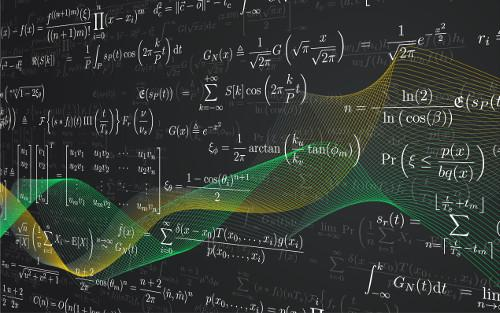

In algorithmic trading, data structures significantly influence the efficiency and accuracy of trading strategies. Among the numerous data structures, tensors and matrices stand out due to their ability to manage substantial datasets effectively. This article examines the crucial distinctions between tensors and matrices, alongside their respective applications in the domain of algorithmic trading. By comprehending how these data structures affect trading strategies and their execution in modern trading systems, traders can optimize their decision-making processes. Additionally, this analysis aims to empower readers with the knowledge to determine when to utilize a tensor versus a matrix in trading algorithms, ensuring they harness the best tools for their specific data and strategy requirements.

## Table of Contents



## Understanding Matrices

Matrices serve as fundamental building blocks in mathematical computations, widely recognized for their use as two-dimensional arrays of numbers. In algorithmic trading, matrices are pivotal in representing datasets such as historical prices, financial indicators, and correlation matrices. Their utility is derived from their structural simplicity, which facilitates straightforward mathematical operations essential for swift computations.

For example, consider a matrix $A$ of historical prices, where each row represents a different asset and each column corresponds to a specific time point. Mathematical operations on matrix $A$, such as addition, subtraction, and multiplication, enable traders to efficiently calculate moving averages, determine asset correlations, or optimize portfolios. The ability to perform these operations quickly is critical in a high-frequency trading environment where time is of the essence.

Despite their advantages, matrices are confined to two dimensions, limiting their application in scenarios involving multi-dimensional data. This constraint can make it challenging to capture complex data structures that extend beyond two variables.

For instance, in Python, matrix operations can be executed using libraries like NumPy, which provides robust tools for handling matrix data. An example of matrix multiplication using NumPy is as follows:

```python
import numpy as np

# Define two matrices
matrix_a = np.array([[1, 2], [3, 4]])
matrix_b = np.array([[5, 6], [7, 8]])

# Perform matrix multiplication
result = np.dot(matrix_a, matrix_b)

print(result)
```

Understanding the inherent properties and limitations of matrices is paramount to their effective application in trading algorithms. Traders must recognize when a matrix suits their needs or when their data complexities necessitate more advanced data structures, such as tensors, that can extend beyond the two-dimensional paradigm. Balancing between the simplicity and speed offered by matrices and the need for capturing multi-dimensional data is crucial for designing efficient trading strategies.

## Exploring Tensors

Tensors extend matrices from two dimensions to n dimensions, representing data structures where each dimension encapsulates different aspects of the data. In [algorithmic trading](/wiki/algorithmic-trading), tensors effectively capture complex datasets, such as time-series data with multiple features or scenarios. This capability is essential when analyzing multi-variate data where numerous factors impact trading decisions simultaneously.

For instance, a trader may analyze stock market data over time, considering various indicators like price, [volume](/wiki/volume-trading-strategy), and [volatility](/wiki/volatility-trading-strategies). A three-dimensional tensor can represent this data, with dimensions corresponding to time, indicators, and stocks. This structure allows for more granular insight into how different indicators interact over time, offering a comprehensive view of market dynamics.

Tensors offer enhanced flexibility and scalability, pivotal for handling large and intricate datasets. They allow traders to manage data that grows not only in size but also in complexity, ensuring that trading strategies can evolve with market demands. The ability to navigate through large datasets efficiently is crucial for maintaining a competitive edge.

As [machine learning](/wiki/machine-learning) becomes integral to algorithmic trading, tensors have become indispensable. They are fundamental in implementing [deep learning](/wiki/deep-learning) models and neural networks, where multi-dimensional input is common. A prime example is the use of convolutional neural networks (CNNs), which require tensors for image-like input data processing. Here, tensor operations facilitate the transformation and normalization of inputs, ensuring the model can learn effectively from complex patterns inherent in the data.

Mastery of tensors enhances a trader's ability to develop sophisticated algorithms that process and analyze massive datasets efficiently. By harnessing tensor operations, traders can implement advanced machine learning models that provide predictive insights and detect nuanced patterns, optimizing trading decisions. The Python library, TensorFlow, exemplifies tools available for tensor manipulation, offering a wealth of functions for tensor operations that streamline the development of powerful algorithmic models.

In summary, tensors unlock new potentials in data analysis and model development, making them a crucial component of modern algorithmic trading strategies. Their ability to handle high-dimensional and voluminous data effectively allows traders to explore complex datasets marvelously, fostering innovation and precision in trading algorithms. As trading environments continue to evolve, the role of tensors is expected to grow, enabling even greater sophistication in algorithmic methodologies.

## Key Differences Between Tensors and Matrices

The fundamental difference between tensors and matrices is their dimensionality. Matrices are confined to two dimensions: rows and columns, represented mathematically as $M \in \mathbb{R}^{m \times n}$. This structure is suitable for a range of linear algebra operations but is limited when dealing with data requiring more complex interactions. Conversely, tensors are n-dimensional arrays that generalize matrices to higher dimensions, such as $T \in \mathbb{R}^{i \times j \times k}$ for a three-dimensional tensor. This generalization allows tensors to accommodate multi-modal data inputs, such as color images or time-series datasets augmented with additional features, which cannot be efficiently represented by matrices.

Tensors provide greater versatility in data representation. They can seamlessly integrate data from multiple sources and dimensions, supporting multi-modal analysis, which is crucial in algorithmic trading scenarios where varied data characteristics may need to be analyzed simultaneously. This capability is especially important in models incorporating diverse inputs, like those used in machine learning frameworks for predictive analytics. In such cases, tensors can manage data that has depth beyond the planar structure of a matrix.

While matrices can be manipulated with standard arithmetic operations, such as addition, subtraction, and multiplication, tensors enable more complex mathematical operations. These operations often leverage high-dimensional algebra, such as tensor decomposition or contraction, which are pivotal for efficiently processing high-dimensional data. For instance, in machine learning, tensors are integral in the computation of backpropagation in neural networks where weights and biases are updated through tensor operations.

From a computational perspective, tensors, due to their higher dimensionality, require more sophisticated algorithms and computational resources. Their processing often demands advanced techniques and optimizations, especially when dealing with massive data sets and real-time computations. This complexity necessitates careful consideration of computational resources, including memory and processing power, especially when implementing sophisticated algorithmic trading systems that rely on high throughput and low latency.

The understanding of these differences is crucial for traders when selecting the appropriate data structure. The choice between using a matrix or tensor should align with the nature of the data and the specific requirements of the algorithm. Traders dealing with two-dimensional datasets might opt for matrices due to their simplicity and lower computational cost. However, for strategies that entail multi-dimensional data or leverage complex models, such as deep learning, tensors offer the necessary flexibility and capabilities. Choosing the right data structure can significantly impact the efficiency and accuracy of trading algorithms by aligning data representation with the analysis needs and computational constraints.

## Applications in Algorithmic Trading

Matrices and tensors are integral in algorithmic trading, with each serving distinct yet complementary purposes based on the complexity and structure of the data being analyzed.

Matrices are prevalent in strategies focused on linear data analysis. A common use case in trading is calculating moving averages. A moving average is a widely used indicator in technical analysis that smooths out price data by creating a constantly updated average price. This is typically achieved by employing a matrix to manipulate historical price data. For instance, a matrix might store daily closing prices over a period, allowing traders to easily compute simple or exponential moving averages, which inform buy or sell decisions.

Another crucial application of matrices in trading is portfolio optimization through covariance matrices. These matrices are essential for understanding the relationships between different assets, helping traders to optimize the weighting of assets in a portfolio to minimize risk. By analyzing the covariance matrix, traders can understand how different assets correlate with each other, thus crafting a balanced and diversified portfolio.

On the other hand, tensors provide substantial advantages in scenarios that require multi-dimensional analysis. They are particularly useful in multi-[factor](/wiki/factor-investing) models or deep learning applications where data inputs are complex and voluminous. Tensors can store and process higher-dimensional data than matrices, making them indispensable for traders employing machine learning techniques. For example, a tensor might be employed to capture time-series data across various features such as price, volume, economic indicators, and market sentiment, all simultaneously.

For traders integrating machine learning into their strategies, tensors facilitate the deployment of deep learning models. These models are invaluable for predictive analysis and anomaly detection, assisting traders in identifying patterns and predicting future market movements. Tensors enhance feature extraction and model training, yielding more robust and adaptive trading strategies that can dynamically adjust to market conditions.

Choosing between matrices and tensors in algorithmic trading is heavily dependent on the data architecture and the required analytical depth. When dealing with inherently two-dimensional data or when simplicity and computational speed are crucial, matrices often suffice. However, when the data becomes multi-dimensional or when complex models are integrated, particularly with machine learning contexts, tensors offer a significant advantage due to their scalability and adaptability in handling larger datasets and more intricate computations.

Ultimately, the decision to use matrices or tensors should be guided by the nature of the trading strategy, the characteristics of the data, and the balance between computational complexity and resource availability. This strategic choice greatly affects the performance and capabilities of trading algorithms.

## When to Use a Tensor vs Matrix

In algorithmic trading, the choice between using a matrix or a tensor hinges on the complexity and dimensionality of the dataset in question, as well as the computational resources available and the nature of the trading strategy. 

Matrices are ideally suited for datasets that are inherently two-dimensional. This includes tasks where simplicity and speed are critical, such as calculating moving averages, variance, or correlation matrices for portfolio optimization. The operations on matrices, such as addition, subtraction, and multiplication, are computationally efficient and easy to interpret, making them an excellent choice for straightforward statistical methods. For example, a matrix can be used in a Python implementation to efficiently compute the covariance matrix using libraries like NumPy:

```python
import numpy as np

# Example of calculating a covariance matrix
data = np.array([[1, 2, 3], [4, 5, 6], [7, 8, 9]])
cov_matrix = np.cov(data, rowvar=False)
print(cov_matrix)
```

On the other hand, tensors are more appropriate when dealing with high-dimensional datasets that involve multiple features or scenarios, such as in predictive modeling or time-series analysis. They are particularly useful in machine learning contexts where the model might need to parse more complex and voluminous data, which offers opportunities for deeper insights and more sophisticated analysis.

However, it is essential to note that tensors require more significant computational power due to their complexity. This factor should be considered when deciding between these data structures, as it impacts both the development and execution of trading strategies. For example, using deep learning in trading strategies necessitates extensive feature extraction and model training, often facilitated by the flexibility of tensors:

```python
import torch

# Example of a 3D tensor in PyTorch
tensor_data = torch.tensor([[[1, 2], [3, 4]], [[5, 6], [7, 8]], [[9, 10], [11, 12]]])
print(tensor_data)
```

Understanding the nature of one's trading strategy is crucial when deciding between tensors and matrices. Predictive models, which might examine trends over time or input various market features simultaneously, could benefit from using tensors. In contrast, strategies that rely more heavily on statistical analyses might stick with matrices for ease of implementation and reduced computational demands.

Balancing the trade-offs between complexity and computational efficiency is essential. Tensors offer greater flexibility and accommodate complex data structures, but they come at the cost of higher computational requirements. Selecting the optimal data structure should ultimately align with the specific requirements and goals of the trading algorithm being employed.

## Conclusion

Tensors and matrices play vital roles in algorithmic trading, each providing distinct benefits and limitations tailored to different analytical needs. Understanding the nuances between these data structures is crucial, as it can dramatically influence the efficiency and potential success of trading algorithms. Matrices, limited to two dimensions, offer simplicity and speed, which makes them suitable for tasks involving linear computations and straightforward data manipulation, such as calculating moving averages or performing basic portfolio optimizations.

On the other hand, tensors provide the capability to handle multi-dimensional data, making them indispensable for complex model integrations, especially in machine learning and deep learning. This ability to accommodate higher-dimensional datasets allows for more intricate analysis and pattern recognition, essential for employing advanced trading strategies like predicting price movements with neural networks or conducting sophisticated anomaly detection.

As the financial industry advances, the use of tensors is likely to expand, paving the way for innovative trading methodologies that harness the power of big data and machine learning. Consequently, traders must carefully consider their data's nature and their algorithmic objectives when choosing between tensors and matrices. A well-thought-out decision in selecting these data structures can provide a competitive advantage, enabling traders to better navigate market complexities and optimize their algorithmic trading performance.

## References & Further Reading

[1]: ["Deep Learning"](https://en.wikipedia.org/wiki/Deep_learning) by Ian Goodfellow, Yoshua Bengio, and Aaron Courville

[2]: ["Numerical Python: A Practical Techniques Approach for Industry"](https://link.springer.com/book/10.1007/978-1-4842-0553-2) by Robert Johansson

[3]: ["Introduction to Machine Learning with Python: A Guide for Data Scientists"](https://www.amazon.com/Introduction-Machine-Learning-Python-Scientists/dp/1449369413) by Andreas C. Müller and Sarah Guido

[4]: Oliphant, T. E. (2006). ["A Guide to NumPy"](http://web.mit.edu/dvp/Public/numpybook.pdf)

[5]: ["Hands-On Machine Learning with Scikit-Learn, Keras, and TensorFlow"](https://books.google.com/books/about/Hands_On_Machine_Learning_with_Scikit_Le.html?id=HHetDwAAQBAJ) by Aurélien Géron