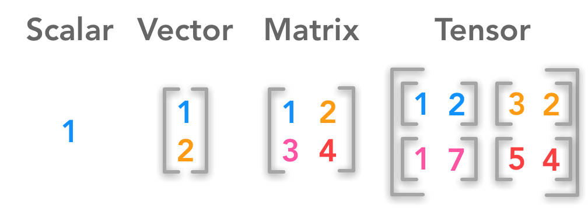

## Table of Contents

## What is a scalar in linear algebra?

In linear algebra, a scalar is just a single number. It's different from vectors or matrices, which have many numbers arranged in a specific way. Think of a scalar as something that can stretch or shrink a vector, but it doesn't change the direction of the vector. For example, if you multiply a vector by the scalar 2, the vector gets twice as long, but it still points in the same direction.

Scalars are important in many parts of linear algebra. They are used in operations like scalar multiplication, where you multiply a vector or a matrix by a single number. This can change the size of the vector or matrix, but not its shape or direction. Scalars also appear in equations and formulas, helping to describe relationships between different quantities in a simple way.

## How do vectors differ from scalars?

Vectors and scalars are both important in math, but they are different in some key ways. A scalar is just a single number, like 5 or -3. It doesn't have any direction, it's just a value. You can think of a scalar as something that can make things bigger or smaller, but it doesn't change the way they point. For example, if you have a temperature of 20 degrees, that's a scalar because it's just a number without any direction.

On the other hand, a vector has both a size (called magnitude) and a direction. Imagine you're giving directions to a friend. You might say, "Walk 3 blocks north." The "3 blocks" is the magnitude, and "north" is the direction. This makes it a vector because it tells you not just how far to go, but also which way to go. In math, vectors are often shown as arrows on a graph, where the length of the arrow shows the magnitude, and the way the arrow points shows the direction.

So, the main difference between vectors and scalars is that scalars are just numbers without direction, while vectors have both a number (magnitude) and a direction. This difference is important because it affects how you can use them in math and in real life situations.

## What are the basic operations that can be performed on vectors?

When working with vectors, you can do a few basic things to them. One thing you can do is add or subtract vectors. If you have two vectors, you can add them by adding their corresponding parts together. For example, if you have vector A that goes 2 steps right and 3 steps up, and vector B that goes 1 step right and 4 steps up, adding them gives you a new vector that goes 3 steps right and 7 steps up. Subtracting vectors works the same way, but you subtract the parts instead of adding them.

Another thing you can do with vectors is multiply them by a scalar. A scalar is just a single number. When you multiply a vector by a scalar, you multiply each part of the vector by that number. So, if you have a vector that goes 2 steps right and 3 steps up, and you multiply it by the scalar 2, you get a new vector that goes 4 steps right and 6 steps up. This makes the vector longer or shorter, but it doesn't change the direction it's pointing.

There's also something called the dot product, which is another way to multiply vectors. The dot product of two vectors gives you a single number, not a new vector. To find the dot product, you multiply the corresponding parts of the vectors and then add those products together. For example, if vector A is 2 steps right and 3 steps up, and vector B is 1 step right and 4 steps up, their dot product is (2 * 1) + (3 * 4) = 2 + 12 = 14. The dot product is useful for figuring out things like how much two vectors are pointing in the same direction.

## What is a matrix and how is it represented?

A matrix is like a special kind of table that holds numbers. It's organized in rows and columns, kind of like a grid. Each spot in the grid where a row and a column meet is called an element, and it holds a number. Matrices are used a lot in math and science to help solve problems and do calculations. They can represent things like how things move or change, or they can be used to solve equations.

Matrices are usually written inside big brackets or parentheses. For example, a simple matrix might look like this: [1 2; 3 4]. This matrix has two rows and two columns. The first row has the numbers 1 and 2, and the second row has the numbers 3 and 4. When you write down a matrix, you list the numbers in each row, and you use a semicolon or a new line to show where one row ends and the next one starts. This way, it's easy to see how the numbers are arranged in the grid.

## How do you perform matrix multiplication?

Matrix multiplication is a way to combine two matrices to make a new one. It's different from multiplying regular numbers because you don't just multiply each number in the first matrix by each number in the second matrix. Instead, you take the rows of the first matrix and the columns of the second matrix and multiply them together in a special way. For example, if you want to multiply a 2x3 matrix by a 3x2 matrix, you can do it, but you can't multiply a 2x3 matrix by a 2x4 matrix because the numbers of columns and rows don't match up right.

To multiply two matrices, you start by [picking](/wiki/asset-class-picking) a row from the first matrix and a column from the second matrix. Then, you multiply the numbers in the row by the numbers in the column, one by one, and add up all those products. This gives you one number that goes into the new matrix. You do this for every row and column combination, filling in the new matrix until you're done. For example, if you're multiplying a 2x2 matrix by another 2x2 matrix, you'll end up with a new 2x2 matrix. It might seem tricky at first, but once you get the hang of it, matrix multiplication can help you solve all sorts of problems in math and science.

## What is a tensor and how does it generalize vectors and matrices?

A tensor is like a more advanced version of vectors and matrices. It's a way to organize numbers in a grid that can have more than just two dimensions. Think of a vector as a list of numbers, and a matrix as a table of numbers. A tensor can be a cube of numbers, or even more complicated shapes. This makes tensors really useful for describing things that happen in more than just two or three dimensions, like in advanced physics or computer graphics.

Tensors generalize vectors and matrices because they can include them as special cases. A vector is just a tensor with one dimension, and a matrix is a tensor with two dimensions. So, when you're working with tensors, you can use all the same ideas and rules that you use for vectors and matrices, but you can also do more complicated things. This makes tensors a powerful tool for solving problems in areas like [machine learning](/wiki/machine-learning), where you might need to handle lots of different kinds of data at the same time.

## How are tensors used in deep learning?

In [deep learning](/wiki/deep-learning), tensors are used to handle and process data. Think of tensors like boxes that can hold numbers in different shapes and sizes. In a deep learning model, data like images, sounds, or text can be turned into tensors. For example, an image might be turned into a 3D tensor where each layer represents the red, green, and blue colors of the image. This makes it easier for the computer to understand and work with the data.

Tensors are also important for the math that happens inside deep learning models. When the model is learning, it uses tensors to do calculations like matrix multiplication and other operations. These calculations help the model figure out patterns in the data and make predictions. Because tensors can handle data in many dimensions, they make it possible for deep learning models to work with complex and large sets of data, which is why they are so useful in this field.

## What is the importance of dimensionality in tensors for neural networks?

In neural networks, the dimensionality of tensors is really important because it helps the network understand and process different kinds of data. Think of a tensor like a box that can hold numbers. The more dimensions the box has, the more information it can hold. For example, a picture might be stored as a 3D tensor where one dimension represents the height, another represents the width, and the third represents the color channels (like red, green, and blue). This way, the [neural network](/wiki/neural-network) can see the whole picture and learn from it.

Having the right number of dimensions in tensors also makes it easier for neural networks to do their job. When a network is learning, it uses tensors to do calculations like adding or multiplying numbers. If the tensors have the right shape and size, these calculations can be done quickly and accurately. This helps the network find patterns in the data and make better predictions. So, choosing the right dimensionality for tensors is key to making neural networks work well.

## How can operations on tensors be optimized for deep learning applications?

In deep learning, making tensor operations faster and more efficient is really important. One way to do this is by using something called parallel processing. This means using lots of computer parts at the same time to do the work. For example, special chips like GPUs can handle many calculations at once, making tensor operations much quicker. Another way is to use smart ways of storing and moving data, so the computer doesn't have to wait around for information to be ready. This can make a big difference in how fast the deep learning model can learn and make predictions.

Another important way to optimize tensor operations is by using special math tricks. For example, some operations can be done in a different order or combined in ways that save time. This is called 'optimization algorithms.' Also, sometimes we can use smaller versions of tensors or simpler calculations that still give good results but take less time. By choosing the right methods and tools, we can make deep learning models run faster and use less computer power, which is great for big projects or when you need quick answers.

## What are some common tensor operations used in convolutional neural networks?

In convolutional neural networks, one of the most common tensor operations is convolution. This is where a small filter slides over the input tensor, like a picture, to find patterns. The filter does a special kind of multiplication and addition with the numbers in the tensor. This helps the network see things like edges or shapes in the picture. Another important operation is pooling, which makes the tensor smaller by picking the most important numbers. This helps the network focus on the big picture and not get stuck on small details.

Another common operation is activation functions, which change the numbers in the tensor in a special way. For example, the ReLU function makes all negative numbers zero, which helps the network learn better. There's also batch normalization, which makes the numbers in the tensor more even. This can help the network train faster and work better. All these operations work together to help the [convolutional neural network](/wiki/convolutional-neural-network) understand and learn from the data.

## How do you handle higher-dimensional tensors in practical deep learning scenarios?

In deep learning, we often use higher-dimensional tensors to handle complex data like videos or 3D images. These tensors have more than just two or three dimensions, which lets them hold a lot more information. For example, a video might be stored as a 5D tensor where the dimensions represent the batch size, time steps, height, width, and color channels. Handling these tensors can be tricky, but we use special tools and methods to make it easier. One way is to use libraries like TensorFlow or PyTorch, which are made to work with high-dimensional tensors and do the hard math for us.

When working with higher-dimensional tensors, it's important to keep track of what each dimension means. This helps us know how to shape the tensor for different parts of the deep learning model. For example, when we want to apply a convolution to a video, we need to make sure the filter moves across the right dimensions. Also, we often use techniques like reshaping or transposing to change the tensor's shape, which can make certain operations faster or easier. By understanding and managing the dimensions carefully, we can use higher-dimensional tensors to build powerful deep learning models that can handle all sorts of complex data.

## What advanced techniques exist for tensor decomposition and their applications in deep learning?

Tensor decomposition is like breaking down a big puzzle into smaller pieces. It helps us understand and work with complex data more easily. One common method is called CP decomposition, which stands for CANDECOMP/PARAFAC. It's like slicing a big cake into smaller, simpler pieces. Another method is Tucker decomposition, which is like breaking down a big box into smaller boxes, where each smaller box can be different sizes. These techniques are useful because they can make big tensors smaller, which makes them easier to handle and process. In deep learning, this can help models learn faster and use less computer power.

In deep learning, tensor decomposition can be used in many cool ways. For example, it can help compress big models, making them smaller and faster. This is really helpful for using deep learning on phones or other small devices. Tensor decomposition can also help with understanding what the model is learning. By breaking down the big tensors that the model uses, we can see which parts of the data are most important. This can help us make the model better or use it in new ways. So, tensor decomposition is a powerful tool that can make deep learning more efficient and easier to understand.

## References & Further Reading

[1]: ["Deep Learning"](https://en.wikipedia.org/wiki/Deep_learning) by Ian Goodfellow, Yoshua Bengio, and Aaron Courville

[2]: ["Numerical Python: A Practical Techniques Approach for Industry"](https://link.springer.com/book/10.1007/978-1-4842-0553-2) by Robert Johansson

[3]: ["Introduction to Machine Learning with Python: A Guide for Data Scientists"](https://www.amazon.com/Introduction-Machine-Learning-Python-Scientists/dp/1449369413) by Andreas C. Müller and Sarah Guido

[4]: Oliphant, T. E. (2006). ["A Guide to NumPy"](http://web.mit.edu/dvp/Public/numpybook.pdf)

[5]: ["Hands-On Machine Learning with Scikit-Learn, Keras, and TensorFlow"](https://books.google.com/books/about/Hands_On_Machine_Learning_with_Scikit_Le.html?id=HHetDwAAQBAJ) by Aurélien Géron