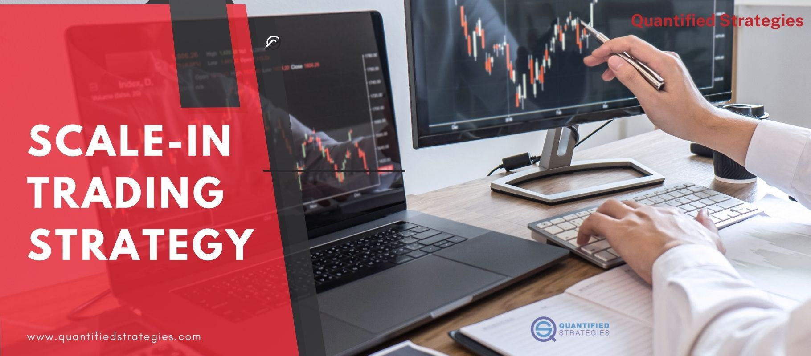

Investing is an endeavor where traders, irrespective of their experience level, consistently strive to enhance their returns while effectively managing risk. The complexity of financial markets today has given rise to a myriad of investment techniques and trading strategies, each designed to navigate the intricate ebb and flow of market dynamics. Algorithmic trading stands out among these innovations, having fundamentally transformed investor interactions with stock markets.

Both novice and seasoned investors are continually searching for effective methods to optimize their portfolios. Investment techniques, which encompass a wide range of analytical approaches, are critical for understanding market conditions and making data-driven decisions. Meanwhile, trading strategies provide structured plans to achieve profitable outcomes. These are meticulously crafted around specific rules, often grounded in technical or fundamental analysis, designed to ensure disciplined trading practices.



In this rapidly evolving landscape, algorithmic trading offers a distinct advantage. By leveraging computer programs to execute trades based on predefined criteria, algorithmic trading increases efficiency, speed, and precision in executing investment strategies. It represents a significant shift from traditional trading methods, enabling investors to automate decisions and base them on comprehensive data analysis.

Another significant aspect of contemporary trading is the scaling-in approach—a tactical method involving the incremental purchase of assets. This strategy assists in managing risk by spreading out entry points, potentially offsetting the effects of market volatility. Incorporating the scaling-in strategy into algorithmic trading algorithms could further enhance systematic execution and optimize investment performance.

This article will cover effective investment techniques, elucidate the pivotal role of strategic trading, and explore the synergy between scaling-in strategies and algorithmic trading. The integration of these elements is essential for developing a robust investment framework capable of maximizing gains while minimizing risks in today's complex financial markets.

## Table of Contents

## Understanding Investment Techniques

Investment techniques are crucial for traders aiming to analyze market conditions and make informed decisions. These techniques encompass a variety of methods, each serving a distinct purpose in the investment process. Fundamental analysis, for instance, involves a comprehensive review of financial statements to assess a company's intrinsic value. This approach helps investors identify undervalued or overvalued stocks by examining indicators such as earnings, revenue, and profit margins.

Technical analysis, on the other hand, focuses on price and [volume](/wiki/volume-trading-strategy) action. It utilizes historical market data to identify trends and patterns, assisting traders in predicting future price movements. Common tools in technical analysis include moving averages, relative strength index (RSI), and stochastic oscillators.

Diversification, another critical component, involves spreading investments across different asset classes to minimize risk. The principle is based on the idea that a diverse portfolio is less likely to be severely impacted by poor performance in a single asset. By balancing investments in equities, bonds, and other financial instruments, investors can protect their portfolios from significant losses.

Risk management is equally essential in developing a successful investment strategy. Techniques such as stop-loss orders, which automatically sell a security when its price falls to a predetermined level, help limit potential losses. Additionally, position sizing ensures that a single investment does not disproportionately affect the overall portfolio.

Developing a well-rounded investment portfolio is vital for managing risk and ensuring long-term growth. A balanced portfolio combines various asset classes, tailored to an investor's risk tolerance and financial goals. By integrating fundamental and technical analyses with diversification and risk management strategies, traders can navigate complex market environments and enhance their investment performance effectively.

## The Role of Trading Strategies

Trading strategies are essential tools used by investors to systematically approach the stock market and achieve profitable outcomes. These strategies comprise predefined plans that provide structure and help in mitigating the influence of emotions on trading decisions.

One of the primary components of trading strategies is the utilization of technical indicators. Technical indicators are mathematical calculations based on historical price, volume, or open interest information that provide signals for market entry or [exit](/wiki/exit-strategy). Popular technical indicators include Moving Averages (MA), Relative Strength Index (RSI), Moving Average Convergence Divergence (MACD), and Bollinger Bands. For instance, a simple moving average crossover strategy involves buying when a short-term moving average crosses above a long-term moving average, and selling when the opposite occurs.

Chart patterns also play a crucial role in trading strategies. These patterns are graphical representations of price movements which can suggest continuation or reversal in trends. Common patterns include head and shoulders, triangles, wedges, and double tops or bottoms. Recognizing these patterns can offer traders insights into potential future price movements, assisting in timing trades for optimal outcomes.

Market sentiment, the overall attitude of investors towards a particular security or the market as a whole, is another [factor](/wiki/factor-investing) that influences trading strategies. Traders often gauge sentiment through the analysis of volume trends, news sentiment analysis, or via sentiment indicators like the put/call ratio. By interpreting sentiment, traders can align their strategies with the prevailing market mood, enhancing their chances of success.

A variety of trading strategies cater to different investment styles and risk appetites. Day trading involves buying and selling securities within the same trading day, capitalizing on short-term price movements. Swing trading seeks to capture gains within a time frame of a few days to several weeks, aiming to profit from price 'swings' in trending markets. Position trading is a longer-term strategy, where investors hold positions for weeks to months, focusing more on [fundamental analysis](/wiki/fundamental-analysis) to justify their trades.

By having a strategic plan, traders enhance their ability to make rational decisions, ultimately reducing the likelihood of impulsive reactions driven by market [volatility](/wiki/volatility-trading-strategies). A well-defined strategy sets out clear entry and exit points, risk management rules, and criteria for selecting trades. This structure not only streamlines the decision-making process but also contributes significantly to sustained trading performance.

In summary, trading strategies are instrumental in guiding investors through the complexities of the stock market. By incorporating technical analysis, chart patterns, and an awareness of market sentiment, traders can develop robust strategies that increase the probability of profitable trading outcomes while minimizing emotional biases.

## Scaling In: A Tactical Approach

Scaling in is an investment strategy wherein traders increase their exposure to a particular asset by making incremental purchases. This approach is designed to mitigate risk and capitalize on favorable market movements. By entering a position gradually, investors can adjust their investment strategies in response to evolving market conditions, thereby potentially reducing the adverse effects of volatility. 

One of the primary benefits of scaling in is its ability to afford traders flexibility in managing risk. Instead of committing a significant amount of capital at once, scaling in allows for phased entries, reducing the risk of entering a position at an unfavorable price point. For instance, if an investor anticipates a potential downward trend, they might begin with a smaller position, adding more shares as the price moves favorably. This process can be formalized using predefined rules or algorithms, enhancing consistency in execution.

In practice, scaling in can help achieve better average entry prices. Consider a scenario where the initial share price is $100. By purchasing shares incrementally as the price fluctuates, a trader might acquire shares at $98, $99, and $101, resulting in an average entry price lower than a single purchase at $100. This strategy can be particularly effective in volatile markets, where prices may experience significant fluctuations over a short period.

To illustrate, a simple Python algorithm for scaling in might look as follows:

```python
def scale_in(target_shares, initial_price, price_levels, shares_per_level):
    total_shares = 0
    average_price = 0

    for price in price_levels:
        if total_shares < target_shares:
            shares_to_buy = min(shares_per_level, target_shares - total_shares)
            total_shares += shares_to_buy
            average_price = (average_price * (total_shares - shares_to_buy) + price * shares_to_buy) / total_shares

    return total_shares, average_price

# Example usage
price_levels = [98, 99, 101, 103]
target_shares = 100
shares_per_level = 25

scaled_shares, avg_price = scale_in(target_shares, 100, price_levels, shares_per_level)
print(f"Scaled Shares: {scaled_shares}, Average Price: {avg_price}")
```

This script automates the scaling in process by determining the number of shares to buy at various price levels, ensuring that the average entry price is optimized over time.

Overall, scaling in is a tactical approach that enables investors to navigate market complexity with enhanced adaptability. By leveraging incremental investments, traders can manage their risk exposure, capture timely entry points, and potentially secure better overall returns.

## Algo Trading: The Future of Investment

Algorithmic trading, often referred to as algo trading, involves the use of computer programs to facilitate trading based on specific pre-established criteria and instructions. This approach revolutionizes traditional trading by employing automation to make crucial investment decisions swiftly and accurately.

One primary advantage of [algorithmic trading](/wiki/algorithmic-trading) is its speed. Algorithms are capable of executing trades much faster than a human, capitalizing on minute market fluctuations that would otherwise be lost in manual trading. For instance, high-frequency trading ([HFT](/wiki/high-frequency-trading-strategies)), a form of algorithmic trading, can execute thousands of orders in fractions of a second, allowing traders to take advantage of small price movements.

Efficiency is another significant benefit. Algorithms can manage vast amounts of data in real-time, allowing for the efficient analysis of various market factors to optimize trade execution. This ability not only streamlines the trading process but also reduces the likelihood of human error. Additionally, algo trading systems can operate continuously without fatigue, monitoring market conditions and executing trades 24/7.

The capability of [backtesting](/wiki/backtesting) is crucial in algorithmic trading. It allows traders to test their strategies against historical data to assess their potential effectiveness before deploying them in live markets. This process involves applying the proposed trading rules to past market data to determine how they would have performed, thus helping traders refine their strategies and minimize risks.

Algorithmic trading is adaptable, incorporating both technical and fundamental analysis to formulate data-driven trading decisions. Technical analysis involves evaluating statistical trends from trading activity, such as price movement and volume, often utilizing indicators like moving averages or the Relative Strength Index (RSI). Conversely, fundamental analysis considers economic indicators, financial statements, and other qualitative factors to determine the intrinsic value of an investment.

The anticipated growth of algorithmic trading is substantial as technology continues to advance. Innovations in [artificial intelligence](/wiki/ai-artificial-intelligence) (AI) and [machine learning](/wiki/machine-learning) (ML) are already starting to influence algorithmic trading by enabling the development of adaptive algorithms that learn from market behavior over time. These advancements are expected to further enhance the precision and efficiency of trading systems, offering new and diverse opportunities for investors.

In conclusion, the future of investment is intricately tied to the progression of algorithmic trading. As AI, ML, and other technological innovations continue to evolve, they hold the promise of unlocking fresh investment strategies, reinforcing the role of algorithms as indispensable tools in modern financial markets. As such, engaging with algo trading is becoming increasingly critical for investors aiming to thrive in today's fast-paced trading environment.

## Integrating Scaling In with Algorithmic Trading

Integrating scaling in with algorithmic trading is a strategic approach that enhances decision-making and optimizes trading performance. Scaling in involves incrementally buying shares to enter a position gradually, allowing for adjustments according to market conditions and price movements. This method can be beneficial in managing risks and potentially increasing returns, especially when implemented in algorithmic trading systems.

Algorithmic trading, which employs computer programs to execute trades based on predetermined criteria, can be effectively combined with scaling in strategies. By programming algorithms to accommodate scaling in techniques, traders can ensure systematic entry points that many traditional methods cannot consistently achieve. This approach allows algorithms to buy small quantities of a security at different price levels, effectively managing the risk of adverse price movements.

For example, consider a simple scaling in algorithm coded in Python:

```python
def scale_in_strategy(prices, cash_available, scale_in_percentage):
    position_size = 0
    cash = cash_available
    for price in prices:
        allocation = cash * scale_in_percentage
        shares_to_buy = allocation // price
        position_size += shares_to_buy
        cash -= shares_to_buy * price
    return position_size, cash

# Example usage
daily_prices = [100, 95, 90, 85, 80]
initial_cash = 10000
size_percentage = 0.1
shares_bought, remaining_cash = scale_in_strategy(daily_prices, initial_cash, size_percentage)
```

In this example, the function `scale_in_strategy` takes a list of prices, initial available cash, and the scale-in percentage of investment per trade. The algorithm computes how many shares to purchase at each price, while updating the remaining cash. By executing small buy transactions across varying price levels, the strategy aims to capture more favorable entry points and minimize risks associated with large single purchases.

Integrating scaling in with algorithmic trading offers a dual advantage: it combines the systematic rigor of algorithms with the flexibility of scaling in techniques. This union facilitates better risk management by reducing the likelihood of entering large positions at disadvantageous prices, which can be particularly advantageous in volatile market environments.

Furthermore, this integrated approach can potentially lead to higher returns as algorithms are continuously assessing price actions and adjusting entries, allowing investors to reallocate resources efficiently. As markets become more complex and technology evolves, leveraging both scaling in and algorithmic trading allows investors to navigate intricate financial landscapes, making informed, data-driven decisions.

In conclusion, the integration of scaling in techniques into algorithmic trading frameworks represents a powerful synergy. By automating the scaling in process, investors can achieve a higher level of precision and effectiveness in their trading strategies, positioning themselves advantageously in the ever-dynamic world of financial markets.

## Conclusion

Investment techniques, trading strategies, and scaling in are crucial for successful trading, serving as the backbone of a well-rounded investment approach. These components help traders make informed decisions, adapt to market changes, and mitigate risks. As markets become increasingly sophisticated, algorithmic trading emerges as a pivotal tool for modern investors. By using computer algorithms to analyze vast datasets and execute trades with remarkable speed and precision, investors gain a significant edge. This technology enables them to combine diverse investment techniques, including scaling in, into their strategies.

The integration of algorithmic trading allows for the automation of repetitive tasks and the application of complex trading strategies that are grounded in both technical and fundamental analysis. Algorithms can be programmed to react to market signals and conditions efficiently, minimizing emotional decision-making and enhancing objectivity. This systematic approach is invaluable in managing risk and optimizing returns.

Adopting these advanced methodologies equips traders to thrive in the dynamic environment of financial markets. Embracing algorithmic trading, alongside traditional investment techniques and scaling in, maximizes profit potential while effectively managing exposure to market volatility. As technology continues to evolve, these tools offer the opportunity for substantial innovation in trading strategies, catering to both risk-averse and aggressive investors.

In summary, understanding and applying a combination of investment technique fundamentals, strategic trading processes, and modern algorithmic solutions provide traders with a robust framework. This helps them not only to adapt to ever-changing market conditions but also to maintain a competitive advantage. As trading continues to evolve with technological advancements, staying informed and proactive in leveraging these tools will be essential for sustained success in financial markets.

## References & Further Reading

[1]: Bergstra, J., Bardenet, R., Bengio, Y., & Kégl, B. (2011). ["Algorithms for Hyper-Parameter Optimization."](https://papers.nips.cc/paper/4443-algorithms-for-hyper-parameter-optimization) Advances in Neural Information Processing Systems 24.

[2]: ["Advances in Financial Machine Learning"](https://www.amazon.com/Advances-Financial-Machine-Learning-Marcos/dp/1119482089) by Marcos Lopez de Prado

[3]: ["Evidence-Based Technical Analysis: Applying the Scientific Method and Statistical Inference to Trading Signals"](https://www.amazon.com/Evidence-Based-Technical-Analysis-Scientific-Statistical/dp/0470008741) by David Aronson

[4]: ["Machine Learning for Algorithmic Trading"](https://github.com/stefan-jansen/machine-learning-for-trading) by Stefan Jansen

[5]: ["Quantitative Trading: How to Build Your Own Algorithmic Trading Business"](https://www.amazon.com/Quantitative-Trading-Build-Algorithmic-Business/dp/1119800064) by Ernest P. Chan