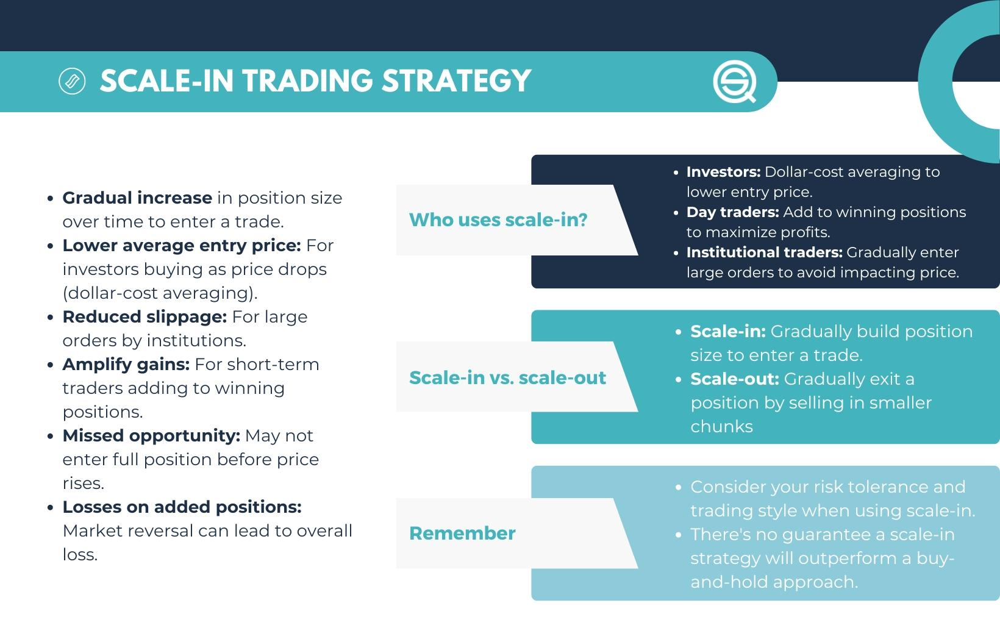

## Table of Contents

## What is a scale-in trading strategy?

A scale-in trading strategy is when a trader buys more of a stock or asset as its price goes down. Instead of buying all at once, the trader buys in smaller amounts over time. This way, if the price keeps dropping, the trader can get the asset at a lower average cost. It's like slowly filling up a bucket with water, adding more as the price gets cheaper.

This strategy can be helpful because it lets traders take advantage of price drops. If a trader believes the price will go back up eventually, buying more when it's low can lead to bigger profits later. However, it's risky too. If the price keeps falling and never goes back up, the trader could lose more money. So, it's important to have a plan and know when to stop buying more.

## How does scaling in differ from other trading strategies?

Scaling in is different from other trading strategies because it focuses on buying more of an asset as its price drops. In contrast, a strategy like buying all at once, or "lump sum investing," involves putting all your money into an asset at a single point in time. With scaling in, you spread out your purchases over time, which can lower your average cost if the price continues to fall. This approach can be less risky than buying everything at once, especially if the market is volatile.

Another common strategy is scaling out, which is the opposite of scaling in. When scaling out, a trader sells parts of their holdings as the price goes up, aiming to lock in profits gradually. This is different from scaling in, where the goal is to increase your position in an asset at lower prices. While scaling in is about taking advantage of price drops, scaling out is about taking profits during price rises. Both strategies require careful planning and monitoring of market conditions to be effective.

## What are the basic principles behind scaling in?

The basic idea behind scaling in is to buy more of something as its price goes down. Instead of spending all your money at once, you spread out your purchases over time. This way, if the price keeps dropping, you can buy more at a lower cost. It's like waiting for a sale to buy more of what you want. The goal is to lower your average cost per share, which can lead to bigger profits if the price goes back up later.

Scaling in is all about timing and patience. You need to believe that the price will eventually go up again, so you keep buying more as it falls. But it's also important to have a plan and know when to stop. If the price keeps going down and never recovers, you could lose more money. So, you need to watch the market closely and be ready to change your strategy if things don't go as planned.

## When should a trader consider using a scale-in strategy?

A trader should think about using a scale-in strategy when they believe the price of a stock or asset will go back up after it falls. If the market is going through a rough patch and prices are dropping, but the trader thinks it's just a temporary dip, then scaling in can be a good move. By buying more as the price goes down, the trader can lower their average cost and potentially make bigger profits when the price recovers.

It's also a good idea to use a scale-in strategy when the trader wants to spread out their risk. Instead of putting all their money into an asset at one time, they can buy in smaller amounts over time. This can be helpful if the market is unpredictable and the trader isn't sure when the best time to buy is. However, it's important for the trader to keep an eye on the market and be ready to change their plan if the price keeps falling without signs of recovery.

## What are the potential benefits of using a scale-in strategy?

Using a scale-in strategy can help lower your average cost. When you buy more of a stock as its price goes down, you end up spending less money overall for each share. This can be really helpful if you believe the price will go back up later. If it does, you could make more money because you bought at lower prices. It's like waiting for a sale to buy more of what you want, but with stocks.

Another benefit is that scaling in can help you spread out your risk. Instead of putting all your money into a stock at one time, you can buy a little bit at a time. This way, if the price keeps dropping, you won't lose as much money as if you had bought everything at once. It's a safer way to invest, especially when the market is unpredictable. Just make sure to keep watching the market and be ready to change your plan if needed.

## What are the risks associated with scaling in?

One big risk with scaling in is that the price might keep going down and never come back up. If you keep buying more as the price drops, you could lose a lot of money if the price never recovers. It's like trying to catch a falling knife – it can be dangerous. You need to be careful and know when to stop buying more, or you could end up with a lot of a stock that's worth less and less.

Another risk is that scaling in can make you miss out on other opportunities. While you're busy buying more of one stock as its price falls, you might not have enough money to invest in other stocks that are doing well. It's important to keep an eye on the whole market and not put all your eggs in one basket. If you focus too much on one stock, you might miss out on better chances to make money elsewhere.

## How can a beginner start implementing a scale-in strategy?

To start using a scale-in strategy, a beginner should first pick a stock or asset they believe in. They need to think the price will go back up after it falls. Once they've chosen, they can start buying small amounts of the stock as its price goes down. Instead of spending all their money at once, they should spread out their purchases over time. This way, if the price keeps dropping, they can buy more at a lower cost. It's important to have a plan and decide how much they're willing to spend in total and at what price points they'll buy more.

A beginner should also keep a close eye on the market. They need to watch the stock's price and be ready to change their plan if things don't go as expected. If the price keeps falling and there's no sign it will recover, they should stop buying more. It's also a good idea to set a limit on how much they're willing to lose. By being patient and careful, a beginner can use a scale-in strategy to potentially make more money when the price goes back up.

## What are some common mistakes to avoid when scaling in?

One common mistake when scaling in is not having a clear plan. It's important to decide ahead of time how much money you're willing to spend and at what price points you'll buy more. Without a plan, you might keep buying as the price falls, hoping it will go back up, but end up losing a lot of money if it never recovers. It's like trying to catch a falling knife – it can be dangerous if you don't know when to stop.

Another mistake is not paying attention to the market. You need to keep watching the stock's price and be ready to change your plan if things don't go as expected. If the price keeps falling and there's no sign it will recover, you should stop buying more. It's also important not to focus too much on one stock. While you're busy buying more of one stock as its price falls, you might miss out on other opportunities to make money. So, always keep an eye on the whole market and don't put all your eggs in one basket.

## How can technical analysis be used to enhance a scale-in strategy?

Technical analysis can help make a scale-in strategy better by looking at charts and patterns to figure out when to buy more of a stock. By using tools like moving averages, support and resistance levels, and chart patterns, a trader can see if a stock's price is likely to keep going down or if it might start going back up soon. For example, if a stock's price is getting close to a strong support level, it might be a good time to buy more because the price could bounce back from there.

It's also helpful to use indicators like the Relative Strength Index (RSI) to see if a stock is overbought or oversold. If the RSI shows that a stock is oversold, it might be a good time to buy more because the price could go up soon. By combining these technical analysis tools with a scale-in strategy, a trader can make smarter decisions about when to buy more of a stock, helping them lower their average cost and potentially make more money when the price goes back up.

## What role does market volatility play in a scale-in approach?

Market [volatility](/wiki/volatility-trading-strategies) can make a scale-in strategy more useful but also riskier. When the market is going up and down a lot, prices can drop quickly. This gives a chance for traders to buy more of a stock at lower prices, which can help lower their average cost. If a trader believes the price will go back up after these drops, they can use the volatility to their advantage by buying more during the dips.

However, high volatility can also be dangerous. If the price keeps falling and doesn't recover, a trader could end up losing more money by buying more at lower prices. It's important to watch the market closely and have a plan for when to stop buying more. Volatility can create good opportunities for a scale-in strategy, but it also requires careful management to avoid big losses.

## How can a trader adjust a scale-in strategy based on different market conditions?

A trader can change their scale-in strategy depending on what the market is doing. If the market is calm and prices aren't moving much, a trader might buy smaller amounts over a longer time. They can wait for small dips in the price to buy more, knowing that big changes are less likely. But if the market is really up and down, a trader might need to act faster. They can buy more of the stock during big price drops, hoping to take advantage of the quick changes. It's important to keep watching the market and be ready to change the plan if things get too risky.

In a strong bull market, where prices are going up a lot, a trader might not use a scale-in strategy as much. They might buy more at once because they think the price will keep going up. But in a bear market, where prices are falling, a scale-in strategy can be really helpful. A trader can buy more as the price goes down, hoping to lower their average cost and make a bigger profit when the market turns around. No matter what, a trader needs to have a plan and know when to stop buying more, so they don't lose too much money if the price keeps falling.

## What advanced techniques can experts use to optimize their scale-in trading?

Experts can use advanced techniques like setting up [algorithmic trading](/wiki/algorithmic-trading) systems to optimize their scale-in strategy. These systems can automatically buy more of a stock as its price goes down, based on certain rules the trader sets. For example, the system might be programmed to buy more if the stock's price drops by a certain percentage or if it reaches a specific support level. This way, the trader doesn't have to watch the market all the time and can still take advantage of price drops. It's like having a robot helper that follows the trader's plan perfectly.

Another technique experts might use is combining scale-in with other trading strategies, like options trading. They could buy put options to protect against big price drops while scaling in. If the stock's price keeps falling, the put options can help limit their losses. At the same time, they can still buy more of the stock at lower prices, hoping for a recovery. By mixing different strategies, experts can manage their risk better and possibly make more money. It's all about finding the right balance and being ready to change the plan if the market moves in unexpected ways.

## References & Further Reading

[1]: Bergstra, J., Bardenet, R., Bengio, Y., & Kégl, B. (2011). ["Algorithms for Hyper-Parameter Optimization."](https://papers.nips.cc/paper/4443-algorithms-for-hyper-parameter-optimization) Advances in Neural Information Processing Systems 24.

[2]: ["Advances in Financial Machine Learning"](https://www.amazon.com/Advances-Financial-Machine-Learning-Marcos/dp/1119482089) by Marcos Lopez de Prado

[3]: ["Evidence-Based Technical Analysis: Applying the Scientific Method and Statistical Inference to Trading Signals"](https://www.amazon.com/Evidence-Based-Technical-Analysis-Scientific-Statistical/dp/0470008741) by David Aronson

[4]: ["Machine Learning for Algorithmic Trading"](https://github.com/stefan-jansen/machine-learning-for-trading) by Stefan Jansen

[5]: ["Quantitative Trading: How to Build Your Own Algorithmic Trading Business"](https://books.google.com/books/about/Quantitative_Trading.html?id=j70yEAAAQBAJ) by Ernest P. Chan