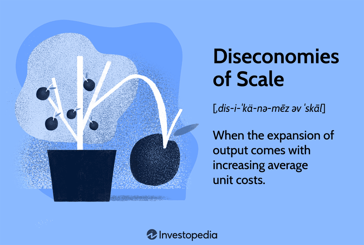

The modern business landscape is defined by the simultaneous pursuit of strategic growth and the seamless integration of technological advancements. Among the leading technological innovations reshaping industries is algorithmic trading, a method that automates the execution of stock trades through pre-programmed instructions. This transformation allows for the rapid execution of trades at scales and speeds unattainable through manual processes.

In pursuing expansion, businesses strive for efficiencies and competitive advantages by realizing economies of scale. Economies of scale refer to the cost advantages achieved when production becomes efficient, as the cost per unit decreases with increasing scale. For instance, firms can optimize resource allocation and production processes, leading to increased output at lower costs.



This article examines how economic scaling and business operations intersect with the nuanced field of algorithmic trading. By understanding these elements, businesses can enhance operational efficiencies and successfully navigate the intricate modern financial markets. The fusion of technology with sound business strategies is critical as firms seek to maintain competitive edges in ever-evolving market environments.

## Table of Contents

## Understanding Economies of Scale in Business

Economies of scale describe the cost advantages that businesses experience as they expand their production capabilities. These advantages manifest as a reduction in the per-unit cost of products or services, primarily as a result of increased scale in operations. This phenomenon occurs due to several factors such as the spread of fixed costs over more units of output, operational efficiencies, and the potential to negotiate better terms with suppliers.

There are two primary types of economies of scale: internal and external. Internal economies of scale are realized within an individual company and result from internal efficiencies. These efficiencies include improved production processes, such as the adoption of automation and advanced manufacturing techniques that enhance productivity. Additionally, better resource management and the optimization of supply chains contribute to reducing costs.

For example, a manufacturing plant might install automated machinery that allows it to produce goods more quickly and with less labor input, reducing the cost per unit. As production [volume](/wiki/volume-trading-strategy) increases, the fixed costs of the machinery are distributed across more units, lowering the overall cost.

External economies of scale, on the other hand, arise from factors outside a company, often industry-wide or regional advantages. These can include shared innovations, access to a skilled labor force, or shared infrastructure developments. For instance, an industry cluster, such as Silicon Valley for technology companies, provides businesses with access to specialized knowledge and opportunities for collaboration, leading to increases in productivity and reductions in costs.

Recognizing and exploiting these economic principles is crucial for businesses aiming to optimize growth strategies effectively. By understanding economies of scale, companies can make informed decisions on expanding their production capacity, investing in technology, or collaborating with other businesses or educational institutions to access new innovations and expertise.

In practice, achieving economies of scale involves strategic planning and analysis to ensure that expansion efforts do not lead to diseconomic outcomes where costs start to increase due to factors like management inefficiencies or overproduction. By balancing growth and efficiency, businesses can achieve sustained competitive advantages.

## The Significance of Specialization in Business Strategy

Specialization involves focusing efforts on specific market segments or business activities. This strategic approach allows firms to refine their processes and build expertise in a defined area, leading to increased productivity and enhanced product or service quality. By concentrating resources and attention on a particular niche, businesses can tailor their offerings more precisely to meet customer demands, potentially achieving a competitive advantage.

The process of specialization boosts economies of scale by increasing output efficiency. When a company specializes, it streamlines its processes and often benefits from a learning curve effect where it becomes more proficient with experience. This proficiency reduces the time and resources required for production, thereby decreasing per-unit costs. For instance, if a manufacturing plant specializes in producing a single type of component rather than multiple types, it can optimize its machinery and labor allocation for that specific production task, minimizing wastage and maximizing throughput.

However, specialization is not without its challenges. Over-specialization can pose significant risks if a company becomes excessively dependent on a single market segment or product line. Changes in consumer preferences, technological advancements, or economic shifts can quickly render a specialized offering obsolete, jeopardizing the firm's viability. Furthermore, excessive specialization may lead to inflexibility, making it difficult for a business to adapt to new opportunities or threats.

Examples of successful specialization are prominent in industries where expert knowledge and precision are crucial. For instance, Apple Inc.'s sustained focus on high-quality consumer electronics has allowed it to dominate the market segment by continuously innovating and perfecting its products. Conversely, companies that have suffered from over-specialization include those in rapidly evolving technology sectors where failure to diversify or innovate can lead to obsolescence. A prudent strategy involves balancing specialization with diversification to mitigate the risks of market fluctuations, thereby achieving sustainable growth.

## Algorithmic Trading: Overview and Evolution

Algorithmic trading is a sophisticated method leveraging technology, specifically algorithms, to make trading decisions at unprecedented speeds and frequencies. Often referred to as "algo trading", this approach relies heavily on pre-programmed instructions to execute trades, eliminating human error and emotion from the process. The core essence of [algorithmic trading](/wiki/algorithmic-trading) lies in its ability to process vast amounts of data and execute trades within milliseconds, exploiting even the slightest market inefficiencies.

Technological advancements have propelled the evolution of algorithmic trading, with [artificial intelligence](/wiki/ai-artificial-intelligence) (AI) and [machine learning](/wiki/machine-learning) (ML) playing pivotal roles. AI enhances algo trading by providing systems with the ability to learn from historical data and adapt to new market conditions without human intervention. Machine learning, a subset of AI, allows trading algorithms to improve over time by identifying patterns and making data-driven predictions.

Various strategies are employed within the domain of algorithmic trading. Trend following is one of the more straightforward strategies, where algorithms detect and capitalize on trends in market data. By analyzing historical price data, these algorithms generate buy or sell signals, aligning with the market's current directions. Another widely adopted strategy is [arbitrage](/wiki/arbitrage), which seeks to exploit price differences of the same asset across different markets. Algorithms capable of performing arbitrage can rapidly identify and act on these price discrepancies, ensuring profitability with minimal risk.

Understanding these strategies is crucial for firms aiming to capitalize on the technological efficiencies offered by algorithmic trading. Trend following strategies often rely on sophisticated indicators, such as moving averages, to identify potential trades. For example, a simple moving average crossover strategy might involve buying an asset when a short-term moving average crosses above a long-term moving average, indicating a potential uptrend.

Python, with its robust ecosystem of libraries, is frequently used in developing algorithmic trading strategies. Here's a basic example of a moving average crossover strategy implemented in Python:

```python
import pandas as pd

# Load historical price data
prices = pd.read_csv('historical_prices.csv')

# Calculate short-term and long-term moving averages
prices['10SMA'] = prices['close'].rolling(window=10).mean()
prices['50SMA'] = prices['close'].rolling(window=50).mean()

# Generate buy/sell signals
prices['signal'] = 0
prices['signal'][10:] = np.where(prices['10SMA'][10:] > prices['50SMA'][10:], 1, 0)

# Identify trade entry points
prices['positions'] = prices['signal'].diff()

# Display trade signals
print(prices[['close', '10SMA', '50SMA', 'signal', 'positions']])
```

This code snippet calculates the short-term and long-term moving averages and generates buying signals when the short-term average crosses above the long-term average, thus indicating a potential buy opportunity.

For firms engaging in algorithmic trading, understanding and implementing these strategies effectively can lead to significant competitive advantages. The ability to harness technological advancements not only optimizes trading efficiencies but also enhances the potential to achieve higher returns through innovative strategies like [trend following](/wiki/trend-following) and arbitrage. The continuous evolution of AI and machine learning is set to further revolutionize algorithmic trading, pushing the boundaries of what is possible in financial markets.

## Achieving Economies of Scale in Algorithmic Trading

Algorithmic trading firms achieve economies of scale primarily through the application of advanced technological infrastructure and efficient data processing techniques. By leveraging automation, these firms are able to execute trades at speeds that far surpass human capabilities, thus significantly reducing transaction costs. Automation also facilitates the handling of large volumes of trades simultaneously, optimizing the operational efficiency and enhancing profitability. 

A prime example of effective scaling in algo trading operations is Renaissance Technologies. This firm, renowned for its [quantitative trading](/wiki/quantitative-trading) strategies, has capitalized on economies of scale by integrating cutting-edge computational resources and sophisticated algorithms. Renaissance Technologies employs complex mathematical models and statistical analysis to predict market trends and execute trades with precision. Their success underscores the importance of a robust technological infrastructure in achieving operational scalability.

Moreover, the integration of cloud computing and data analytics plays a crucial role in the efficient scaling of algo trading operations. Cloud computing offers scalable resources that can be adjusted based on demand, providing firms with the flexibility to optimize their computing power without the need for costly physical infrastructure. This scalability is further enhanced by data analytics, which enables the processing and analysis of vast datasets to identify trading opportunities and manage risks effectively.

In Python, for instance, libraries such as NumPy and pandas facilitate the handling and analysis of large datasets, while platforms like AWS and Google Cloud offer scalable cloud solutions:

```python
import numpy as np
import pandas as pd

# Example of handling large datasets using pandas
df = pd.read_csv('large_data.csv')
# Example operation: calculating moving average
df['moving_average'] = df['price'].rolling(window=20).mean()

# Use cloud-based computing for scalability
# Assuming AWS SDK is configured
import boto3

client = boto3.client('ec2')
response = client.describe_instances()
```

By exploiting these technologies, algorithmic trading firms can significantly enhance their scalability and maintain a competitive edge in the financial markets. The ability to process large volumes of data quickly and execute trades efficiently are critical drivers of success, underlining the importance of economies of scale in the field of algorithmic trading.

## Specialization in Algorithmic Trading

Firms engaged in algorithmic trading frequently focus on specialized trading strategies or select market segments to enhance performance and competitive edge. Specialization in this context involves honing expertise in specific trading methodologies which can help lower the impact of market [volatility](/wiki/volatility-trading-strategies) and lead to more consistent trading outcomes. By concentrating resources and efforts on distinct areas, firms can achieve deeper insights into market behaviors, allowing for strategic adjustments that improve overall profitability.

A specialized focus enables in-depth research and development of trading algorithms. This process entails the continuous refinement and testing of algorithms under various market conditions. The iterative nature of refining algorithms is similar to machine learning models, which improve by learning from progressively larger datasets. Trading algorithms can be optimized for specific market conditions; for example, [statistical arbitrage](/wiki/statistical-arbitrage) strategies can take advantage of temporary price discrepancies between correlated securities. This refinement requires a combination of historical data analysis, [backtesting](/wiki/backtesting) using time-series data, and implementation of machine learning techniques to predict future trends more accurately.

Case studies of firms like Renaissance Technologies, known for its Medallion Fund, demonstrate the effectiveness of a specialized approach combined with economies of scale. Their success is largely attributed to a deep focus on quantitative research and the recruitment of a highly specialized workforce, including mathematicians, statisticians, and computer scientists. This specialized focus, supported by robust computational infrastructure, allows Renaissance Technologies to process complex datasets at scale, thus achieving significant competitive advantages.

Moreover, specialization reduces the burden of market noises by tailoring algorithms to the idiosyncrasies of particular trading environments. For instance, strategies focusing on high-frequency trading ([HFT](/wiki/high-frequency-trading-strategies)) require the development of algorithms that can operate within extremely tight timeframes, such as milliseconds. These algorithms can be coded in Python, leveraging libraries like NumPy and pandas for data manipulation, or in C++ to optimize execution speed. Here's a simple Python snippet exemplifying how one might initialize a basic framework for algorithmic trading focused on rapid data processing:

```python
import numpy as np
import pandas as pd

# Sample dataset representing market prices
data = pd.DataFrame({
    'timestamp': pd.date_range(start='1/1/2023', periods=1000, freq='T'),
    'price': np.random.random(size=1000) * 100
})

# Function to simulate a basic trading strategy
def trading_strategy(data):
    # Moving average calculation for buy/sell signals
    data['short_ma'] = data['price'].rolling(window=5).mean()
    data['long_ma'] = data['price'].rolling(window=20).mean()
    # Basic trade signals: 1 for buy, -1 for sell
    data['signal'] = 0
    data.loc[data['short_ma'] > data['long_ma'], 'signal'] = 1
    data.loc[data['short_ma'] < data['long_ma'], 'signal'] = -1
    return data

# Apply trading strategy
results = trading_strategy(data)
```

In conclusion, specialization in algorithmic trading allows for detailed refinement and enhanced efficiency of trading strategies. Successful firms leverage this specialized knowledge alongside economies of scale to capitalize on technological efficiencies, thereby securing a competitive advantage in dynamic financial markets.

## Integrating Scaling and Specialization for Strategic Growth

Firms can sustain a competitive advantage by integrating economies of scale with specialization in their business strategies. Achieving this balance necessitates a dual focus on enhancing broad operational capabilities while honing specialized expertise. Economies of scale enable firms to reduce per-unit costs through increased production, taking advantage of cost efficiencies that arise from expanded operations. For example, automating routine tasks with technology increases output without proportionately increasing input costs. However, without specialization, the risk exists that these efficiencies will be underutilized, as broad capabilities might miss niche market demands or fail to innovate effectively within specialized sectors.

Specialization, on the other hand, empowers firms by fostering deep expertise and advanced competency in targeted areas, which enhances the quality of outputs and services. This focus can improve customer satisfaction and brand loyalty within niche markets, allowing firms to capitalize on specific opportunities and tailor solutions precisely to market demands. However, excessive specialization can lead to vulnerabilities, such as dependency on limited markets or stagnation in innovation outside the specialized domain.

Successfully balancing these elements involves creating a cohesive strategy that leverages the strengths of both approaches. One effective method is the use of modular business structures, where core operations benefit from economies of scale, and specialized units focus on unique market contributions. For instance, a company may utilize a centralized, large-scale production framework to gain cost efficiencies, while specialized teams focus on specific innovations or customizations.

Advancements in technology, particularly artificial intelligence (AI) and blockchain, are reshaping how firms integrate these strategies. AI facilitates data-driven decision-making, automating complex processes and enabling predictive analytics tailored to specific markets. Python, with libraries like Tensorflow and PyTorch, can be utilized to develop machine learning models that analyze large datasets, identify trends, and make informed decisions on scaling production or focusing on specialization. Here is a basic example of using Python for a predictive model:

```python
import pandas as pd
from sklearn.model_selection import train_test_split
from sklearn.ensemble import RandomForestClassifier

# Load dataset
data = pd.read_csv('market_data.csv')
X = data.drop('target', axis=1)
y = data['target']

# Split dataset
X_train, X_test, y_train, y_test = train_test_split(X, y, test_size=0.2, random_state=42)

# Train model
model = RandomForestClassifier(n_estimators=100)
model.fit(X_train, y_train)

# Predict
predictions = model.predict(X_test)
```

Blockchain technology offers decentralized record-keeping and smart contracts, which can optimize supply chain operations and protect intellectual property in specialized fields. For instance, firms can maintain efficiency in scaled operations by executing automated transactions securely and transparently through blockchain, without intermediaries. This decentralization also supports innovation, collaborative projects, and specialization by ensuring that contributions are recognized and rewarded fairly.

In conclusion, a synergistic approach that combines the expansive reach of economies of scale with the precision of specialization positions firms to maximize efficiency, innovation, and market responsiveness. As technologies continue to evolve, they will further enable and refine this integration, ensuring enhanced business agility and competitive advantage.

## Conclusion

Economies of scale and specialization are fundamental to effective business strategies, particularly in the dynamic financial markets. In algorithmic trading, these concepts are not merely theoretical; they manifest in practical applications that drive efficiency and profitability. By automating trading processes, firms reduce costs and increase transaction volumes, achieving economies of scale. The technology infrastructure, consisting of advanced algorithms and data analytics, enables firms to execute trades at unprecedented speeds and volumes, surpassing human capabilities.

Specialization, on the other hand, allows trading firms to concentrate on specific strategies or market niches, enhancing their ability to generate profitable outcomes. By focusing on particular methodologies, firms can optimize their algorithms, making them more resilient to market fluctuations. This niche expertise often translates to deeper insights and more precise execution strategies, which are critical in competitive markets.

For businesses aiming to scale, balancing operational scalability with niche specialization poses a unique challenge. Large-scale operations benefit from reduced per-unit costs, but maintaining a keen focus on specialized expertise ensures agility and responsiveness. A holistic approach to business strategy, where companies leverage both broad scale operations and deep specialization, is crucial for ensuring sustained competitive advantage. 

By harmonizing these strategies, businesses can achieve operational excellence, efficiently navigating the complexities of modern markets while maintaining a competitive edge. This strategic balance equips firms not only to respond to current market demands but also to anticipate and adapt to future changes, driven by advancements in technology and shifts in market dynamics.

## References & Further Reading

Bergstra, J., Bardenet, R., Bengio, Y., & Kégl, B. (2011). 'Algorithms for Hyper-Parameter Optimization.' This work discusses various methods used to optimize hyper-parameters, which is crucial for improving the performance of machine learning models, including those used in algorithmic trading. The authors focus on the efficient exploration of hyper-parameter spaces to enhance learning algorithms. This publication is essential for understanding the optimization processes that can significantly impact algorithmic trading efficacy.

"Advances in Financial Machine Learning" by Marcos Lopez de Prado dives into cutting-edge techniques in financial machine learning, presenting innovative ways to apply machine learning in trading. Lopez de Prado introduces practical algorithms and methodologies, underscoring the importance of systematic approaches in algorithmic trading.

"Evidence-Based Technical Analysis" by David Aronson emphasizes the necessity of scientific methods in technical analysis. Aronson challenges traditional technical analysis beliefs by introducing evidence-based practices, encouraging traders to adopt rigorous statistical techniques that improve the predictive power of trading algorithms.

"Machine Learning for Algorithmic Trading" by Stefan Jansen offers a comprehensive guide to implementing machine learning models in trading. Jansen provides readers with practical insights and Python code examples, covering essential topics like feature engineering, model evaluation, and backtesting strategies. The book is a valuable resource for traders looking to leverage machine learning for strategic growth.

"Quantitative Trading" by Ernest P. Chan delivers practical advice on developing trading strategies using quantitative methods. Chan covers topics such as data sourcing, statistical arbitrage, and backtesting, all crucial for understanding the mechanics behind successful algorithmic trading strategies. His insights are valuable for traders aiming to specialize and scale their operations efficiently.

