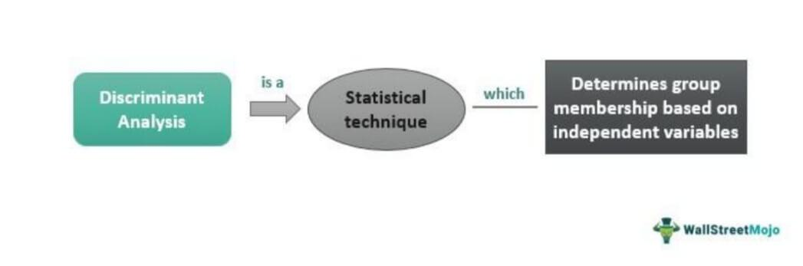

Scaling in distributed systems has emerged as a critical paradigm, especially within the sphere of algorithmic trading, an area requiring high efficiency and rapid data processing. Distributed systems, consisting of multiple independent components that communicate with each other to achieve a common objective, have become foundational in modern financial markets. These systems provide the infrastructure necessary for executing a multitude of trading operations concurrently, thus enabling high-frequency trading and real-time market analysis.

Horizontal scaling, a key approach in distributed systems, involves adding more machines or nodes to a system to increase its capacity. This contrasts with vertical scaling, which involves enhancing the power of existing machines. Horizontal scaling proves advantageous by significantly improving performance and reliability, as additional nodes can handle increased loads and process transactions concurrently. This capability ensures that trading platforms remain robust, even as transaction volumes surge.



Algorithmic trading, which relies on algorithms to make decisions about trading, exemplifies the dependency on scalable distributed systems. These systems must swiftly process vast amounts of market data to enable instantaneous trading decisions. The adaptability and resilience afforded by horizontally scaled systems make them indispensable in maintaining the competitiveness and efficacy of algorithmic trading platforms. By distributing the computational load across numerous machines, these systems can support the intricate algorithms that drive decision-making processes, while also managing the risk and ensuring compliance with market regulations.

In summary, the intersection of scaling in distributed systems and algorithmic trading underscores its importance in navigating the complexities of modern financial markets. Through horizontal scaling, distributed systems enhance the capacity and reliability necessary for efficient trading operations, solidifying their role as the backbone of contemporary trading ecosystems.

## Table of Contents

## Understanding Distributed Systems

Distributed systems refer to a collection of independent computers that appear to the users of the system as a single coherent system. The core components of distributed systems include computers, networks, and software that enable these components to communicate and coordinate their actions. In the context of distributed systems, these components collaborate to achieve a common goal, despite being physically dispersed.

One of the key characteristic features of distributed systems is their ability to manage resources and tasks across multiple machines, enhancing the overall computational power, fault tolerance, and resource utilization. A quintessential example of distributed systems can be found in modern applications like cloud services, global databases, and high-frequency trading, where operations necessitate extensive parallel processing capabilities.

High-frequency trading environments present specific challenges to distributed systems. The pace at which transactions are carried out in such environments demands near-real-time data processing and decision-making. The primary challenges include ensuring low-latency communication, data consistency, fault tolerance, and efficient load balancing across various nodes. Managing latency is particularly crucial, as even millisecond delays can significantly impact trading strategies and profitability. Thus, it is imperative for distributed systems in financial markets to integrate technologies that minimize communication delays and optimize data throughput.

Seamless communication and coordination among distributed components are vital to the functionality of these systems. These aspects ensure synchronized operations, accurate data transmission, and the integrity of processes across different nodes. The architectural design must account for potential failures and provide mechanisms for coordination, such as consensus algorithms and synchronization protocols, to ensure consistent states across all components. Effective coordination also involves managing resource allocation dynamically and supporting failover strategies to maintain continuous operations in the event of component failures.

In conclusion, distributed systems form the backbone of many high-performance applications by facilitating robust, scalable, and efficient computing environments. Their design and management are critical, especially in high-frequency trading, where performance and reliability are paramount.

## Horizontal vs. Vertical Scaling

Horizontal scaling and vertical scaling are two fundamental approaches to augment the capacity of distributed systems, particularly in data-intensive domains such as financial markets. Horizontal scaling, also known as scaling out, involves adding more nodes to a system to handle increased loads. In contrast, vertical scaling, or scaling up, means enhancing the capacity of existing nodes by upgrading the hardware, such as adding more CPU or memory.

### Horizontal Scaling

Horizontal scaling distributes the load across multiple servers, allowing for parallel processing and redundancy. This approach is particularly beneficial for handling large volumes of data and transactions, as it enables systems to manage increased demand by distributing the workload:

- **Improved Performance:** By allocating tasks across several nodes, horizontal scaling reduces the burden on individual servers, minimizing latency and improving response times.
- **Fault Tolerance and Reliability:** With multiple nodes, the system can continue to operate even if one node fails, thus enhancing reliability.
- **Flexibility and Cost-Effectiveness:** Using commodity hardware can make horizontal scaling a cost-effective solution. Additionally, it provides flexibility as new nodes can be added to the system without significant downtime.

Horizontal scaling is widely used in financial systems, especially in high-frequency trading and real-time data analysis. For example, financial institutions often deploy clusters of servers to process market data feeds and execute trading algorithms simultaneously.

### Vertical Scaling

Conversely, vertical scaling involves boosting the capacity of a single node. While this approach can yield short-term gains in performance, it has limitations:

- **Hardware Constraints:** There is a ceiling on the improvements that can be made to a single system, constrained by current technological capabilities.
- **Single Point of Failure:** Enhancing a single node increases dependency on it, and a failure can disrupt the entire system.

### Comparison and Use Cases

Horizontal scaling is generally preferred for applications requiring high availability and the ability to handle massive loads. Real-world examples include large-scale distributed databases and services like Apache Cassandra or Google Cloud Platform, which allow adding server instances on demand.

In financial systems, horizontal scaling supports a wide range of activities:

- **Market Data Processing:** Financial markets generate vast amounts of data. Firms use horizontally scaled systems to filter, process, and analyze this data in real-time.
- **Algorithmic Trading:** Trading firms implement horizontally scaled architectures to execute numerous trades simultaneously across different markets.

In conclusion, while both horizontal and vertical scaling have their merits, horizontal scaling offers distinct advantages in the context of distributed systems dealing with extensive data volumes and requiring high reliability. Financial systems harness horizontal scaling for efficient and resilient operations, reflecting its crucial role in modern trading architectures.

## Key Strategies for Scaling Distributed Systems

When scaling distributed systems, particularly in data-intensive environments like [algorithmic trading](/wiki/algorithmic-trading), efficient management of resources and data flow is crucial. Here are some of the key strategies to achieve optimal scaling:

### Load Balancing and Auto-Scaling Groups

Load balancing is critical in evenly distributing incoming network traffic across multiple servers. This technique ensures no single server becomes a bottleneck, maintaining a high level of performance and availability. Auto-scaling groups complement load balancing by automatically adjusting the number of servers based on traffic demands. By increasing instances during peak times and reducing them during low demand, auto-scaling groups minimize costs while ensuring efficiency.

```python
# Example: Configuring auto-scaling with AWS Boto3
import boto3

client = boto3.client('autoscaling')

response = client.create_auto_scaling_group(
    AutoScalingGroupName='my-auto-scaling-group',
    InstanceId='i-1234567890abcdef0',
    MinSize=1,
    MaxSize=10,
    DesiredCapacity=2
)
```

### Database Sharding and Partitioning

Database sharding involves breaking up a database into smaller, more manageable pieces called shards. Each shard operates as an independent database, allowing distributed systems to scale horizontally by distributing data across multiple servers. This strategy effectively overcomes data management bottlenecks, enhancing system resiliency and query performance. Partitioning, similarly, divides a single database table into multiple pieces based on criteria like range or hash, ensuring efficient data retrieval and storage.

**Formula for hash-based partitioning:**
$$
\text{partition\_index} = \text{hash(key)} \mod \text{number\_of\_partitions}
$$

### Caching and Replication

Caching involves storing frequently accessed data in-memory to reduce load times and enhance the throughput of read operations. Tools like Memcached and Redis are commonly used to implement caching in distributed systems. Replication, on the other hand, involves duplicating data across different nodes, enhancing data availability and fault tolerance. By adopting caching and replication strategies, distributed systems can significantly improve their read-write performance, ensuring consistent and quick access to data even during high demand periods.

Together, these strategies form the backbone of an optimized, scalable distributed system, ensuring robust performance in environments with high data and transaction volumes.

## Scaling in Algorithmic Trading

Algorithmic trading relies heavily on the rapid processing of vast amounts of data and the swift execution of trades based on pre-defined strategies. The necessity for real-time decision-making in these environments mandates that distributed systems powering such platforms are highly scalable.

A fundamental requirement for algorithmic trading systems is the ability to process large streams of market data with low latency. This requires scalable architectures capable of handling data from various sources, with the flexibility to adjust to fluctuating data volumes. Distributed stream processing frameworks, such as Apache Kafka and Apache Flink, are often employed to ingest, process, and analyze data in parallel. These frameworks support horizontal scaling by allowing additional processing nodes to be added, enhancing throughput and reducing latency.

Scalable architectures accommodate complex trading algorithms by employing distributed computing resources. For instance, a common technique involves partitioning the data and distributing the computational workload across multiple nodes. This ensures efficient utilization of resources and minimizes the time taken for computation-heavy tasks. Techniques such as load balancing are crucial in this context, ensuring that no single node becomes a bottleneck by distributing tasks evenly across the system.

Market [volatility](/wiki/volatility-trading-strategies) poses significant challenges, as trading systems must be able to handle sudden spikes in transaction [volume](/wiki/volume-trading-strategy). A scalable system can dynamically allocate resources in response to these fluctuations, often using cloud-based solutions that offer elasticity as a key feature. For example, auto-scaling groups in cloud platforms like Amazon Web Services (AWS) automatically adjust the number of active instances based on the current load, ensuring optimal performance during peak periods.

Additionally, the execution of large transactions demands a robust infrastructure to avoid slippage and other adverse impacts on trading performance. Scalable distributed systems achieve this through techniques such as database sharding, which partitions a database into smaller, more manageable pieces, and caching mechanisms that optimize read-write operations by reducing access times to frequently requested data.

In summary, scalable architectures in algorithmic trading systems incorporate advanced data processing frameworks, dynamic resource allocation, and strategic data management techniques to support rapid decision-making, address market volatility, and handle substantial transaction volumes effectively.

## Criticism and Challenges of Scaling

Scaling distributed systems, particularly in the context of algorithmic trading, presents several challenges and criticisms that must be addressed to ensure smooth and reliable operations. One of the primary concerns is the increased complexity that scaling introduces. As a system scales, either horizontally or vertically, managing the complexity of inter-node communication, data consistency, and fault tolerance becomes more challenging. The need to maintain coherent communication among numerous distributed components can lead to complicated architectures, often requiring advanced protocols and monitoring tools to manage the expanded system efficiently.

Cost is another significant downside associated with scaling. Expanding system capacity often requires additional hardware resources, software licenses, and human expertise to manage and optimize system performance. These expenses can escalate quickly, leading to increased operational costs. For horizontal scaling, in particular, the addition of more servers or nodes to handle data loads can become costly. Furthermore, the ongoing maintenance and scalability tests to ensure system performance also demand significant financial and resource allocation.

In the context of algorithmic trading, transaction latency is a critical [factor](/wiki/factor-investing), and scaling can sometimes exacerbate latency issues. As network size increases, the time taken for data to traverse from one component of the system to another can lead to delays. In high-frequency trading environments, even microsecond delays can impact the profitability of trading strategies. The challenge lies in ensuring that scaling efforts do not inadvertently introduce bottlenecks or delays that could undermine trading performance.

System reliability can also be impacted by scaling. As the system becomes more distributed, the likelihood of node failures increases. Ensuring high availability and reliability in such environments demands robust failure detection and recovery mechanisms. This need is further amplified in algorithmic trading, where system downtime or failures can lead to significant financial losses due to missed trading opportunities and potential market distortions.

Moreover, scaling can have pronounced effects on market behavior and trading strategies. As trading algorithms become more sophisticated and the volume of trading data increases, the market landscape can be altered. The increased scale can amplify the impact of algorithmic trades on market prices, leading to greater volatility. This dynamic necessitates that trading firms continually adapt their strategies in response to changing market conditions influenced by their scaling policies.

In summary, while scaling distributed systems offers the potential to handle increased data volumes and improve performance, it also introduces a range of challenges related to complexity, cost, latency, and reliability. These factors can significantly influence the effectiveness of trading strategies and overall market behavior, necessitating careful consideration and planning to balance the benefits and downsides of scaling.

## The Role of Microservices in Scaling

Microservices architecture represents a significant advancement in the design and management of distributed systems, offering a paradigm that enhances scalability, flexibility, and resilience. Unlike monolithic architectures, where all components are tightly interwoven, microservices break systems into smaller, loosely coupled services, each serving a specific function. This modular approach is particularly beneficial in the complex and rapidly evolving field of algorithmic trading.

Microservices facilitate independent scaling, which is crucial in distributed environments handling extensive data and transaction volumes, such as financial markets. Each service can be scaled independently based on its load characteristics, optimizing resource utilization and reducing costs. For instance, a service responsible for market data ingestion can be scaled differently compared to a reporting service, ensuring efficient use of computational resources.

The architecture enhances fault isolation, a critical aspect for maintaining system reliability. In algorithmic trading, system downtime or errors can lead to significant financial loss. By isolating faults to specific services, microservices prevent the entire system from failing when one component encounters issues. This isolation is further supported by techniques such as circuit breakers and bulkheads, which contain faults and protect the system's integrity.

Implementing microservices for algorithmic trading applications involves several considerations. Key among these is leveraging containerization technologies like Docker to deploy services efficiently, ensuring portability and consistency across different environments. Kubernetes or similar orchestrators can manage service deployment, scaling, and operations, facilitating the seamless management of complex application lifecycles.

Moreover, microservices introduce the need for robust inter-service communication, often handled through lightweight protocols like REST or gRPC. In trading applications where speed and accuracy are paramount, selecting the appropriate communication mechanism is crucial for minimizing latency and ensuring real-time data processing and decision-making capabilities.

Additionally, microservices inherently support polyglot persistence, allowing different services to leverage databases that best suit their data requirements. This flexibility enhances the efficiency of data handling in algorithmic trading, where different types of data, ranging from unstructured market data to structured trade records, need unique storage solutions.

In conclusion, microservices offer a robust framework for scaling distributed systems in algorithmic trading, providing the flexibility, resilience, and efficiency required to navigate the complexities of modern financial markets. Through independent scaling, fault isolation, and flexible implementation strategies, microservices architecture stands out as a transformative approach for optimizing trading system performance and reliability.

## Future Trends in Scaling Distributed Systems

Scaling distributed systems effectively is pivotal for sustaining the operational demands of algorithmic trading. Emerging technologies are providing new avenues for optimizing horizontal scaling, enhancing both performance and scalability in financial systems.

### Serverless Computing and Edge Computing in Financial Systems

Serverless computing has gained traction as a means to optimize resource utilization and streamline costs associated with distributed systems deployment. Unlike traditional server-based models, serverless computing allows functions to be executed on demand without provisioning or managing physical servers. This flexibility enables trading firms to dynamically adjust computational resources in response to fluctuating volumes of market data, thereby enhancing the scalability of algorithmic trading systems. A key advantage of serverless architectures is their ability to handle asynchronous workloads efficiently, which is instrumental in processing large datasets typical in trading environments.

Additionally, edge computing places computational resources closer to data sources, reducing latency and bandwidth usage. In financial markets, where milliseconds can determine the profitability of a trade, deploying edge nodes near stock exchanges can facilitate faster data analysis and decision-making processes. By distributing computational tasks across geographically dispersed nodes, trading systems can improve response times and increase fault tolerance.

### Role of Artificial Intelligence in Scaling and Optimizing Trading Systems

Artificial intelligence (AI) has increasingly become integral in optimizing the performance and scalability of distributed systems for algorithmic trading. Machine learning algorithms can analyze enormous volumes of market data to identify trading patterns, predict trends, and make real-time trade decisions. AI-driven systems can also optimize resource allocation in distributed systems by predicting workload demands and adjusting computational resources accordingly.

For instance, [reinforcement learning](/wiki/reinforcement-learning), a type of [machine learning](/wiki/machine-learning), can be used to train trading algorithms that adapt to changing market conditions. This adaptability is critical for maintaining scalability and performance in dynamic market environments. Moreover, AI techniques such as predictive analytics can forecast system bottlenecks and preemptively redistribute loads across available resources, aiding horizontal scaling efforts.

In conclusion, the future of scaling distributed systems in financial markets lies in embracing innovative technologies like serverless computing, edge computing, and [artificial intelligence](/wiki/ai-artificial-intelligence). These advancements not only enhance the scalability and efficiency of trading systems but also ensure they remain responsive and resilient in the face of growing market complexities.

## Conclusion

In summarizing the exploration of scaling distributed systems for algorithmic trading, we emphasize the integral role that scalable architectures play in maintaining robust trading operations. As the financial market dynamics become increasingly complex, distributed systems must efficiently handle vast amounts of data and execute numerous transactions with low latency. By leveraging horizontal scaling over vertical scaling, systems achieve greater resilience and flexibility to accommodate growth without sacrificing performance.

Key strategies such as load balancing, database sharding, and caching are pivotal in ensuring that distributed systems remain efficient and responsive under varying loads. For instance, load balancing distributes incoming requests evenly across server resources, optimizing throughput and minimizing response times. Database sharding partitions large databases into smaller, more manageable pieces, reducing bottleneck risks in data management. Meanwhile, caching accelerates data access by temporarily storing frequently accessed data closer to the processing units.

The application of scalable distributed systems in algorithmic trading extends their utility by ensuring rapid data processing and decision-making capabilities. Algorithmic trading relies on real-time analysis and execution of trading strategies, demanding an architecture that can handle spikes in market activity and large transaction volumes. Moreover, the increasingly common use of microservices enhances the flexibility and fault tolerance of these systems, promoting independent scaling of components and robust failover mechanisms.

Despite the clear advantages, scaling poses challenges such as increased complexity and cost. However, the strategic implementation of scalable solutions is critical in mitigating these challenges and ensuring reliable performance. Organizations are encouraged to further explore and adopt efficient scaling strategies that align with their objectives, leveraging emerging technologies like artificial intelligence to optimize and enhance their systems.

In conclusion, scalable architectures are essential for the sustained success of algorithmic trading operations. As financial markets continue to evolve, adopting advanced scaling techniques will be crucial for staying competitive and achieving operational excellence.

## References & Further Reading

[1]: Armbrust, M., Stoica, I., Zaharia, M., & Fox, A. (2010). ["A View of Cloud Computing."](https://dl.acm.org/doi/10.1145/1721654.1721672) Communications of the ACM, 53(4), 50-58.

[2]: Alon, N., & Spencer, J. H. (2008). ["The Probabilistic Method."](https://math.bme.hu/~gabor/oktatas/SztoM/AlonSpencer.ProbMethod3ed.pdf) John Wiley & Sons.

[3]: Patterson, D. A., & Hennessy, J. L. (2013). ["Computer Architecture: A Quantitative Approach."](https://dl.acm.org/doi/book/10.5555/1999263) Elsevier.

[4]: Kleppmann, M. (2017). ["Designing Data-Intensive Applications: The Big Ideas Behind Reliable, Scalable, and Maintainable Systems."](https://archive.org/details/designing-data-intensive-applications-the-big-ideas-behind-reliable-scalable-and) O'Reilly Media.

[5]: Lewis, J., & Fowler, M. (2014). ["Microservices."](https://martinfowler.com/microservices/) Martin Fowler's Blog.

[6]: Dean, J., & Ghemawat, S. (2008). ["MapReduce: Simplified Data Processing on Large Clusters."](https://dl.acm.org/doi/10.1145/1327452.1327492) Communications of the ACM, 51(1), 107-113.

[7]: Karlin, A. R., & Motwani, R. (1995). ["Algorithms for Sequentially Allocating Resources."](https://rajsain.files.wordpress.com/2013/11/randomized-algorithms-motwani-and-raghavan.pdf) IEEE Transactions on Computers, 44(1), 39-51.

[8]: Bass, L., Clements, P., & Kazman, R. (2012). ["Software Architecture in Practice,"](https://www.researchgate.net/publication/224001127_Software_Architecture_In_Practice) Third Edition. Addison-Wesley Professional.