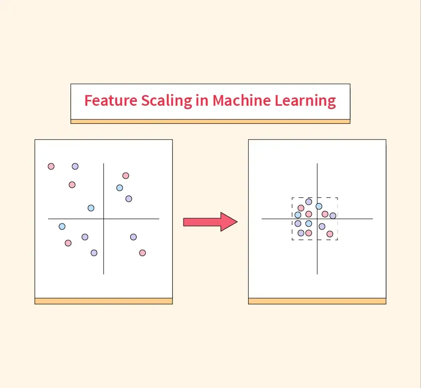

## Table of Contents

## What is scaling in the context of machine learning?

Scaling in machine learning is the process of adjusting the range of feature values in a dataset. This is important because many machine learning algorithms perform better or converge faster when the features are on a similar scale. For example, if one feature ranges from 0 to 1 and another ranges from 0 to 1000, the algorithm might be biased towards the feature with the larger range. Scaling helps to prevent this by bringing all features to a common scale, which can improve the accuracy and efficiency of the model.

There are several common methods for scaling data. One popular method is normalization, which rescales the features to a fixed range, usually between 0 and 1. This can be done using the formula $$X_{\text{norm}} = \frac{X - X_{\text{min}}}{X_{\text{max}} - X_{\text{min}}}$$. Another method is standardization, which transforms the data to have a mean of 0 and a standard deviation of 1. This is done using the formula $$X_{\text{std}} = \frac{X - \mu}{\sigma}$$, where $$\mu$$ is the mean and $$\sigma$$ is the standard deviation of the feature. Both methods help to ensure that the features contribute equally to the model's performance.

In practice, scaling is often implemented using libraries like scikit-learn in Python. For example, you can use the `MinMaxScaler` for normalization and the `StandardScaler` for standardization. Here's a simple example of how to use these scalers:

```python
from sklearn.preprocessing import MinMaxScaler, StandardScaler
import numpy as np

# Sample data
data = np.array([[1, 2], [3, 4], [5, 6]])

# Normalization
min_max_scaler = MinMaxScaler()
data_normalized = min_max_scaler.fit_transform(data)

# Standardization
standard_scaler = StandardScaler()
data_standardized = standard_scaler.fit_transform(data)

print("Normalized data:", data_normalized)
print("Standardized data:", data_standardized)
```

This code demonstrates how to apply both normalization and standardization to a dataset, ensuring that the features are on a common scale for better model performance.

## Why is scaling important for machine learning models?

Scaling is important for [machine learning](/wiki/machine-learning) models because it helps them work better and faster. When the numbers in your data are very different in size, some machine learning algorithms can get confused. For example, if one feature goes from 0 to 1 and another goes from 0 to 1000, the algorithm might pay too much attention to the feature with the bigger numbers. By scaling the data, you make sure all the features are treated fairly, which can make your model more accurate.

There are different ways to scale data, but two common methods are normalization and standardization. Normalization changes the data so it fits between 0 and 1. You can do this with the formula $$X_{\text{norm}} = \frac{X - X_{\text{min}}}{X_{\text{max}} - X_{\text{min}}}$$. Standardization changes the data so it has an average of 0 and a spread of 1. This is done with the formula $$X_{\text{std}} = \frac{X - \mu}{\sigma}$$, where $$\mu$$ is the average and $$\sigma$$ is the spread of the data. Both methods help make sure all features are on the same level, which can help your machine learning model learn better and faster.

## What are the common methods used for scaling data in machine learning?

In machine learning, scaling data means making the numbers in your dataset easier for the computer to understand. One popular way to do this is called normalization. Normalization changes all the numbers so they fit between 0 and 1. You can do this with the formula $$X_{\text{norm}} = \frac{X - X_{\text{min}}}{X_{\text{max}} - X_{\text{min}}}$$. This helps because it makes sure no single feature in your data is too big or too small compared to the others. Another way to scale data is called standardization. Standardization changes the numbers so they have an average of 0 and a spread of 1. You can do this with the formula $$X_{\text{std}} = \frac{X - \mu}{\sigma}$$, where $$\mu$$ is the average and $$\sigma$$ is the spread of the data. This method is good because it helps the computer see the data in a way that's easier to work with.

In practice, you can use tools like scikit-learn in Python to scale your data. For example, you can use the `MinMaxScaler` for normalization and the `StandardScaler` for standardization. Here's a simple example of how to use these tools:

```python
from sklearn.preprocessing import MinMaxScaler, StandardScaler
import numpy as np

# Sample data
data = np.array([[1, 2], [3, 4], [5, 6]])

# Normalization
min_max_scaler = MinMaxScaler()
data_normalized = min_max_scaler.fit_transform(data)

# Standardization
standard_scaler = StandardScaler()
data_standardized = standard_scaler.fit_transform(data)

print("Normalized data:", data_normalized)
print("Standardized data:", data_standardized)
```

This code shows how to apply both normalization and standardization to a dataset, making sure all the features are on the same scale for better model performance.

## How does scaling affect different machine learning algorithms?

Scaling data is important for many machine learning algorithms because it helps them work better. Some algorithms, like k-nearest neighbors (k-NN) and support vector machines (SVM), are sensitive to the scale of the data. If one feature has a much larger range than another, these algorithms might pay too much attention to the feature with the bigger numbers. By scaling the data, you make sure all features are treated fairly. For example, if you use standardization, you change the data so it has an average of 0 and a spread of 1 using the formula $$X_{\text{std}} = \frac{X - \mu}{\sigma}$$, where $$\mu$$ is the average and $$\sigma$$ is the spread of the data. This helps the algorithm see the data in a balanced way.

Other algorithms, like decision trees and random forests, are not as affected by scaling. These algorithms work by splitting the data based on certain conditions, and the scale of the data doesn't change how they make these splits. However, even for these algorithms, scaling can sometimes help by making the training process faster and more stable. In practice, it's a good idea to scale your data before using any machine learning algorithm, just to be safe. You can do this easily in Python using tools like `StandardScaler` from the scikit-learn library:

```python
from sklearn.preprocessing import StandardScaler
import numpy as np

# Sample data
data = np.array([[1, 2], [3, 4], [5, 6]])

# Standardization
standard_scaler = StandardScaler()
data_standardized = standard_scaler.fit_transform(data)

print("Standardized data:", data_standardized)
```

This code shows how to standardize your data, making sure all features are on the same scale, which can help improve the performance of many machine learning models.

## What is the difference between normalization and standardization?

Normalization and standardization are two ways to scale data so that machine learning algorithms can work better. Normalization changes the numbers in your data so they all fit between 0 and 1. You can do this with the formula $$X_{\text{norm}} = \frac{X - X_{\text{min}}}{X_{\text{max}} - X_{\text{min}}}$$. This helps because it makes sure no single feature in your data is too big or too small compared to the others. For example, if one feature goes from 0 to 100 and another goes from 0 to 1, normalization will make them both fit between 0 and 1.

Standardization changes the numbers in your data so they have an average of 0 and a spread of 1. You can do this with the formula $$X_{\text{std}} = \frac{X - \mu}{\sigma}$$, where $$\mu$$ is the average and $$\sigma$$ is the spread of the data. This method is good because it helps the computer see the data in a way that's easier to work with. For example, if one feature has an average of 50 and another has an average of 5, standardization will make them both have an average of 0. This can be really helpful for algorithms like k-nearest neighbors and support vector machines that are sensitive to the scale of the data.

## When should you use min-max scaling versus z-score normalization?

Min-max scaling, also known as normalization, is best used when you need your data to fit within a specific range, usually between 0 and 1. This method is helpful when you want to compare features that have different units or scales. For example, if one feature measures height in centimeters and another measures weight in kilograms, min-max scaling can make them comparable. You can do min-max scaling using the formula $$X_{\text{norm}} = \frac{X - X_{\text{min}}}{X_{\text{max}} - X_{\text{min}}}$$. This method is often used in image processing and neural networks where the input needs to be in a fixed range.

Z-score normalization, also known as standardization, is better when you want your data to have a mean of 0 and a standard deviation of 1. This method is useful for algorithms that assume your data is normally distributed, like linear regression and k-nearest neighbors. Standardization helps these algorithms work better because it makes the data easier to understand. You can do z-score normalization using the formula $$X_{\text{std}} = \frac{X - \mu}{\sigma}$$, where $$\mu$$ is the mean and $$\sigma$$ is the standard deviation. This method is often used in preprocessing steps for many machine learning models.

## How can scaling impact the performance of gradient descent?

Scaling can make a big difference in how well gradient descent works. Gradient descent is a way for machine learning models to learn by slowly adjusting their guesses to get closer to the right answer. When the numbers in your data are very different in size, gradient descent can take a long time to find the best solution. For example, if one feature goes from 0 to 1 and another goes from 0 to 1000, the algorithm might move too fast in the direction of the bigger numbers. By scaling the data, you make sure all the features are treated fairly, which can help gradient descent find the best solution faster.

One way to scale data is called standardization. Standardization changes the data so it has an average of 0 and a spread of 1. You can do this with the formula $$X_{\text{std}} = \frac{X - \mu}{\sigma}$$, where $$\mu$$ is the average and $$\sigma$$ is the spread of the data. This helps gradient descent because it makes the steps the algorithm takes more even across all features. In practice, you can use tools like scikit-learn in Python to standardize your data. Here's a simple example of how to do it:

```python
from sklearn.preprocessing import StandardScaler
import numpy as np

# Sample data
data = np.array([[1, 2], [3, 4], [5, 6]])

# Standardization
standard_scaler = StandardScaler()
data_standardized = standard_scaler.fit_transform(data)

print("Standardized data:", data_standardized)
```

This code shows how to apply standardization to a dataset, making sure all the features are on the same scale, which can help improve the performance of gradient descent.

## What are the challenges of scaling in distributed machine learning environments?

Scaling data in distributed machine learning environments can be tricky because the data is spread out across different computers. When you want to scale the data, you need to make sure all the computers are using the same rules for scaling. For example, if you use standardization, which changes the data to have an average of 0 and a spread of 1 using the formula $$X_{\text{std}} = \frac{X - \mu}{\sigma}$$, you need to calculate the average and spread across all the data. This means you have to gather information from all the computers, which can be slow and might cause problems if some computers are slower than others.

Another challenge is that scaling can take a lot of computer power. If you have a lot of data spread across many computers, scaling all of it can use up a lot of memory and processing time. This can slow down your machine learning model's training process. To handle this, you might need to use special methods or tools that are designed to work well in distributed environments. For example, you might use libraries like Apache Spark, which can help manage and process large amounts of data across many computers more efficiently.

## How do you handle scaling when dealing with sparse data?

When dealing with sparse data, scaling can be tricky because many of the values are zero. If you use regular scaling methods like normalization, which changes the data to fit between 0 and 1 using the formula $$X_{\text{norm}} = \frac{X - X_{\text{min}}}{X_{\text{max}} - X_{\text{min}}}$$, the zeros in the data can stay zero. This can be a problem because it might not change the scale of the non-zero values enough. Instead, you might want to use a method like max absolute scaling, which scales the data based on the maximum absolute value. This way, the zeros stay zero, but the other values are scaled correctly.

In practice, you can use tools like scikit-learn in Python to handle scaling sparse data. For example, you can use the `MaxAbsScaler` from scikit-learn, which is designed to work well with sparse data. Here's a simple example of how to use it:

```python
from sklearn.preprocessing import MaxAbsScaler
import numpy as np
from scipy import sparse

# Sample sparse data
data = sparse.csr_matrix([[0, 1, 0], [0, 0, 2], [3, 0, 0]])

# Max absolute scaling
max_abs_scaler = MaxAbsScaler()
data_scaled = max_abs_scaler.fit_transform(data)

print("Scaled sparse data:")
print(data_scaled)
```

This code shows how to apply max absolute scaling to a sparse dataset, making sure the scaling is done correctly even when many values are zero.

## What are advanced techniques for scaling in deep learning?

In [deep learning](/wiki/deep-learning), advanced scaling techniques can help improve the performance of neural networks. One popular method is called batch normalization. Batch normalization adjusts the inputs to each layer so they have an average of 0 and a spread of 1. This helps the network learn faster and reduces the chance of overfitting. You can do batch normalization using the formula $$y = \frac{x - \text{E}[x]}{\sqrt{\text{Var}[x] + \epsilon}}$$, where $$x$$ is the input, $$\text{E}[x]$$ is the average, $$\text{Var}[x]$$ is the spread, and $$\epsilon$$ is a small number to keep things stable. Batch normalization is often used in convolutional neural networks and other deep learning models.

Another advanced technique is layer normalization, which is similar to batch normalization but works across all the features in a single sample. This can be especially useful when you're working with data that changes a lot or when you're training on different computers. Layer normalization uses the formula $$y = \frac{x - \text{E}[x]}{\sqrt{\text{Var}[x] + \epsilon}}$$, but it calculates the average and spread across the features of each sample, not across the whole batch. This makes it more stable and can help the network learn better. Both batch and layer normalization are important tools in deep learning that can make your models work better and train faster.

## How can automated feature scaling improve machine learning pipelines?

Automated feature scaling can make machine learning pipelines easier and more reliable. When you use tools that automatically scale your data, you don't have to worry about doing it yourself every time. This means you can focus on other parts of building your model, like choosing the right algorithms or tuning the settings. Automated scaling also helps make sure that all your features are treated fairly, which can make your model work better. For example, if you use standardization, which changes the data to have an average of 0 and a spread of 1 using the formula $$X_{\text{std}} = \frac{X - \mu}{\sigma}$$, where $$\mu$$ is the average and $$\sigma$$ is the spread, the tool will do this for you automatically.

Another benefit of automated feature scaling is that it can help make your machine learning pipeline more consistent. When you scale your data the same way every time, you can compare different models and experiments more easily. This can help you understand which changes make your model better or worse. In practice, you can use libraries like scikit-learn in Python to automate your scaling. For example, you can use the `StandardScaler` to standardize your data, which can help improve the performance of many machine learning models. Here's a simple example of how to do it:

```python
from sklearn.preprocessing import StandardScaler
import numpy as np

# Sample data
data = np.array([[1, 2], [3, 4], [5, 6]])

# Standardization
standard_scaler = StandardScaler()
data_standardized = standard_scaler.fit_transform(data)

print("Standardized data:", data_standardized)
```

## What are the best practices for scaling large datasets in machine learning?

When dealing with large datasets in machine learning, it's important to scale the data in a way that doesn't take too long or use too much memory. One good way to do this is to use a method called "online scaling" or "incremental scaling." This means you scale the data as it comes in, instead of waiting for all the data to be ready. For example, you can use the `StandardScaler` from scikit-learn in Python, which can be set to work in an incremental way. This helps because it lets you start scaling right away, even if you're still getting more data. You can use the formula $$X_{\text{std}} = \frac{X - \mu}{\sigma}$$ to standardize your data, where $$\mu$$ is the average and $$\sigma$$ is the spread, but you calculate these values as new data comes in.

Another best practice is to use tools that are made for handling big data, like Apache Spark. These tools can help you scale your data across many computers at the same time, which can make the process much faster. For example, you can use the `StandardScaler` from Spark's MLlib library to standardize your data. This is helpful because it can handle very large datasets without using too much memory on any one computer. By using these tools and methods, you can make sure your machine learning model works well, even with a lot of data.

## References & Further Reading

[1]: Müller, A. C., & Guido, S. (2016). ["Introduction to Machine Learning with Python: A Guide for Data Scientists."](https://books.google.com/books/about/Introduction_to_Machine_Learning_with_Py.html?id=1-4lDQAAQBAJ) O'Reilly Media, Inc.

[2]: Géron, A. (2019). ["Hands-On Machine Learning with Scikit-Learn, Keras, and TensorFlow: Concepts, Tools, and Techniques to Build Intelligent Systems."](https://www.amazon.com/Hands-Machine-Learning-Scikit-Learn-TensorFlow/dp/1098125975) O'Reilly Media, Inc.

[3]: Pedregosa, F., Varoquaux, G., Gramfort, A., Michel, V., Thirion, B., Grisel, O., ... & Duchesnay, É. (2011). ["Scikit-learn: Machine Learning in Python."](https://dl.acm.org/doi/10.5555/1953048.2078195) Journal of Machine Learning Research, 12, 2825-2830.

[4]: Goodfellow, I., Bengio, Y., & Courville, A. (2016). ["Deep Learning."](https://link.springer.com/article/10.1007/s10710-017-9314-z) MIT Press.

[5]: Ioffe, S., & Szegedy, C. (2015). ["Batch Normalization: Accelerating Deep Network Training by Reducing Internal Covariate Shift."](https://arxiv.org/abs/1502.03167) arXiv preprint arXiv:1502.03167.

[6]: Ruder, S. (2016). ["An Overview of Gradient Descent Optimization Algorithms."](https://arxiv.org/abs/1609.04747) arXiv preprint arXiv:1609.04747.