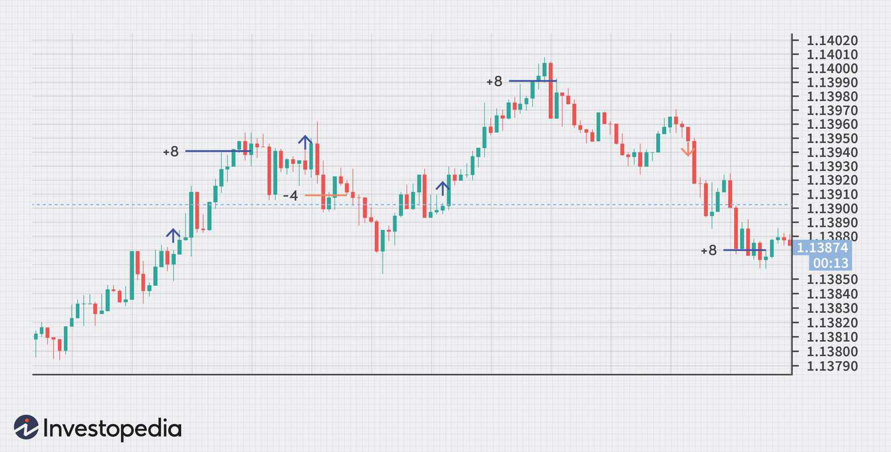

Forex trading, particularly scalp trading, has garnered immense popularity among traders eager to capitalize on rapid fluctuations in the currency market. This trading style is characterized by its focus on short-term gains, with traders often aiming to exploit minor price movements within very brief timeframes. The method requires considerable skill and unwavering attention to execute numerous trades swiftly, often closing within minutes of opening.

The primary appeal of scalp trading lies in its potential for quick profits. However, this strategy is not without its challenges and inherent risks. The high frequency of trades can lead to increased transaction costs and the potential for slippage, where trades are executed at prices different from those intended due to sudden market shifts.



In recent times, algorithmic trading has emerged as a crucial component in enhancing the efficiency and effectiveness of scalping strategies. By leveraging computer programs to automate trade entries and exits based on pre-determined criteria, traders can execute high-frequency strategies with greater precision and speed. Automation also helps to eliminate emotional biases that might influence decision-making, potentially improving overall trading outcomes.

This article will examine scalp trading within the forex market, highlighting its operational dynamics, associated risks, and how algorithmic solutions can ameliorate some of these challenges. By understanding how scalp trading integrates with overall forex trading strategies, readers can better appreciate its place in the complex world of financial markets.

## Table of Contents

## What is Forex Scalping?

Forex scalping is a popular short-term trading strategy in the currency market that involves capitalizing on small price fluctuations. Traders, known as "scalpers," focus on minute-to-minute movements in currency prices to accrue small profits. This approach necessitates a high volume of trades within a single day, with positions typically closed within minutes rather than hours or days.

Given the rapid nature of scalp trading, traders are required to remain constantly vigilant, glued to their screens to monitor price action and execute trades swiftly. Most trades depend on technical analysis, with traders frequently analyzing charts, indicators, and price patterns to identify opportunities for entering and exiting trades efficiently.

The key principle of [forex](/wiki/forex-system) [scalping](/wiki/gamma-scalping) is to achieve a small profit per trade, making it imperative to execute numerous trades throughout the day to accumulate substantial returns. For instance, if a scalper aims for a 5-pip profit per trade, they might need to make hundreds of trades to realize significant gains. This high-frequency trading approach could involve thousands of transactions over a month, with each aiming to extract the slightest edge from the market's natural ebb and flow.

The small margins per trade mean that scalpers are heavily reliant on the [volume](/wiki/volume-trading-strategy) of their trades, stressing the importance of both precision and speed in execution. Efficient scalping typically leverages technology that offers direct market access and rapid order execution to mitigate the risks associated with time delays and market fluctuations. As such, forex scalping is a strategy that combines meticulous market analysis with swift trading decisions to effectively capture minuscule market movements for profit.

## The Mechanics of Forex Scalping

Forex scalping involves trading currency in lots, which are standardized units facilitating ease of transactions. These lots come in various sizes: standard lots (100,000 units of currency), mini lots (10,000 units), and micro lots (1,000 units). This method capitalizes on small fluctuations in currency prices, with traders aiming to accumulate profits by making numerous trades within short timeframes. 

Scalping usually relies on high-speed trading enabled by direct market access and low-latency trading platforms. These technologies facilitate rapid trade execution, which is vital given the minute profit margins scalpers work with. Direct market access allows scalpers to interact directly with the electronic communication networks that facilitate most forex orders, reducing intermediaries and ensuring minimal delays. Low latency ensures that the time between order execution and confirmation is as brief as possible, a crucial [factor](/wiki/factor-investing) when numerous trades occur within seconds or minutes.

Technical analysis is indispensable in scalping, with traders often using various charts and indicators to determine potential entry and [exit](/wiki/exit-strategy) points. Common indicators employed by scalpers include moving averages, Relative Strength Index (RSI), Bollinger Bands, and support and resistance levels. Traders analyze these indicators to predict short-term price movements and exploit small swings and price discrepancies. 

Overall, successful forex scalping depends on the trader's ability to quickly interpret market signals and react with precise trade executions, leveraging technology to support their strategies.

## Risks Associated with Forex Scalping

Forex scalping, a strategy characterized by high-frequency trading, inherently carries several risks. Primarily, the elevated trading frequency can result in significant transaction costs, which can substantially reduce profit margins. The cumulative effect of these costs, including spreads and commissions, can be detrimental, making it necessary for traders to achieve a large number of successful trades just to offset these expenses.

Scalpers also face the risk of slippage. Slippage occurs when a trader receives a different execution price than intended, often due to rapid market movements or insufficient [liquidity](/wiki/liquidity-risk-premium). In volatile forex markets, prices can change within fractions of a second, leading to discrepancies between the expected and actual transaction price. This can turn potentially profitable trades into losses if not managed appropriately.

Leverage, a tool often used to increase potential returns, magnifies both gains and losses. The leverage ratio in forex trading can be quite high, allowing traders to control large positions with relatively small amounts of capital. While this can lead to significant profits, it also increases the risk of substantial losses, especially if the market moves unfavorably. Traders must meticulously manage their leverage, perhaps utilizing margin calls or stop-loss orders to mitigate potential downsides.

Risk management in forex scalping is paramount. Traders benefit from employing strategies such as setting predefined stop-loss and take-profit levels to protect against unforeseen market movements. This includes constantly monitoring open positions and market conditions to adjust strategies as needed. In essence, forex scalping necessitates not only a strong understanding of market mechanics but also the discipline to maintain strict control over trading activities and risk exposure.

## The Role of Algorithmic Trading in Forex Scalping

Algorithmic trading, often termed algo trading, is revolutionizing the forex scalp trading landscape by leveraging computer programs to enter and exit trades based on predefined criteria. This method is especially beneficial for scalping, given its fast-paced nature and the necessity for quick decision-making.

One of the primary advantages of [algorithmic trading](/wiki/algorithmic-trading) is its facilitation of high-frequency trading ([HFT](/wiki/high-frequency-trading-strategies)). High-frequency trading is integral to scalping, where the objective is to make profits from small price movements within very short time frames. Algorithms execute trades with extraordinary speed and precision, ensuring that traders can capitalize on fleeting trading opportunities that arise from minute fluctuations in currency values.

Moreover, algo trading significantly reduces the emotional component in trading decisions. By automating the trading process, it mitigates the risk of human error that can arise from emotional responses to market changes, a common pitfall in manual trading. Emotions like fear and greed often lead to irrational decision-making, but with algorithmic trading, the decision to buy or sell is made solely based on the data and the set parameters.

Algorithmic systems execute trades with increased accuracy and speed, crucial in a scalp trading setting where timing is everything. These systems can quickly analyze multiple indicators and trends, entering and exiting trades faster than any manual process. This increase in execution speed decreases latency – the delay between receiving a signal and executing a trade – thereby enhancing the likelihood of securing optimal entry and exit points.

Consider the Python code snippet below illustrating a basic algorithm for scalp trading:

```python
import pandas as pd

def scalping_algorithm(data):
    entry_point = None

    for index, row in data.iterrows():
        if entry_point is None and row['Signal'] == 'Buy':
            entry_point = row['Price']
            print(f"Buying at {entry_point}")

        elif entry_point is not None and row['Signal'] == 'Sell':
            exit_point = row['Price']
            profit = exit_point - entry_point
            print(f"Selling at {exit_point}, Profit: {profit}")
            entry_point = None

# Example usage with pseudo data
data = pd.DataFrame({
    'Price': [1.100, 1.105, 1.095, 1.110, 1.107],
    'Signal': ['Buy', '', 'Sell', 'Buy', 'Sell']
})

scalping_algorithm(data)
```

This simplified scalping algorithm examines a data series for buy and sell signals. On detecting a buy signal, it determines an entry point, and upon receiving a sell signal, it captures the exit point, calculating the profit. While this example demonstrates a rudimentary strategy, more sophisticated algorithms integrate multiple data feeds and complex strategies.

In summary, the integration of algorithmic trading in forex scalping enhances trading efficiency by allowing rapid trade execution based on data-defined signals. It eliminates emotional biases and operates with an accuracy and speed that are essential for profiting in the fast-paced forex market. Algorithmic trading equips scalpers with the capability to navigate the complexities of modern trading environments, bolstering their potential for success.

## Strategies for Effective Scalping

Forex scalping strategies often focus on exploiting small price movements to generate quick profits. One prevalent approach is trend trading, where traders align their actions with an existing market [momentum](/wiki/momentum). By identifying a prevailing trend—either upward or downward—scalpers can capitalize on minor price swings within this direction. The key lies in pinpointing entry and exit points that maximize the potential for gains while minimizing exposure to reversals.

In addition to trend trading, countertrend and range trading are popular among scalpers. Countertrend trading involves identifying potential price reversals, allowing traders to profit from market corrections. This strategy requires keen market observation and timing precision to distinguish between temporary pullbacks and genuine trend changes. Range trading, on the other hand, focuses on capitalizing on price fluctuations within a stable market range. Scalpers closely monitor support and resistance levels, aiming to buy near the support and sell near the resistance.

Statistical analysis plays an essential role for successful scalpers. By analyzing historical price data, traders identify recurring patterns that may suggest potential trading opportunities. These patterns could be based on price movements, candlestick formations, or even indicators like moving averages or Bollinger Bands. For instance, a scalper might use a simple moving average crossover system to signal entry and exit points. 

Consider a simple moving average strategy in Python:
```python
import pandas as pd

# Load your forex data
data = pd.read_csv('forex_data.csv')

# Calculate short and long simple moving averages
data['SMA_Short'] = data['Close'].rolling(window=5).mean()
data['SMA_Long'] = data['Close'].rolling(window=20).mean()

# Determine buy and sell signals
data['Signal'] = 0
data['Signal'][5:] = np.where(data['SMA_Short'][5:] > data['SMA_Long'][5:], 1, 0)

# Generate trading positions
data['Position'] = data['Signal'].diff()

# Print the signal dataframe
print(data[['Close', 'SMA_Short', 'SMA_Long', 'Signal', 'Position']])
```
In this example, a buy signal is generated when the short-term moving average crosses above the long-term moving average, and a sell signal occurs when it crosses below.

Effective risk management is crucial in scalping to protect against sudden market moves. Traders often set stop-loss orders to limit potential losses if the market moves against their position. Similarly, take-profit levels help secure gains once a trade reaches a predetermined profit target. These tools are vital for maintaining discipline and managing emotions during fast-paced trading sessions. Developing a robust risk management plan involves analyzing market [volatility](/wiki/volatility-trading-strategies), defining acceptable risk levels per trade, and adjusting strategies to align with evolving market conditions.

## Conclusion

Forex scalping is characterized by its dynamic nature, demanding traders to exhibit discipline, rapid decision-making, and efficient execution. This approach leverages brief fluctuations in currency prices, requiring traders to continuously monitor the market. While forex scalping offers significant profit potential, it inherently carries substantial risks. These risks are attributed to the [high frequency](/wiki/high-frequency-trading) of trades and the leverage used, which can amplify both gains and losses. Therefore, comprehensive market knowledge and robust risk management strategies are crucial for traders aiming to succeed in this domain.

Algorithmic trading serves as a valuable asset for scalpers, offering a range of tools that enhance the efficiency of executing trading strategies. By utilizing sophisticated algorithms, scalpers can achieve precision and speed, minimizing human error and emotional biases that can adversely affect trading outcomes. Algorithmic solutions, like high-frequency trading systems, allow for seamless trade executions, which are vital when operating within the narrow timeframes that scalping encompasses.

The ultimate success in forex scalping lies in integrating strategic planning with advanced technological tools. Traders must harness the power of real-time data analysis and algorithmic execution to navigate the highly volatile forex markets effectively. This combination allows traders to maximize potential profits while mitigating associated risks, ensuring a balanced and informed approach to scalp trading in forex.

## References & Further Reading

[1]: Bergstra, J., Bardenet, R., Bengio, Y., & Kégl, B. (2011). ["Algorithms for Hyper-Parameter Optimization."](https://papers.nips.cc/paper/4443-algorithms-for-hyper-parameter-optimization) Advances in Neural Information Processing Systems 24.

[2]: ["Advances in Financial Machine Learning"](https://www.amazon.com/Advances-Financial-Machine-Learning-Marcos/dp/1119482089) by Marcos Lopez de Prado

[3]: ["Evidence-Based Technical Analysis: Applying the Scientific Method and Statistical Inference to Trading Signals"](https://www.amazon.com/Evidence-Based-Technical-Analysis-Scientific-Statistical/dp/0470008741) by David Aronson

[4]: ["Machine Learning for Algorithmic Trading"](https://github.com/stefan-jansen/machine-learning-for-trading) by Stefan Jansen

[5]: ["Quantitative Trading: How to Build Your Own Algorithmic Trading Business"](https://www.amazon.com/Quantitative-Trading-Build-Algorithmic-Business/dp/1119800064) by Ernest P. Chan