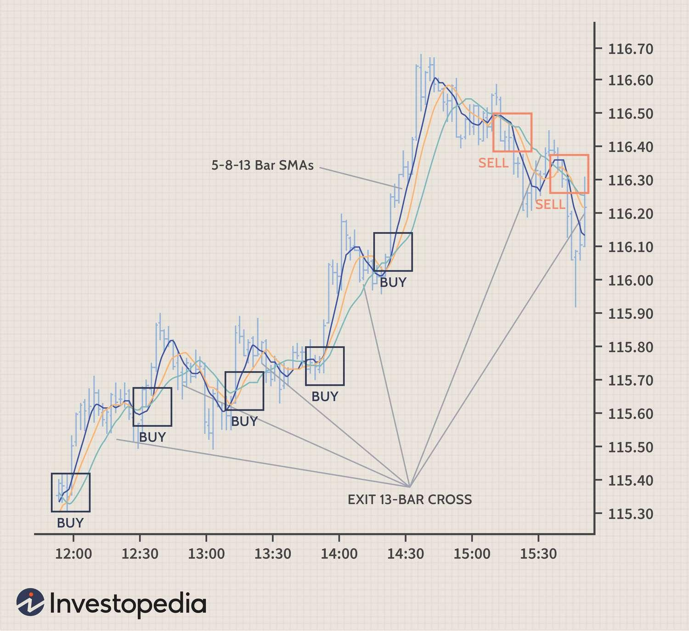

## Table of Contents

## What is scalping in financial trading?

Scalping in financial trading is a strategy where traders make many small trades throughout the day to earn small profits from each trade. The idea is to buy a financial product, like a stock or currency, at a low price and then sell it quickly at a slightly higher price. Traders who use this method, called scalpers, aim to take advantage of small price changes that happen often in the market.

Scalping requires a lot of attention and quick decision-making. Traders need to watch the market closely and act fast to make their trades. Because the profits from each trade are small, scalpers need to make a lot of trades to make a significant amount of money. This strategy can be risky because it involves a lot of trading and the costs of trading, like fees, can add up quickly.

## How does scalping differ from other trading strategies?

Scalping is different from other trading strategies because it focuses on making many small trades in a short time. Unlike strategies like day trading or swing trading, where traders might hold onto their investments for hours or days, scalpers buy and sell within minutes or even seconds. The goal of scalping is to make small profits from tiny price movements that happen all the time in the market. This means scalpers need to be very quick and pay close attention to the market all the time.

Other trading strategies, like swing trading or position trading, involve holding onto investments for longer periods. Swing traders might keep their investments for days or weeks, trying to benefit from bigger price changes. Position traders might hold onto their investments for months or even years, aiming to profit from long-term trends. These strategies require less immediate attention to the market compared to [scalping](/wiki/gamma-scalping), but they also [carry](/wiki/carry-trading) different risks and potential rewards. Scalping is more about speed and [volume](/wiki/volume-trading-strategy), while other strategies focus more on timing and patience.

## What are the key principles of scalping?

Scalping is all about making quick, small profits from tiny price changes in the market. The main idea is to buy something at a low price and sell it just a little bit higher, but to do this many times throughout the day. Scalpers need to watch the market very closely and be ready to act fast because they only make a small amount of money from each trade. To make a good profit, they have to do a lot of trades, which means they need to be very focused and quick.

Another important thing about scalping is managing risk. Because scalpers do so many trades, they can quickly lose money if they don't keep an eye on their trades. They use tools like stop-loss orders to limit how much they can lose on each trade. Scalpers also have to be aware of the costs of trading, like fees, because these can add up and eat into their small profits. So, while scalping can be a way to make money, it requires a lot of skill and careful planning to do well.

## What types of financial instruments are commonly used for scalping?

Scalping is often done with financial instruments that have a lot of trading activity and small price changes. The most common ones are [forex](/wiki/forex-system) (foreign exchange) markets, where people trade different currencies. Forex markets are open 24 hours a day during the week, so there are always opportunities to make trades. Another popular choice for scalping is stocks, especially those that are very active and have a lot of trading volume. These stocks move quickly, which is good for scalpers who want to make many small trades.

In addition to forex and stocks, scalpers also use futures contracts. Futures are agreements to buy or sell something at a future date, and they can be based on things like commodities, stock indexes, or currencies. Futures markets can be very active, which makes them suitable for scalping. Some scalpers also use options, which are contracts that give the right, but not the obligation, to buy or sell an asset at a set price. Options can be complex, but they can also offer opportunities for quick trades. Overall, the key is to choose instruments that have enough activity and small enough price movements to make scalping profitable.

## What are the essential tools and indicators for a scalper?

Scalpers need certain tools and indicators to do their job well. One important tool is a fast and reliable trading platform that lets them make trades quickly. They also use charts to see how prices are moving. These charts show price changes over time, which helps scalpers decide when to buy and sell. Another useful tool is a stop-loss order, which automatically sells a trade if the price goes down too much, helping scalpers limit their losses.

Indicators are also very important for scalpers. One common indicator is the moving average, which shows the average price of a financial instrument over a certain time. This helps scalpers see the overall direction of the price. Another useful indicator is the Relative Strength Index (RSI), which tells scalpers if a financial instrument is overbought or oversold. This can help them decide when to make a trade. Scalpers also use the MACD (Moving Average Convergence Divergence) indicator, which shows the relationship between two moving averages and can signal when to buy or sell.

## How can a beginner start scalping?

If you're a beginner wanting to start scalping, the first thing you should do is learn as much as you can about how it works. Scalping means making lots of small trades in a short time to earn small profits. You'll need to understand how to read price charts and use different tools like moving averages and the RSI (Relative Strength Index) to help you make decisions. It's also important to practice using a demo account, which lets you trade with pretend money so you can get the hang of it without risking your own money.

Once you feel ready, choose a reliable trading platform that lets you make trades quickly. Start with small amounts of money and focus on financial instruments that are good for scalping, like forex or very active stocks. Remember to use stop-loss orders to limit your losses. Scalping can be exciting, but it's also risky, so take your time to learn and don't rush into making big trades right away.

## What are the common risks associated with scalping?

Scalping can be risky because it involves making a lot of trades in a short time. If you make a mistake, you might lose money quickly. The costs of trading, like fees, can also add up fast because you're doing so many trades. This means that even if you make small profits on each trade, the fees might take a big chunk out of your earnings. Another risk is that the market can be unpredictable, and small price changes can go against you, leading to losses.

Another big risk is that scalping takes a lot of focus and quick thinking. If you get distracted or make decisions too slowly, you might miss good opportunities or make bad trades. It can also be stressful because you need to watch the market all the time. This stress can lead to mistakes, which can cost you money. So, while scalping can be a way to make money, it's important to be aware of these risks and take steps to manage them carefully.

## How can one manage risk effectively while scalping?

Managing risk while scalping is very important because you are making many small trades. One way to do this is by using stop-loss orders. A stop-loss order automatically sells your trade if the price goes down too much. This helps you limit how much money you can lose on each trade. Another way to manage risk is by not putting all your money into one trade. Instead, use only a small amount of your money for each trade. This way, even if you lose on some trades, you won't lose all your money at once.

Another important part of managing risk is keeping an eye on the costs of trading, like fees. Since you are making so many trades, these fees can add up quickly and eat into your small profits. Make sure to choose a trading platform with low fees. Also, try to be disciplined and stick to your trading plan. Don't let emotions make you trade more than you should. Scalping can be exciting, but staying calm and following your plan will help you manage risk better.

## What psychological traits are important for successful scalping?

To be good at scalping, you need to be very patient and focused. Because you're making lots of small trades all the time, you need to stay calm and not let small losses or quick wins make you lose your cool. It's important to stick to your plan and not let your emotions take over. If you get too excited or too upset, you might start making bad decisions and lose money.

Another important trait is being able to make quick decisions. Scalping means you have to act fast because the market can change in just a few seconds. You need to be able to look at the charts and indicators, and then decide to buy or sell without thinking too long. This takes practice and confidence in what you're doing. If you can stay focused, patient, and make quick decisions, you'll be better at managing the risks of scalping and might make more money.

## How do market conditions affect scalping strategies?

Market conditions can really change how well scalping works. When the market is moving a lot, with big price changes happening fast, it can be a good time for scalping. This is because scalpers make money from small price moves, and a busy market gives them more chances to trade. But, if the market is very calm and prices aren't moving much, it can be hard for scalpers to make money because there aren't enough price changes to make small profits from.

Another thing to think about is how much other people are trading. If there's a lot of trading going on, it's easier for scalpers to get in and out of trades quickly. But if there's not much trading, it can be harder to buy and sell fast, which is important for scalping. Also, big news or events can shake up the market and make prices jump around a lot. This can be good for scalpers because it creates more chances to trade, but it can also be risky because the market might move in ways that are hard to predict.

## What advanced techniques can enhance scalping performance?

To make scalping better, you can use something called "order flow analysis." This means looking at how many people are buying and selling and at what prices. By understanding this, you can see where the market might be going next. Another technique is using "level 2 quotes," which show you more details about the prices people are willing to buy and sell at. This can help you make better decisions about when to trade. Also, using "time and sales" data can show you the exact trades happening in real time, helping you spot trends and make quick moves.

Another way to improve scalping is by using "[algorithmic trading](/wiki/algorithmic-trading)." This means using computer programs to make trades for you based on certain rules you set. These programs can look at the market much faster than a person can and make trades in a split second. This can help you take advantage of small price changes that you might miss otherwise. Also, "tape reading" is a technique where you watch the price movements very closely to see patterns and make trades based on what you see. By combining these advanced techniques, you can make your scalping more effective and possibly make more money.

## How can one evaluate the effectiveness of their scalping strategy?

To figure out if your scalping strategy is working well, you need to look at how much money you're making and how much you're losing. Keep track of all your trades, writing down how much you made or lost on each one. Then, add up your profits and subtract your losses to see your total gain or loss. It's also important to look at how often you're winning compared to losing. If you're winning more often than losing, that's a good sign. But if you're losing more, you might need to change your strategy.

Another way to check your scalping strategy is by seeing how well you're managing risk. Look at how much money you're risking on each trade and if you're using stop-loss orders to limit your losses. If you're losing too much on some trades, your risk might be too high. Also, think about the costs of trading, like fees. If these costs are eating up a lot of your profits, you might need to find a cheaper way to trade. By looking at these things, you can see if your scalping strategy is working and make changes to do better.

## References & Further Reading

[1]: Bergstra, J., Bardenet, R., Bengio, Y., & Kégl, B. (2011). ["Algorithms for Hyper-Parameter Optimization."](https://dl.acm.org/doi/10.5555/2986459.2986743) Advances in Neural Information Processing Systems 24.

[2]: ["Advances in Financial Machine Learning"](https://www.amazon.com/Advances-Financial-Machine-Learning-Marcos/dp/1119482089) by Marcos Lopez de Prado

[3]: ["Evidence-Based Technical Analysis: Applying the Scientific Method and Statistical Inference to Trading Signals"](https://www.wiley.com/en-us/Evidence+Based+Technical+Analysis%3A+Applying+the+Scientific+Method+and+Statistical+Inference+to+Trading+Signals-p-9780470008744) by David Aronson

[4]: ["Machine Learning for Algorithmic Trading"](https://github.com/PacktPublishing/Machine-Learning-for-Algorithmic-Trading-Second-Edition) by Stefan Jansen

[5]: ["Quantitative Trading: How to Build Your Own Algorithmic Trading Business"](https://books.google.com/books/about/Quantitative_Trading.html?id=j70yEAAAQBAJ) by Ernest P. Chan