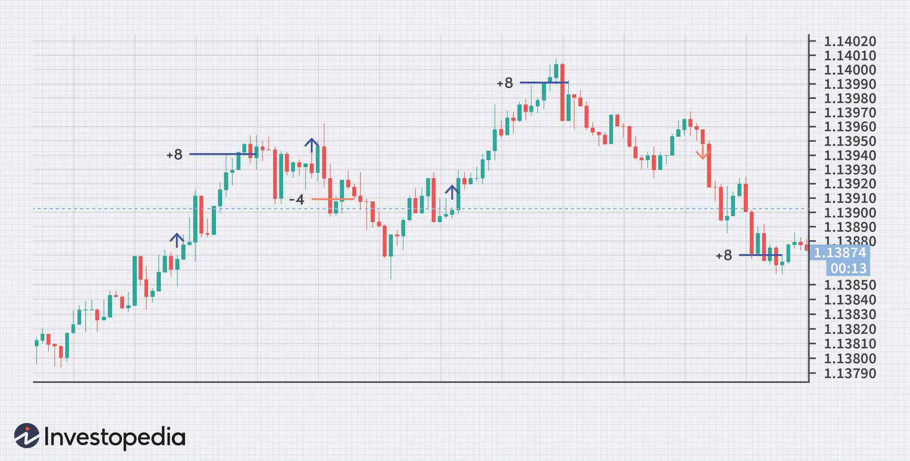

Forex trading involves the exchange of currency pairs with the primary aim of benefiting from fluctuations in exchange rates. At its core, this practice requires an understanding of the international monetary market and the ability to anticipate the movements of currency values. Among the diverse strategies employed by traders, scalping stands out for its focus on rapid, successive trades. Scalping is characterized by the execution of numerous transactions within very short periods, often just seconds to minutes, to capitalize on minor price variations. This strategy is particularly appealing to those seeking swift profits without holding positions long-term.

The scalping approach demands not only quick decision-making but also precise execution, as the potential profit from each trade is typically small. Therefore, it is crucial to ensure that the cumulative gains from many trades outweigh any losses or transaction costs incurred. To accommodate the rapid pace and complexity of scalping, traders frequently turn to algorithmic trading systems. These automated systems have the advantage of speed and consistency, qualities essential for the successful implementation of a scalping strategy.



Algorithmic trading facilitates the automation of decision-making processes based on predefined parameters and market data analysis. By leveraging these systems, traders can enhance both the efficiency and consistency of their operations. The use of algorithms minimizes the potential for human error and eliminates the influence of emotional biases, which can be detrimental in a fast-paced trading environment. This article will explore the integral components and strategic aspects of employing algorithmic trading in conjunction with scalping strategies in the forex market.

## Table of Contents

## Understanding Forex Scalping

Forex scalping is a trading strategy aimed at capitalizing on small price movements within extremely short timeframes. Unlike traditional approaches that might hold positions for days or weeks, scalpers seek to take advantage of brief market fluctuations, often executing and closing trades within seconds or minutes. The primary objective is to accumulate numerous small profits that collectively yield significant returns.

Scalpers operate by targeting frequent trading signals, which necessitate quick decision-making and execution. Given the need for rapid response to market movements, many scalpers rely on automated trading systems to enhance the accuracy and efficiency of trade executions. These systems can swiftly identify entry and exit points based on pre-defined criteria, allowing traders to manage multiple trades simultaneously.

Critical to successful scalping are trading efficiency, market liquidity, and minimal spreads. High liquidity in the forex market ensures that trades can be executed swiftly without significant price changes. This characteristic is particularly important because any delay in execution can erode the small profit margins typical in scalping. Similarly, tight spreads reduce the transaction costs associated with each trade, maximizing the profitability potential.

Scalping is best suited to traders who thrive under high-pressure conditions and possess the capability to maintain high levels of concentration over extended periods. The inherent nature of this strategy demands strong discipline and the ability to make quick decisions while managing stress effectively. While risky and demanding, [forex](/wiki/forex-system) [scalping](/wiki/gamma-scalping) remains popular among traders due to its potential for generating quick, frequent profits.

## Popular Currency Pairs for Scalping

Certain currency pairs are preferred for scalping due to their intrinsic characteristics that support this high-frequency trading approach. Scalpers prioritize pairs that exhibit high [liquidity](/wiki/liquidity-risk-premium) and tight spreads as these factors allow for rapid entry and [exit](/wiki/exit-strategy) in the market, which is crucial given the narrow profit margins associated with scalping.

Major currency pairs such as EUR/USD, USD/JPY, and GBP/USD are frequently favored by scalpers. These pairs are considered among the most liquid in the forex market, meaning they have a high [volume](/wiki/volume-trading-strategy) of trades on a daily basis. This liquidity leads to tight bid-ask spreads, minimizing transaction costs, which is essential when profits per trade are slim. For instance, according to data available on platforms like Bloomberg and Reuters, the EUR/USD pair often exhibits some of the tightest spreads and highest trading volumes, making it a staple for scalpers looking to capitalize on small price movements.

The behavior and [volatility](/wiki/volatility-trading-strategies) patterns of these major pairs are also critical for scalping. They tend to respond predictably to economic news and global events, providing scalpers with the opportunity to exploit short-term price fluctuations. For instance, the release of European Central Bank [interest rate](/wiki/interest-rate-trading-strategies) decisions or U.S. employment reports can cause significant movements in the EUR/USD pair, thereby presenting numerous quick trading opportunities for scalpers.

Scalping strategies are significantly influenced by the choice of currency pairs. A trader’s success is partially contingent on selecting pairs that not only exhibit high liquidity and tight spreads but also align with their risk tolerance and trading style. For example, while major pairs provide stability and predictability, some minor or exotic pairs might offer higher volatility and potentially larger profits but come with increased risk and wider spreads.

In summary, the selection of currency pairs in scalping is a strategic decision that hinges on factors such as liquidity, spreads, and volatility. An astute scalper will weigh these factors carefully, often focusing on major pairs like EUR/USD, USD/JPY, and GBP/USD, to optimize their trading strategy and maximize profitability.

## The Role of Algorithmic Trading in Scalping

Algorithmic trading plays a pivotal role in enhancing scalping strategies by automating the decision-making processes involved in executing rapid trades. This automation is achieved through the use of algorithms developed to follow predefined criteria and conduct real-time market analysis.

Firstly, automated systems significantly improve the speed and precision necessary for successful scalping. The execution times of algorithmic trades are often measured in milliseconds, far surpassing human capabilities. This rapid execution is crucial in scalping, where capturing even the smallest price fluctuations can be the difference between profit and loss.

Algorithms facilitate the simultaneous management of multiple trades, thereby potentially increasing profitability and optimizing risk management. By handling numerous trades, algorithms can diversify trading activities and decrease the overall risk exposure of a trading strategy. This kind of scalability in trade management is essential for maximizing the potential returns from scalping, where high-volume and fast-paced trading dominate.

A significant advantage of [algorithmic trading](/wiki/algorithmic-trading) is its ability to reduce human error and emotional bias, elements that can impair decision-making in trading. Scalping requires executing a [high frequency](/wiki/high-frequency-trading) of trades, leaving it particularly susceptible to human inconsistencies and emotional responses to market fluctuations. By adhering strictly to predefined rules, algorithmic systems maintain discipline and consistency across trades.

Moreover, the integration of technical analysis tools within these algorithms is crucial. Technical indicators such as moving averages, relative strength index (RSI), and Bollinger Bands can be programmatically applied to generate accurate buy and sell signals. The use of such technical analysis enables algorithms to identify trends, overbought or oversold conditions, and potential [breakout](/wiki/breakout-trading) points more effectively than manual analysis.

In code, this integration can be exemplified through a simple Python script using libraries such as pandas and TA-Lib for technical analysis:

```python
import pandas as pd
import talib as ta

# Example of loading data
data = pd.read_csv('forex_data.csv')
close_prices = data['Close']

# Calculate moving average
short_ma = ta.SMA(close_prices, timeperiod=5)
long_ma = ta.SMA(close_prices, timeperiod=20)

# Generate buy/sell signals
signal = (short_ma > long_ma).astype(int)  # Buy when short MA crosses above long MA
```

This code snippet demonstrates how technical indicators can be integrated into an algorithmic trading system to automate the generation of trading signals based on moving averages. Such integration exemplifies the synergy between algorithmic trading and technical analysis, facilitating effective scalping strategies in the currency market.

## Pros and Cons of Scalping in Forex

Forex scalping is a trading strategy characterized by the rapid execution of numerous transactions aimed at benefiting from small price changes. There are distinct advantages and disadvantages to adopting this method, making it suitable for some traders while posing challenges for others.

One of the principal benefits of scalping in the forex market is the potential for frequent profits. By executing a large volume of trades within a short period, traders have multiple opportunities to capitalize on small market movements. This approach can lead to accumulative gains over time, particularly during periods of high market activity. Additionally, scalping reduces exposure to prolonged market risks. Since trades are held for only a few seconds to minutes, scalpers are less vulnerable to unexpected market fluctuations that can affect long-term trades. This makes scalping attractive to traders with a low-risk tolerance.

Furthermore, scalping offers a lower barrier to entry for retail traders. Unlike other strategies that may require comprehensive market analysis or reliance on complex indicators, scalping can be executed with minimal market knowledge and basic trading tools. The simplicity of the strategy allows beginners to engage with the forex market more readily, encouraging participation in a global economic arena.

However, the methodology comes with significant challenges. Scalping demands substantial focus as traders must remain attentive to price movements and execute trades swiftly. The fast-paced nature of scalping can lead to mental fatigue and stress, impacting the decision-making abilities of traders. Additionally, the use of leverage magnifies both potential profits and losses, increasing financial exposure. Given the small profit margins typical of scalping, any amplification of losses can rapidly diminish trading capital.

High transaction costs are another downside to consider. Frequent trading incurs numerous spreads and fees, which can erode potential gains and impair financial objectives. This requires scalpers to achieve a higher trade success rate to remain profitable. The narrow profit margin for each trade necessitates precision in execution, adding pressure on traders to maintain consistent performance.

Achieving long-term success in scalping requires a careful balance between risk management and trading volume. Traders must implement stringent risk control measures, such as stop-loss orders and predetermined risk-reward ratios, to safeguard their investments. By maintaining discipline and periodically evaluating risk exposure, scalpers can enhance their sustainability in the volatile forex market.

In conclusion, while forex scalping presents opportunities for frequent profits with reduced market exposure, it is accompanied by challenges that require rigorous focus and effective risk management. The strategy remains viable for retail traders who can navigate its demands and leverage its strengths to achieve consistent profitability.

## Scalping Strategies and Indicators

Scalping strategies in the forex market commonly utilize technical indicators such as Bollinger Bands, moving averages, and the Relative Strength Index (RSI) to identify trading opportunities. Each of these indicators provides insights into market conditions, aiding scalpers in executing quick trades.

Bollinger Bands are a popular tool among scalpers for gauging market volatility and identifying breakout points. Developed by John Bollinger, these bands consist of a middle band (usually a 20-day simple moving average), and an upper and lower band set a certain number of standard deviations away from the middle band. When price moves toward the upper band, it signals a potential overbought condition, whereas movement toward the lower band signifies a potential oversold condition. Scalpers use these signals to make quick entry and exit decisions, capturing profitable movements as prices revert to the mean.

Moving averages smooth out price data, generating a continuous average that helps traders discern the direction of the trend. For scalping, shorter moving averages, such as the 5-period or 10-period simple moving averages, are often used due to the brief nature of trades. These averages provide clear buy and sell signals over short timeframes; for instance, when a short-term moving average crosses above a longer-term moving average, it may indicate a bullish condition, prompting a buy. Conversely, a cross below may signal bearish conditions, suggesting a sell.

The Relative Strength Index (RSI) is another crucial indicator for scalpers, offering insights into overbought or oversold conditions. The RSI, which ranges from 0 to 100, typically uses a 14-period time frame. An RSI above 70 generally indicates that a currency pair might be overbought, while an RSI below 30 suggests it might be oversold. Scalpers watch for these levels to identify potential reversals or continuation trends and execute trades accordingly.

To enhance signal accuracy and adapt to varying market conditions, many traders combine these strategies. For example, a scalper might look for alignment between RSI signals and Bollinger Band positions, bolstered by confirmation from moving averages, to increase the probability of successful trades. Integrating these tools can help scalpers better navigate the intricate movements of the forex market, providing a more comprehensive framework for decision-making.

## Risk Management with Scalping

Effective risk management is paramount in forex scalping to protect against potential losses caused by market volatility and rapid price fluctuations. Scalping, characterized by executing numerous trades within short timeframes, necessitates strategies that minimize risk while maximizing profit potential. Several key practices are fundamental to achieving this balance.

Utilizing stop-loss orders is a crucial technique in managing risk during scalping. Stop-loss orders allow traders to set predetermined price levels at which positions are automatically closed, preventing further losses should market movements go against their predictions. This mechanism is essential for maintaining financial discipline and protecting trader capital.

Another significant aspect of risk management involves adhering to a predetermined risk-reward ratio. This ratio defines the amount of risk a trader is willing to take in relation to the potential reward, helping to make informed trading decisions. A common approach is to aim for a minimum risk-reward ratio of 1:2, where potential profits are at least twice the amount of risks taken. Ensuring that each trade aligns with this ratio can increase profitability over time despite occasional losses.

Proper position sizing is also essential to keeping trades within a trader's risk appetite. Position sizing refers to determining the number of units to trade based on the account balance, risk tolerance, and specific trade setup. This can be calculated using the formula:

$$
\text{Position Size} = \frac{\text{Account Balance} \times \text{Risk per Trade (\%)}}{\text{Stop Loss in Pips} \times \text{Value per Pip}}
$$

Consistent risk evaluation and trading discipline are necessary to navigate the unpredictability of the forex market. Regularly assessing market conditions, reviewing trading performance, and sticking to established strategies ensure that emotional biases do not compromise trading decisions. This discipline helps traders avoid impulsive actions based on temporary market fluctuations or unforeseen events.

Lastly, adapting risk management strategies to current market conditions is critical. Volatile markets may require tighter stop-loss levels or adjusted position sizing to protect gains and minimize exposure. Conversely, stable market environments may allow for greater risk-taking.

Implementing these risk management strategies in forex scalping helps traders safeguard their capital, enhancing sustainability in trading practices. The dynamic nature of the forex market demands a proactive approach to risk, promoting long-term success and profitability.

## Conclusion: The Future of Scalping in Forex

Scalping continues to be a viable and popular strategy among retail forex traders, driven by the potential for rapid returns through small price movements within short timeframes. This method remains appealing due to its ability to offer frequent profit opportunities, and its effectiveness is significantly enhanced by continuous advancements in algorithmic trading. Algorithmic systems provide traders with tools to optimize their strategies, automate decision-making processes, and execute trades with precision. These systems can rapidly process large volumes of market data, identify trading signals, and execute trades without human intervention, which is crucial in scalping where timing is critical.

The integration of technology in forex trading enables traders to harness sophisticated algorithms for analyzing market conditions, detecting patterns, and forecasting price changes. As technology advances, the capabilities of these systems expand, allowing traders to refine their scalping techniques. Effective risk management is also essential for scalping success. Establishing strict risk controls, such as stop-loss orders, allows traders to mitigate potential losses while maximizing profitability. Maintaining a balanced risk-reward ratio and adhering to predefined risk limits help ensure sustainable trading practices.

Adapting to the fast-paced forex market environment requires traders to continually update their knowledge and understanding of market dynamics. They must remain informed about global economic developments, geopolitical events, and technological trends that could impact currency prices. The dynamic nature of the forex market necessitates a forward-thinking approach, with traders seeking to anticipate changes and leverage automated systems to gain a competitive edge.

In conclusion, the future of scalping in forex is promising, driven by technological innovations and the growing sophistication of algorithmic trading systems. Traders who leverage these advancements, combined with effective risk management strategies and a deep understanding of market behaviors, are well-positioned to capitalize on the opportunities presented by the evolving forex market landscape. The integration of automated trading systems is set to continue bolstering the popularity and effectiveness of scalping strategies, providing a pathway for traders to achieve their financial objectives in the competitive forex market.

## References & Further Reading

[1]: Bergstra, J., Bardenet, R., Bengio, Y., & Kégl, B. (2011). ["Algorithms for Hyper-Parameter Optimization."](https://dl.acm.org/doi/10.5555/2986459.2986743) Advances in Neural Information Processing Systems 24.

[2]: ["Advances in Financial Machine Learning"](https://www.amazon.com/Advances-Financial-Machine-Learning-Marcos/dp/1119482089) by Marcos Lopez de Prado

[3]: ["Evidence-Based Technical Analysis: Applying the Scientific Method and Statistical Inference to Trading Signals"](https://www.amazon.com/Evidence-Based-Technical-Analysis-Scientific-Statistical/dp/0470008741) by David Aronson

[4]: ["Machine Learning for Algorithmic Trading"](https://github.com/stefan-jansen/machine-learning-for-trading) by Stefan Jansen

[5]: ["Quantitative Trading: How to Build Your Own Algorithmic Trading Business"](https://www.amazon.com/Quantitative-Trading-Build-Algorithmic-Business/dp/1119800064) by Ernest P. Chan