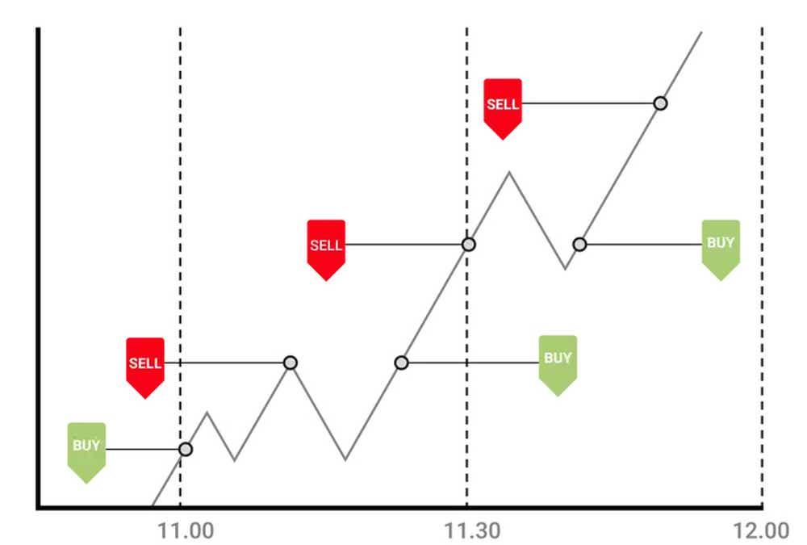

In the fast-paced world of trading, scalping has gained popularity as a strategy for achieving quick profits. This approach involves making numerous trades within short periods to capitalize on small price movements. Unlike long-term investing, which focuses on potential significant gains over extended periods, scalping aims for accumulation of small gains through frequent transactions. Such rapid transactions require not only keen market insight but also swift execution capabilities.

This article examines the legality of scalping as a trading strategy, with a particular focus on its application using algorithmic trading methods. Algorithmic trading has revolutionized scalping by enabling traders to execute trades at high speeds with minimal human intervention. These algorithms can process vast amounts of market data to identify favorable trading opportunities and automatically conduct trades with precision.



Understanding the regulatory framework surrounding scalping is essential for traders to ensure compliance and to avoid potential legal issues. Different markets have varying rules regarding the acceptability and regulation of scalping practices. Moreover, the risks associated with scalping, including potential regulatory scrutiny and ethical concerns such as market manipulation, are significant factors that traders must consider.

This article will cover these aspects, offering insights into the best practices for legal and effective scalping. Whether you are a novice or an experienced trader, understanding the complexities of scalping, including its legal and ethical dimensions, is crucial for achieving success while maintaining regulatory compliance.

## Table of Contents

## What is Scalping in Trading?

Scalping is a trading strategy aimed at generating numerous small profits through swift trading activities, often conducted within mere seconds or minutes. This method involves traders entering and exiting multiple positions rapidly in order to capitalize on minor price fluctuations in the market. The essence of scalping lies in its focus on high-frequency interactions rather than substantial long-term gains. 

Fast execution is a critical component of successful scalping, as profitability relies on the ability to respond immediately to tiny changes in price. This rapid pace often necessitates the use of technology and automation to ensure trades are executed in a timely manner. Furthermore, scalping may involve the use of leverage, allowing traders to increase their market position and potentially amplify returns on minimal price movements. However, leverage can also heighten risks, necessitating cautious management of trading size and exposure.

A distinguishing feature of [scalping](/wiki/gamma-scalping) compared to traditional investment approaches is the markedly brief holding periods and [high frequency](/wiki/high-frequency-trading) of transactions. Traditional investing often involves holding assets over a longer term to realize substantial appreciation, while scalping focuses on seizing numerous small gains over a short span. This high-frequency trading requires a precision-oriented approach and a robust understanding of market dynamics, as traders must rapidly assess and act on market signals to maintain a competitive edge.

Overall, scalping demands a combination of speed, strategic acumen, and stringent risk management to be pursued effectively. The distinct characteristic of exploiting numerous minuscule price differences sets it apart from other trading strategies, making it particularly appealing to traders seeking quick profits and willing to engage in both intensive monitoring and a rapid trading tempo.

## Algorithmic Scalping: The Role of Technology

Algorithmic trading has significantly influenced the practice of scalping, allowing for rapid transactions and in-depth market analysis. The essence of scalping involves executing numerous trades within brief time frames to capitalize on minor price fluctuations. Algorithms enhance this process by providing the speed and precision necessary for success.

Scalpers utilize sophisticated algorithms to scrutinize market conditions, identify opportunities, and execute trades with unparalleled swiftness. These algorithms are capable of analyzing vast amounts of data in real-time, including price trends, [volume](/wiki/volume-trading-strategy), and market [volatility](/wiki/volatility-trading-strategies), enabling traders to make informed decisions within milliseconds. This capability is essential for scalping, where timing can be the difference between profit and loss.

High-frequency trading ([HFT](/wiki/high-frequency-trading-strategies)) systems are integral to algorithmic scalping. These systems execute thousands of trades per second, exploiting minute price discrepancies that are often invisible to human traders. HFT relies on powerful computing infrastructure and proximity to exchange servers to minimize latency—the delay between decision-making and execution. This minimization is crucial, as even microsecond delays can affect the profitability of scalping strategies.

In addition to high-frequency trading systems, intraday scanning software is used by scalpers to continuously monitor market conditions within the trading day. These software tools identify short-term patterns and anomalies, offering traders a competitive edge by alerting them to potential scalping opportunities as they arise. The integration of [machine learning](/wiki/machine-learning) techniques further refines these tools, allowing for adaptive algorithms that improve over time based on trading outcomes.

The code snippet below illustrates a simple example of using Python to generate trading signals based on moving averages, a common method in scalping strategies:

```python
import pandas as pd

def generate_signals(data, short_window=12, long_window=26):
    data['Short_Mavg'] = data['Price'].rolling(window=short_window, min_periods=1).mean()
    data['Long_Mavg'] = data['Price'].rolling(window=long_window, min_periods=1).mean()

    data['Signal'] = 0
    data.loc[data['Short_Mavg'] > data['Long_Mavg'], 'Signal'] = 1
    data.loc[data['Short_Mavg'] < data['Long_Mavg'], 'Signal'] = -1

    return data

# Example usage:
# df = pd.DataFrame({'Price': [...]})
# signals_df = generate_signals(df)
```

This code calculates the short-term and long-term moving averages of a price series and generates buy (1) or sell (-1) signals. Although simplified, such strategies form the backbone of more complex algorithmic systems employed by scalpers.

Overall, technology's role in algorithmic scalping cannot be understated. It empowers traders with enhanced decision-making tools and the ability to execute trades at lightning speed, thus maximizing the potential for profit in the dynamic landscape of trading.

## Legality of Scalping in Different Markets

Scalping is generally a legal trading strategy across various financial markets, though specific regulations can vary according to region and the type of asset being traded. In the Forex (foreign exchange) market, scalping is broadly accepted, with brokers typically imposing few limitations. Forex brokers generally provide the platforms and tools necessary for executing quick trades, making it a conducive market for scalpers looking for profitable opportunities in currency price fluctuations.

In contrast, the stock markets often enforce more stringent rules. In the United States, for instance, the Pattern Day Trader (PDT) rule necessitates that traders maintain a minimum account balance of $25,000 to engage in [day trading](/wiki/day-trading-spy) activities, including scalping, in margin accounts. This rule is designed to protect individual investors from the risks associated with frequent trading and requires that day traders hold a significant amount of equity in leveraged accounts to mitigate potential losses.

Cryptocurrency trading presents a more complex regulatory scenario. The legal status and regulation of scalping within [cryptocurrency](/wiki/cryptocurrency) markets can be inconsistent, largely due to the decentralized and rapidly evolving nature of these digital asset exchanges. It is crucial for traders to remain informed about local laws and specific exchange rules governing scalping activities. Some exchanges might have restrictions on the frequency or type of trades permitted, reflecting a broader regulatory uncertainty in the cryptocurrency domain.

In all markets, the overarching legal requirement is that scalping practices should not constitute market manipulation. Traders must ensure that their strategies adhere to fair market practices and prevent engaging in illegal activities such as spoofing, which could lead to severe penalties. By understanding these legal frameworks, traders can effectively navigate scalping strategies across different market environments.

## Regulatory Insights and Ethical Considerations

Scalping, while legal, must adhere to a strict regulatory framework to prevent any form of market manipulation. Authorities worldwide aim to maintain fairness and transparency in financial markets, and scalpers are expected to operate within these legal boundaries. Practices such as spoofing and quote stuffing are explicitly outlawed and considered forms of market manipulation. Spoofing involves rapidly placing and canceling large orders to create an illusion of demand or supply and alter prices, while quote stuffing refers to the practice of quickly entering and withdrawing large numbers of orders to congest the market's [order book](/wiki/order-book-trading-strategies), slowing down other trading activities.

Various regulatory bodies, including the Securities and Exchange Commission (SEC) in the United States and the Financial Conduct Authority (FCA) in the United Kingdom, have established rules to detect and penalize such activities. These bodies deploy advanced surveillance technologies to monitor trading patterns and detect anomalies indicative of manipulation. Compliance with these regulations is crucial for scalpers to avoid substantial fines and other legal repercussions.

Scalpers must also contend with the high transaction costs inherent in their trading strategy. Frequent trading results in significant broker fees and commissions, which can rapidly erode profits. It is essential for scalpers to [factor](/wiki/factor-investing) these costs into their trading strategy and ensure that they do not outweigh the small profits gained from individual trades.

The psychological component of scalping cannot be overlooked. The need to make rapid decisions can lead to emotional responses, significantly increasing the risk of overtrading. Overtrading occurs when traders execute more trades than their strategy dictates, often driven by the fear of missing out on profitable opportunities or attempting to recover losses. This behavior can disrupt a trader's plan and turn a profitable strategy into a loss-making exercise.

Therefore, scalpers should employ rigorous risk management practices and maintain discipline. Utilizing automated trading systems can aid in minimizing emotional decision-making and maintaining adherence to predefined trading systems. Additionally, continuous education on evolving regulations and ethical standards is vital to ensure that their trading practices remain compliant and sustainable.

## Best Practices for Legal Scalping

To ensure the practice of scalping aligns with legal standards and achieves profitability, traders must follow certain best practices. The first step is to understand and comply with the specific rules and regulations of the market being traded. Different markets have distinct regulatory frameworks, and it's crucial for traders to be well-versed in these to avoid non-compliance penalties. For instance, stock markets in the United States are governed by the Pattern Day Trader rule, which requires maintaining a minimum account balance for those who make four or more day trades within five business days. Compliance with such regulations not only avoids legal troubles but also fosters a disciplined trading strategy. 

Selecting the right broker is vital for successful scalping. A broker's infrastructure should support scalping with features like low commissions, rapid trade execution, and minimal slippage. Such characteristics are essential because scalping relies on capitalizing on small price movements, which can be eroded by high transaction costs and delayed executions. Traders should scrutinize broker reviews and opt for those known to accommodate high-frequency trading strategies.

Implementing robust trading strategies is another key component. These strategies should have well-defined entry and [exit](/wiki/exit-strategy) points, supported by a comprehensive risk management framework. Risk management techniques can include setting strict stop-loss orders to minimize potential losses and employing position sizing strategies to ensure that no single trade can significantly impact the trader's overall capital. One common formula to determine position size is the Kelly Criterion, which can be expressed as:

$$
f^* = \frac{bp - q}{b}
$$

where $f^*$ is the fraction of the capital to bet, $b$ is the odds received on the wager, $p$ is the probability of winning, and $q$ is the probability of losing. 

Utilizing technology judiciously is crucial in scalping. While algorithmic systems can enhance the speed and accuracy of trade executions, they should not be used for manipulative practices like spoofing or quote stuffing, which are illegal. Ethical use of technology ensures that the market structure remains fair and that the trader maintains integrity in operations. Leveraging technology for legitimate purposes, such as real-time data analysis and risk assessment, can give traders a competitive edge.

By adhering to these best practices, scalpers can enhance their chances of not only maintaining compliance with market regulations but also achieving sustained success in their trading activities.

## Conclusion

Scalping stands as a legal and legitimate trading strategy when traders adhere to prevailing regulations and ethical standards of the financial markets. The success in scalping rests upon a blend of discipline, compliance, and a deep comprehension of market dynamics. Traders must exercise rigorous discipline to execute their trading plans promptly, leveraging both technical and fundamental analyses to make informed decisions. Given the high-speed nature of scalping, maintaining compliance is critical to prevent inadvertent breaches of trading laws that could lead to severe penalties.

A fundamental aspect of successful scalping is the continuous refinement of trading strategies. Markets are dynamic, characterized by ever-evolving trends and regulatory frameworks. Therefore, traders must stay updated regarding changes in market regulations and adjust their strategies accordingly to maintain their competitive edge. This includes thorough research and back-testing of new strategies to determine their efficacy under different market conditions.

Technological advancements play a crucial role in facilitating efficient scalping, offering tools for swift execution and real-time analysis. However, it is crucial to balance the use of technology with ethical considerations to avoid manipulative practices. Employing programmatic trading strategies through coding languages like Python can automate and optimize processes, but they should be designed to respect market integrity. For example, developers should avoid practices like spoofing, which can distort market perceptions.

Ultimately, the effectiveness of a scalping strategy lies in its adaptability and the trader's ability to navigate the complex interplay of market forces. This adaptability ensures that they can capitalize on transient market opportunities while mitigating risks associated with high-frequency trading. By staying informed and compliant, traders can harness the potential of scalping as a viable method to achieve their financial goals.

## References & Further Reading

[1]: Bergstra, J., Bardenet, R., Bengio, Y., & Kégl, B. (2011). ["Algorithms for Hyper-Parameter Optimization."](https://papers.nips.cc/paper/4443-algorithms-for-hyper-parameter-optimization) Advances in Neural Information Processing Systems 24.

[2]: ["Advances in Financial Machine Learning"](https://www.amazon.com/Advances-Financial-Machine-Learning-Marcos/dp/1119482089) by Marcos Lopez de Prado

[3]: ["Evidence-Based Technical Analysis: Applying the Scientific Method and Statistical Inference to Trading Signals"](https://www.amazon.com/Evidence-Based-Technical-Analysis-Scientific-Statistical/dp/0470008741) by David Aronson

[4]: ["Machine Learning for Algorithmic Trading"](https://github.com/stefan-jansen/machine-learning-for-trading) by Stefan Jansen

[5]: ["Quantitative Trading: How to Build Your Own Algorithmic Trading Business"](https://www.amazon.com/Quantitative-Trading-Build-Algorithmic-Business/dp/1119800064) by Ernest P. Chan