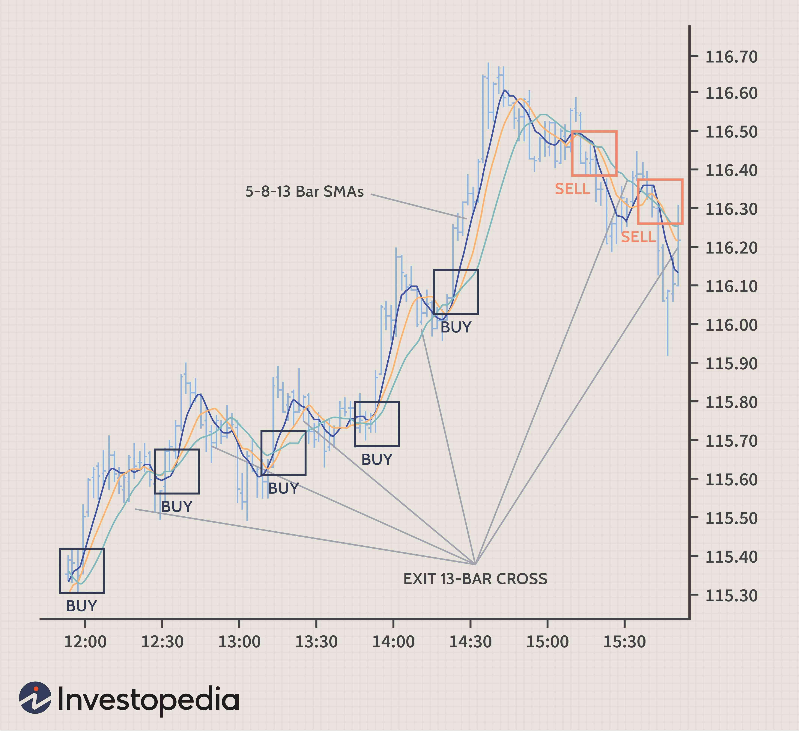

## Table of Contents

## What is scalping in trading?

Scalping in trading is a strategy where traders buy and sell financial instruments quickly to make small profits from tiny price changes. They might hold a position for just a few seconds or minutes. The goal is to make many small profits throughout the day, which can add up to a significant amount over time.

This method requires a lot of focus and quick decision-making. Scalpers often use technical analysis and charts to spot small price movements. They also need to manage their trades carefully because even small losses can add up if not watched closely. It's a fast-paced style of trading that isn't suited for everyone, but it can be profitable for those who master it.

## What are the key principles of scalping trading?

Scalping trading is all about making quick, small profits from tiny price changes. Traders who scalp buy and sell things like stocks or currencies very fast, often holding onto them for just a few seconds or minutes. The main idea is to do lots of trades in a day and make a little bit of money on each one. Over time, these small profits can add up to a big total. To do this well, scalpers need to pay close attention to the market and be ready to act fast.

The key to successful scalping is using technical analysis to spot these small price movements. Scalpers look at charts and other tools to find the best times to buy and sell. They also need to be good at managing their trades because even small losses can hurt if they happen too often. It's important for scalpers to keep their emotions in check and stick to their trading plan. This style of trading can be exciting and rewarding, but it's not for everyone because it requires a lot of focus and quick thinking.

## How does scalping differ from other trading strategies?

Scalping is different from other trading strategies because it focuses on making many small profits in a short amount of time. While other strategies might involve holding onto investments for hours, days, or even weeks, scalpers buy and sell in just seconds or minutes. This means they need to watch the market very closely and be ready to act fast. Other strategies, like day trading or swing trading, might not need such quick decisions and can be less stressful because they give traders more time to think.

Another big difference is the amount of trades scalpers do. A scalper might make hundreds of trades in a single day, while someone using a different strategy might only make a few trades. This high number of trades means scalpers need to be very good at managing their money and keeping track of their profits and losses. Other strategies might focus more on bigger price movements and might not need as much attention to detail. Scalping can be exciting and rewarding, but it's also more demanding and might not be the best fit for everyone.

## What are the best times to engage in scalping?

The best times to engage in scalping are usually when the markets are most active. This often happens at the start of the trading day, right after the market opens. For example, in the stock market, this might be around 9:30 AM Eastern Time in the U.S. During these times, there's a lot of buying and selling going on, which can create more opportunities for scalpers to make quick profits from small price changes.

Another good time for scalping is during major economic announcements or news events. These can cause big price movements in a short time, which scalpers can take advantage of. For instance, if a big company reports its earnings or if there's an important news release from the government, the market might react quickly. Scalpers need to be ready to act fast during these times to catch the small price changes that happen.

It's also worth noting that different markets have different peak times. For forex trading, the best times might be when multiple major markets are open at the same time, like when both London and New York are trading. This overlap can lead to higher activity and more chances for scalping. Knowing when these peak times are can help scalpers plan their trading day better and increase their chances of making profits.

## Which markets are most suitable for scalping?

The forex market is one of the best places for scalping. It's open 24 hours a day from Monday to Friday, so there are lots of times when you can trade. The forex market is also very liquid, which means there are always people buying and selling. This makes it easier to get in and out of trades quickly, which is what scalping is all about. Plus, the forex market has times when different big markets like London and New York are open at the same time, which can lead to more trading activity and more chances to scalp.

Another good market for scalping is the stock market, especially during the first hour after it opens. This is when the market is usually the most active, with lots of buying and selling happening. This can create more opportunities for scalpers to make quick profits from small price changes. However, the stock market isn't open 24 hours like forex, so scalpers need to be ready to trade during the times when the market is open, especially at the start of the day.

Futures markets can also be good for scalping, especially markets like the E-mini S&P 500. These markets are known for their high liquidity and tight bid-ask spreads, which are important for scalpers. Like the stock market, futures markets have specific trading hours, so scalpers need to know when these markets are most active to take advantage of the best times for scalping.

## What tools and indicators are essential for scalping?

For scalping, traders need tools and indicators that help them see small price changes quickly. One of the most important tools is a real-time price chart. This shows the current price of whatever you're trading, like stocks or currency, and updates very fast. Scalpers also use technical indicators like the Moving Average Convergence Divergence (MACD) and the Relative Strength Index (RSI). These help spot trends and see if a price is about to move up or down. Another useful tool is the volume indicator, which shows how many people are buying and selling. This can help scalpers decide when to enter or exit a trade.

Another essential tool for scalping is a fast and reliable trading platform. Since scalpers need to make quick decisions, their platform has to work well and not slow down. Many scalpers also use Level 2 quotes, which show more details about the buying and selling happening in the market. This can help them see where the price might go next. Lastly, a good risk management tool is important. This can help scalpers set stop-loss orders to limit their losses if a trade goes the wrong way. All these tools together help scalpers make the most of small price movements and manage their trades carefully.

## How can a beginner start scalping?

If you're a beginner wanting to start scalping, the first step is to learn about the markets where scalping works best, like forex, stocks, or futures. You'll need to understand how these markets work and what times are best for trading. It's also important to get familiar with a trading platform that's fast and reliable. Practice using this platform with a demo account, which lets you trade without real money. This way, you can get used to the tools and indicators you'll need, like real-time price charts, MACD, RSI, and volume indicators, without risking any money.

Once you feel comfortable with the basics, start small with real money. Begin with a small amount that you can afford to lose, and focus on making small profits. Keep an eye on your trades and use stop-loss orders to limit any losses. As you get better, you can increase the amount you trade with. Remember, scalping takes a lot of focus and quick thinking, so be patient and keep learning. It's a good idea to keep a trading journal to track what works and what doesn't, so you can improve over time.

## What are common mistakes to avoid in scalping?

One common mistake in scalping is not using stop-loss orders. Stop-loss orders help limit your losses if a trade goes the wrong way. Without them, even a small loss can grow bigger and hurt your overall profits. Another mistake is trading too much. Scalping can be exciting, but doing too many trades can lead to big losses if you're not careful. It's important to stick to your trading plan and not let emotions like greed or fear take over.

Another big mistake is not managing your money well. This means not putting too much money into one trade and making sure you have enough to keep trading even if you have some losses. Also, beginners often jump into scalping without enough practice. It's important to spend time learning and practicing with a demo account before using real money. This helps you get used to the fast pace of scalping and the tools you need to use.

## How do experienced scalpers manage risk?

Experienced scalpers manage risk by using stop-loss orders. A stop-loss order is like a safety net that automatically closes a trade if the price moves against them by a certain amount. This helps limit their losses and protect their money. They also manage risk by not putting all their money into one trade. Instead, they spread their money across many small trades, so if one trade goes bad, it won't hurt too much. This way, they can keep trading even if they have some losses.

Another way experienced scalpers manage risk is by sticking to their trading plan. They know that emotions like greed or fear can make them do things that aren't smart, so they follow a plan that tells them when to buy and sell. They also keep a close eye on their trades and the market, ready to act fast if things change. By being disciplined and careful, they can make small profits while keeping their losses small too.

## What advanced techniques can enhance scalping performance?

Experienced scalpers can use advanced techniques like algorithmic trading to improve their performance. This means using computer programs to make trades automatically based on certain rules. These programs can watch the market all the time and make decisions faster than a person could. This can help scalpers catch more small price changes and make more trades in a day. Another technique is using multiple time frames when looking at charts. This means checking the price over different periods, like a few minutes or an hour, to get a better idea of where the price might go next. This can help scalpers make smarter decisions about when to buy and sell.

Another advanced technique is using order flow analysis. This means looking at the details of buying and selling happening in the market to see where the price might move next. Scalpers can use this information to get in and out of trades at the best times. They also might use advanced risk management strategies, like adjusting their stop-loss orders based on how the market is moving. This can help them limit their losses even more and protect their profits. By using these advanced techniques, experienced scalpers can make their scalping more effective and increase their chances of making money.

## How can one optimize a scalping strategy for different market conditions?

To optimize a scalping strategy for different market conditions, it's important to understand how the market changes throughout the day. During times when the market is really busy, like right after it opens or during big news events, scalpers can take advantage of more price movements. They might use shorter time frames on their charts to catch these quick changes. On the other hand, when the market is quieter, scalpers might need to be more patient and wait for the right moments to trade. They can use longer time frames to see bigger trends and make trades that last a bit longer but still fit the scalping style.

Another way to optimize a scalping strategy is by adjusting the tools and indicators you use. In a fast-moving market, scalpers might rely more on quick indicators like the MACD or RSI to spot trends and make decisions fast. In slower markets, they might use volume indicators more to see when there's enough activity to make a trade. Also, scalpers can change their risk management approach based on how the market is behaving. In a volatile market, they might set tighter stop-loss orders to limit losses, while in a more stable market, they might give their trades a bit more room to move. By being flexible and adjusting their strategy, scalpers can do better no matter what the market is like.

## What psychological traits are necessary for successful scalping?

To be good at scalping, you need to be very patient and disciplined. This means sticking to your trading plan and not letting your feelings like greed or fear make you do something different. Scalping can be stressful because you need to make quick decisions, so being able to stay calm and focused is really important. If you can't keep your emotions in check, you might make bad choices that hurt your trading.

Another important trait is being able to handle stress well. Scalping involves a lot of fast trading, and the market can change quickly. You need to be okay with small losses and not let them upset you too much. Being able to bounce back from losses and keep going is key. If you can stay strong and keep your cool, you'll do better at scalping.

## References & Further Reading

[1]: ["Advances in Financial Machine Learning"](https://www.amazon.com/Advances-Financial-Machine-Learning-Marcos/dp/1119482089) by Marcos Lopez de Prado.

[2]: ["Evidence-Based Technical Analysis: Applying the Scientific Method and Statistical Inference to Trading Signals"](https://www.amazon.com/Evidence-Based-Technical-Analysis-Scientific-Statistical/dp/0470008741) by David Aronson.

[3]: ["Machine Learning for Algorithmic Trading"](https://github.com/stefan-jansen/machine-learning-for-trading) by Stefan Jansen.

[4]: ["Quantitative Trading: How to Build Your Own Algorithmic Trading Business"](https://books.google.com/books/about/Quantitative_Trading.html?id=j70yEAAAQBAJ) by Ernest P. Chan.

[5]: Aldridge, Irene. (2009). ["High-Frequency Trading: A Practical Guide to Algorithmic Strategies and Trading Systems"](https://www.amazon.com/High-Frequency-Trading-Practical-Algorithmic-Strategies/dp/1118343506) by Wiley Finance.