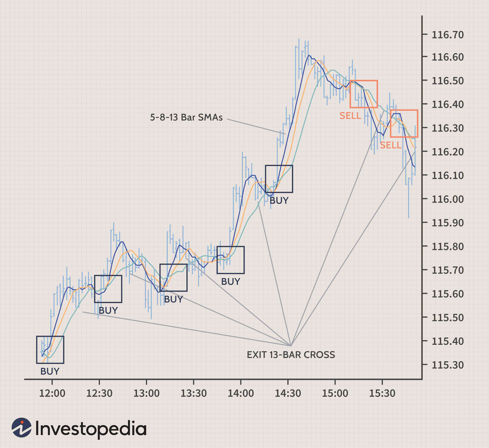

## Table of Contents

## What is scalping in trading?

Scalping in trading is a strategy where traders buy and sell assets very quickly to make small profits from tiny price changes. They might hold a position for just a few seconds or minutes. The idea is to do this many times throughout the day, and the small profits can add up to a significant amount.

Scalpers often use technical analysis and charts to find the best times to trade. They look for patterns and signals that show when prices might go up or down a little bit. Because they trade so often, scalpers need to be very focused and quick to react. It can be stressful, but if done right, it can be profitable.

## Why do traders use scalping strategies?

Traders use scalping strategies because they want to make money from small price changes in the market. Instead of waiting for big moves, scalpers jump in and out of trades quickly. This means they can make a lot of small profits in a short time. For example, if a trader makes a small profit on each trade and does this many times a day, those small profits can add up to a big total.

Scalping also lets traders take advantage of market conditions that might not be good for other types of trading. The stock market or [forex](/wiki/forex-system) market can be very busy, with prices moving up and down all the time. Scalpers use this to their advantage by trading in these fast-moving markets. It requires a lot of focus and quick thinking, but for those who are good at it, [scalping](/wiki/gamma-scalping) can be a successful way to trade.

## What are the key principles of scalping?

Scalping is all about making quick trades to catch small price changes. Traders who use this method look at charts and use special tools to spot tiny moves in the market. They try to buy low and sell high in a very short time, like a few seconds or minutes. To do well, scalpers need to be fast and pay close attention to what's happening. They often use a lot of trades to make up for the small profits they get from each one.

Another big part of scalping is managing risk. Since scalpers trade so often, they need to keep their losses small. They use things like stop-loss orders to make sure they don't lose too much on any one trade. This helps them stay in the game even if some trades don't go their way. Scalpers also need to be good at handling stress because the fast pace can be tough. But if they stick to their plan and manage their risks well, they can make money from the small price changes they catch.

## What markets are suitable for scalping?

Scalping works well in markets that move a lot and are open for trading most of the time. The forex market is a great place for scalping because it's open 24 hours a day from Monday to Friday. Prices in forex can change quickly, and there are always traders buying and selling, so scalpers can find lots of chances to make small profits.

Another good market for scalping is the stock market, especially when it's busy. During times like the opening and closing hours, prices can move fast, and scalpers can jump in to catch these moves. But, the stock market has set trading hours, so scalpers need to be ready during those times. Both markets need quick thinking and good tools to help spot the right moments to trade.

## What tools and indicators are essential for scalping?

Scalpers use special tools and indicators to help them make quick trades. One important tool is the charting platform, which shows price movements in real time. Scalpers often use short time frames like 1-minute or 5-minute charts to see the tiny price changes they need to catch. They also use technical indicators like the Moving Average Convergence Divergence (MACD) to spot trends and [momentum](/wiki/momentum). The Relative Strength Index (RSI) helps them see if a market is overbought or oversold, which can signal when to buy or sell.

Another key tool for scalpers is the order execution system. This system needs to be fast and reliable because scalpers need to get in and out of trades quickly. They often use limit orders and stop-loss orders to manage their trades. Limit orders let them set the exact price they want to buy or sell at, while stop-loss orders help them limit their losses if the market moves against them. These tools and indicators together help scalpers make the most of the small price changes they're looking for.

## How does one set up a trading platform for scalping?

To set up a trading platform for scalping, you need to start with a good charting platform. Choose one that shows prices in real time and lets you use short time frames like 1-minute or 5-minute charts. These short time frames help you see the small price changes you want to catch. Next, add technical indicators to your charts. Popular ones for scalping include the Moving Average Convergence Divergence (MACD) and the Relative Strength Index (RSI). The MACD helps you spot trends and momentum, while the RSI tells you if a market is overbought or oversold, which can be a good time to buy or sell.

Once your charts are set up, you need to make sure your order execution system is fast and reliable. Scalping means you need to get in and out of trades very quickly, so any delay can cost you money. Set up limit orders to buy or sell at the exact price you want, and use stop-loss orders to limit your losses if the market moves against you. These orders help you manage your trades better. With your charting platform and order system ready, you can start looking for those small price changes and make quick trades to try and make a profit.

## What are the common entry and exit strategies in scalping?

Scalpers use different ways to decide when to start and stop a trade. For entry, they often look at technical indicators like the MACD or RSI. If the MACD lines cross, it might be a good time to buy or sell. If the RSI shows a market is overbought or oversold, that can also be a signal to enter a trade. Scalpers also watch price action closely. They might enter a trade when the price breaks through a key level or when they see a certain pattern on the chart. The goal is to catch the market at the right moment to make a small profit.

For exiting a trade, scalpers use stop-loss and take-profit orders. A stop-loss order helps them limit their losses if the market moves against them. They set this order at a price where they're willing to accept a small loss and get out of the trade. A take-profit order is set at a price where they want to lock in a small profit. Scalpers might also [exit](/wiki/exit-strategy) a trade based on the same indicators they used to enter. If the MACD lines cross back or the RSI moves out of the overbought or oversold zone, it might be time to close the trade. The key is to get out quickly to keep the small profits adding up.

## How can risk management be applied specifically in scalping?

Risk management in scalping is all about keeping losses small so you can keep trading. Scalpers use stop-loss orders to do this. A stop-loss order is like a safety net that automatically closes a trade if the price moves against you by a certain amount. This way, you don't lose too much money on any one trade. Scalpers set these stop-loss orders close to their entry price because they want to get out quickly if things go wrong. They also trade with small amounts of money per trade, so even if they lose, the loss is small.

Another way scalpers manage risk is by using a good risk-reward ratio. This means they aim to make more money on their winning trades than they lose on their losing trades. For example, if they risk $10 on a trade, they might set a take-profit order to make $20. This way, even if they lose a few trades, they can still come out ahead if they win enough trades. Scalpers also keep an eye on their overall account balance and don't risk too much of it on any single trade. By managing risk carefully, scalpers can keep trading and try to make a profit from the small price changes they catch.

## What are the psychological challenges of scalping and how to overcome them?

Scalping can be tough on your mind because it's so fast and you need to make quick decisions. You might feel a lot of stress and pressure to get things right. It's easy to get scared and make mistakes when you see the market moving against you, even if it's just a little bit. Also, because you're making so many trades, it can be hard to stay focused all the time. If you start feeling tired or distracted, you might miss good chances to trade or make bad choices.

To deal with these challenges, it's important to stay calm and stick to your plan. Take breaks when you need to, so you don't get too tired. It can help to practice deep breathing or other ways to relax when you feel stressed. Also, remember that it's okay to lose some trades. What matters is that you follow your rules and keep your losses small. Over time, if you do this well, you can still make money even if not every trade works out.

## Can you provide examples of successful scalping trades?

Imagine a scalper trading in the forex market. They see that the price of the EUR/USD pair is moving up and down a lot. They look at their 1-minute chart and see the MACD lines crossing, which tells them it might be a good time to buy. They quickly enter a trade to buy EUR/USD at 1.1800. Just a few seconds later, the price goes up to 1.1805. The scalper decides to sell and makes a small profit of 5 pips. They do this many times throughout the day, and all those small profits add up to a good amount of money.

Another example is in the stock market. A scalper is watching a busy stock like Apple (AAPL) during the opening hour. They notice the stock price breaking through a key level on their chart. They buy AAPL at $150.00, hoping to catch a quick rise. The price goes up to $150.25 in just a few minutes. The scalper sells and makes a small profit of $0.25 per share. They keep doing this all day, making small profits on each trade. By the end of the day, their total profit is significant because they made so many trades.

## What are the differences between scalping and other short-term trading strategies?

Scalping is a short-term trading strategy where traders make a lot of quick trades to catch small price changes. They might hold a trade for just a few seconds or minutes. The goal is to make small profits on each trade, but do it many times throughout the day. Scalpers use technical indicators like MACD and RSI to find the right moments to trade. They also use stop-loss and take-profit orders to manage their risk and keep their losses small.

Other short-term trading strategies, like [day trading](/wiki/day-trading-spy) and swing trading, are different from scalping. Day traders hold their trades for a whole day or less, but they might keep a position open for hours instead of just seconds or minutes. They look for bigger price moves than scalpers do. Swing traders hold trades for a few days to a few weeks. They try to catch price swings that happen over a longer time. Both day trading and swing trading need less quick thinking than scalping, but they still need good risk management and a solid plan.

## How can one measure the effectiveness of a scalping strategy over time?

To measure how well a scalping strategy is working over time, you need to look at a few key things. First, check how much money you are making or losing. Keep track of all your trades and see if you are making more money than you are losing. This is called your profit and loss, or P&L. If your P&L is going up over time, your strategy might be working well. Also, look at your win rate, which is the percentage of trades that make money. A high win rate can be a good sign, but remember that small profits from many trades can still add up to a lot of money.

Another important thing to measure is how well you are managing risk. Look at the average size of your wins and losses. A good scalping strategy should have small losses and bigger wins, even if the wins are not that big. You can use something called the risk-reward ratio to see this. If you risk $10 to make $20 on each trade, that's a good ratio. Over time, if you keep your losses small and your wins bigger, your strategy will be more effective. Also, think about how much stress and time the strategy takes. If it's too hard to keep up, it might not be worth it, even if you are making money.

## References & Further Reading

[1]: Chan, E. (2009). ["Algorithmic Trading: Winning Strategies and Their Rationale."](https://github.com/ftvision/quant_trading_echan_book) Wiley.

[2]: Davey, K. (2013). ["Scalping: Professional Guide to Scalping in the Forex Market."](https://www.babypips.com/learn/forex/scalping) CreateSpace Independent Publishing Platform.

[3]: Lopez de Prado, M. (2018). ["Advances in Financial Machine Learning."](https://www.amazon.com/Advances-Financial-Machine-Learning-Marcos/dp/1119482089) Wiley.

[4]: Jansen, S. (2020). ["Machine Learning for Algorithmic Trading."](https://github.com/stefan-jansen/machine-learning-for-trading) Packt Publishing.

[5]: Aronson, D.R. (2007). ["Evidence-Based Technical Analysis: Applying the Scientific Method and Statistical Inference to Trading Signals."](https://www.amazon.com/Evidence-Based-Technical-Analysis-Scientific-Statistical/dp/0470008741) Wiley.