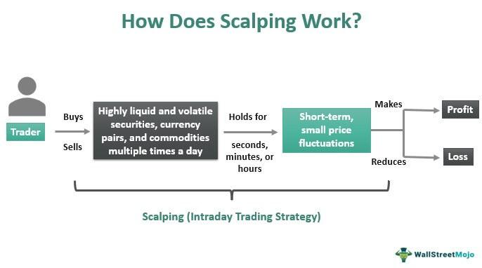

## Table of Contents

## What is scalping in trading?

Scalping in trading is a strategy where traders buy and sell financial instruments very quickly to make small profits. They might hold a position for just a few seconds or minutes. The goal is to make many small gains throughout the day, which can add up to a significant amount. Scalpers often use technical analysis and charts to find the best times to trade.

This method requires a lot of focus and quick decision-making. Scalpers need to be good at spotting small changes in the market and reacting fast. They also need to manage their risks carefully because even small losses can add up if they happen often. Many scalpers use automated trading systems to help them make trades faster and more accurately.

## How does scalping differ from other trading strategies?

Scalping is different from other trading strategies because it focuses on making many small profits in a short time. Other strategies might involve holding onto a trade for hours, days, or even weeks. Scalpers might buy and sell a stock in just a few seconds or minutes. They look for tiny changes in the market and try to make a small profit from each trade. This is different from strategies like day trading, where traders might hold a position for a whole day, or swing trading, where traders might keep a position for several days to catch bigger market moves.

Another big difference is the amount of time and attention [scalping](/wiki/gamma-scalping) requires. Scalpers need to watch the market very closely all day long. They need to be quick and make decisions fast. This can be stressful and tiring. Other strategies might not need as much constant attention. For example, a swing trader might only need to check the market a few times a day. Because scalping involves so many trades, it also means more transaction costs, like fees for buying and selling. This is something scalpers have to think about, while other strategies might have fewer trades and lower costs.

## What are the key principles of scalping?

Scalping is all about making quick, small profits from tiny changes in the market. The main idea is to buy and sell a lot, but each time you make just a little bit of money. You need to be very fast and pay close attention to the market all the time. Scalpers often use charts and other tools to help them see when it's a good time to buy or sell. They might only hold onto a trade for a few seconds or minutes before selling it again.

Another important thing about scalping is managing risk. Because you are making so many trades, even small losses can add up quickly. So, scalpers need to be careful and use strategies to limit how much they can lose on each trade. They might use things like stop-loss orders, which automatically sell a trade if it starts to lose too much money. Scalping can be stressful because it needs so much focus and quick thinking, but if done right, those small profits can add up to a lot over time.

## What markets are suitable for scalping?

Scalping works well in markets that are very active and have a lot of trading going on. The [forex](/wiki/forex-system) market is a great place for scalping because it's open 24 hours a day and there are always people buying and selling currencies. This means there are lots of chances to make small profits from tiny changes in the prices. The stock market can also be good for scalping, especially with stocks that are popular and have a lot of trading [volume](/wiki/volume-trading-strategy). These stocks move a lot during the day, giving scalpers many opportunities to trade.

Another market that can be good for scalping is the futures market. Futures are contracts to buy or sell something at a future date, and they can be very active. Just like in forex and stocks, if there's a lot of trading happening, scalpers can find many small price changes to make quick profits. But it's important to remember that not all markets are the same. Some might be too slow or not have enough trading for scalping to work well. So, it's best to choose markets that are busy and have lots of action.

## What tools and indicators are essential for a scalper?

Scalpers need certain tools and indicators to help them make quick decisions. One important tool is a fast and reliable trading platform. This helps them buy and sell quickly without delays. Another key tool is a charting software that shows real-time price movements. Scalpers often use technical indicators like moving averages, which help them see the general direction of the market. The Relative Strength Index (RSI) is also useful because it shows if a market is overbought or oversold, helping scalpers decide when to enter or [exit](/wiki/exit-strategy) a trade.

Indicators like the Bollinger Bands can be helpful too. They show the [volatility](/wiki/volatility-trading-strategies) of the market, which can tell scalpers when prices might be about to change a lot. The MACD (Moving Average Convergence Divergence) is another popular indicator that helps scalpers spot trends and possible reversals. Scalpers might also use volume indicators to see how much trading is happening, which can signal good times to trade. All these tools and indicators help scalpers make quick, informed decisions to catch those small profits.

Lastly, scalpers often use automated trading systems or algorithms. These systems can make trades faster than a human can, which is important for scalping. They can also help manage risk by automatically setting stop-loss orders and take-profit levels. While these tools and indicators are essential, it's important for scalpers to understand how to use them well and not rely on them too much. Combining these tools with good judgment and experience can make scalping more successful.

## How can one identify the best times to scalp?

The best times to scalp are usually when the markets are most active and there is a lot of trading happening. This is often during the opening hours of major markets. For example, in the stock market, the first hour after the market opens is usually very busy. This is because many traders are trying to buy or sell stocks at the start of the day. In the forex market, the best times can be when different major markets overlap, like when the London and New York sessions are both open. During these times, there is more action and more chances to make small profits from quick trades.

To find the best times, scalpers often look at charts and use indicators to see when the market is moving a lot. They might use tools like the Average True Range (ATR) to measure how much the price is changing. If the ATR is high, it means the market is volatile and there might be good opportunities for scalping. Scalpers also pay attention to economic news and events that can make the market move a lot. For example, if a big news report is coming out, the market might react quickly, giving scalpers chances to trade. By watching these things, scalpers can figure out when the market is likely to be busy and when to try their trades.

## What are the common entry and exit strategies used in scalping?

Scalpers use simple entry strategies to quickly get into trades. They often look for small price movements and use technical indicators like moving averages or the RSI to spot these opportunities. For example, they might buy a stock when its price crosses above a short-term moving average, signaling that the price might keep going up. They might also enter a trade when the RSI shows that a stock is oversold, meaning it might bounce back soon. The key is to enter the trade fast before the price moves too much.

Exiting a trade is just as important as entering it. Scalpers usually set a target for how much profit they want to make and a stop-loss to limit their losses. They might sell a stock as soon as it reaches their profit target, even if it's just a small gain. If the price starts to go against them, the stop-loss order will automatically sell the stock to prevent bigger losses. Some scalpers also use time-based exits, where they sell the stock after holding it for a set amount of time, like a few minutes. This helps them keep their trades short and quick.

## What are the risks associated with scalping and how can they be managed?

Scalping can be risky because it involves making a lot of trades in a short time. Even small losses can add up quickly if they happen often. The fast pace of scalping can also be stressful and tiring, which might lead to mistakes. Another risk is the cost of trading. Every time you buy or sell, you have to pay a fee, and these fees can eat into your profits if you're making a lot of trades. Plus, the market can be unpredictable, and sudden changes can cause big losses if you're not careful.

To manage these risks, scalpers need to use good risk management strategies. One way is to use stop-loss orders, which automatically sell a trade if it starts losing too much money. This helps limit the damage from any single bad trade. Scalpers should also set clear profit targets and stick to them, even if it means missing out on bigger gains. It's important to keep the size of each trade small so that no single loss is too big to handle. Finally, taking breaks and not trading all the time can help manage the stress and keep decisions sharp.

## How does one develop a scalping trading plan?

Developing a scalping trading plan starts with understanding the market you want to trade in. You need to know when the market is most active and what times are best for scalping. Look at the opening hours of major markets, like the stock market or forex market, and find out when they overlap. This can help you figure out the best times to trade. You should also learn about the tools and indicators that can help you, like moving averages, RSI, and volume indicators. These can show you when to enter and exit trades quickly.

Next, you need to set clear rules for entering and exiting trades. Decide on the small price movements you will look for and use indicators to spot these opportunities. For example, you might enter a trade when a stock's price crosses above a moving average. Set a profit target for each trade, even if it's small, and use stop-loss orders to limit your losses. Keep the size of each trade small to manage risk. It's also important to plan for breaks to manage the stress of scalping. By following these steps, you can create a solid scalping trading plan that helps you make quick, small profits while managing the risks.

## What psychological traits are important for successful scalping?

To be good at scalping, you need to be very focused and quick in making decisions. The market changes fast, and you have to watch it closely all the time. This can be stressful, so you need to stay calm and not let your emotions take over. If you get too excited or scared, you might make bad choices. Being able to keep your cool and think clearly is really important for scalping.

Another key trait is discipline. You need to stick to your trading plan and not chase after big wins. Scalping is about making small profits over and over again. It's easy to get tempted by bigger gains, but that can lead to bigger losses too. You also need to be okay with taking breaks. The stress of scalping can wear you out, so knowing when to step away and rest is part of being disciplined. With focus, calmness, and discipline, you can be better at scalping.

## How can one evaluate the performance of their scalping strategy?

To evaluate the performance of your scalping strategy, you need to look at how much money you are making and losing. Keep track of every trade you make, including how much you bought or sold, the price, and how much profit or loss you made. Over time, you can see if you are making more money than you are losing. It's also important to check how often you are winning trades compared to losing trades. If you are winning more often, that's a good sign. But if you are losing more often, you might need to change your strategy.

Another way to evaluate your scalping strategy is to look at how well you are managing risk. Check if your stop-loss orders are working to limit your losses. Also, see if you are sticking to your profit targets and not getting greedy. It's good to review your trades regularly to see if there are patterns in when you do well or poorly. This can help you make your strategy better. Remember, the goal of scalping is to make small profits many times, so if your strategy is doing that, it's working well.

## What advanced techniques can be used to enhance scalping effectiveness?

To make scalping work better, you can use something called "order flow analysis." This means watching the market to see what other traders are doing. By looking at the orders coming in, you can guess which way the price might go next. This can help you make smarter trades. Another advanced technique is to use "[algorithmic trading](/wiki/algorithmic-trading)." This is when you use a computer program to make trades for you. The program can look at the market much faster than a person can and make trades based on rules you set. This can help you catch more small profits and make fewer mistakes.

You can also try "[market making](/wiki/market-making)." This is when you buy and sell the same thing at the same time, but at slightly different prices. The idea is to make a small profit from the difference. It can be tricky and needs a lot of practice, but it can help you make more money. Lastly, using "multiple time frame analysis" can help too. This means looking at different time periods on your charts, like a 1-minute chart and a 5-minute chart. By seeing what's happening in both, you can get a better idea of when to trade. These advanced techniques can make your scalping more effective if you learn how to use them well.

## References & Further Reading

[1]: ["Advances in Financial Machine Learning"](https://www.amazon.com/Advances-Financial-Machine-Learning-Marcos/dp/1119482089) by Marcos Lopez de Prado

[2]: ["Evidence-Based Technical Analysis: Applying the Scientific Method and Statistical Inference to Trading Signals"](https://www.amazon.com/Evidence-Based-Technical-Analysis-Scientific-Statistical/dp/0470008741) by David Aronson

[3]: ["Machine Learning for Algorithmic Trading"](https://github.com/stefan-jansen/machine-learning-for-trading) by Stefan Jansen

[4]: ["Quantitative Trading: How to Build Your Own Algorithmic Trading Business"](https://www.amazon.com/Quantitative-Trading-Build-Algorithmic-Business/dp/1119800064) by Ernest P. Chan

[5]: Cartea, Á., Jaimungal, S., & Penalva, J. (2015). ["Algorithmic and High-Frequency Trading."](https://assets.cambridge.org/97811070/91146/frontmatter/9781107091146_frontmatter.pdf) Cambridge University Press.

[6]: Harris, L. (2003). ["Trading and Exchanges: Market Microstructure for Practitioners."](https://www.amazon.com/Trading-Exchanges-Market-Microstructure-Practitioners/dp/0195144708) Oxford University Press.

[7]: Jamal, A. & Liu, C. (2020). ["High-Frequency Trading and Market Performance."](https://papers.ssrn.com/sol3/papers.cfm?abstract_id=2674767) Applied Economics Letters.

[8]: Schwartz, R. A., & Francioni, R. (2004). ["Equity Markets in Action: The Fundamentals of Liquidity, Market Structure & Trading."](https://books.google.com/books/about/Equity_Markets_in_Action.html?id=fPV16sxH8oUC) John Wiley & Sons.