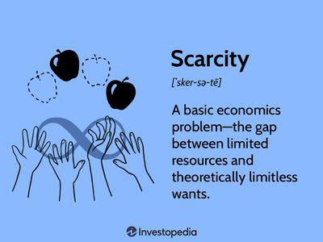

In today's fast-paced financial markets, the intersection of economic principles and advanced technology significantly influences trade dynamics. One such principle, scarcity, holds a fundamental position in economics, impacting how resources are allocated and valued. Scarcity refers to the limited availability of resources compared to the unlimited wants and needs, causing competition and strategic behavior in markets. In financial contexts, this principle affects trading strategies, where traders constantly seek to understand and leverage scarcity-driven opportunities.

Algorithmic trading, or algo trading, emerges as a quintessential application of technology in financial markets. At its core, algorithmic trading employs computer algorithms to automatically execute trades based on pre-defined criteria, capitalizing on speed and precision beyond human capabilities. This technical approach seeks to exploit inefficiencies within the market—opportunities often rooted in the scarcity of financial instruments or information.



The synergy between scarcity economics and algorithmic trading opens up complex layers of interaction where most of the market activities revolve around predicting and reacting to scarcity-driven changes. For instance, goods and assets that are perceived as scarce tend to increase in value as demand tends to surpass supply, creating lucrative opportunities for traders equipped with efficient algorithms. These algorithms are adept at scanning large volumes of data to detect patterns and execute trades at the optimal moment, thus addressing market inefficiencies dictated by scarcity.

This article explores the convergence of these two domains: scarcity economics and algorithmic trading. Understanding their intertwined nature provides insights into their applications and implications and offers a roadmap for navigating the complexities of modern financial markets effectively.

## Table of Contents

## Understanding Scarcity Economics

The scarcity principle is a cornerstone of economic theory, predicated on the notion that resources are finite while human desires are virtually limitless. This fundamental economic problem necessitates choices, fostering competition among individuals and entities for the allocation of resources. As a result, scarcity inherently leads to the assignment of value to goods and services, with those items deemed scarcer often achieving higher market valuations.

In financial markets, this principle is vividly observed. When demand for a financial asset surpasses its available supply, the scarcity of the asset propels its price upward. This dynamic is encapsulated in the basic demand-supply framework, where price increases until equilibrium is reached, or new supply offsets the heightened demand. The equation $P = D/S$, where $P$ stands for price, $D$ for demand, and $S$ for supply, succinctly captures this relationship, illustrating how price is a function of demand relative to supply.

Scarcity also indirectly influences market psychology and participant behavior. Assets perceived to be scarce often attract heightened investor interest, not only due to their potential for appreciation but also driven by speculative behaviors. This can lead to phenomena such as bubbles, where asset prices exceed intrinsic values based on speculative buying.

Understanding scarcity is a crucial facet for traders aiming to predict market movements and asset price variations. Knowledge of scarcity dynamics provides traders with the ability to foresee when supply constraints might lead to price rallies or when demand surges due to external factors could spike asset valuations. This predictive capacity forms the basis for numerous trading strategies, including but not limited to, trend-following and value investing, where traders anticipate scarcity effects to capitalize on favorable market conditions.

In summary, the scarcity principle is not just a foundational economic concept but a critical analytical tool for understanding market behaviors and fluctuations. By recognizing the effects of limited resources on asset prices, traders can better navigate the complexities of financial markets and optimize their investment strategies.

## The Rise of Algorithmic Trading

Algorithmic trading, often referred to as algo trading, represents a significant evolution in the field of finance, harnessing the power of computer algorithms to execute trades based on predefined criteria. This approach capitalizes on the speed and precision that computers offer, performing tasks at scales and rapidities unattainable by human traders alone.

At its core, [algorithmic trading](/wiki/algorithmic-trading) eliminates the emotional biases and hesitations commonly associated with human trading. Emotions such as fear and greed can lead to suboptimal decision-making and can be particularly detrimental in volatile markets where quick, unbiased decisions are paramount. By contrast, algorithms operate purely on logic and data, executing trades as soon as the set conditions are met, thus maximizing efficiency.

The speed at which algorithmic trades can be executed is one of its defining advantages. High-frequency trading ([HFT](/wiki/high-frequency-trading-strategies)), a subset of algorithmic trading, epitomizes this, executing orders within fractions of a second. This speed allows traders to capitalize on tiny price movements that are often missed by human traders. The precision of algo trading also ensures compliance with strategy parameters, reducing the likelihood of execution errors.

Algorithmic trading strategies are often grounded in mathematical models and statistical analysis. For instance, a simple moving average crossover strategy might execute a buy order when a short-term moving average surpasses a long-term moving average, indicating a potential upward trend. This strategy can be expressed in Python as follows:

```python
import pandas as pd

def simple_moving_average_crossover(prices, short_window=40, long_window=100):
    signals = pd.DataFrame(index=prices.index)
    signals['price'] = prices
    signals['short_mavg'] = prices.rolling(window=short_window, min_periods=1).mean()
    signals['long_mavg'] = prices.rolling(window=long_window, min_periods=1).mean()
    signals['signal'] = 0.0  # Default signal
    signals['signal'][short_window:] = np.where(
        signals['short_mavg'][short_window:] > signals['long_mavg'][short_window:], 1.0, 0.0
    )
    signals['positions'] = signals['signal'].diff()
    return signals
```

In this script, `prices` represents a time series of asset prices. The algorithm calculates short-term and long-term moving averages, determining trade signals based on their crossovers.

The rise of algorithmic trading coincides with rapid technological advancements and increased access to market data. These innovations enable traders to develop more sophisticated models and strategies. In financial markets characterized by scarcity—where demand often outpaces supply—algorithmic trading provides a toolkit for identifying and exploiting fleeting opportunities, executing trades that align with defined criteria and conditions.

## Integration of Scarcity Economics in Algo Trading

Traders implementing algorithmic trading employ sophisticated algorithms to identify market trends and price adjustments influenced by scarcity. The scarcity principle, which underscores limited availability of resources or assets, plays a critical role in shaping these algorithms. By understanding and modeling scarcity, algorithms are better positioned to predict and respond to fluctuations in supply and demand dynamics, executing trades in an optimal timeframe.

These algorithms often incorporate real-time data analysis to recognize patterns indicative of scarcity, allowing for timely decision-making. For instance, if an asset is perceived as scarce due to a supply chain disruption, algorithms can detect sudden changes in [volume](/wiki/volume-trading-strategy) or price, subsequently triggering trades that capitalize on these fluctuations. This recognition allows traders to enter or [exit](/wiki/exit-strategy) positions based on anticipated price movements, thus aligning trading strategies with scarcity-driven market behaviors.

Furthermore, the integration of scarcity economics into algorithmic trading facilitates the exploitation of [arbitrage](/wiki/arbitrage) opportunities. Arbitrage arises when price disparities exist for the same asset across different markets or exchanges. Scarcity can exacerbate these disparities by causing divergent valuations, thus creating a ripe environment for arbitrage. Algorithms can swiftly identify and act on these opportunities by executing simultaneous buy and sell orders across platforms to capitalize on the price differences before the market self-corrects.

In practice, algorithms may employ techniques, such as statistical analysis, [machine learning](/wiki/machine-learning), and predictive modeling, to quantify scarcity and its potential impact on market conditions. For example, a simple Python-based model could use historical price data to forecast future trends:

```python
import numpy as np
from sklearn.linear_model import LinearRegression

# Historical price data
prices = np.array([100, 102, 105, 107, 110, 115]).reshape(-1, 1)
time = np.array(range(len(prices))).reshape(-1, 1)

# Linear regression model
model = LinearRegression()
model.fit(time, prices)

# Predict future price
future_time = np.array([[len(prices) + i] for i in range(5)])
predicted_prices = model.predict(future_time)

print(predicted_prices)
```

This basic model demonstrates how traders might use historical price data to project future trends, aiding in anticipation of shifts caused by scarcity. Ultimately, the seamless integration of scarcity economics into algorithmic trading offers traders a powerful toolkit for navigating dynamic and often unpredictable financial markets. The ability to systematically analyze and respond to scarcity-induced market changes enhances the potential for informed, strategic, and profitable trading decisions.

## Strategies Leveraging Scarcity

Trend-following strategies in algorithmic trading often originate from scarcity-related price movements in financial markets. These strategies identify and capitalize on trends, which frequently emerge when demand exceeds supply, causing asset prices to follow a distinctive trajectory. By harnessing the scarcity principle, traders can develop algorithms that systematically predict these trend patterns, allowing timely entry and exit points to maximize profit potential.

For instance, a trend-following algorithm might employ moving averages to detect price movements indicative of scarcity. When the short-term moving average crosses above the long-term moving average, it signals a potential upward trend, suggesting increased demand relative to supply.

```python
def moving_average(data, window_size):
    return [sum(data[i:i+window_size])/window_size for i in range(len(data) - window_size + 1)]

def generate_signals(prices, short_window, long_window):
    short_ma = moving_average(prices, short_window)
    long_ma = moving_average(prices, long_window)
    signals = []
    for short, long in zip(short_ma, long_ma):
        if short > long:
            signals.append('Buy')
        elif short < long:
            signals.append('Sell')
        else:
            signals.append('Hold')
    return signals
```

Arbitrage strategies also exploit temporary market inefficiencies, often triggered by scarcity. Price discrepancies between markets or within assets can occur when scarcity causes sudden shifts in supply-demand dynamics. Algorithms designed for arbitrage quickly detect and execute trades to benefit from these differences before they close, ensuring consistent returns. An algorithm might monitor multiple exchanges to identify a stock priced lower on one platform and higher on another, executing buy and sell orders almost simultaneously to lock in a risk-free profit.

For systematic traders, these strategies offer structured approaches to consistent returns. By leveraging the power of algorithms, traders can efficiently manage and adapt to market conditions driven by scarcity, exploiting trends and inefficiencies that may not be apparent through manual trading methods. This strategic application of scarcity within algorithmic frameworks ultimately enhances decision-making, providing traders a distinct advantage in competitive markets.

## Risks and Challenges

Algorithmic trading, despite its advantages, presents various risks and challenges that need to be managed carefully. One significant risk is technical failure. The reliance on technology makes trading systems susceptible to hardware malfunctions, software glitches, or connectivity issues. These failures can lead to costly trading errors, including unintended orders or positions, that may negatively impact a trader's financial position.

Another challenge is the unpredictable nature of market events, which can result in extreme [volatility](/wiki/volatility-trading-strategies) and rapid price changes. Algorithmic systems often depend on historical data to inform trading decisions. However, this dependence can be a vulnerability, as historical patterns may not account for unprecedented events that create scarcity-induced market disruptions. These scenarios can swiftly alter supply-demand dynamics, leading to unforeseen outcomes.

Regulatory compliance is crucial in algorithmic trading. Financial markets are tightly regulated to ensure fairness, transparency, and stability. Traders must adhere to rules that govern trading activities, such as restrictions on specific trading practices or requirements for reporting. Non-compliance can result in legal penalties and reputational damage, making it vital for algorithmic traders to stay informed and aligned with regulatory expectations.

Ethical considerations also play a significant role in the fast-evolving landscape of algorithmic trading. The deployment of high-frequency trading algorithms, for example, can raise concerns about market manipulation and fairness. There's an ongoing debate about the ethical implications of using advanced technologies that may advantage specific market participants over others, potentially exacerbating inequalities within the financial market system.

In summary, while algorithmic trading offers speed and efficiency, it demands careful management of technical risks, thorough understanding and anticipation of market events, strict regulatory compliance, and adherence to ethical standards to navigate the intricacies of modern financial markets effectively.

## Future of Algorithmic Trading and Scarcity Economics

As technology and data analytics continue to advance, the integration of scarcity economics into algorithmic trading is expected to become more sophisticated. Traders are increasingly relying on the principles of scarcity to fine-tune their algorithms, allowing them to better predict and respond to market dynamics where demand exceeds supply. This trend hints at a future where algorithms are not only capable of analyzing vast datasets swiftly but can also intuitively understand the nuances of scarcity-induced market behaviors.

The advent of advanced [artificial intelligence](/wiki/ai-artificial-intelligence) (AI) promises to further enhance the efficacy of algorithmic trading strategies by providing deeper insights into scarcity economics. AI techniques, such as machine learning and [deep learning](/wiki/deep-learning), can process unstructured and structured data to forecast market movements with higher accuracy. Machine learning algorithms can be trained to identify patterns that signal a shift in supply-demand equilibrium. For example, [reinforcement learning](/wiki/reinforcement-learning), a subset of machine learning, can be employed to adaptively adjust trading strategies based on real-time market data, maximizing the profit potential from scarcity-driven price changes.

With the introduction of AI-based improvements, traders can simulate and backtest their strategies more effectively, identifying optimal conditions under scarcity-driven scenarios. The integration of AI into algo trading platforms could involve the use of natural language processing (NLP) to parse and analyze textual data from financial news and reports, which could provide insights into future market conditions affected by resource limitations or other scarcity factors.

Moreover, understanding and leveraging scarcity principles will remain a crucial competitive advantage in the trading sphere. As markets become more automated, the ability to anticipate scarcity-related fluctuations will separate successful traders from their peers. For example, a trader using an algorithm that efficiently models scarcity effects might employ a Python-based program to:

```python
import numpy as np
from sklearn.linear_model import LinearRegression

# Example: Predicting price movements using scarcity indicators
scarcity_index = np.array([1, 2, 3, 4, 5]).reshape(-1, 1)  # Simplified scarcity index
price_change = np.array([2.2, 3.8, 5.1, 6.9, 8.5])

# Linear regression model to predict future price based on scarcity
model = LinearRegression().fit(scarcity_index, price_change)
future_scarcity = np.array([6]).reshape(-1, 1)
predicted_price_change = model.predict(future_scarcity)

print("Predicted price change:", predicted_price_change)
```

As illustrated, this simple linear regression example demonstrates how scarcity indicators might influence asset prices, guiding traders in making informed decisions.

In summary, the future of algorithmic trading intertwined with scarcity economics lies at the intersection of innovative AI applications and a deep understanding of economic constraints. As markets grow more complex and interconnected, traders who adeptly combine these elements are likely to harness significant opportunities, sustaining their edge in an increasingly competitive landscape.

## Conclusion

The synergy between scarcity economics and algorithmic trading presents exciting opportunities for modern financial markets. Scarcity economics, with its focus on limited resources and resulting market dynamics, provides valuable insights that can be seamlessly integrated into algorithmic trading strategies. These strategies leverage computational power to exploit market inefficiencies, allowing traders to make informed decisions swiftly and effectively.

For traders, understanding how scarcity impacts asset pricing and market movements is crucial. By incorporating these principles into algorithmic models, traders are better equipped to navigate volatile market conditions, anticipate shifts in supply and demand, and capitalize on pricing anomalies. This advanced understanding paves the way for enhanced market analysis and improved trading outcomes.

Additionally, continuous innovation and adaptation are essential for traders aiming to maintain a competitive edge. As technology advances, particularly in artificial intelligence and machine learning, the potential for refining algorithmic models to incorporate scarcity economics will grow significantly. This progression could lead to more sophisticated algorithms capable of processing vast amounts of data with unprecedented speed and accuracy, further optimizing trading strategies.

In conclusion, combining scarcity economics with algorithmic trading offers a powerful framework for analyzing and engaging with modern financial markets. The ongoing evolution of technology and economic understanding ensures that these strategies will remain integral to successful trading practices. Constant innovation and adaptation are key to harnessing the full potential of this dynamic combination and driving future success in the trading landscape.

## References & Further Reading

[1]: Bergstra, J., Bardenet, R., Bengio, Y., & Kégl, B. (2011). ["Algorithms for Hyper-Parameter Optimization."](https://dl.acm.org/doi/10.5555/2986459.2986743) Advances in Neural Information Processing Systems 24.

[2]: ["Advances in Financial Machine Learning"](https://www.amazon.com/Advances-Financial-Machine-Learning-Marcos/dp/1119482089) by Marcos Lopez de Prado

[3]: ["Evidence-Based Technical Analysis: Applying the Scientific Method and Statistical Inference to Trading Signals"](https://www.amazon.com/Evidence-Based-Technical-Analysis-Scientific-Statistical/dp/0470008741) by David Aronson

[4]: ["Machine Learning for Algorithmic Trading"](https://github.com/PacktPublishing/Machine-Learning-for-Algorithmic-Trading-Second-Edition) by Stefan Jansen

[5]: ["Quantitative Trading: How to Build Your Own Algorithmic Trading Business"](https://books.google.com/books/about/Quantitative_Trading.html?id=j70yEAAAQBAJ) by Ernest P. Chan