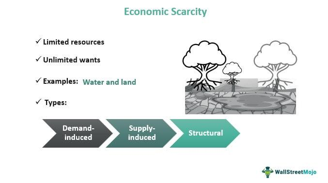

In an increasingly complex global marketplace, the concepts of scarcity and resource management are more pertinent than ever. Scarcity economics is concerned with the allocation of limited resources to meet diverse demands within an economy. It is a fundamental aspect that drives supply and demand dynamics, influencing economic decisions on both micro and macro scales. Understanding how to effectively manage these scarce resources is crucial for maintaining economic stability and growth.

Algorithmic trading, commonly referred to as algo trading, applies these economic principles to optimize trading in financial markets. It utilizes sophisticated algorithms and mathematical models to make automated trading decisions, often faster and more efficiently than human traders. This integration of technology with economic theory exemplifies the evolving strategies in modern economic practices as they seek to enhance efficiency and effectiveness in resource allocation and utilization.

This article explores the intersection of scarcity economics, resource management, and algorithmic trading. By examining the interplay between these elements, we aim to clarify how they influence each other, reshaping strategies and practices in contemporary economics. This exploration is pivotal in understanding the broader impact of technological advancements on economic frameworks and strategies.

## Table of Contents

## Understanding Scarcity Economics

Scarcity economics is the study of how limited resources are allocated across competing demands within an economy. This field is grounded in the fundamental principle that resources such as time, money, labor, and raw materials are finite, while human wants and needs are virtually infinite. Therefore, scarcity necessitates choices, influencing supply and demand dynamics in any marketplace.

**Scarcity and Supply and Demand:**

In any economic system, scarcity impacts the balance between supply and demand. When a resource is scarce, its supply diminishes, often driving up demand and consequently increasing its market price. For example, during drought conditions, limited water supply can lead to increased competition among agricultural producers, municipalities, and industry, pushing prices higher. This price mechanism encourages consumers to adjust their usage and producers to innovate or find alternatives, guiding the efficient allocation of scarce resources.

**Economic Decisions and Resource Allocation:**

Scarcity influences economic decisions, compelling individuals, businesses, and governments to prioritize their needs and allocate resources strategically. Decision-makers weigh opportunity costs—what must be forgone to acquire an additional unit of a scarce resource. For instance, a government facing budget constraints may need to choose between investing in healthcare or education, with each decision having different societal impacts.

**Real-world Examples of Scarcity:**

Scarcity is prevalent in numerous real-world scenarios. The 1970s oil crisis exemplifies how sudden scarcity of a vital resource disrupted global markets, causing economic turmoil. Similarly, the 2020 global pandemic highlighted scarcity in healthcare resources, such as ventilators and personal protective equipment, prompting countries to make critical allocation decisions.

**Microeconomics and Macroeconomics Connection:**

Scarcity economics links closely with both microeconomics and macroeconomics. On a microeconomic level, scarcity affects individual consumers and firms, influencing their behavior and decision-making processes. Firms, for instance, may innovate or shift production techniques to manage scarce resources efficiently. In macroeconomics, scarcity has broader implications for a country’s output, economic growth, and overall welfare. Policymakers must consider scarcity when formulating fiscal and monetary policies to ensure economic stability and growth.

Understanding scarcity economics helps elucidate how economies function in the face of limited resources, shaping policies and strategic decisions across various sectors.

## The Role of Resource Management

Resource management is a critical component of economic theory and practice, focusing on the optimal allocation and utilization of resources to maximize value and efficiency. It addresses the challenges posed by limited resources and seeks to balance demand and supply in various sectors. The core idea is to allocate resources in a way that meets economic objectives while minimizing waste and inefficiency.

### Strategies for Resource Allocation and Optimization

Several strategies can be implemented to optimize resource allocation under scarcity conditions. The Pareto Efficiency principle, for example, is a foundational concept in microeconomics that aims to allocate resources such that no individual's situation can be improved without worsening someone else's. Mathematical optimization techniques, such as linear programming, can also be applied to model and solve problems related to resource distribution. These strategies can be expressed through optimization problems that seek to maximize a given objective function subject to certain constraints.

### Role of Technology in Enhancing Efficiency

Technology plays a pivotal role in enhancing the efficiency of resource management. Advanced data analytics, [machine learning](/wiki/machine-learning), and [artificial intelligence](/wiki/ai-artificial-intelligence) enable more precise forecasting and decision-making. For instance, predictive analytics can anticipate demand trends and resource requirements, allowing for proactive adjustments. Geographic Information Systems (GIS) facilitate effective land and resource use, while Internet of Things (IoT) devices contribute to monitoring and managing resources in real-time. This technological integration not only streamlines operations but also reduces costs and improves productivity.

### Resource Management by Businesses and Governments

Businesses and governments employ various methods to manage resources, prioritizing sustainability and efficiency. Companies often implement inventory management systems to ensure that they have the right amount of stock at the right time, minimizing both overproduction and shortages. Lean production techniques focus on waste reduction and operational efficiency.

Governments, on the other hand, may implement policies such as taxation and subsidies to influence resource allocation in the economy. Additionally, public-private partnerships can be formed to address large-scale resource challenges, such as energy production or infrastructure development.

### Case Studies of Successful Applications

There are several notable case studies that demonstrate successful resource management. For instance, Toyota's adoption of lean manufacturing principles has significantly reduced waste and improved their operational efficiency. The company's Just-In-Time (JIT) production system has become a benchmark for efficient inventory management and resource utilization.

In the public sector, Singapore's water management system is an exemplary model of efficient resource use. Facing a scarcity of natural water resources, Singapore has invested heavily in technology and innovation to ensure a sustainable water supply. The country's water strategy includes a mix of imported water, desalination, rainwater collection, and water recycling.

Overall, effective resource management strategies are crucial for addressing scarcity and ensuring sustainable economic development. By leveraging technology and innovative practices, both businesses and governments can optimize resource allocation and enhance economic productivity.

## Algo Trading: A Technological Revolution

Algorithmic trading, or algo trading, represents a significant technological shift in the landscape of financial markets, leveraging computational power to execute trades with precision and speed. It involves the use of advanced mathematical models to automate the trading process, thereby facilitating the execution of orders based on complex algorithms. These algorithms analyze a multitude of market variables—such as price, [volume](/wiki/volume-trading-strategy), and time—to determine optimal trading strategies, incorporating elements of artificial intelligence and machine learning in their design.

One of the primary advantages of algo trading is its unparalleled speed, which allows for swift execution of orders far beyond human capability. This speed enables traders to capitalize on fleeting market opportunities, increasing the potential for profit. Moreover, [algorithmic trading](/wiki/algorithmic-trading) enhances efficiency by processing vast datasets to identify patterns not easily recognizable through traditional methods. By minimizing human intervention, algo trading reduces the risk of errors associated with emotional and impulsive decision-making, leading to more consistent and objective trading outcomes.

Algo trading significantly impacts market [liquidity](/wiki/liquidity-risk-premium) and price discovery, two crucial elements that sustain the dynamism of financial markets. By facilitating a higher volume of trades at a faster pace, algo trading contributes to greater liquidity, making it easier for traders to enter and [exit](/wiki/exit-strategy) positions without substantial price slippage. Moreover, algorithmic strategies can enhance price discovery by swiftly assimilating new information into market prices, thereby reflecting a more accurate valuation of assets.

In the trading process, resource allocation is managed through algorithmic precision, where computational systems dynamically allocate capital and adjust positions according to pre-set criteria and market conditions. This optimization ensures that resources are allocated efficiently, maximizing returns on investment while minimizing risks. Algorithms are designed to continuously assess market data, making real-time adjustments to maintain an optimal portfolio balance.

The rise of algo trading illustrates a technological revolution in financial markets, reshaping how trades are executed and how resources are allocated. By harnessing the power of algorithms, market participants can achieve greater efficiency and accuracy, setting the stage for continued innovation in trading practices.

## Interconnection Between Scarcity Economics, Resource Management, and Algo Trading

Scarcity economics fundamentally influences algorithmic trading strategies by dictating how algorithmic models prioritize and allocate scarce resources in fluctuating markets. At its core, scarcity economics is concerned with the optimal distribution of limited resources to satisfy various demands, which can be directly applied to the conditions in financial markets where assets can be scarce or highly sought after. Algorithmic trading leverages these principles by using advanced mathematical models and computational algorithms to assess scarcity conditions and adjust trading decisions accordingly. These algorithms can analyze vast amounts of market data to identify opportunities where supply-demand imbalances may lead to profitable trades.

The synergy between resource management practices and algo trading efficiency is evident in the way these strategies optimize trading processes. Resource management, which involves planning and controlling resources efficiently and effectively, parallels the objectives of algo trading, where algorithms allocate trading capital in response to market conditions. This alignment enables traders to maximize returns by reducing transaction costs and ensuring timely execution of trades. For example, algorithms might allocate more capital to assets predicted to outperform based on scarcity-driven demand increases, demonstrating efficient resource management.

Algorithmic trading's ability to navigate market scarcity is exemplified in various case studies. During periods of market scarcity, such as the financial crisis of 2008 or the COVID-19 pandemic, algo trading systems adjusted rapidly to shifts in market liquidity and [volatility](/wiki/volatility-trading-strategies). For instance, some algorithms were programmed to identify liquidity pools for assets that became scarce and anticipate price movements, thus enabling traders to maintain market positions or capitalize on price changes. These case studies show that algo trading can effectively handle the risks and opportunities presented by market scarcity through its adaptive and data-driven approach.

However, the integration of scarcity economics, resource management, and algo trading also presents potential conflicts. These may include ethical dilemmas, such as the prioritization of trades that may exacerbate market imbalances or create unfair advantages. Regulatory concerns arise from the need to balance innovation with market fairness and stability. Addressing these conflicts involves regulatory frameworks that ensure transparency and fairness while fostering technological advancements. Additionally, incorporating risk management controls within algorithms can mitigate these ethical implications by ensuring trades align with both market integrity and strategic objectives.

The future of this integration is likely to witness several trends, including the increasing role of artificial intelligence (AI) in enhancing algorithmic strategies. AI models can incorporate more complex scenarios and larger datasets, improving predictions related to scarcity and resource allocation. Moreover, cross-disciplinary innovations that blend behavioral economics with algorithmic models could offer more nuanced insights into investor behavior under scarcity conditions, leading to more refined trading strategies. Furthermore, as global markets evolve, the emphasis on sustainability and ethical considerations may drive algo trading to incorporate sustainable and socially responsible investing practices, aligned with broader economic and ethical goals.

In conclusion, the collaboration among scarcity economics principles, resource management practices, and algo trading is a robust framework that will continue to shape modern trading strategies. These interconnected fields collectively enhance market intelligence, improve trading efficiency, and contribute to the overall stability and sustainability of financial markets.

## Challenges and Considerations

Integrating scarcity economics with algorithmic trading (algo trading) presents a series of challenges and considerations that require careful evaluation. One of the primary limitations is the inherent unpredictability and complexity of financial markets. Algo trading systems are built on mathematical models and historical data; however, these models may not fully capture the dynamic nature of scarcity-driven market conditions. This limitation can lead to erroneous trading decisions, particularly in volatile markets where supply and demand can fluctuate rapidly due to scarcity.

Ethical and regulatory considerations are vital in both resource management and algo trading. The automated nature of algo trading poses ethical questions regarding accountability and the potential for market manipulation. As algorithms can place thousands of trades in seconds, the lack of oversight may lead to unfair advantages and potential exploitation of market inefficiencies. Regulatory bodies such as the Securities and Exchange Commission (SEC) and the Commodity Futures Trading Commission (CFTC) in the United States, emphasize the need for transparency and accountability in algorithmic systems to ensure fair trading practices.

Market volatility is a significant risk [factor](/wiki/factor-investing) in algo trading. High-frequency trading algorithms can exacerbate market swings, leading to flash crashes, where prices plummet followed by a rapid recovery. Security concerns also arise, as algo trading systems are vulnerable to cyberattacks, potentially leading to significant financial losses and destabilizing markets. Implementing robust cybersecurity measures is essential to safeguard these trading systems and maintain market stability.

Artificial Intelligence (AI) plays a crucial role in addressing some of these challenges. AI models can enhance the adaptability of trading algorithms by recognizing patterns and learning from new market data in real time, allowing for more informed trading decisions under scarcity conditions. Machine learning techniques enable algorithms to adjust their strategies dynamically, potentially reducing the risks associated with unforeseen market volatility.

To mitigate ethical implications and ensure fair resource allocation, a multifaceted approach is essential. Regulators must establish clear guidelines and frameworks to monitor and control algorithmic trading activities. Firms deploying algo trading systems should integrate ethical protocols that include fairness, accountability, and transparency in their operations. Regular audits and stress testing of algo trading systems can help identify vulnerabilities and improve resilience against market shocks.

In summary, while the integration of scarcity economics with algorithmic trading holds promise for enhanced resource management, it requires addressing significant challenges related to market unpredictability, ethical considerations, market stability, and security. Leveraging AI innovations and adhering to stringent regulatory standards can pave the way for more efficient and fair trading practices in the face of scarcity.

## Conclusion

The interconnectedness of scarcity economics, resource management, and algorithmic trading is vital in contemporary economic and trading practices. Scarcity economics elucidates how limited resources necessitate strategic decision-making to fulfill diverse economic demands. This principle is deeply rooted in both micro and macroeconomics, where the effective allocation of resources is crucial to balancing supply and demand.

Resource management, on the other hand, is pivotal in optimizing resource use under constraints, employing various strategies, often enhanced by technological advancements, to mitigate the challenges posed by scarcity. Businesses and governments alike utilize these strategies to allocate resources efficiently, ensuring sustainability and economic growth.

Algorithmic trading represents a technological innovation that has transformed financial markets by employing complex mathematical models to automate trading decisions. Its speed, efficiency, and ability to reduce human error have marked a significant evolutionary step in trading practices, enhancing market liquidity and aiding in precise price discovery.

When aligned, these disciplines offer a robust framework for navigating market complexities. Algorithmic trading benefits from the principles of scarcity economics, where it adapts strategies to profitable opportunities under resource constraints. Concurrently, resource management practices enhance the functionality and robustness of algo trading by providing structured approaches to utilize resources efficiently.

Looking ahead, it is anticipated that the integration of scarcity economics with algorithmic trading will evolve further. The continuing development of artificial intelligence and machine learning algorithms is expected to refine trading strategies and resource management techniques, potentially addressing some of the pressing challenges such as market volatility, security concerns, and ethical implications.

Continued exploration and innovation at the intersection of these fields promise to lead to more sophisticated and equitable economic frameworks. Emphasizing fair resource allocation and sustainable practices will be crucial in crafting future economic policies and trading systems that are resilient, inclusive, and aligned with the ethical standards of society.

## References & Further Reading

[1]: Bergstra, J., Bardenet, R., Bengio, Y., & Kégl, B. (2011). ["Algorithms for Hyper-Parameter Optimization."](https://papers.nips.cc/paper/4443-algorithms-for-hyper-parameter-optimization) Advances in Neural Information Processing Systems 24.

[2]: ["Advances in Financial Machine Learning"](https://www.amazon.com/Advances-Financial-Machine-Learning-Marcos/dp/1119482089) by Marcos Lopez de Prado

[3]: ["Evidence-Based Technical Analysis: Applying the Scientific Method and Statistical Inference to Trading Signals"](https://www.amazon.com/Evidence-Based-Technical-Analysis-Scientific-Statistical/dp/0470008741) by David Aronson

[4]: ["Machine Learning for Algorithmic Trading"](https://github.com/PacktPublishing/Machine-Learning-for-Algorithmic-Trading-Second-Edition) by Stefan Jansen

[5]: ["Quantitative Trading: How to Build Your Own Algorithmic Trading Business"](https://www.amazon.com/Quantitative-Trading-Build-Algorithmic-Business/dp/1119800064) by Ernest P. Chan