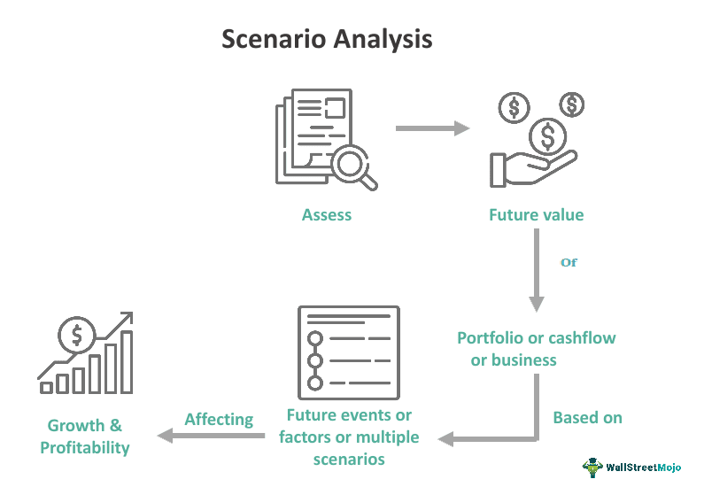

In today's rapidly evolving financial markets, traders and investors are constantly exploring innovative strategies to maximize returns and manage risks effectively. Algorithmic trading, often referred to as algo trading, has become a fundamental aspect of this technological shift. By leveraging advanced algorithms and high-speed computing, traders can now execute trades with remarkable precision and efficiency, significantly reducing human error and enhancing execution speed.

One of the pivotal methodologies employed to refine algo trading strategies is scenario analysis. This analytical approach involves evaluating potential future market conditions by considering a wide range of hypothetical situations. By simulating different scenarios, traders can gain valuable insights into how various factors might impact their trading algorithms. Such analyses are crucial in identifying both potential risks and opportunities that may not be visible through conventional analytical methods.



Scenario analysis plays a crucial role in optimizing algorithmic trading strategies by preparing traders for market uncertainties. By examining a spectrum of possible market conditions, traders can better position themselves to adapt to unexpected changes, ultimately enhancing their trading outcomes. As financial markets continue to advance, incorporating scenario analysis into algo trading strategies is increasingly becoming a fundamental practice for traders aiming to maintain a competitive edge.

## Table of Contents

## Understanding Scenario Analysis

Scenario analysis is a vital analytical tool that evaluates potential future events by exploring alternative outcomes, offering significant value in various fields, including finance and trading. This approach plays a crucial role in predicting how different market scenarios might influence trading algorithms, helping assess their adaptability and robustness under various market conditions.

In trading, scenario analysis provides a structured way to anticipate and evaluate the effects of different market conditions—such as economic shifts, geopolitical changes, and sudden financial crises—on trading strategies. By testing algorithms against a range of hypotheticals, traders can uncover potential risks and opportunities that traditional analyses might overlook. This comprehensive evaluation enables the development and refinement of trading models that can withstand and adapt to uncertain market environments.

Moreover, scenario analysis aids traders by highlighting systemic vulnerabilities in their strategies. For instance, an algorithm performing well in standard conditions might underperform during unforeseen events, such as a market crash. By considering these scenarios, traders can preemptively adjust strategies to mitigate risks. For example, if a particular strategy shows weaknesses during a simulated financial crisis, modifications like adjusting stop-loss levels or diversifying the asset portfolio might be advisable.

This iterative process of scenario analysis typically involves statistical and computational methods. Quantitative models are used to simulate a variety of market conditions. Tools like Monte Carlo simulations are valuable here, as they allow evaluation of the algorithm's performance across a broad spectrum of random events, providing a probabilistic understanding of potential outcomes.

```python
import numpy as np

# Example: Monte Carlo simulation for a simple trading scenario
def monte_carlo_simulation(current_price, num_simulations, time_horizon, volatility):
    results = []
    for _ in range(num_simulations):
        price = current_price
        for _ in range(time_horizon):
            price += price * np.random.normal(0, volatility)
        results.append(price)
    return np.mean(results), np.std(results)

# Simulating 1000 scenarios over a 30-day period for a given asset
current_price = 100  # current price of the asset
num_simulations = 1000
time_horizon = 30  # 30 days
volatility = 0.02  # 2% daily volatility

average_price, price_volatility = monte_carlo_simulation(current_price, num_simulations, time_horizon, volatility)
print(f"Average simulated price: {average_price}, Simulated price volatility: {price_volatility}")
```

In conclusion, scenario analysis is essential for fine-tuning [algorithmic trading](/wiki/algorithmic-trading) strategies, improving their resilience to market [volatility](/wiki/volatility-trading-strategies), and ensuring they are robust against a multitude of potential future events. This method enables traders to make informed decisions and maintain a competitive edge in the ever-changing financial landscape.

## The Methodology of Scenario Analysis

The methodology of scenario analysis in algorithmic trading involves a systematic approach to understanding the potential implications of different market conditions on trading algorithms. This process comprises four key steps aimed at optimizing the performance of trading strategies under varying market environments.

1. **Scenario Development**: This initial step involves creating comprehensive descriptions of possible future market conditions. Traders rely on historical data and expert insights to construct these scenarios. Historical data helps in identifying patterns and trends, while expert insights can contribute qualitative assessments of potential market shifts. This dual approach ensures that scenarios are both data-driven and grounded in market realities.

2. **Model Simulation**: Once scenarios are developed, computational models are employed to simulate how trading algorithms would perform under these hypothetical market conditions. The model simulation step is crucial for observing how algorithms react to changes in market variables such as volatility, interest rates, and liquidity. Traders can employ different types of models, including statistical, machine learning, and hybrid models, to predict the algorithm's performance. Python remains a popular choice for such simulations due to its comprehensive libraries, such as NumPy for numerical computation and pandas for data manipulation.

3. **Impact Assessment**: After performing simulations, traders move on to analyzing the results to assess the impact of different scenarios on trading outcomes. This step involves examining various performance metrics such as returns, volatility, Sharpe ratio, and drawdowns to identify strengths and weaknesses in the algorithmic strategy. The analysis helps in understanding the algorithm's robustness and its capacity to handle adverse conditions.

4. **Strategy Refinement**: The final step involves refining the algorithmic strategies based on the insights gained from impact assessment. Adjustments might include modifying algorithm parameters, revising risk management protocols, or incorporating new decision rules to enhance resilience and adaptability. This iterative refinement is critical in aligning the strategy with identified risks and opportunities, ensuring it is capable of capitalizing on market opportunities while minimizing potential losses.

Through this structured methodology, traders can enhance their decision-making processes and optimize trading performance, ensuring strategies remain effective amid market volatility. By systematically exploring potential market scenarios, scenario analysis supports traders in adapting to changes, managing risks, and improving profitability in algorithmic trading.

## Examples of Scenario Analysis in Algo Trading

Example 1: Market Volatility Impact

Scenario analysis can be used to test a trading algorithm's robustness during periods of extreme market volatility. During such times, rapid price movements can cause unexpected losses if risk management strategies are inadequate. By simulating volatile market conditions, traders can evaluate how their algorithms respond to sharp price fluctuations and identify any weaknesses in their risk management frameworks. Adjustments can then be made to strategy parameters to enhance resilience and ensure that the algorithm can withstand similar real-world conditions without significant financial losses.

Example 2: Interest Rate Changes

Trading algorithms in the currency markets are particularly sensitive to changes in interest rates. Scenario analysis helps evaluate the impact of potential [interest rate](/wiki/interest-rate-trading-strategies) hikes or cuts on these algorithms. By simulating various interest rate trajectories, traders can assess how currency pairs might react, influencing trading strategies predicated on interest rate differentials. This analysis allows traders to preemptively adjust their algorithmic strategies to either capitalize on interest rate movements or hedge against adverse scenarios effectively.

Example 3: Geopolitical Events

Geopolitical events, such as trade wars, elections, or diplomatic tensions, can significantly affect stock market dynamics. By modeling these events through scenario analysis, traders can simulate their potential market impacts. For example, an algorithm might be tested to respond to increased market uncertainty following a major geopolitical event by adjusting positions and rebalancing portfolios. This proactive approach enables traders to better prepare for sudden geopolitical developments, minimizing risks and capturing opportunities that arise from market shifts.

Example 4: Market Liquidity Fluctuations

High-frequency trading ([HFT](/wiki/high-frequency-trading-strategies)) algorithms are particularly affected by changes in market [liquidity](/wiki/liquidity-risk-premium). Scenario analysis allows traders to simulate varying liquidity conditions and assess their impact on HFT strategies. During periods of low liquidity, bid-ask spreads may widen, and order execution times could be delayed, potentially affecting strategy profitability. By testing algorithms under different liquidity scenarios, traders can adapt their HFT strategies to maintain performance even when liquidity is constrained. 

These examples illustrate how scenario analysis can be customized to evaluate and refine specific algorithmic trading strategies, thereby enhancing their effectiveness and resilience in dynamic market environments.

## Benefits of Scenario Analysis in Algorithmic Trading

Scenario analysis plays a vital role in enhancing the efficacy of algorithmic trading by enabling proactive risk management through the simulation of diverse adverse market conditions and outcomes. This analytical approach helps traders to identify hidden vulnerabilities within their algorithms. By unveiling these weak points, traders can refine and fortify their trading strategies, ensuring they are resilient and robust against unexpected market shifts.

Exploring a variety of potential future states provides traders with valuable insights, allowing them to swiftly adapt and capitalize on emerging trends. This foresight supports informed decision-making, offering a significant advantage in the fast-paced financial markets. By understanding how different scenarios can impact trading strategies, traders can preemptively address issues and opportunities, optimizing their responses to market developments.

The benefits of scenario analysis extend to improved profitability, as traders can better align their strategies with anticipated market movements. Additionally, this approach aids in reducing losses by pre-emptively adjusting algorithms to counteract unfavorable conditions, thereby enhancing risk-adjusted returns. For instance, consider a Python-based model simulation for testing algorithm robustness under various scenarios:

```python
import numpy as np

def simulate_scenario(algo, market_conditions):
    # Simulate trading algorithm performance under given market conditions
    np.random.seed(42)  # For reproducibility
    returns = np.random.normal(loc=market_conditions['mean_return'],
                               scale=market_conditions['volatility'],
                               size=1000)

    algo_performance = algo(returns)
    return algo_performance

def trading_algorithm(returns):
    # Simple algorithm: Buy if returns > threshold, sell otherwise
    threshold = 0.01
    return np.where(returns > threshold, "buy", "sell")

# Example market conditions
scenario_1 = {'mean_return': 0.005, 'volatility': 0.02}
scenario_2 = {'mean_return': -0.005, 'volatility': 0.05}

# Simulate scenarios
performance_1 = simulate_scenario(trading_algorithm, scenario_1)
performance_2 = simulate_scenario(trading_algorithm, scenario_2)

print("Scenario 1 Performance:", np.unique(performance_1, return_counts=True))
print("Scenario 2 Performance:", np.unique(performance_2, return_counts=True))
```

This script simulates a trading algorithm's behavior in two different market scenarios, demonstrating how varied market conditions can affect trading decisions. Such analyses inform traders of the potential need for strategy adjustments, ensuring adaptability and resilience in their trading operations.

Overall, scenario analysis is a strategic tool that enables traders to enhance profitability, reduce losses, and achieve better risk-adjusted returns, reinforcing its indispensability in algorithmic trading environments.

## Challenges of Implementing Scenario Analysis

While scenario analysis provides a powerful framework for enhancing algorithmic trading strategies, its implementation is not without significant challenges that traders must navigate.

**Data Limitations:** The effectiveness of scenario analysis is intrinsically linked to the quality and comprehensiveness of historical data. High-quality data is essential to accurately model and predict potential market scenarios. However, trading data can often be sparse, inconsistent, or incomplete, especially for newer markets or financial instruments. This paucity of robust data can lead to less reliable scenario predictions, ultimately compromising the utility of the analysis.

**Complexity in Model Development:** Developing realistic and comprehensive scenarios requires a deep understanding of market dynamics, along with sophisticated modeling techniques. Crafting these scenarios involves complex statistical and mathematical methods to accurately capture market behavior under different conditions. This not only demands advanced expertise but also robust computational tools capable of handling intricate algorithms and simulations. For instance, models might need to incorporate stochastic processes to account for the random nature of market movements, which can increase their complexity significantly.

**Resource Intensity:** Implementing scenario analysis is both time-consuming and computationally expensive. Running extensive simulations to explore a wide range of potential scenarios demands substantial processing power and time. This requirement for advanced computational infrastructure and the expertise to use it effectively can pose substantial barriers, especially for smaller trading operations or those with limited resources. Furthermore, the ongoing maintenance and updating of models as new data becomes available add to the resource demands.

Despite these challenges, the benefits of scenario analysis underscore its importance in the arsenal of tools for sophisticated algorithmic trading operations. The insights gained from thorough scenario analysis enable traders to anticipate market changes and refine their strategies accordingly, providing a notable strategic advantage in competitive financial markets.

## Conclusion

Scenario analysis is an indispensable tool for traders seeking to refine and enhance their algorithmic trading strategies. By systematically exploring potential market scenarios, traders can make informed predictions about future market conditions, enabling them to anticipate changes and manage risks effectively. This proactive approach allows for optimization of profits by positioning trades advantageously before market shifts occur. Moreover, as financial markets continue to evolve at a rapid pace, embracing methodologies like scenario analysis is crucial for maintaining a competitive edge. The dynamic nature of markets demands that traders are not only reactive but also predictive in their strategy formulation.

Despite the challenges associated with implementing scenario analysis—such as data limitations and the complexity of model development—the strategic benefits far outweigh the costs. The insights garnered from scenario simulations provide traders with a comprehensive understanding of potential market disruptions, leading to stronger and more resilient trading strategies. This makes scenario analysis a worthwhile investment for forward-thinking traders who aim to stay ahead of the curve.

Furthermore, scenario analysis does more than just improve current trading outcomes; it prepares investors for future market developments. By fostering an adaptive mindset, it equips traders to respond effectively to unforeseen events and capitalize on emerging trends. As such, scenario analysis not only bolsters immediate trading performance but also contributes to long-term financial success by ensuring that traders are well-prepared for a variety of potential future states in the market landscape.

## References & Further Reading

[1]: Bergstra, J., Bardenet, R., Bengio, Y., & Kégl, B. (2011). ["Algorithms for Hyper-Parameter Optimization."](https://dl.acm.org/doi/10.5555/2986459.2986743) Advances in Neural Information Processing Systems 24.

[2]: ["Advances in Financial Machine Learning"](https://www.amazon.com/Advances-Financial-Machine-Learning-Marcos/dp/1119482089) by Marcos Lopez de Prado

[3]: ["Evidence-Based Technical Analysis: Applying the Scientific Method and Statistical Inference to Trading Signals"](https://www.amazon.com/Evidence-Based-Technical-Analysis-Scientific-Statistical/dp/0470008741) by David Aronson

[4]: ["Machine Learning for Algorithmic Trading"](https://github.com/stefan-jansen/machine-learning-for-trading) by Stefan Jansen

[5]: ["Quantitative Trading: How to Build Your Own Algorithmic Trading Business"](https://www.amazon.com/Quantitative-Trading-Build-Algorithmic-Business/dp/1119800064) by Ernest P. Chan