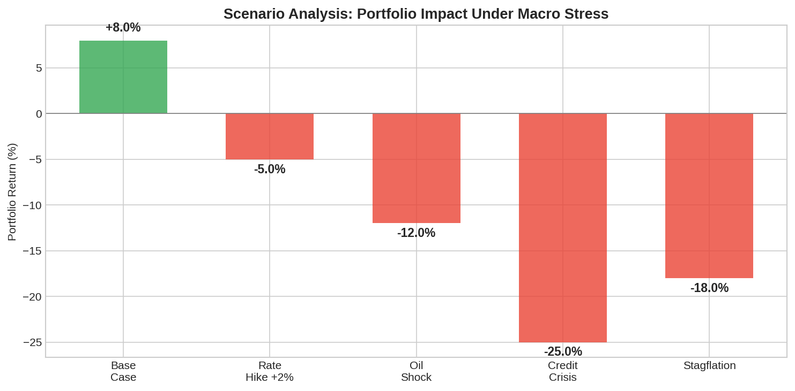

**Scenario analysis** is a risk management technique that evaluates portfolio performance under specific hypothetical conditions — a rate hike, an oil shock, a credit crisis — rather than relying solely on historical statistics. **Stress testing** is the extreme version: it subjects the portfolio to severe but plausible scenarios to identify vulnerabilities before they materialize. Together, they answer the question every trader should ask: "What happens to my portfolio if X occurs?"

## Why Standard Risk Metrics Are Not Enough

Value at Risk (VaR) and standard deviation measure risk under normal conditions but fail to capture tail events. The 2008 financial crisis, the 2020 COVID crash, and the 2022 rate shock all fell outside the bounds predicted by standard statistical models. Scenario analysis fills this gap by testing specific narratives rather than statistical distributions.

| Approach | What It Measures | Limitation |
|----------|-----------------|------------|
| VaR | Loss at a given probability | Assumes stable distributions |
| Standard deviation | Average dispersion | Symmetric, ignores tails |
| Scenario analysis | Loss under specific events | Subjective scenario selection |
| Stress testing | Loss under extreme events | May miss novel scenarios |
| Monte Carlo | Full distribution | Depends on model assumptions |

## Building Scenario Analysis

A scenario analysis requires three components: the scenario definition (what macro variables change and by how much), the transmission model (how macro changes map to asset returns), and the portfolio mapping (how asset moves affect portfolio value).

$$\Delta V_{\text{portfolio}} = \sum_{i=1}^{N} w_i \cdot \beta_i \cdot \Delta F_{\text{scenario}}$$

where $w_i$ are portfolio weights, $\beta_i$ are factor sensitivities, and $\Delta F$ is the scenario shock.



## Python Implementation

```python
import numpy as np

def scenario_analysis(weights, factor_betas, scenarios):
    """
    Run scenario analysis on a portfolio.
    weights: portfolio weights per asset
    factor_betas: n_assets x n_factors exposure matrix
    scenarios: dict of {scenario_name: factor_shocks}
    """
    results = {}
    for name, shocks in scenarios.items():
        shocks = np.array(shocks)
        asset_impacts = factor_betas @ shocks
        portfolio_impact = weights @ asset_impacts
        results[name] = {
            "portfolio_return": portfolio_impact,
            "asset_impacts": asset_impacts,
            "worst_asset": np.argmin(asset_impacts),
        }
    return results

# Define portfolio
weights = np.array([0.40, 0.30, 0.15, 0.15])  # Equities, Bonds, Gold, Commodities
asset_names = ["Equities", "Bonds", "Gold", "Commodities"]

# Factor sensitivities: [GDP shock, Rate shock, Inflation shock, Credit shock]
factor_betas = np.array([
    [ 2.0, -0.5, -0.3,  1.5],  # Equities
    [-0.3,  4.0, -0.5, -1.0],  # Bonds
    [-0.2, -1.5,  2.0, -0.5],  # Gold
    [ 1.0, -0.3,  1.5,  0.5],  # Commodities
])

# Scenarios: [GDP%, Rate%, Inflation%, Credit%]
scenarios = {
    "Base case":       [ 0.02,  0.00,  0.00,  0.00],
    "Rate shock +2%":  [-0.01,  0.02,  0.005, 0.005],
    "Oil crisis":      [-0.015, 0.005, 0.03,  0.01],
    "Credit crunch":   [-0.03, -0.01, -0.01,  0.05],
    "Stagflation":     [-0.02,  0.015, 0.04,  0.02],
}

results = scenario_analysis(weights, factor_betas, scenarios)
print(f"{'Scenario':>18} {'Portfolio':>10} {'Worst Asset':>15}")
print("-" * 48)
for name, res in results.items():
    worst = asset_names[res["worst_asset"]]
    print(f"{name:>18} {res['portfolio_return']*100:>+9.2f}% {worst:>15}")
```

## Historical Stress Tests

Common historical stress scenarios include the 2008 Global Financial Crisis (equities -50%, credit spreads +500bps), the 2020 COVID crash (equities -34% in 23 days), the 2022 rate shock (bonds and equities both down 15%+), and the 1998 LTCM crisis (liquidity evaporation, spread blowout). Replaying these scenarios against the current portfolio reveals structural vulnerabilities.

The [All Weather Portfolio](https://paperswithbacktest.com/wiki/all-weather-portfolio) was specifically designed to survive multiple stress scenarios by balancing macro factor exposures. [Value at Risk](https://paperswithbacktest.com/wiki/var-value-at-risk) provides the statistical complement to narrative-driven scenario analysis.

## Limitations and Risks

The main limitation is scenario selection bias — you can only test scenarios you imagine. The next crisis may come from a source that no one anticipated. Scenario analysis is also sensitive to the assumed factor sensitivities, which change over time. Use it as a complement to statistical risk measures, not a replacement.

## Conclusion

Scenario analysis and stress testing transform abstract risk into concrete, actionable intelligence. By asking "what happens if?" and running the numbers, traders can identify portfolio vulnerabilities, size hedges appropriately, and build resilience against the macro shocks that destroy unprepared portfolios.

---

**Explore further on PapersWithBacktest:**
- Browse [backtested risk-managed strategies](https://paperswithbacktest.com/strategies) with Python code and performance metrics
- Access [clean historical market data](https://paperswithbacktest.com/datasets) for equities, crypto, and futures
- Take the [algo trading course](https://paperswithbacktest.com/course) — 60+ video lessons and notebooks
- Related wiki pages: [Value at Risk (VaR)](https://paperswithbacktest.com/wiki/var-value-at-risk) · [All Weather Portfolio](https://paperswithbacktest.com/wiki/all-weather-portfolio) · [Kelly Criterion Position Sizing](https://paperswithbacktest.com/wiki/kelly-criterion-position-sizing)
