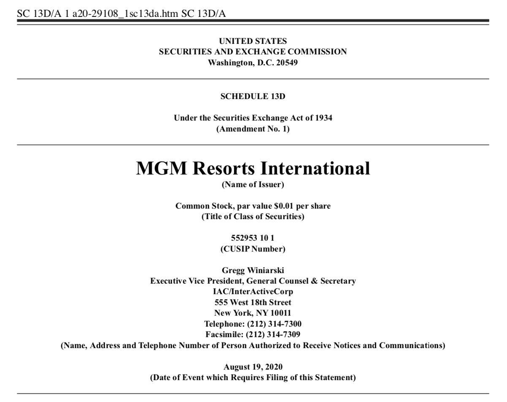

Investment disclosures are vital components of modern financial markets, serving as tools for transparency and trust between investors and companies. Among these disclosures, Schedule 13D filings with the U.S. Securities and Exchange Commission (SEC) are particularly significant. These filings are required when an entity acquires more than 5% of a company's voting shares, offering insights into potential shifts in control and strategic intentions related to mergers, takeovers, or other pivotal corporate actions. The transparency provided by Schedule 13D not only reassures existing shareholders but also informs potential investors of any changes in the composition and influence within a company's shareholder base.

Simultaneously, the evolution of stock markets has been profoundly impacted by the rise of algorithmic trading. This form of trading, characterized by the use of sophisticated algorithms to execute trades at speeds and frequencies beyond human capabilities, is now a dominant force in financial markets. For practitioners in algorithmic trading, understanding regulatory filings such as Schedule 13D is essential. These filings offer valuable data points that can influence trading strategies by highlighting potential market-moving events, such as changes in a company’s ownership structure. The integration of Schedule 13D data into algorithmic trading platforms can significantly enhance predictive models, allowing traders to anticipate and respond to market dynamics more effectively.



This article provides an overview of Schedule 13D filings, discussing their requirements and illustrating how these disclosures intersect with algorithmic trading strategies. By examining the role of Schedule 13D in fostering transparency and enabling advanced trading techniques, this discussion aims to underscore the filing's importance in maintaining market integrity and driving informed investment decisions.

## Table of Contents

## What is Schedule 13D?

Schedule 13D is a regulatory form required by the U.S. Securities and Exchange Commission (SEC) when an individual or group acquires more than 5% of a company's voting shares. The form must be filed within ten days of this threshold being crossed. It serves as a critical transparency tool in financial markets, revealing significant shifts in a company's ownership structure that could signal changes in control or the strategic direction of the company.

The significance of Schedule 13D lies in its requirement for detailed information disclosure by the acquirer. The form must specify the identity of the beneficial owner, the number of shares acquired, and the source of the funds for the purchase. This level of detail is essential for investors and market analysts to assess the potential impact of the acquisition on the company’s governance and future strategies.

Moreover, Schedule 13D can function as an early indicator of corporate actions like mergers, takeovers, or proxy battles. When a significant shareholder amasses a more substantial stake, it might suggest an intent to influence or gain control over the company's management decisions. This is particularly true if the acquiring party has a history of such activities.

In summary, Schedule 13D filings are instrumental in providing transparency and insights into the movements of major investors, helping maintain an informed and orderly market environment.

## Requirements of Schedule 13D

Schedule 13D is a critical regulatory filing that mandates certain disclosure requirements for beneficial owners who acquire a significant stake in a publicly traded company. This filing serves to ensure transparency and maintain investor confidence. When a person or entity acquires more than 5% of a company's voting shares, a Schedule 13D must be submitted to the Securities and Exchange Commission (SEC). 

Key information required in Schedule 13D includes the identity of the beneficial owner, the exact percentage and number of securities purchased, and the source of the funds used for the acquisition. These details provide insight into the scale of investment and the investor's potential influence over the company.

Furthermore, Schedule 13D mandates the disclosure of the purpose behind the acquisition. This could encompass any intentions to influence the company's management structure, plans for mergers, takeovers, or any other strategic considerations. Such disclosures are essential for stakeholders to assess possible shifts in company control dynamics.

Schedule 13D also requires timely updates to reflect material changes in ownership. A significant aspect of this requirement is that if there is a change constituting 1% or more in beneficial ownership after the initial filing, an amendment to the Schedule 13D must be filed. This ensures that all stakeholders remain informed about meaningful shifts in stock ownership, which may signal changes in control or strategy.

These requirements collectively foster a transparent environment where investors and market participants have access to crucial ownership information, thereby aiding in their decision-making processes.

## Officials Monitoring and Amendments

Investors who acquire more than 5% of a company's voting shares are required to file a Schedule 13D form with the U.S. Securities and Exchange Commission (SEC) within a 10-day period. This submission is a crucial step in ensuring transparency in the capital markets, as it informs other investors and the company about significant ownership stakes and potential shifts in control. 

To maintain up-to-date information, any material change in beneficial ownership, defined as a change of 1% or more, must be reported through an amendment to the original filing. These amendments must be submitted to the SEC within two days of the change occurring. This swift update requirement is designed to keep the market informed and prevent any delays that might otherwise disrupt market stability or lead to unfair trading advantages.

The SEC facilitates accessibility and transparency through its EDGAR (Electronic Data Gathering, Analysis, and Retrieval) system. This online platform allows investors, analysts, and regulators to review Schedule 13D filings and any amendments easily. Through EDGAR, stakeholders can readily access vital information about significant owners and their intentions, which is indispensable for making informed investment decisions and understanding market dynamics. This system underscores the intersection of regulatory compliance and technological advancement in the era of digital finance.

## Algorithmic Trading and Schedule 13D

Algorithmic traders increasingly rely on data from Schedule 13D filings to anticipate stock price movements driven by significant ownership changes. These traders examine deviations in ownership levels to adjust their trading strategies in anticipation of corporate actions, such as mergers and acquisitions, that might trigger share price fluctuations. A spike in Schedule 13D filings signals potential upcoming corporate maneuvers, creating strategic entry points for [algorithmic trading](/wiki/algorithmic-trading) models.

These models employ various techniques to process and analyze the data contained within 13D filings. For instance, natural language processing (NLP) algorithms might be utilized to extract pertinent information regarding the intentions and plans of major stakeholders disclosed in the filings. Quantitative algorithms then leverage this information to model potential market reactions.

The strategic adjustment of holdings based on these predictions typically involves the integration of data from Schedule 13D filings into quantitative models. Such models may include predictive analytics techniques that utilize historical data to forecast price movements. For example, if a prominent investor discloses a significant position in a company, it might suggest an impending strategic shift or control change. Algorithmic models would then be programmed to exploit these insights by adjusting portfolio holdings accordingly.

Python, a widely used language in algorithmic trading, provides numerous libraries and tools to aid in the analysis of Schedule 13D filings. For instance, libraries like `pandas` can be used to manage and analyze time-series data derived from these filings, while `scikit-learn` can support the implementation of [machine learning](/wiki/machine-learning) algorithms to identify patterns and trends.

```python
import pandas as pd
from sklearn.linear_model import LinearRegression

# Hypothetical example: read historical 13D filing data 
data = pd.read_csv('13D_filings.csv')

# Extract relevant features for the model
features = data[['ownership_change', 'stakeholder_influence', 'filing_date']]
target = data['price_movement']

# Initialize a Linear Regression model
model = LinearRegression()

# Fit the model
model.fit(features, target)

# Predict future price movement based on new filing data
new_filing_data = pd.DataFrame({
    'ownership_change': [0.07],
    'stakeholder_influence': [0.5],
    'filing_date': ['2023-10-15']
})
predicted_movement = model.predict(new_filing_data)

print(predicted_movement)
```

Through algorithmic adjustments informed by Schedule 13D data, traders can adeptly navigate market dynamics, optimizing their portfolios to benefit from anticipated shifts facilitated by changes in significant ownership. This integration of regulatory filing data into trading models exemplifies the sophisticated and data-driven nature of contemporary algorithmic trading strategies.

## Importance of Schedule 13D to Investors

Schedule 13D forms are crucial for investors as they provide detailed insights into significant ownership changes and potential strategic maneuvers within a company. These forms, mandated by the Securities and Exchange Commission (SEC), alert investors to key activities such as hostile takeovers, proxy battles, or other significant strategic realignments. Such disclosures are instrumental in fostering transparency and informing market participants of substantial shareholder intentions.

When an entity acquires more than 5% of a company’s voting shares, this acquisition is of particular interest to investors for several reasons. Firstly, a significant change in ownership often preludes a potential shift in corporate strategy or governance. Investors utilize this information to gauge the likelihood of future mergers, acquisitions, or takeovers that could impact shareholder value. For instance, a large-scale acquisition indicated in a Schedule 13D could signal a forthcoming attempt to influence or control the company's board of directors, potentially leading to a shift in business direction that may affect the company’s market valuation.

The primary allure of these filings to investors lies in their capability to forecast corporate actions that may affect the market. When an investor or a group declares a substantial stake, it may trigger anticipation of corporate restructuring, asset reallocation, or operational changes. Schedule 13D forms, therefore, act as early indicators of such corporate behaviors, facilitating investors to align their strategies with the predicted market movements.

From a risk management perspective, understanding and interpreting Schedule 13D disclosures allow investors to navigate market [volatility](/wiki/volatility-trading-strategies) more effectively. These filings help in evaluating potential risks associated with aggressive investment strategies by other stakeholders, enabling investors to preemptively adjust their portfolios. As market conditions fluctuate in response to significant filings, the informed investor stands a better chance of optimizing their investment returns by preemptively addressing emerging risks or capitalizing on opportunities presented by these ownership disclosures.

Overall, the strategic interpretation of Schedule 13D forms fosters a proactive investment approach by equipping investors with essential knowledge of significant stakeholder actions, thereby mitigating risk and paving the way for informed decision-making in an increasingly complex financial market landscape.

## Conclusion

Schedule 13D filings are essential tools for maintaining transparency in financial markets, particularly in scenarios involving large-scale transactions. By requiring detailed disclosures from individuals or entities that acquire more than 5% of a company's voting shares, these filings provide vital information about potential shifts in control and strategic directions. This transparency is crucial not just for regulators, but for investors who rely on this information to make informed decisions.

For algorithmic traders, data from Schedule 13D filings can be a significant component of successful trading strategies. The information disclosed allows traders to anticipate market movements by identifying changes in ownership, which might suggest forthcoming corporate actions such as mergers, takeovers, or strategic realignments. Algorithmic models can harness this data to adjust holdings and optimize trading strategies. For example, Python scripts using libraries like `pandas` and `numpy` can efficiently analyze large datasets obtained from the SEC's EDGAR database to identify patterns and build predictive models.

As trading strategies become more sophisticated, the ability to integrate data from Schedule 13D filings aids in maintaining both compliance and a competitive tactical advantage. Understanding these filings is vital for market participants aiming to capitalize on emergent trends and insights while ensuring adherence to regulatory standards. In an environment where strategic decision-making is informed by ever-evolving data flows, the role of Schedule 13D filings in providing actionable intelligence is likely to remain indispensable.

## References & Further Reading

[1]: ["Schedule 13D and 13G Filings with SEC, Information & Requirements"](https://www.sec.gov/submit-filings/filer-support-resources/how-do-i-guides/file-schedule-13d-schedule-13-g-corresponding-amendments), U.S. Securities and Exchange Commission.

[2]: Andres, C. (2018). ["The Impact of Schedule 13D filings on Stock Prices and Returns."](https://pubmed.ncbi.nlm.nih.gov/29097493/) Financial Analysts Journal.

[3]: ["Machine Learning for Algorithmic Trading"](https://github.com/stefan-jansen/machine-learning-for-trading) by Stefan Jansen.

[4]: ["Advances in Financial Machine Learning"](https://www.amazon.com/Advances-Financial-Machine-Learning-Marcos/dp/1119482089) by Marcos Lopez de Prado.

[5]: ["Quantitative Trading: How to Build Your Own Algorithmic Trading Business"](https://www.amazon.com/Quantitative-Trading-Build-Algorithmic-Business/dp/1119800064) by Ernest P. Chan.