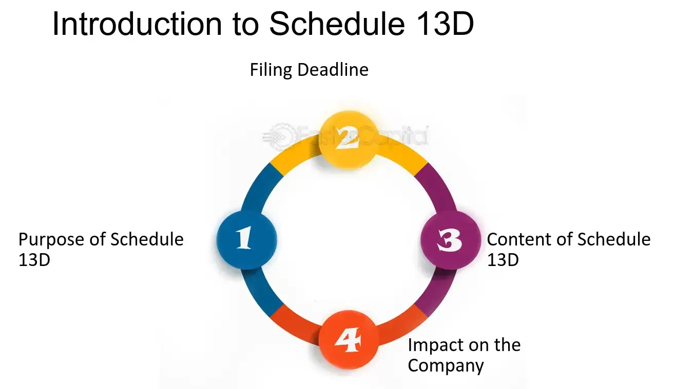

## Table of Contents

## What is Schedule 13D?

Schedule 13D is a form that people or groups need to fill out and send to the U.S. Securities and Exchange Commission (SEC) when they buy a lot of shares in a company. Specifically, it's required when someone owns more than 5% of a company's stock. This rule helps keep the stock market fair and open by making sure everyone knows who owns big chunks of a company.

The form has to be filed within 10 days of reaching that 5% ownership. It includes details like who the buyer is, how many shares they own, and what they plan to do with those shares. This information is important because it lets other investors and the public know about big changes in who controls a company, which can affect the stock's price and the company's future.

## Who is required to file a Schedule 13D?

Anyone who buys more than 5% of a company's stock needs to file a Schedule 13D with the U.S. Securities and Exchange Commission (SEC). This rule applies to individuals, groups, or companies who reach this ownership threshold. The purpose is to make sure that big changes in who owns a company are public, so everyone knows what's happening.

The form has to be filed within 10 days of reaching that 5% ownership level. It includes information about who the buyer is, how many shares they own, and what they plan to do with those shares. This helps keep the stock market fair and open by letting other investors and the public know about significant shifts in a company's ownership, which can impact the stock price and the company's future direction.

## What is the threshold for filing a Schedule 13D?

The threshold for filing a Schedule 13D is when someone buys more than 5% of a company's stock. This rule is set by the U.S. Securities and Exchange Commission (SEC) to make sure big changes in who owns a company are known to the public.

When someone reaches this 5% ownership, they have to fill out and send the Schedule 13D form to the SEC within 10 days. This form tells everyone who the buyer is, how many shares they own, and what they plan to do with those shares. It helps keep the stock market fair and open by letting other investors know about important changes in a company's ownership.

## What information must be included in a Schedule 13D filing?

A Schedule 13D filing needs to include a lot of important details. It starts with who the person or group is that bought the shares. This means their name, address, and what they do for a living. Then, it lists how many shares they own and what percentage of the company that is. It's also important to say how they got those shares, like if they bought them or got them some other way.

The filing also has to explain what the buyer plans to do with the shares. This could be things like trying to change who runs the company or how it's managed. They need to say if they're working with anyone else to do this. Lastly, the form should include any other important details that could affect the company or its stock price. This helps everyone know what's going on and keeps the stock market fair.

## How soon must a Schedule 13D be filed after the threshold is met?

A Schedule 13D must be filed within 10 days after someone buys more than 5% of a company's stock. This rule is set by the U.S. Securities and Exchange Commission (SEC) to make sure that big changes in who owns a company are known to the public quickly.

When someone reaches this 5% ownership, they need to fill out and send the Schedule 13D form to the SEC. This form tells everyone who the buyer is, how many shares they own, and what they plan to do with those shares. It helps keep the stock market fair and open by letting other investors know about important changes in a company's ownership.

## What are the amendments and when are they required for Schedule 13D?

Amendments to Schedule 13D are changes that need to be made to the original form if certain things happen. If there's a big change in the number of shares someone owns, or if their plans for those shares change, they need to file an amendment. This also applies if there's a change in who is working together on the ownership, or if any important details from the original filing change.

These amendments have to be filed quickly. The rule is that they need to be sent to the SEC within 2 business days after the change happens. This makes sure that everyone knows about the new information as soon as possible, so the stock market stays fair and open.

## How does Schedule 13D differ from Schedule 13G?

Schedule 13D and Schedule 13G are both forms that need to be filed with the SEC when someone owns more than 5% of a company's stock, but they are used in different situations. Schedule 13D is used when someone plans to influence or control the company they've invested in. This means they might want to change how the company is run or who runs it. The form has to be filed within 10 days of reaching the 5% ownership and includes details about the buyer, how many shares they own, and what they plan to do with those shares.

On the other hand, Schedule 13G is used when someone owns more than 5% of a company's stock but doesn't plan to influence or control it. This form is simpler and has a longer filing deadline. It can be used by certain types of investors like banks, brokers, or people who own the stock just to invest, not to change the company. The main difference is that Schedule 13G shows a passive investment, while Schedule 13D shows an active one.

## What are the potential penalties for not filing a Schedule 13D on time?

If someone doesn't file a Schedule 13D on time, they could face some serious problems. The SEC can take legal action against them. This might mean they have to pay a lot of money as a fine. The fines can be different depending on how bad the delay was and if it was done on purpose.

Not filing on time can also cause other issues. It can hurt the person's or company's reputation. People might not trust them anymore because they didn't follow the rules. This can make it harder for them to do business in the future. So, it's really important to file the Schedule 13D within the 10-day deadline to avoid these problems.

## Can the information in a Schedule 13D be used for insider trading?

The information in a Schedule 13D can be used for insider trading, but it's against the law. Insider trading happens when someone uses secret information to buy or sell stocks before that information is public. If someone sees a Schedule 13D and uses it to trade stocks before everyone else knows about it, that's illegal. The SEC watches for this kind of thing to keep the stock market fair for everyone.

The Schedule 13D is meant to make big ownership changes public so everyone can see them. It's supposed to help people make smart choices about their investments. But if someone uses the information in a Schedule 13D to trade stocks in a way that gives them an unfair advantage, they could get in big trouble. The SEC can fine them and even send them to jail for insider trading.

## How does the SEC review and process Schedule 13D filings?

When someone files a Schedule 13D with the SEC, the SEC looks at it to make sure it follows the rules. They check if the form is filled out right and if it has all the needed information. The SEC also checks if the person filed it on time, which is within 10 days of owning more than 5% of a company's stock. If something is wrong or missing, the SEC might ask for more details or even start an investigation.

The SEC makes the Schedule 13D public so everyone can see it. They put it on their website, EDGAR, where anyone can look at it. This helps keep the stock market fair because it lets other investors know about big changes in who owns a company. If someone doesn't file the form on time or tries to hide important information, the SEC can take action, like fining them or starting legal action.

## What strategic considerations should be taken into account when filing a Schedule 13D?

When someone decides to file a Schedule 13D, they need to think about how it might affect the company they're investing in. Filing a Schedule 13D shows that they own more than 5% of the company's stock and they want to influence how the company is run. This can make the company's stock price go up or down because other investors might see it as good or bad news. The person filing also needs to think about how the company's board and other shareholders might react. They might not like the idea of someone trying to take control, so they could try to stop it.

Another thing to consider is timing. The person filing needs to make sure they file the Schedule 13D within 10 days of buying more than 5% of the stock. If they don't, they could get in trouble with the SEC. They also need to be ready to explain their plans for the company in the filing. This means they should have a clear idea of what they want to do and how they plan to do it. Being open and honest in the filing can help build trust with other investors and the company's board.

## How can technological tools assist in managing Schedule 13D filings?

Technological tools can make it a lot easier to manage Schedule 13D filings. They help by keeping track of how many shares someone owns. When someone buys more shares and goes over the 5% limit, these tools can remind them to file the Schedule 13D on time. They also help fill out the form correctly by putting in all the needed information automatically. This way, the person filing doesn't miss anything important and can avoid making mistakes that might get them in trouble with the SEC.

These tools also make it easier to keep the Schedule 13D up to date. If there are changes in how many shares someone owns or in their plans for the company, the tools can help them file amendments quickly. They can also help by sending reminders about when to file these amendments, so they don't miss the 2-day deadline. Using technology like this can save time and help make sure everything is done right, keeping the person filing out of trouble with the SEC.

## References & Further Reading

[1]: ["Schedule 13D and 13G Filings with SEC, Information & Requirements"](https://www.sec.gov/submit-filings/filer-support-resources/how-do-i-guides/file-schedule-13d-schedule-13-g-corresponding-amendments), U.S. Securities and Exchange Commission.

[2]: Andres, C. (2018). ["The Impact of Schedule 13D filings on Stock Prices and Returns."](https://pubmed.ncbi.nlm.nih.gov/29097493/) Financial Analysts Journal.

[3]: ["Machine Learning for Algorithmic Trading"](https://github.com/stefan-jansen/machine-learning-for-trading) by Stefan Jansen.

[4]: ["Advances in Financial Machine Learning"](https://www.amazon.com/Advances-Financial-Machine-Learning-Marcos/dp/1119482089) by Marcos Lopez de Prado.

[5]: ["Quantitative Trading: How to Build Your Own Algorithmic Trading Business"](https://www.amazon.com/Quantitative-Trading-Build-Algorithmic-Business/dp/1119800064) by Ernest P. Chan.