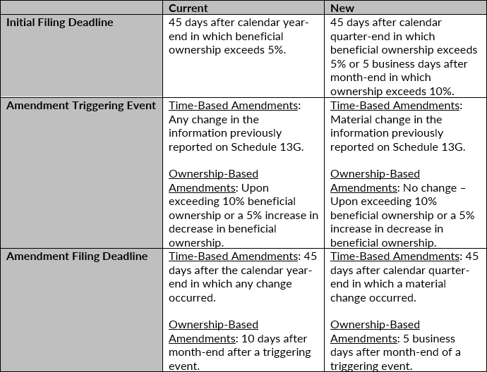

Transparency is a cornerstone of modern financial markets, providing essential insights that enable investors to make informed decisions. Among the various tools used to maintain this transparency are Schedule 13G filings with the U.S. Securities and Exchange Commission (SEC). These filings are particularly relevant for significant investors, as they disclose the acquisition of more than 5% of a company’s stock. Unlike Schedule 13D, which is required when an investor aims to influence company decisions, Schedule 13G is designed for those who remain passive. This article focuses on the role of Schedule 13G filings within investment reporting, shedding light on their importance and the implications for emerging trends such as algorithmic trading.

Algorithmic trading, a method that uses automated systems to make trading decisions, often relies on timely and accurate information to craft strategies. Schedule 13G filings offer valuable data about large movements in stock ownership, allowing traders to analyze potential impacts on market conditions. Understanding who is required to file Schedule 13G, along with the specific requirements and deadlines, is crucial for traders and investors alike. Recent regulatory changes have also added complexity to this subject, making it essential to stay informed.



As we explore the intricacies of Schedule 13G filings, this article will address the core requirements and examine how these disclosures impact market participants. Mastery of these details ensures compliance with SEC regulations, while also offering potential advantages in anticipating shifts in market dynamics.

## Table of Contents

## Understanding Schedule 13G

Schedule 13G is a streamlined disclosure form mandated by the U.S. Securities and Exchange Commission (SEC) for certain investors who own over 5% of a company’s equity securities. This filing serves as an alternative to the more comprehensive Schedule 13D, predominantly used by investors who do not seek to influence or control the issuing company. The primary utility of Schedule 13G lies in its reduced reporting burden, making it a preferred option for passive investors.

Unlike Schedule 13D, which requires detailed information about the investor’s intentions and plans for the issuer, Schedule 13G allows for a more concise declaration. Investors eligible to file Schedule 13G include those who meet specific criteria, chiefly centering around their passive investment stance and lack of intent to exert control over the company. In practice, this often involves investors such as mutual funds, certain trusts, and individuals or entities seeking to avoid taking an active role in the company’s operations.

To qualify for Schedule 13G instead of Schedule 13D, an investor must satisfy one of several conditions:

1. **Passive Investors**: These are investors who hold securities with no intention of acquiring control. Passive investors must ensure their total ownership does not exceed 20% of the company’s stock. If this threshold is crossed, they must switch to filing Schedule 13D.

2. **Qualified Institutional Investors (QIIs)**: Entities like banks, insurance companies, and broker-dealers that acquire securities in the ordinary course of business without the intent of participating in control arrangements. QIIs can use Schedule 13G provided they adhere to specific SEC regulations, usually encompassing routine acquisition activities rather than strategic control ambitions.

3. **Exempt Investors**: Entities or persons who acquired their securities prior to the company's registering under the Exchange Act can file Schedule 13G. These investors must still comply with reporting thresholds but benefit from the filing’s abbreviated structure due to their exempt status at acquisition.

In summary, Schedule 13G offers a more succinct reporting alternative for investors who view their stock holdings as passive financial assets rather than parts of a strategy to influence the company’s management or policies. Understanding the eligibility criteria and obligations associated with this filing is crucial for investors seeking compliance with SEC regulations while minimizing reporting complexity.

## Who Files Schedule 13G?

Schedule 13G filings are integral to maintaining transparency in financial markets, specifically concerning significant shareholdings. Three main categories of investors can file Schedule 13G: exempt investors, passive investors, and qualified institutional investors (QIIs).

Exempt investors are those who acquired their securities prior to the registration of the company under the Securities Exchange Act of 1934. This historical exemption facilitates compliance for investors with long-held positions that predate the company's Exchange Act registration.

Passive investors file Schedule 13G under the condition that they own less than 20% of a company’s securities and do not intend to affect control over the company. These investors typically include individuals or entities whose investment strategy does not involve seeking active influence over company management and operations. As a result, they qualify for the less demanding reporting requirements of Schedule 13G.

Qualified Institutional Investors, or QIIs, encompass institutions such as banks, brokers, insurance companies, and certain investment companies. These entities routinely acquire securities as part of their ordinary business activities. Unlike individual or smaller investors, QIIs often manage large portfolios and have collective holdings that cross the 5% reporting threshold. However, their routine nature of equity acquisition necessitates distinct consideration under SEC rules.

Schedule 13G provides a streamlined reporting process tailored for these investor types, thereby facilitating disclosures without imposing undue burdens on those not aiming to influence company control. Understanding the eligibility criteria for each investor category is crucial for compliance and ensuring the accuracy of public disclosures, which, in turn, promotes fair and transparent market practices.

## Key Deadlines and Requirements

The SEC mandates specific deadlines for Schedule 13G filings, imposing timely disclosure obligations for significant stock acquisitions. Institutional investors are required to submit Schedule 13G filings within 45 days of the calendar year-end if, on the last day of the year, they own more than 5% of a company’s shares. This requirement ensures that institutional ownership is reported in a manner aligned with annual reporting cycles, allowing the public to remain informed about significant institutional holdings.

For passive investors, the filing deadline is more immediate. If their acquisition results in ownership exceeding 5% of a company’s stock, they must file a Schedule 13G within 10 days of reaching this threshold. This swift deadline reflects the necessity for prompt reporting, given the potential market impact of substantial share acquisition by passive investors.

Recent amendments to filing requirements and deadlines are set to be effective from September 2024. These amendments are designed to enhance transparency and synchronize with the evolving landscape of financial markets. Keeping informed of these regulatory updates is essential for investors to ensure compliance and avoid penalties. The specifics of these amendments aim to provide both the SEC and the investing public with more timely access to information about significant changes in ownership stakes, thereby fostering a more transparent marketplace.

## Importance for Algorithmic Trading

Schedule 13G filings are instrumental for algorithmic traders seeking to refine their trading strategies by assessing the actions and intentions of substantial market participants. These filings provide detailed insights into the investment patterns of large investors who hold significant equity in publicly traded companies. When these substantial investors adjust their positions, either by increasing or decreasing their holdings, there can be notable impacts on the stock price and market perception. 

Algorithmic traders can integrate data from Schedule 13G filings into their predictive models to identify potential trends that could influence stock prices. For instance, an increase in a major investor's position might signal confidence in the company's prospects, potentially leading to a positive price movement. Conversely, a reduction in holdings might indicate anticipated downturns, serving as a precursor to declining stock prices. By incorporating such signals into their algorithms, traders can pre-emptively adjust their strategies, optimizing for anticipated market conditions.

Moreover, Schedule 13G provides essential information about the aggregate shareholding in terms of percentage ownership. This allows for the calculation of various metrics that can be used to gauge market influence and investor sentiment. Consider the formula for calculating the Herfindahl-Hirschman Index (HHI), a measure of market concentration:

$$
\text{HHI} = \sum_{i=1}^{n} s_i^2
$$

where $s_i$ represents the percentage shareholding of the ith investor. A higher HHI indicates more concentration and potentially higher volatility upon changes in investor behavior, informing algorithmic adjustments.

Additionally, algorithmic models can utilize [machine learning](/wiki/machine-learning) approaches to analyze historical Schedule 13G data, identifying patterns and potential outcomes based on historical investor behavior. Python libraries such as Pandas and NumPy can be instrumental in handling this time-series analysis, enabling traders to simulate various scenarios and optimize their trading positions.

Here is a simplified example in Python:

```python
import pandas as pd
import numpy as np

# Example data: Date, Investor, Holding Percentage 
data = {'Date': ['2023-01-01', '2023-03-01'], 'Investor': ['A', 'B'], 'Holding': [7.5, 10.2]}
df = pd.DataFrame(data)

# Calculate market influence metric
df['SquaredHolding'] = df['Holding'] ** 2
market_influence = df['SquaredHolding'].sum()

print(f"Market Influence Metric (HHI): {market_influence}")
```

By understanding the influence of major stockholders through filings like Schedule 13G, algorithmic traders can enhance their strategic frameworks. This allows them to dynamically react to the evolving market landscape, ultimately leading to more informed and potentially profitable trading decisions.

## Compliance and Penalties

Failure to file or improperly filing a Schedule 13G with the U.S. Securities and Exchange Commission (SEC) can lead to substantial penalties for investors. The SEC has established stringent regulations to ensure that disclosures are made timely and accurately, in order to maintain transparency in the financial markets. These regulations are critical for providing all market participants with access to important information about significant stakeholders in public companies.

Under the SEC rules, any investor who fails to comply with the Schedule 13G reporting requirements may face severe consequences. Violators are subject to enforcement actions which often result in hefty fines. In some instances, the penalties may also include legal action, depending on the severity of the non-compliance issue. Such actions serve as a deterrent against negligent or intentional oversight in reporting obligations.

To maintain compliance with Schedule 13G requirements, investors should focus on a few key practices. Firstly, it is essential to maintain accurate records of all securities transactions and holdings. This helps ensure that any significant change in ownership that crosses the 5% threshold is promptly acknowledged and reported. Using software tools designed for tracking investment portfolios can be beneficial in managing and updating records efficiently.

The filing deadlines must also be adhered to rigorously. Passive investors are required to file within 10 days of acquiring more than 5% of a company's securities, while institutional investors have a 45-day deadline post-year-end. Being conscious of these deadlines and preparing documentation in advance can prevent accidental late filings and potential penalties.

Moreover, it is advisable for investors to regularly review and understand the current regulations and amendments related to Schedule 13G filings. Regulatory updates, such as the amendments effective from September 2024, may alter filing deadlines and requirements. Staying informed of these changes enables investors to align their compliance strategies with evolving obligations, thus avoiding potential pitfalls.

Incorporating these practices into regular compliance routines not only promotes adherence to SEC regulations but also reinforces the integrity of the financial markets by ensuring that all investors have access to critical ownership information.

## Conclusion

Schedule 13G filings play a crucial role in enhancing market transparency and safeguarding investors' interests. These filings allow the Securities and Exchange Commission (SEC) to monitor significant ownership stakes in public companies, thus maintaining a fair and informed marketplace. Understanding the filing requirements is essential for large investors, particularly those engaged in automated trading, as it ensures compliance and promotes orderly financial markets.

For large investors, adherence to Schedule 13G requirements helps mitigate risks associated with non-compliance, such as financial penalties or reputational damage. It is important to note that entities involved in [algorithmic trading](/wiki/algorithmic-trading) must integrate data from these filings into their trading strategies. By doing so, they can adjust algorithms to better predict and respond to market dynamics impacted by large investors' activities.

Staying informed about regulatory changes is equally important. The SEC periodically updates filing requirements and deadlines to adapt to evolving market conditions. Investors must remain vigilant to avoid being caught off guard by new obligations that could impact their reporting processes or strategic decisions. By keeping up with these regulatory changes, investors can maintain compliance and continue to leverage the transparency afforded by Schedule 13G filings to make informed investment choices.

## References & Further Reading

[1]: Mac, C.A. (2013). [“Regulation of Financial Institutions."](https://papers.ssrn.com/sol3/papers.cfm?abstract_id=2225950) Foundation Press.

[2]: U.S. Securities and Exchange Commission. ["Schedule 13G."](https://www.sec.gov/Archives/edgar/data/201772/000119312504060255/dsc13g.htm) 

[3]: Lopez de Prado, M. (2018). ["Advances in Financial Machine Learning."](https://www.amazon.com/Advances-Financial-Machine-Learning-Marcos/dp/1119482089) Wiley.

[4]: Aronson, D. R. (2006). ["Evidence-Based Technical Analysis: Applying the Scientific Method and Statistical Inference to Trading Signals."](https://www.amazon.com/Evidence-Based-Technical-Analysis-Scientific-Statistical/dp/0470008741) Wiley.

[5]: Jansen, S. (2020). ["Machine Learning for Algorithmic Trading."](https://github.com/stefan-jansen/machine-learning-for-trading) Packt Publishing.

[6]: Chan, E. P. (2009). ["Quantitative Trading: How to Build Your Own Algorithmic Trading Business."](https://github.com/ftvision/quant_trading_echan_book) Wiley.