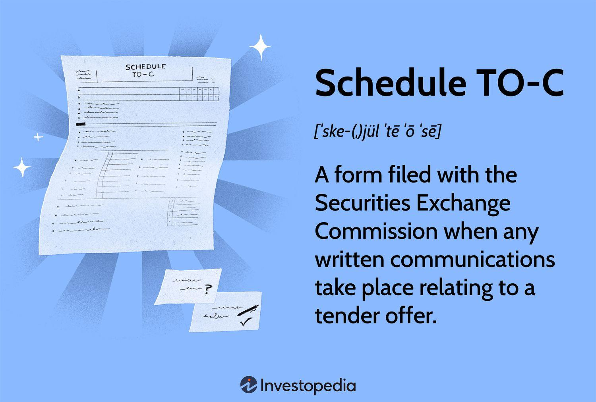

The financial markets represent a sophisticated ecosystem where the convergence of regulatory compliance and advanced technology significantly influences trading activities. One significant component of regulatory compliance in this domain is the Schedule TO-C filing with the Securities and Exchange Commission (SEC). This filing becomes imperative when written communications related to a tender offer are made, thereby offering a structured approach to transparency and investor protection.

This article aims to clarify the nuances of Schedule TO-C, highlighting its relevance within the context of tender offers. Tender offers, characterized by propositions to purchase shareholders' stakes typically at a premium, serve as mechanisms for companies to acquire substantial or complete control over another corporation. By ensuring all related communications are properly recorded, Schedule TO-C filings reinforce market integrity.



Furthermore, the role of algorithmic trading in tender offers represents a compelling intersection of regulatory frameworks and technological innovation. Algorithmic trading harnesses sophisticated algorithms to execute trades with precision and at speeds beyond human capabilities. These algorithms are increasingly being employed to detect price discrepancies and exploit arbitrage opportunities during tender offers—highlighting the transformative impact of technology in financial markets.

Understanding these mechanisms allows investors and companies to navigate the regulatory landscape more effectively, optimizing their trading strategies along the way. As this article will explore, the integration of algorithmic trading strategies within the bounds of regulatory requirements sets the stage for a dynamic interaction among market participants, offering pathways to refined risk management and enhanced trading outcomes. Through this lens, the ongoing evolution of financial markets continues to be shaped by the synthesis of compliance mandates and technological capabilities.

## Table of Contents

## Understanding Schedule TO-C

Schedule TO-C is a disclosure requirement mandated by the Securities and Exchange Commission (SEC) when written communications are made in the context of a tender offer. A tender offer is a public proposal to purchase a certain number of shares from shareholders of a corporation, typically at a price above the current market value, to incentivize them to sell. The objective is often to acquire a controlling interest in the company. The filing of Schedule TO-C serves to ensure transparency and compliance for these public takeover attempts.

The core function of Schedule TO-C is to document any communication regarding tender offers, which helps protect investors while maintaining the integrity of the financial markets. By formally recording these offers with the SEC, the schedule provides a clear and standardized framework that governs how such offers are communicated, thereby reducing the risk of misinformation or incomplete disclosures.

The submission of Schedule TO-C is mandatory whenever written communications about a tender offer are disseminated. This ensures that all material information is accessible to investors and the public, thereby facilitating informed decision-making. The regulatory requirement aims to provide a balanced view of both the proposal and the acquiring party's intentions, offering a comprehensive picture that assists stakeholders in assessing the offer's implications. Consequently, Schedule TO-C is an essential aspect of securities regulation, ensuring that tender offers are conducted transparently and fairly.

## The Role of Tender Offers in the Market

Tender offers are a pivotal tool for companies seeking to acquire a substantial stake or achieve complete control over another entity. These offers are designed as public propositions whereby the acquiring company proposes to purchase shares, often at a premium over the prevailing market price, to persuade existing shareholders to sell their holdings. The premium acts as an incentive, providing shareholders with an immediate and superior return compared to the current market valuation.

The public nature of tender offers subjects them to extensive regulatory scrutiny while simultaneously becoming a core element of sophisticated trading strategies. The Securities and Exchange Commission (SEC) evaluates these offers to ensure compliance with the regulations that protect investors and maintain market integrity. This regulatory oversight helps to eliminate fraudulent practices and ensures transparent communication of offer conditions.

The execution of acquisitions through tender offers can significantly influence stock prices and thus requires meticulous planning and strategic execution. Companies planning a tender offer must consider timing, valuation, and target company response, among other factors. The announcement of a tender offer typically results in increased stock price [volatility](/wiki/volatility-trading-strategies) as investors speculate on the outcome and potential changes in the target company's valuation post-acquisition.

In response to the inherent stock price movements associated with tender offers, a range of market activities is triggered. Among these activities, [algorithmic trading](/wiki/algorithmic-trading) strategies play an increasingly prominent role. These strategies leverage advanced algorithms to identify and exploit [arbitrage](/wiki/arbitrage) opportunities that arise from the price discrepancies created by the tender offer announcement. For instance, an algorithm could be designed to execute trades based on price movements exceeding a certain threshold, capturing gains from short-term volatility.

Algorithmic trading's capacity to analyze vast datasets at high speed enhances market [liquidity](/wiki/liquidity-risk-premium) and efficiency, although it also introduces complexities requiring thorough understanding and management. Investors employing these strategies must account for market conditions, transaction costs, and the regulatory landscape to optimize returns while minimizing risks.

Overall, tender offers are a crucial mechanism for corporate acquisitions, shaping stock prices and influencing trading activities. The interplay between regulatory compliance and strategic trading underscores the multifaceted nature of financial markets, where precision and strategic foresight can significantly impact outcomes.

## Regulatory Compliance in Tender Offers

Compliance with SEC regulations is a fundamental requirement during a tender offer, serving as a safeguard against fraudulent activities and ensuring fair market practices. Tender offers, due to their nature, require precise adherence to regulatory frameworks to protect investors and maintain market integrity.

One of the key regulatory requirements includes the filing of Schedule TO-C, which documents communications related to tender offers. However, this is not the only necessary filing. Other regulatory forms, such as Schedule TO-I and Schedule TO-T, may also be required, depending on the specifics of the tender offer. Schedule TO-I is typically filed by the issuing company, encompassing all issuer information relevant to the offer. Schedule TO-T, on the other hand, pertains to third-party tender offers and encompasses more detailed transactional data and potential conflicts of interest.

These forms together ensure that all stakeholders, including investors and regulatory bodies, have access to accurate and timely information about the conditions of the tender offer. This transparency is vital for decision-making and diminishes the likelihood of deceptive practices.

The Sarbanes-Oxley Act is another critical component in securing investor protection during tender offers. Enacted in response to financial scandals, this act fortifies corporate governance and enhances financial disclosures, thus adding another layer of transparency. By mandating thorough internal controls and auditing, Sarbanes-Oxley ensures that the financial representations and conditions outlined in tender offers are not only accurate but also reliable.

Fulfilling these regulatory requirements is not trivial. Companies must possess a comprehensive understanding of the regulations and ensure meticulous documentation throughout the offer process. Failure to comply can result in significant penalties, making it imperative for companies to establish robust compliance mechanisms. Such mechanisms often involve deploying specialized personnel and advanced infrastructure to monitor SEC requirements continually.

In conclusion, the navigation of regulatory compliance in tender offers is a meticulous process that is essential for maintaining market integrity and protecting investor interests. As financial markets evolve, the importance of such compliance continues to grow, necessitating diligence and thoroughness from all parties involved.

## Algorithmic Trading and Tender Offers

Algorithmic trading, an advanced method utilizing computer programs to execute trades at high speeds and volumes, has become integral in financial markets, especially during tender offers. These algorithms are designed to interpret various market signals and respond promptly, maximizing efficiency and profitability in trade execution. 

One of the prominent advantages of algorithmic trading during tender offers is its ability to identify arbitrage opportunities. Arbitrage exploits the price discrepancies between the tender offer price and the current market price of the stock. Algorithms can swiftly detect these differences and execute trades to capitalize on the profit margin. For instance, when a tender offer sets a purchase price higher than the market price, algorithms can initiate buying existing stocks and selling them at the offer price, thereby securing a profit without significant risk.

Moreover, the integration of [artificial intelligence](/wiki/ai-artificial-intelligence) and [machine learning](/wiki/machine-learning) has significantly enhanced algorithmic trading. These technologies empower algorithms to handle complex and large sets of market data, learning from historical trends to predict future price movements. Machine learning models can be trained to refine their responses to market patterns, continuously improving their decision-making processes. For example, they can use [reinforcement learning](/wiki/reinforcement-learning) to adjust strategies based on the outcomes of previous trades, honing precision in volatile market conditions.

Despite their efficacy, employing algorithms in trading during tender offers necessitates sophisticated strategic planning and a comprehensive understanding of market dynamics. The algorithms need to be meticulously programmed to anticipate and react to sudden market shifts, ensuring that trade executions are optimal and in line with the desired outcomes. It is essential to develop robust algorithms that can adapt to varying market conditions and maintain performance without significant degradation.

In summary, while algorithmic trading presents a formidable advantage during tender offers, the intrinsic complexities demand a well-crafted approach. A thorough examination of both market signals and technological capabilities is crucial to harness the full potential of this trading strategy. This systematic approach ensures not only improved trade execution but also maintains a competitive edge in the fast-evolving landscape of financial markets.

## Challenges and Considerations

Algorithmic trading and regulatory compliance in tender offers, while advantageous, come with a set of inherent challenges. One primary concern lies in the necessity for continuous monitoring and adjustment of trading algorithms to ensure they respond aptly to real-time market data. Market conditions are fluid, and algorithms must be capable of dynamic adaptation to maintain efficiency and capitalize on trading opportunities. For instance, a sudden shift in stock prices during a tender offer could necessitate immediate recalibration of algorithmic parameters to optimize trade execution.

Moreover, adherence to SEC regulations is paramount. The complexity and strictness of these requirements mean that non-compliance can lead to significant penalties and reputational damage. This situation underscores the importance of having a sophisticated compliance infrastructure and dedicated compliance personnel. The role of robust technology infrastructure cannot be overstated; systems must be able to handle large volumes of data and complex calculations swiftly and accurately to prevent execution errors.

Volatility in the market presents another layer of complexity. Fluctuating prices can lead to algorithmic errors if not properly accounted for within the trading strategy. Missteps in programming or misinterpretations of regulatory guidelines can have dire financial consequences, emphasizing the need for precision and expertise. An example using Python could illustrate how real-time data feeds are integrated into an algorithmic trading strategy:

```python
import numpy as np

# Simulate a simple trading signal based on moving averages
def trading_signal(prices, short_window, long_window):
    signals = np.zeros(len(prices))
    short_mavg = np.convolve(prices, np.ones(short_window)/short_window, 'valid')
    long_mavg = np.convolve(prices, np.ones(long_window)/long_window, 'valid')
    signal = 1 if short_mavg[-1] > long_mavg[-1] else 0
    signals[(long_window - 1):] = signal
    return signals

# Example usage with simulated price data
prices = np.random.normal(loc=100, scale=10, size=100)  # Simulated price data
signals = trading_signal(prices, short_window=5, long_window=20)
```

This code snippet outlines a basic trading strategy based on moving averages—a common technique in algorithmic trading—but underscores the need for rigorous testing and calibration in a simulated environment before deployment in live markets.

Furthermore, the interpretation of regulations can vary, leading to potential discrepancies in compliance practices. The combination of these factors necessitates not only advanced technical skills but also a thorough understanding of the regulatory environment. Success in algorithmic trading during tender offers hinges on balancing technical innovation with regulatory diligence and strategic oversight.

## Conclusion

Schedule TO-C filings, though mandated by regulatory authorities, are fundamental in ensuring transparency and accountability during tender offers. By maintaining a comprehensive record of communications related to a tender, these filings protect investor interests and uphold market integrity. The combination of this regulatory framework with algorithmic trading strategies offers significant opportunities for optimizing market participation. These strategies enable traders to execute transactions with precision, exploiting brief market inefficiencies and responding swiftly to changing conditions.

For investors and companies, navigating both regulatory and technological landscapes is crucial. Staying compliant with SEC regulations is not optional; it is a cornerstone of maintaining trust and legality in financial operations. Concurrently, leveraging cutting-edge trading technologies, such as algorithmic and AI-driven models, can significantly enhance trading performance. These models process large volumes of data and swiftly execute trades, thus maximizing the opportunities that arise from market movements prompted by tender offers.

A deep understanding of regulatory requirements and technological advancements fosters more robust risk management practices. By anticipating potential pitfalls and tuning strategies accordingly, stakeholders can make more informed investment decisions. This dual awareness helps mitigate risks associated with market volatility, algorithm errors, and non-compliance penalties, ensuring a favorable trading outcome.

As financial markets continue to evolve, the integration of regulatory compliance and sophisticated trading strategies will increasingly influence securities trading. Companies and investors who adeptly harness these elements will likely lead in the competitive financial landscape, paving the way for innovative trading practices and sustained growth.

## References & Further Reading

[1]: ["Algorithmic Trading: Winning Strategies and Their Rationale"](https://books.google.com/books/about/Algorithmic_Trading.html?id=WAlFDwAAQBAJ) by Ernest P. Chan

[2]: DeMiguel, V., Garlappi, L., & Uppal, R. (2007). ["Optimal Versus Naive Diversification: How Inefficient is the 1/N Portfolio Strategy?"](https://www.semanticscholar.org/paper/Optimal-Versus-Naive-Diversification%3A-How-is-the-1-DeMiguel-Garlappi/896a1592b60fa7c8d57031c50c434dcbd4e38fd1) Management Science, 55(5).

[3]: Hasbrouck, J., & Saar, G. (2013). ["Low-Latency Trading."](https://www.sciencedirect.com/science/article/abs/pii/S1386418113000165) The Journal of Financial Markets.

[4]: Securities and Exchange Commission. ["Schedule TO."](https://www.law.cornell.edu/cfr/text/17/240.14d-100) 

[5]: Bühler, H., Horvath, B., & Teichmann, J. (2019). ["Deep Hedging."](https://arxiv.org/abs/1802.03042) Quantitative Finance.