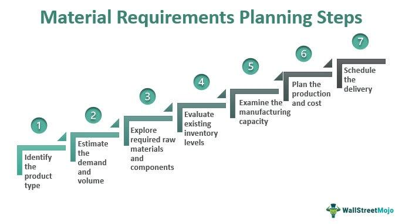

Algorithmic trading, also known as automated trading, is the practice of using computer programs to execute trading orders at exceptional speeds based on pre-defined criteria. This technological advancement has revolutionized the trading industry, enabling traders to perform thousands of trades in nanoseconds, thus maximizing efficiency and precision. Traditional trading, reliant on human decision-making, cannot match the speed and accuracy offered by algorithmic trading systems, which are engineered to react instantaneously to market changes.

This article explores the essential requirements and schedules necessary for setting up successful algorithmic trading systems. It aims to provide a comprehensive overview, starting from the initial stages of requirement gathering to the implementation of practical examples. Investors and traders will gain insights into the complete process necessary to understand and harness the power of algorithmic trading systems.



The rise of algorithmic trading has underscored the importance of adopting a structured approach to mitigate inherent risks. As traders increasingly rely on algorithms to handle large volumes of trades, adherence to a carefully planned system becomes critical. This involves not only the development and implementation of sophisticated algorithms but also ensuring regulatory compliance, robust testing, and effective risk management strategies. By following these structured methodologies, traders can exploit market opportunities while safeguarding against potential losses, ultimately contributing to a stable and efficient trading environment.

## Table of Contents

## Understanding Algorithmic Trading

Algorithmic trading utilizes sophisticated algorithms to make trading decisions that are aimed at maximizing financial returns. These algorithms, often implemented through computer programs, autonomously manage key elements such as speed, volume, and timing of trades. Speed is critical in algorithmic trading as financial markets are highly competitive environments where milliseconds can make a difference. Algorithms execute trades at much faster rates than human traders, allowing the capture of fleeting market opportunities and reducing latency in trade execution.

Volume pertains to the quantity of assets being traded. Algorithmic systems can determine optimal trade volumes to capitalize on large and small market shifts, ensuring that trading strategies align with liquidity constraints and market impact considerations. Timing is equally crucial, with algorithms able to strategically schedule trades to execute when market conditions are most favorable, thus enhancing execution efficiency and reducing costs.

One key advantage of algorithmic trading is the minimization of human error. Automation reduces the risk of mistakes that can arise from manual trading, such as emotional decision-making or execution errors. This leads to greater precision in executing trade strategies and ensures that rules and parameters defined within the algorithm are strictly adhered to, resulting in consistent trading behavior.

The design of these algorithms is driven by historical data and prevailing market conditions. Algorithms require access to vast amounts of historical price data, which they use to identify patterns, trends, and statistical relationships that inform trading decisions. For example, a simple moving average crossover strategy might look for instances where a short-term moving average crosses above a long-term moving average to signal a buy opportunity. This can be implemented in Python as follows:

```python
import pandas as pd

def moving_average_strategy(data, short_window, long_window):
    signals = pd.DataFrame(index=data.index)
    signals['price'] = data['price']
    signals['short_avg'] = data['price'].rolling(window=short_window, min_periods=1, center=False).mean()
    signals['long_avg'] = data['price'].rolling(window=long_window, min_periods=1, center=False).mean()

    # Generate signals
    signals['signal'] = 0.0
    signals['signal'][short_window:] = np.where(signals['short_avg'][short_window:] > signals['long_avg'][short_window:], 1.0, 0.0)   
    signals['positions'] = signals['signal'].diff()

    return signals
```

This example shows how one might use past price data in a simple decision-making algorithm, although real-world applications would involve more complex models and multiple data inputs.

The success of [algorithmic trading](/wiki/algorithmic-trading) fundamentally relies on how well the algorithms are designed to interpret historical data and adapt to changing market environments. By emerging with advancements in technology, algorithmic trading enables increased market efficiency, [liquidity](/wiki/liquidity-risk-premium) provision, and reduced transaction costs, yet requires rigorous design and testing to navigate financial markets effectively.

## Regulatory Requirements

Understanding the regulatory landscape is imperative for algorithmic trading to ensure compliance and safeguard market integrity. Key regulatory bodies such as the Commodity Futures Trading Commission (CFTC) and the Securities and Exchange Commission (SEC) oversee these activities in the United States, providing comprehensive guidelines to manage the complexities involved.

The CFTC proposed Regulation Automated Trading (Reg AT) as a framework to enhance the transparency and security of algorithmic trading in futures markets. Reg AT emphasizes the need for proper registration of algorithmic traders, necessitating that any trader using such systems in designated contract markets (DCMs) register as a Registered Commodity Trading Advisor ([CTA](/wiki/cta-strategy)). This registration process is aimed at identifying algorithmic traders and ensuring they adhere to regulatory requirements.

Complementary to CFTC's initiatives, the SEC has established the Market Access Rule (Rule 15c3-5) which enforces rigorous risk management controls and supervisory procedures. This rule mandates broker-dealers offering market access to have robust systems in place to prevent erroneous orders, unauthorized trading, and system errors that might lead to market disruptions. Specific measures include real-time monitoring and controls to manage exposure during trading hours.

Compliance with these regulations involves multiple components:

1. **Registration**: Algorithmic traders must be properly registered with regulatory bodies to operate legally. This ensures a monitored trading environment where all participants are accountable.

2. **Reporting**: Regular reporting of trades and strategies to the concerned regulatory authorities is required. This transparency helps in tracking trading activities and identifying any patterns that might suggest malpractice or risks to market stability.

3. **Risk Management Controls**: Firms must implement pre-trade and post-trade risk management systems, focusing on order and trade monitoring, market access controls, and real-time surveillance. These systems are crucial to averting fraudulent activities and maintaining orderly markets.

4. **Post-Trade Surveillance**: Post-trade analysis is required to detect and mitigate any adverse effects that may have arisen from trading activities. This includes the examination of trade execution quality and adherence to trading strategies.

Compliance with these regulations is not merely a legal obligation but a strategy to support market stability and protect against systemic risks. Effective regulatory oversight promotes a stable market environment, enhancing participant confidence and contributing to the overall health of the financial markets.

## Key Components of a Trading Algorithm

Pre-programmed instructions are foundational to any trading algorithm, consisting of several key components that dictate its functionality. Central to these instructions are the definitions of entry and [exit](/wiki/exit-strategy) points, which determine when a trade should be initiated or closed. These points are typically based on technical indicators, price movements, or other quantitative criteria. Risk management strategies are also embedded within these instructions to mitigate potential losses. These strategies can include stop-loss orders, which automatically sell assets if their price falls to a certain level, and take-profit orders, which secure profits when a pre-set target price is reached. Additionally, trade sizing or position sizing is crucial to control the amount of capital allocated to each trade, based on the trader's overall risk tolerance and account balance.

Programming languages play a pivotal role in the development of trading algorithms. Python is widely used due to its simplicity, extensive libraries, and community support, which facilitate the implementation of complex algorithms. Here's a basic example of a simple moving average crossover strategy using Python:

```python
import pandas as pd

# Sample data: Replace with actual market data
data = pd.DataFrame({
    'price': [10, 11, 12, 13, 12, 14, 13, 15, 16, 17],
})

# Calculate moving averages
data['short_ma'] = data['price'].rolling(window=3).mean()
data['long_ma'] = data['price'].rolling(window=5).mean()

# Determine entry and exit points
data['signals'] = 0
data['signals'][data['short_ma'] > data['long_ma']] = 1
data['signals'][data['short_ma'] < data['long_ma']] = -1

print(data)
```

C++ is another language that is favored for its execution speed and memory efficiency, making it suitable for high-frequency trading applications. JavaScript, often used in web-based applications, can also be employed to develop trading bots, particularly for cryptocurrencies on platforms like Node.js.

Access to reliable market data is critical for the success of algorithmic trading. Traders use this data to analyze past trends and predict future movements, which forms the basis for the algorithm's decision-making process. Platforms like Bloomberg and Reuters provide extensive market data services. Execution platforms, which facilitate the actual buying and selling of assets, are equally important. Popular trading platforms, such as MetaTrader or [Interactive Brokers](/wiki/interactive-brokers-api), offer robust APIs allowing seamless integration with custom algorithms.

For effective [backtesting](/wiki/backtesting), historical records must be both comprehensive and accurate. Backtesting involves applying a trading algorithm to historical data to evaluate its potential profitability and effectiveness before actual deployment. This process helps in identifying flaws in the strategy and in optimizing its parameters to suit current market dynamics.

In summary, trading algorithms rely on meticulously crafted pre-programmed instructions executed via advanced programming languages. They require comprehensive market data, execution platforms, and historical records for effective backtesting, ensuring the algorithm functions optimally. These components collectively contribute to a successful trading algorithm by enabling precise market analysis and efficient trade execution.

## Testing and Optimization

Backtesting is a vital component in algorithmic trading, as it allows traders to evaluate how their strategies would have performed using historical data. This process can be seen as a simulation, where the algorithm's performance is analyzed against past market conditions to determine its viability, effectiveness, and profitability. The goal is to identify any strengths and weaknesses before deploying the strategy in a live trading scenario. During backtesting, considerations such as slippage, transaction costs, and market impact should be accounted for to ensure realistic results. 

A typical backtesting workflow begins with the acquisition and preparation of high-quality historical data. Traders often utilize platforms like Python with libraries such as Pandas and NumPy to handle and manipulate large datasets. An example of a simple backtesting script using Python could look like this:

```python
import pandas as pd

# Load historical data
data = pd.read_csv('historical_data.csv')

# Define trading strategy: e.g. simple moving average crossover
data['SMA_50'] = data['Close'].rolling(window=50).mean()
data['SMA_200'] = data['Close'].rolling(window=200).mean()

# Generate trading signals
data['Signal'] = 0
data.loc[data['SMA_50'] > data['SMA_200'], 'Signal'] = 1
data.loc[data['SMA_50'] < data['SMA_200'], 'Signal'] = -1

# Calculate returns based on signals
data['Returns'] = data['Close'].pct_change()
data['Strategy_Returns'] = data['Signal'].shift(1) * data['Returns']

# Output the strategy performance
cumulative_returns = (1 + data['Strategy_Returns'].dropna()).prod() - 1
print(f'Cumulative Strategy Returns: {cumulative_returns:.2%}')
```

Paper trading, also known as virtual trading, represents another crucial stage in testing algorithmic strategies. By simulating trades in real-time market conditions without the risk of financial loss, traders can further validate their strategies' effectiveness. This method bridges the gap between backtesting and live trading, allowing for adjustments based on contemporary market dynamics without exposing capital to risk.

Optimization is the subsequent step, where the goal is to refine the algorithm to better respond to current and predicted market environments. This process involves tweaking various parameters of the strategy to enhance performance. However, caution must be exercised to avoid overfitting, a scenario where the algorithm performs exceptionally well on historical data but poorly in live trading. Balancing between optimization and robustness is key, as overfitted models often lack the flexibility required to adapt to new market conditions.

Optimization can be approached systematically using techniques such as grid search or [machine learning](/wiki/machine-learning) tools that automate the tuning process based on predefined performance criteria. By iterating through different parameter combinations and assessing their outcomes, traders strive to identify the most effective configuration. 

Implementing a robust testing and optimization framework, investors are equipped to create strategies that are not only profitable theoretically but also resilient in the ever-changing financial landscape.

## Risk Management in Algo Trading

Effective risk management is a critical component of successful algorithmic trading strategies. Algorithmic trading, by design, executes trades with speed and precision, but it also introduces specific risks that need to be managed meticulously. Here, we explore key strategies and considerations for mitigating these risks.

Traders often establish risk limits to control the exposure of their trading activities. Risk limits can be defined in terms of maximum drawdown, position size, or total capital allocation. For example, a common strategy is to restrict the drawdown to a predetermined percentage of the trading account, such as 2%. This can be implemented programmatically in Python as follows:

```python
def check_drawdown_limit(current_balance, max_drawdown_percent):
    max_drawdown = initial_balance * (max_drawdown_percent / 100)
    if current_balance < initial_balance - max_drawdown:
        return False  # Stop trading to prevent further losses
    return True
```

Diversification of strategies is another essential risk management tactic. By deploying multiple trading algorithms that respond to different market conditions, traders can reduce reliance on a single strategy's performance. This approach helps cushion against the adverse impacts of market fluctuations that might negatively affect specific strategies.

Cautious leverage application is critical in reducing the risk of significant losses. While leverage can amplify gains, it can also magnify losses. Understandably, algorithmic traders often opt for modest leverage ratios to balance potential profits against the risks of financial exposure.

Regular performance tracking and system updates are also vital to adapting to the ever-changing market environment. This involves continuously monitoring the effectiveness of trading algorithms, evaluating their performance metrics, and making necessary adjustments. One way this can be achieved is by implementing real-time analytics to assess performance metrics such as Sharpe ratio, alpha, and beta. Monitoring these metrics helps in identifying strategies that are underperforming and require optimization or deactivation.

For instance, calculating the Sharpe ratio, a key performance indicator that measures risk-adjusted returns, can guide traders in evaluating their strategies:

$$
\text{Sharpe Ratio} = \frac{E[R_p - R_f]}{\sigma_p}
$$

Where:
- $E[R_p]$ is the expected portfolio return,
- $R_f$ is the risk-free rate,
- $\sigma_p$ is the standard deviation of the portfolio’s excess return.

Ultimately, a robust risk management framework in algorithmic trading involves setting clear risk limits, diversifying strategies, using leverage judiciously, and maintaining ongoing performance evaluations. By implementing such measures, traders can better mitigate losses and enhance the durability of their trading operations in varying market climates.

## Real-World Examples of Algorithmic Trading

Trend-following strategies are an integral part of algorithmic trading, capitalizing on the [momentum](/wiki/momentum) of asset prices to generate returns. These strategies analyze historical data to determine the likelihood of price trends continuing, employing algorithms to execute trades that either follow or counter the current trend. A typical example involves the use of moving averages, where a short-term average crossing above a long-term average signals a buy order, and vice versa for a sell order. This method is appealing due to its simplicity and effectiveness across various market conditions. However, it is most successful in trending markets and can suffer during sideways or choppy market conditions.

Mean reversion strategies, contrasted with trend-following approaches, operate under the premise that asset prices will revert to their historical averages over time. These strategies often identify overbought or oversold conditions using indicators like the Relative Strength Index (RSI) or Bollinger Bands. When an asset strays too far from its historical average, mean reversion strategies trigger trades that anticipate its return to the mean. While effective in range-bound markets, these strategies [carry](/wiki/carry-trading) the risk of significant losses if prices defy historical patterns and establish a new trend.

Model-based strategies expand beyond linear price analysis, incorporating complex mathematical models to identify mispriced assets or market inefficiencies. Delta-neutral trading, for instance, focuses on achieving a portfolio position where the overall delta, a measure of sensitivity to price changes, is zero. This approach often uses options to hedge against price movements, allowing traders to profit from factors like time decay or [volatility](/wiki/volatility-trading-strategies) changes rather than directional price changes. Arbitrage opportunities present another model-based strategy, where algorithms exploit price discrepancies across different markets or instruments. These discrepancies, often fleeting, require rapid execution and precise calculations to secure profit without incurring excessive risk.

Case studies reveal both the potential and pitfalls of algorithmic trading implementations. A notable example is Renaissance Technologies, whose Medallion Fund employs proprietary algorithms to deliver exceptional returns over the years, driven by trend-following and statistical [arbitrage](/wiki/arbitrage) strategies. Their success underscores the importance of robust data analysis, market understanding, and continual adaptation of algorithms to evolving market conditions.

Conversely, the "Quant Quake" of August 2007 highlights the vulnerabilities in algorithmic strategies. During this period, many quantitative funds experienced significant losses due to their similar approach to market data, causing simultaneous unwinding of positions and amplifying market volatility. This case emphasizes the necessity for diversification in strategies and the incorporation of risk management controls to mitigate systemic risks.

In summary, understanding and effectively implementing real-world algorithmic trading strategies requires not only technical acumen but also a deep understanding of market dynamics and potential risks. As the trading landscape continues to evolve, successful traders consistently refine their strategies to harness technological advancements and adapt to changing market conditions.

## Conclusion

Algorithmic trading stands at the forefront of financial market evolution, offering unparalleled opportunities for efficiency and profitability. Nevertheless, the path to success in this domain mandates meticulous planning and robust risk management. Algorithmic trading systems must be crafted with an acute awareness of the regulatory requirements that govern financial markets, involving critical adherence to guidelines set forth by bodies such as the Commodity Futures Trading Commission (CFTC) and the Securities and Exchange Commission (SEC). By ensuring comprehensive compliance, traders can safeguard their operations against potential legal pitfalls and contribute to overall market stability.

In addition to regulatory considerations, the testing and optimization of algorithms form the backbone of a sound trading strategy. Rigorous backtesting on historical data enables traders to evaluate the viability of their strategies under past market conditions, while paper trading facilitates the refinement of these strategies in a risk-free environment. The optimization process is indispensable, allowing traders to fine-tune their algorithms for responsiveness to current and anticipated market dynamics.

Crucially, algorithmic trading is not static; it necessitates a commitment to continuous learning and adaptation. As market conditions evolve and technologies advance, traders must stay informed about the latest developments and emerging trends. This ongoing education is vital for maintaining competitiveness and achieving long-term success. Adaptive algorithms that can adjust to shifting market landscapes will be better positioned to exploit new opportunities and mitigate potential risks.

In conclusion, while algorithmic trading systems proffer vast potential, realizing their benefits requires a holistic approach encompassing regulatory compliance, strategic testing, and dynamic optimization. By fostering an environment of continuous improvement and proactive adaptation, algorithmic traders can harness the full potential of automated systems to achieve sustainable profitability.

## References & Further Reading

[1]: Bergstra, J., Bardenet, R., Bengio, Y., & Kégl, B. (2011). ["Algorithms for Hyper-Parameter Optimization."](https://dl.acm.org/doi/10.5555/2986459.2986743) Advances in Neural Information Processing Systems 24.

[2]: ["Advances in Financial Machine Learning"](https://www.amazon.com/Advances-Financial-Machine-Learning-Marcos/dp/1119482089) by Marcos Lopez de Prado

[3]: ["Evidence-Based Technical Analysis: Applying the Scientific Method and Statistical Inference to Trading Signals"](https://www.amazon.com/Evidence-Based-Technical-Analysis-Scientific-Statistical/dp/0470008741) by David Aronson

[4]: ["Machine Learning for Algorithmic Trading"](https://github.com/stefan-jansen/machine-learning-for-trading) by Stefan Jansen

[5]: ["Quantitative Trading: How to Build Your Own Algorithmic Trading Business"](https://www.amazon.com/Quantitative-Trading-Build-Algorithmic-Business/dp/1119800064) by Ernest P. Chan