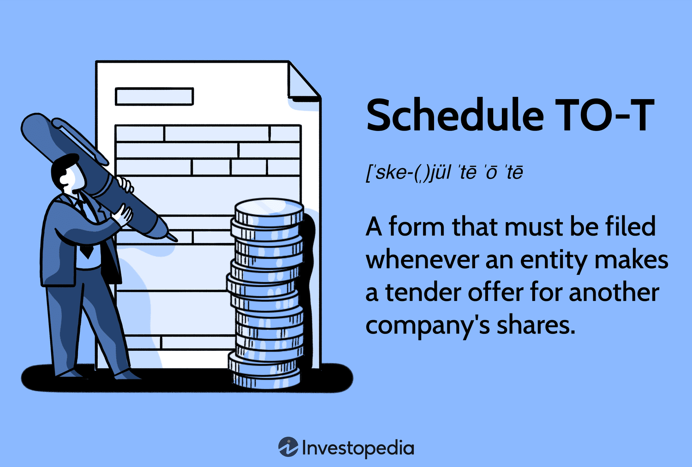

## Table of Contents

## What is Schedule TO-T?

Schedule TO-T is a form that companies must file with the U.S. Securities and Exchange Commission (SEC) when they want to buy back their own shares from the public. This process is called a tender offer, and the form helps the SEC make sure that the company is following the rules and treating shareholders fairly. The form includes important details like how many shares the company wants to buy, the price they are willing to pay, and the dates when shareholders can sell their shares back to the company.

Filing Schedule TO-T is important because it helps keep the stock market fair and transparent. When a company decides to buy back its shares, it can affect the stock price and the value of shareholders' investments. By requiring companies to file this form, the SEC can review the details of the tender offer and make sure that the company is not doing anything that could harm investors. This helps maintain trust in the market and protects shareholders' rights.

## Who needs to file a Schedule TO-T?

A company needs to file a Schedule TO-T with the SEC if it wants to buy back its own shares from the public. This is called a tender offer. The company has to let the SEC know how many shares it wants to buy, how much it will pay for them, and when shareholders can sell their shares back.

Filing the Schedule TO-T is important because it helps the SEC make sure the company is following the rules. This protects shareholders and keeps the stock market fair. When a company buys back its shares, it can change the stock price and affect investors. The SEC reviews the details in the Schedule TO-T to make sure everything is done correctly and fairly.

## What is the purpose of Schedule TO-T?

Schedule TO-T is a form that a company has to fill out and send to the SEC when it wants to buy back its own shares from the public. This is called a tender offer. The form tells the SEC important things like how many shares the company wants to buy, how much it will pay for them, and when shareholders can sell their shares back.

The main reason for Schedule TO-T is to make sure the company follows the rules when it buys back its shares. This helps keep the stock market fair and protects people who own the company's stock. When a company buys back shares, it can change the stock price and affect investors. The SEC looks at the Schedule TO-T to make sure everything is done the right way and that shareholders are treated fairly.

## How does Schedule TO-T differ from other SEC schedules?

Schedule TO-T is different from other SEC schedules because it is specifically used when a company wants to buy back its own shares through a tender offer. Other schedules, like Schedule 13D or Schedule 14A, serve different purposes. For example, Schedule 13D is filed when someone acquires more than 5% of a company's stock, and Schedule 14A is used for proxy statements during shareholder meetings. Schedule TO-T focuses on the details of the tender offer, such as the number of shares to be bought, the price, and the timeline, which are unique to this type of transaction.

The main goal of Schedule TO-T is to ensure that the company follows the rules when buying back its shares, which helps protect shareholders and maintain fairness in the market. Other schedules, like Schedule 13G, are simpler and used for passive investors who own more than 5% of a company's stock but do not plan to influence the company's management. Schedule TO-T, on the other hand, requires detailed information about the tender offer to allow the SEC to review and ensure the process is conducted transparently and fairly, which is crucial for protecting investor interests and maintaining trust in the market.

## What are the key components of a Schedule TO-T?

Schedule TO-T is a form that companies need to fill out when they want to buy back their own shares from the public. It has several important parts that help the SEC make sure everything is done correctly. The form includes information about how many shares the company wants to buy back, the price it will pay for those shares, and the dates when shareholders can sell their shares back to the company. This helps the SEC check that the company is following the rules and treating shareholders fairly.

Another key part of Schedule TO-T is the details about how the tender offer will be made. This includes how the company will let shareholders know about the offer, like through letters or announcements. The form also explains any conditions that might change the offer, like if the company can decide not to buy the shares if something unexpected happens. By including all this information, Schedule TO-T helps keep the process transparent and protects shareholders' rights.

## What are the filing requirements for Schedule TO-T?

When a company wants to buy back its own shares, it has to file a Schedule TO-T with the SEC. This form needs to be filed before the company starts the tender offer. The company has to give the SEC details like how many shares it wants to buy, how much it will pay for them, and the dates when shareholders can sell their shares back. It's important for the company to file this form on time so the SEC can review it and make sure everything is done correctly.

The company also has to tell shareholders about the tender offer. This can be done through letters or announcements. The Schedule TO-T needs to include information on how the company will let shareholders know about the offer. If there are any conditions that might change the offer, like if the company can decide not to buy the shares if something unexpected happens, those need to be explained in the form too. By following these filing requirements, the company helps keep the process fair and transparent for everyone involved.

## How do you prepare and submit a Schedule TO-T?

To prepare a Schedule TO-T, a company first needs to gather all the important information about the tender offer. This includes deciding how many shares they want to buy back, what price they will pay for those shares, and the dates when shareholders can sell their shares back to the company. The company also needs to think about how they will tell shareholders about the offer, whether it's through letters or announcements. If there are any conditions that might change the offer, like if the company can decide not to buy the shares if something unexpected happens, those need to be included too. All this information needs to be put into the Schedule TO-T form in a clear and detailed way.

Once the Schedule TO-T is ready, the company needs to submit it to the SEC before they start the tender offer. This can be done electronically through the SEC's Electronic Data Gathering, Analysis, and Retrieval (EDGAR) system. The company needs to make sure they file the form on time so the SEC can review it and check that everything is done correctly. After submitting the form, the company can start the tender offer and let shareholders know about it. By following these steps, the company helps keep the process fair and transparent for everyone involved.

## What are common mistakes to avoid when filing Schedule TO-T?

When filing a Schedule TO-T, it's important not to make mistakes that can cause problems. A common mistake is not including all the required information. The form needs to have details like how many shares the company wants to buy back, the price they will pay, and the dates when shareholders can sell their shares. If any of this is missing, the SEC might not approve the tender offer, and it could delay the whole process.

Another mistake to avoid is not filing the form on time. The Schedule TO-T needs to be submitted to the SEC before the company starts the tender offer. If it's late, the SEC might not be able to review it properly, which can lead to delays or even rejection. Also, make sure to tell shareholders about the offer correctly. The form should explain how the company will let shareholders know, like through letters or announcements. If this part is not done right, it can cause confusion and problems for shareholders.

## How does Schedule TO-T impact corporate transactions?

Schedule TO-T is important for companies that want to buy back their own shares. When a company decides to do this, it has to fill out the Schedule TO-T form and send it to the SEC. This form tells the SEC how many shares the company wants to buy, how much it will pay, and when shareholders can sell their shares back. By filing this form, the company makes sure it follows the rules and treats shareholders fairly. This helps keep the stock market honest and protects people who own the company's stock.

Filing a Schedule TO-T can affect how a company does its business. It can change the stock price because when a company buys back its shares, it can make the stock more valuable. This can be good for shareholders because their shares might be worth more. But it's important for the company to do everything right when filing the form. If they make mistakes or don't follow the rules, it can delay the buyback or even stop it from happening. This can cause problems for the company and its shareholders.

## What are the recent changes or updates to Schedule TO-T regulations?

Recently, there haven't been many big changes to the rules about Schedule TO-T. The SEC sometimes updates its rules to make sure companies follow them correctly and to protect shareholders. But for Schedule TO-T, the main things companies need to do are still the same. They need to tell the SEC how many shares they want to buy back, how much they will pay, and when shareholders can sell their shares back. This helps the SEC check that the company is following the rules and treating shareholders fairly.

Even though the rules for Schedule TO-T haven't changed much, companies still need to be careful when they file the form. They need to make sure all the information is correct and that they file it on time. If they make mistakes or don't follow the rules, it can cause problems for the company and its shareholders. The SEC keeps an eye on these filings to make sure everything is done right and to keep the stock market fair and transparent.

## How can technology assist in managing Schedule TO-T filings?

Technology can make it easier for companies to manage Schedule TO-T filings. By using special software, companies can fill out the form quickly and make sure all the information is correct. This software can also help them keep track of important dates and deadlines, so they don't miss when they need to file the form. It can even send reminders to make sure everything is done on time. This helps companies avoid mistakes and delays, which is important for following the rules and keeping shareholders happy.

Another way technology helps is by making it simple to share information with the SEC and shareholders. Companies can use electronic systems like the SEC's EDGAR to send in their Schedule TO-T forms. This is faster and more reliable than sending paper forms. Technology also lets companies tell shareholders about the tender offer through emails or online announcements. This makes the process more transparent and helps shareholders understand what's happening with their shares. By using technology, companies can manage their Schedule TO-T filings better and make sure everything goes smoothly.

## What advanced strategies can be employed to optimize the use of Schedule TO-T?

One advanced strategy to optimize the use of Schedule TO-T is to use data analytics to better understand the market and shareholder behavior. By analyzing data, companies can predict how many shareholders might be interested in selling their shares back during the tender offer. This can help the company set a better price and choose the right time for the offer. Using data can also help the company see how the tender offer might affect the stock price. This way, the company can make the tender offer more successful and make sure shareholders are happy with the process.

Another strategy is to use technology to automate parts of the Schedule TO-T filing process. Special software can help fill out the form quickly and correctly, and keep track of important dates and deadlines. This can save time and reduce the chance of making mistakes. Technology can also help communicate with shareholders more easily, using emails or online announcements to tell them about the tender offer. By automating these tasks, companies can make the process smoother and more efficient, which helps them follow the rules and keep shareholders informed.

## References & Further Reading

[1]: U.S. Securities and Exchange Commission. ["Tender Offers"](https://www.sec.gov/rules-regulations/staff-guidance/compliance-disclosure-interpretations/tender-offer-rules-schedules). 

[2]: Gastineau, G. L. (2010). ["The Securities Fraud Handbook"](https://onlinelibrary.wiley.com/doi/book/10.1002/9781118266946). Wiley Finance.

[3]: Biais, B., Foucault, T., & Moinas, S. (2015). ["Equilibrium High Frequency Trading"](https://www.sciencedirect.com/science/article/abs/pii/S0304405X15000288). Review of Economic Studies.

[4]: U.S. Securities and Exchange Commission. ["Schedule TO: Tender Offer Statement Under Section 14(d)(1) or 13(e)(1) of the Securities Exchange Act of 1934"](https://www.sec.gov/Archives/edgar/data/1723690/000119312524267664/d869684dsctoia.htm).

[5]: Weber, B. W., & Li, Y. (2016). ["Algorithmic Trading: A Primer"](https://assets.cambridge.org/97811070/91146/frontmatter/9781107091146_frontmatter.pdf). CME Group.