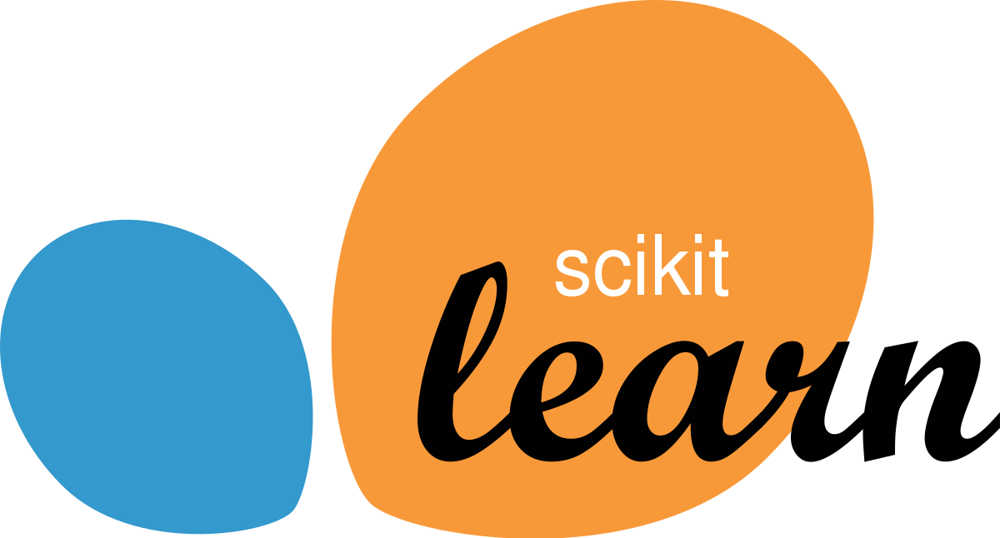

## Table of Contents

## What is Scikit-learn and what is it used for?

Scikit-learn is a free software machine learning library for the Python programming language. It's used to help people analyze data and make predictions based on that data. Think of it as a toolbox that has many tools for different jobs in data science.

People use Scikit-learn for things like classifying data into different groups, predicting future values, and understanding patterns in data. For example, it can help a business figure out which customers are likely to buy a product, or help a doctor predict if a patient might get sick based on their health data. It's popular because it's easy to use and has a lot of tools that work well together.

## How do you install Scikit-learn?

To install Scikit-learn, you need to use a tool called pip, which is a package installer for Python. Open your computer's command line or terminal, and type in the command `pip install scikit-learn`. Press enter, and pip will download and set up Scikit-learn for you. It might take a few minutes, so be patient.

If you are using a special environment like Anaconda, you can use a different command. In Anaconda, you would open the Anaconda prompt and type `conda install scikit-learn`. This will use Anaconda's own package manager to install Scikit-learn. Both ways will get you the same result, so choose the one that fits your setup.

## What are the basic data structures used in Scikit-learn?

In Scikit-learn, the main data structures you'll use are called arrays and dataframes. Arrays are like lists of numbers that you can do math on easily. They come from a library called NumPy, which Scikit-learn uses a lot. Arrays are good for storing things like measurements or scores because they let you do calculations quickly. When you want to use Scikit-learn to learn from your data, you often need to put your data into arrays.

Dataframes are another important structure, especially if your data has different types of information, like numbers and words. Dataframes come from a library called pandas, which works well with Scikit-learn. A dataframe is like a table where each row can be a different item, and each column can be a different piece of information about that item. For example, if you're looking at data about people, you might have columns for age, height, and favorite color. Dataframes are great because they let you organize and sort your data easily before you use it in Scikit-learn.

## Can you explain the difference between supervised and unsupervised learning in Scikit-learn?

Supervised learning in Scikit-learn is like having a teacher who shows you examples and tells you the right answers. You give the computer a bunch of data, like pictures of animals, and you also tell it what each picture is, like "this is a cat" or "this is a dog." The computer learns from these examples and then can guess what new pictures are. It's called supervised because you're guiding the computer with the right answers. In Scikit-learn, you use this for things like predicting house prices or figuring out if an email is spam.

Unsupervised learning is different because there's no teacher telling the computer the right answers. Instead, the computer looks at the data and tries to find patterns or groups on its own. For example, if you give it a bunch of customer data, it might find that some customers buy similar things and group them together. It's like the computer is exploring the data without any hints. In Scikit-learn, you use unsupervised learning for things like organizing data into clusters or finding hidden structures in the data.

## How do you preprocess data using Scikit-learn?

Preprocessing data in Scikit-learn means getting your data ready so it works well with the machine learning tools. One common way to do this is by scaling your data. Imagine you have data about people, like their age and income. Age might be a small number, like 30, while income could be a big number, like 50,000. If you don't scale them to be on the same level, the big numbers might seem more important to the computer. Scikit-learn has tools like StandardScaler that can make all your data fit on the same scale, so age and income are treated fairly.

Another important part of preprocessing is handling missing data. Sometimes, your data might have gaps where information is missing. Scikit-learn has tools like SimpleImputer that can fill in these gaps. You can tell it to use the average value or the most common value to replace the missing spots. This way, you don't have to throw away data just because it's incomplete. Once your data is scaled and complete, it's ready to be used in machine learning models to learn and make predictions.

## What are some common algorithms available in Scikit-learn for classification?

Scikit-learn has a bunch of tools for figuring out which group something belongs to, like deciding if an email is spam or not. One common tool is called Logistic Regression. It's good for when you want to say yes or no about something. For example, it can help decide if a picture is of a cat or a dog. Another tool is called Support Vector Machines (SVM). This one works well when you have data that's hard to separate into groups, like when the lines between groups are all twisty.

There's also something called K-Nearest Neighbors (KNN). This tool looks at the data points that are closest to the thing you're trying to classify and decides based on what group those neighbors are in. It's like asking your friends for advice. Decision Trees are another option, and they're easy to understand because they work like a flowchart. You ask a series of yes or no questions until you reach an answer. Lastly, Random Forests are a bunch of Decision Trees working together. They're good because they can make more accurate guesses by combining the answers from many trees.

## How do you perform model selection and validation in Scikit-learn?

In Scikit-learn, model selection and validation help you pick the best tool for your job and make sure it works well. You do this by trying out different tools and seeing which one does the best job with your data. One way to do this is by using something called cross-validation. Imagine you're trying to guess how good a student is at math. You wouldn't just give them one test, right? You'd give them a few different tests and see how they do overall. Cross-validation is like that. You split your data into pieces, use some pieces to train the tool, and other pieces to test it. You do this a few times and see how well the tool does on average.

Another way to pick the best tool is by using something called a validation curve. This helps you figure out the best settings for your tool. Imagine you're tuning a guitar; you need to find the right spot for each string. A validation curve shows you how changing the settings affects how well the tool works. You can see if making the settings bigger or smaller helps or hurts. Once you find the best settings, you can use them to make your tool work as well as possible. Both cross-validation and validation curves help you make sure your tool is ready to do a good job with new data.

## Can you describe how to use Scikit-learn for clustering?

In Scikit-learn, clustering is like organizing a messy room into groups. You give the computer a bunch of data, and it tries to find patterns or groups without you telling it what the groups should be. One popular way to do this is by using something called K-means clustering. Imagine you're trying to sort different fruits into groups. You might decide there are three groups: apples, oranges, and bananas. K-means works by picking a certain number of groups, like three, and then it tries to put each piece of data into the group it fits best. It keeps moving things around until it finds the best way to group everything.

Another way to cluster data in Scikit-learn is by using something called DBSCAN. This method is good when your data is spread out in weird ways, like if some fruits are mixed together and others are far apart. DBSCAN looks at how close the data points are to each other. If they're close, it puts them in the same group. If they're far away, it might leave them out or start a new group. This is helpful when you don't know how many groups there should be, and you want the computer to figure it out based on how the data is arranged. Both K-means and DBSCAN are tools in Scikit-learn that help you find patterns in your data without telling the computer exactly what to look for.

## What are the steps to implement a simple linear regression model using Scikit-learn?

To implement a simple linear regression model using Scikit-learn, you start by getting your data ready. Imagine you have data about houses, like their size and price. You need to split this data into two parts: the part you want to predict, like the price, and the part you use to make the prediction, like the size. In Scikit-learn, you call these parts the target and the feature. You put the feature data into an array, and the target data into another array. Then, you split these arrays into training and testing sets. The training set is what you use to teach the model, and the testing set is what you use to see how well the model learned.

Once your data is ready, you create and train the linear regression model. In Scikit-learn, you do this by importing the LinearRegression class and creating an instance of it. You then use the fit method to teach the model with your training data. After training, you can use the model to make predictions on your test data with the predict method. Finally, you can check how well your model did by comparing the predictions to the actual values in the test set. Scikit-learn has tools like mean squared error to help you see how close your predictions are to the real numbers.

## How do you handle imbalanced datasets in Scikit-learn?

Handling imbalanced datasets in Scikit-learn is important when you have more of one type of data than another. Imagine you're trying to predict if a credit card transaction is fraud or not. Most transactions are not fraud, so you have a lot more "not fraud" examples than "fraud" examples. This can make it hard for your model to learn about the "fraud" cases because it sees them less often. Scikit-learn has tools to help with this problem. One way is to use something called RandomOverSampler, which makes copies of the less common data, like the "fraud" cases, so you have more of them to learn from. Another way is to use RandomUnderSampler, which removes some of the more common data, like the "not fraud" cases, to make the groups more even.

Another tool in Scikit-learn for handling imbalanced datasets is called SMOTE, which stands for Synthetic Minority Over-sampling Technique. SMOTE doesn't just copy the less common data; it creates new, similar examples by mixing the features of existing ones. This can help your model learn better about the less common cases because it has more variety to work with. You can use these tools before you start training your model, and they can help make your predictions more accurate, especially for the less common cases. By balancing your data, you give your model a fairer chance to learn about all the different types of data you have.

## What advanced techniques can be used for feature selection in Scikit-learn?

Feature selection in Scikit-learn is like picking the best ingredients for a recipe. You want to choose the features that help your model learn the best. One advanced technique is called Recursive Feature Elimination (RFE). Imagine you're trying to solve a puzzle, and you keep removing pieces that don't seem to fit until you're left with the ones that work best. RFE does something similar by training a model, checking which features are least important, and then removing them one by one until you're left with the best set of features. This can help your model focus on what really matters and make better predictions.

Another technique is called Lasso (Least Absolute Shrinkage and Selection Operator). Think of Lasso like a chef who decides to use only the most important spices in a dish. Lasso adds a penalty to the model that makes some feature coefficients shrink to zero, effectively removing them from the model. This helps in selecting features by keeping only the ones that have a strong impact on the outcome. By using Lasso, you can simplify your model and improve its performance by focusing on the most relevant features.

## How do you optimize hyperparameters using Scikit-learn tools like GridSearchCV?

Optimizing hyperparameters in Scikit-learn is like tuning a guitar to make it sound its best. Hyperparameters are settings you choose for your model, and they can make a big difference in how well it works. GridSearchCV is a tool that helps you find the best settings by trying out different combinations. Imagine you're trying to find the perfect recipe for a cake. You might try different amounts of flour, sugar, and eggs until you find the mix that tastes the best. GridSearchCV does the same thing but for your model's settings. It goes through all the combinations you tell it to try, trains the model with each one, and then picks the one that gives the best results.

Using GridSearchCV is easy. First, you decide which hyperparameters you want to try and what values you want to test. Then, you tell GridSearchCV to use a certain model, like a decision tree, and to try all the combinations of settings you've chosen. It will use something called cross-validation to test each combination and see how well the model works with those settings. Cross-validation is like giving the model a few different tests to see how it does overall. After GridSearchCV tries all the combinations, it will tell you which one worked the best. You can then use those best settings to train your final model, knowing it will work as well as possible.

## How can you implement algorithmic trading strategies using Scikit-learn?

Algorithmic trading entails the use of automated strategies designed to capitalize on statistical and mathematical models to anticipate market trends and price movements. Scikit-learn, a versatile machine learning library, provides the tools necessary for developing these predictive models. At the core of [algorithmic trading](/wiki/algorithmic-trading) strategies is the ability to forecast asset prices and detect trading signals effectively. Scikit-learn supports a variety of machine learning models, such as Linear Regression, Decision Trees, and Random Forests, all of which can be employed to create and refine these predictive models.

Linear Regression, a fundamental technique, involves modeling the relationship between a dependent variable and one or more independent variables. In trading contexts, this model could be used to predict price movements based on historical data. The formula for simple linear regression is:

$$
y = \beta_0 + \beta_1 x + \varepsilon
$$

Where $y$ is the dependent variable (e.g., stock price), $\beta_0$ and $\beta_1$ are coefficients that represent the intercept and slope, $x$ is the independent variable(s), and $\varepsilon$ is the error term.

Decision Trees and Random Forests are more sophisticated techniques that cater to both classification and regression tasks. Decision Trees split data into branches to aid decision-making processes, whereas Random Forests, an ensemble method, enhance predictive power by combining multiple decision trees. Here's a basic implementation of a Random Forest model using scikit-learn:

```python
from sklearn.ensemble import RandomForestRegressor
from sklearn.model_selection import train_test_split

# Assuming X is your feature set and y is the target variable
X_train, X_test, y_train, y_test = train_test_split(X, y, test_size=0.2, random_state=42)

# Model initialization
rf_model = RandomForestRegressor(n_estimators=100, random_state=42)

# Model fitting
rf_model.fit(X_train, y_train)

# Prediction
predictions = rf_model.predict(X_test)
```

Crucial to algorithmic trading is the [backtesting](/wiki/backtesting) process, which involves evaluating how a strategy would have performed using historical data. It helps in identifying the strategy's strengths and potential areas for improvement. Scikit-learn provides model evaluation tools that facilitate comprehensive performance analysis, such as calculating R-squared, Mean Absolute Error (MAE), and Mean Squared Error (MSE).

Moreover, incorporating walkforward analysis ensures that trading models are tested under conditions that mimic real-life trading environments. This involves iterative testing of a model on rolling windows of data, refining it over time, and continually validating its effectiveness in new data sets. This approach not only improves predictive reliability but also aids in mitigating overfitting—a common pitfall in model training.

By employing scikit-learn in the construction of algorithmic trading models, traders can leverage machine learning's robust analytical capabilities to enhance strategy development, refine investment decisions, and ultimately achieve superior performance in financial markets.

## What are the methods and criteria for Model Selection and Evaluation?

Selecting the appropriate machine learning model is essential for the success of algorithmic trading strategies, as it directly influences the effectiveness of predictions and trading decisions. Scikit-learn, a versatile Python library, offers several tools that greatly facilitate model selection and evaluation, ensuring traders can choose the optimal algorithm for their specific needs.

Scikit-learn provides methods like cross-validation, which are crucial in assessing how a model's results generalize to an independent dataset. Cross-validation involves partitioning data into complementary subsets, training the model on one subset, and validating it on the other. This technique minimizes the risk of overfitting by ensuring that the model is subjected to various segments of the dataset. The function `cross_val_score` in scikit-learn can be employed to conduct cross-validation, providing a reliable estimate of a model's performance.

Alongside cross-validation, the library offers a powerful parameter optimization tool called Grid Search. It systematically tunes model parameters to identify the combination that yields the highest performance. In scikit-learn, `GridSearchCV` facilitates this process, automating the exhaustive search through the specified parameter grid. The implementation of grid search ensures that an algorithm's hyperparameters are fine-tuned to improve its predictive capabilities without manual effort.

Once the models are trained, evaluation metrics are essential for measuring their predictive power. Scikit-learn supports a wide range of evaluation metrics that provide a comprehensive view of model performance. For regression models, metrics such as the R-squared ($R^2$) and mean squared error (MSE) are commonly used. The R-squared metric indicates the proportion of variance captured by the model, calculated as:

$$
R^2 = 1 - \frac{\sum_{i=1}^{n}(y_i - \hat{y}_i)^2}{\sum_{i=1}^{n}(y_i - \bar{y})^2}
$$

where $y_i$ are the actual values, $\hat{y}_i$ are the predicted values, and $\bar{y}$ is the mean of the actual values.

The mean squared error is given by:

$$
\text{MSE} = \frac{1}{n}\sum_{i=1}^{n}(y_i - \hat{y}_i)^2
$$

These metrics help traders determine how well a model approximates reality, guiding the selection of only those models that exhibit strong predictive accuracy.

Comparing multiple models is an integral process of selecting the right model for deployment in live trading environments. Scikit-learn's capabilities of handling numerous models and evaluation metrics allow traders to compare predictions' accuracy, ensuring only the most effective models are deployed. By leveraging these tools, scikit-learn empowers traders to implement and refine their algorithmic strategies confidently.

## References & Further Reading

[1]: Bergstra, J., Bardenet, R., Bengio, Y., & Kégl, B. (2011). ["Algorithms for Hyper-Parameter Optimization."](https://proceedings.neurips.cc/paper/2011/file/86e8f7ab32cfd12577bc2619bc635690-Paper.pdf) Advances in Neural Information Processing Systems 24.

[2]: ["Advances in Financial Machine Learning"](https://www.amazon.com/Advances-Financial-Machine-Learning-Marcos/dp/1119482089) by Marcos Lopez de Prado

[3]: ["Evidence-Based Technical Analysis: Applying the Scientific Method and Statistical Inference to Trading Signals"](https://www.amazon.com/Evidence-Based-Technical-Analysis-Scientific-Statistical/dp/0470008741) by David Aronson

[4]: ["Machine Learning for Algorithmic Trading"](https://github.com/stefan-jansen/machine-learning-for-trading) by Stefan Jansen

[5]: ["Quantitative Trading: How to Build Your Own Algorithmic Trading Business"](https://books.google.com/books/about/Quantitative_Trading.html?id=j70yEAAAQBAJ) by Ernest P. Chan