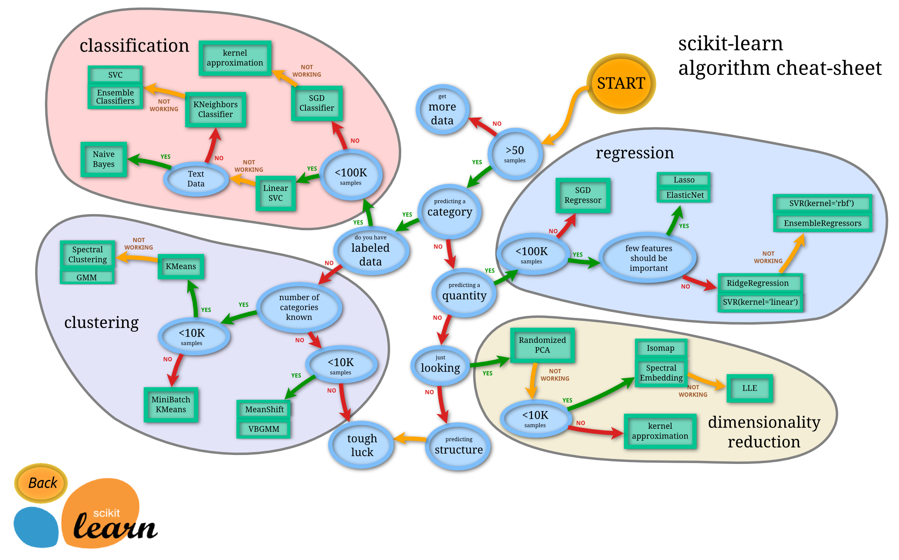

## Table of Contents

## What is Scikit-Learn and why is it important for machine learning?

Scikit-Learn is a free software machine learning library for the Python programming language. It's like a big toolbox that helps people who want to use machine learning in their projects. It has lots of different tools for things like sorting data into groups, guessing future values, and finding patterns in data. It's easy to use because it's made to work well with other popular Python tools like NumPy and Pandas.

Scikit-Learn is important for machine learning because it makes it easier for people to start using these techniques without needing to know all the complicated math behind them. It has ready-to-use methods that can be quickly added to projects, which saves time and helps people focus on using the results rather than building everything from scratch. This library is also used a lot in teaching because it helps students learn about machine learning by letting them try out different methods easily.

## How do you install Scikit-Learn and set up your environment?

To install Scikit-Learn, you first need to make sure you have Python on your computer. Once you have Python, you can use a tool called pip, which is like an app store for Python packages. Just open your command line or terminal and type ```pip install scikit-learn```. This will download and set up Scikit-Learn on your computer. It's a good idea to use a virtual environment, which helps keep your projects organized and prevents different projects from messing with each other's settings. You can create a virtual environment by typing ```python -m venv myenv``` and then activating it with ```source myenv/bin/activate``` on macOS/Linux or ```myenv\Scripts\activate``` on Windows.

After installing Scikit-Learn, setting up your environment involves making sure you have all the other tools you might need. Scikit-Learn works well with NumPy and Pandas, so you might want to install those too with ```pip install numpy pandas```. Once everything is installed, you can start using Scikit-Learn in your Python scripts by adding ```import sklearn``` at the top of your file. This lets you use all the tools Scikit-Learn offers. If you're new to machine learning, you might want to check out the Scikit-Learn website, which has lots of examples and guides to help you learn how to use it.

## What are the basic data preprocessing steps you can perform using Scikit-Learn?

Data preprocessing with Scikit-Learn helps clean and prepare your data for machine learning. One common step is handling missing values. If your data has gaps, you can use the `SimpleImputer` class to fill them in. For example, you might choose to replace missing values with the mean or median of the column. Another important step is scaling your data. This makes sure all your features are on the same scale, which can help algorithms work better. The `StandardScaler` can be used to standardize features by removing the mean and scaling to unit variance, which is done with the formula $$z = \frac{x - \mu}{\sigma}$$ where $$x$$ is the original feature, $$\mu$$ is the mean, and $$\sigma$$ is the standard deviation.

Another preprocessing step is encoding categorical data. If your data includes categories like colors or types, you need to convert them into numbers that machine learning algorithms can understand. The `LabelEncoder` can turn each unique category into a number, while `OneHotEncoder` can create binary columns for each category. For example, if you have a 'color' column with values 'red', 'green', and 'blue', `OneHotEncoder` will create three new columns, each representing one color. Finally, you might want to split your data into training and testing sets. This is done easily with `train_test_split`, which helps you evaluate how well your model performs on unseen data. By following these steps, you can make sure your data is ready for building and testing machine learning models.

Here's a simple example of how you might use some of these preprocessing steps in Scikit-Learn:

```python
from sklearn.impute import SimpleImputer
from sklearn.preprocessing import StandardScaler, OneHotEncoder
from sklearn.model_selection import train_test_split
import pandas as pd

# Sample data
data = pd.DataFrame({
    'A': [1, 2, None, 4, 5],
    'B': ['red', 'green', 'blue', 'red', 'green']
})

# Handle missing values
imputer = SimpleImputer(strategy='mean')
data['A'] = imputer.fit_transform(data[['A']])

# Encode categorical data
encoder = OneHotEncoder()
encoded_B = encoder.fit_transform(data[['B']]).toarray()
encoded_B_df = pd.DataFrame(encoded_B, columns=encoder.get_feature_names(['B']))

# Combine encoded data with original data
data = pd.concat([data[['A']], encoded_B_df], axis=1)

# Scale the data
scaler = StandardScaler()
scaled_data = scaler.fit_transform(data)
scaled_data_df = pd.DataFrame(scaled_data, columns=data.columns)

# Split the data
X_train, X_test = train_test_split(scaled_data_df, test_size=0.2, random_state=42)

print("Processed and split data:")
print(X_train)
print(X_test)
```

## How do you split your dataset into training and testing sets in Scikit-Learn?

Splitting your dataset into training and testing sets is important for machine learning because it helps you check how well your model works on new data. In Scikit-Learn, you can do this easily with the `train_test_split` function from the `sklearn.model_selection` module. This function lets you decide what part of your data to use for training and what part for testing. Usually, people use 80% of the data for training and 20% for testing, but you can change this if you want.

Here's how you can use `train_test_split`. You give it your data and tell it what fraction you want to use for testing. The function then mixes up your data and splits it into two parts: one for training and one for testing. You can also set a `random_state` to make sure you get the same split every time you run your code, which is helpful for repeating experiments. For example, if you have a dataset with features `X` and labels `y`, you can split it like this:

```python
from sklearn.model_selection import train_test_split

# Sample data
X = [[1, 2], [3, 4], [5, 6], [7, 8]]
y = [0, 1, 0, 1]

# Split the data into training and testing sets
X_train, X_test, y_train, y_test = train_test_split(X, y, test_size=0.25, random_state=42)

print("Training data:")
print("X_train:", X_train)
print("y_train:", y_train)
print("\nTesting data:")
print("X_test:", X_test)
print("y_test:", y_test)
```

## What are some common machine learning algorithms available in Scikit-Learn?

Scikit-Learn has many machine learning algorithms that help with different kinds of tasks. For sorting data into groups, you can use algorithms like K-Nearest Neighbors (KNN), which looks at the closest data points to decide what group something belongs to, and Support Vector Machines (SVM), which find the best line or curve to separate different groups. There are also tree-based methods like Decision Trees, which make choices by asking questions about the data, and Random Forests, which use many decision trees together to make better predictions. For tasks where you want to guess a number, like predicting house prices, you can use algorithms like Linear Regression, which finds the best straight line to fit your data, or more complex ones like Polynomial Regression, which can fit curves to your data.

Another important type of algorithm in Scikit-Learn is for finding patterns in data without labels, called unsupervised learning. One common method is clustering, where you can use algorithms like K-Means to group similar data points together. Another method is dimensionality reduction, where algorithms like Principal Component Analysis (PCA) help simplify your data by finding the most important parts. Scikit-Learn also has algorithms for tasks like detecting unusual data points (anomaly detection) and recommending items (recommender systems). All these tools make it easier to explore and understand your data, helping you build models that can learn and make predictions.

Here's a simple example of using some of these algorithms in Scikit-Learn:

```python
from sklearn.neighbors import KNeighborsClassifier
from sklearn.svm import SVC
from sklearn.tree import DecisionTreeClassifier
from sklearn.ensemble import RandomForestClassifier
from sklearn.linear_model import LinearRegression
from sklearn.preprocessing import PolynomialFeatures
from sklearn.cluster import KMeans
from sklearn.decomposition import PCA

# Classification
knn = KNeighborsClassifier(n_neighbors=3)
svm = SVC(kernel='linear')
dt = DecisionTreeClassifier(random_state=42)
rf = RandomForestClassifier(n_estimators=100, random_state=42)

# Regression
lr = LinearRegression()
poly = PolynomialFeatures(degree=2)
X_poly = poly.fit_transform(X)
lr_poly = LinearRegression().fit(X_poly, y)

# Clustering
kmeans = KMeans(n_clusters=3, random_state=0)

# Dimensionality Reduction
pca = PCA(n_components=2)
X_pca = pca.fit_transform(X)
```

## How do you train a model using Scikit-Learn and what are the key parameters to consider?

Training a model with Scikit-Learn is easy and follows a simple pattern. You start by picking the right algorithm for your task, like a classifier for sorting data or a regressor for guessing numbers. Once you've chosen your algorithm, you create the model by calling the algorithm's class and setting any parameters you want. Then, you use the `fit` method to train the model on your data. For example, if you're using a `LinearRegression` model, you would do something like `model = LinearRegression()` and then `model.fit(X_train, y_train)` to train it on your training data.

When choosing your model's parameters, you need to think about what will work best for your data. Some common parameters include the number of neighbors for K-Nearest Neighbors (`n_neighbors`), the kernel type for Support Vector Machines (`kernel`), and the number of trees for Random Forests (`n_estimators`). These parameters can change how your model learns from the data and can affect how well it works. It's a good idea to try out different values for these parameters to see what gives you the best results. You can use tools like `GridSearchCV` to help you find the best settings automatically. For example, if you're using a `KNeighborsClassifier`, you might try different values for `n_neighbors` to see which one makes your model guess better.

## How do you evaluate the performance of a model in Scikit-Learn?

Evaluating a model's performance in Scikit-Learn is important to see how well it works on new data. After you train your model, you use it to make predictions on your test data. Then, you compare these predictions to the actual results to see how close they are. For example, if you're using a classifier to sort data into groups, you can use tools like `accuracy_score` to see what percentage of your predictions were right. If you're guessing numbers, you might use `mean_squared_error` to see how far off your guesses are on average. These tools help you understand if your model is doing a good job or if you need to make changes.

Choosing the right way to evaluate your model depends on what you're trying to do. For classification tasks, you might look at the confusion matrix to see where your model is making mistakes. You can also use metrics like precision, recall, and F1-score to get a more detailed look at how well your model is sorting data. For regression tasks, besides mean squared error, you might use the coefficient of determination, $$R^2$$, which tells you how well your model fits the data. The closer $$R^2$$ is to 1, the better your model is at explaining the data. Scikit-Learn has all these tools ready to use, so you can easily check how your model is doing and make it better if needed.

Here's a simple example of how you might evaluate a model in Scikit-Learn:

```python
from sklearn.metrics import accuracy_score, mean_squared_error, r2_score
from sklearn.model_selection import train_test_split
from sklearn.linear_model import LinearRegression
from sklearn.datasets import load_iris
from sklearn.svm import SVC

# Example for classification
iris = load_iris()
X, y = iris.data, iris.target
X_train, X_test, y_train, y_test = train_test_split(X, y, test_size=0.2, random_state=42)

clf = SVC()
clf.fit(X_train, y_train)
y_pred = clf.predict(X_test)
accuracy = accuracy_score(y_test, y_pred)
print("Classification Accuracy:", accuracy)

# Example for regression
import numpy as np

X = np.array([1, 2, 3, 4, 5]).reshape(-1, 1)
y = np.array([2, 4, 5, 4, 5])

X_train, X_test, y_train, y_test = train_test_split(X, y, test_size=0.2, random_state=42)

reg = LinearRegression()
reg.fit(X_train, y_train)
y_pred = reg.predict(X_test)
mse = mean_squared_error(y_test, y_pred)
r2 = r2_score(y_test, y_pred)
print("Regression Mean Squared Error:", mse)
print("Regression R-squared:", r2)
```

## What techniques can you use for model selection and hyperparameter tuning in Scikit-Learn?

In Scikit-Learn, you can use cross-validation to pick the best model and tune its hyperparameters. Cross-validation works by splitting your data into smaller pieces and using some of these pieces to train your model and the others to test it. This way, you can see how well your model works on different parts of your data. A common method is k-fold cross-validation, where your data is split into k equal parts, and the model is trained and tested k times, each time using a different part as the test set. You can use `cross_val_score` to do this easily in Scikit-Learn. For example, if you want to compare different models, you can run cross-validation on each one and pick the one with the best average score.

For tuning hyperparameters, you can use tools like `GridSearchCV` and `RandomizedSearchCV`. `GridSearchCV` tries every combination of hyperparameters you give it, which can be slow but thorough. `RandomizedSearchCV` picks random combinations, which can be faster and still find good settings. Both methods use cross-validation to test each combination, so you can be sure you're picking the best settings for your model. For example, if you're using a `RandomForestClassifier`, you might want to try different numbers of trees (`n_estimators`) and different ways of choosing features (`max_features`). By using these tools, you can make your model work as well as possible without guessing the right settings.

```python
from sklearn.model_selection import cross_val_score, GridSearchCV, RandomizedSearchCV
from sklearn.ensemble import RandomForestClassifier
from sklearn.datasets import load_iris
from sklearn.model_selection import train_test_split

# Load and split data
iris = load_iris()
X, y = iris.data, iris.target
X_train, X_test, y_train, y_test = train_test_split(X, y, test_size=0.2, random_state=42)

# Example of cross-validation
rf = RandomForestClassifier(n_estimators=100, random_state=42)
scores = cross_val_score(rf, X_train, y_train, cv=5)
print("Cross-validation scores:", scores)
print("Mean score:", scores.mean())

# Example of GridSearchCV
param_grid = {
    'n_estimators': [10, 50, 100, 200],
    'max_features': ['auto', 'sqrt', 'log2']
}
grid_search = GridSearchCV(estimator=rf, param_grid=param_grid, cv=5)
grid_search.fit(X_train, y_train)
print("Best parameters:", grid_search.best_params_)
print("Best cross-validation score:", grid_search.best_score_)

# Example of RandomizedSearchCV
param_dist = {
    'n_estimators': [10, 50, 100, 200],
    'max_features': ['auto', 'sqrt', 'log2']
}
random_search = RandomizedSearchCV(estimator=rf, param_distributions=param_dist, n_iter=10, cv=5, random_state=42)
random_search.fit(X_train, y_train)
print("Best parameters:", random_search.best_params_)
print("Best cross-validation score:", random_search.best_score_)
```

## How do you implement cross-validation in Scikit-Learn and why is it important?

Cross-validation in Scikit-Learn is a way to check how well your model works on different parts of your data. It's like testing your model many times to make sure it's not just good at guessing the same data over and over. You can use the `cross_val_score` function to do this easily. For example, if you have a model like `RandomForestClassifier`, you can split your data into 5 pieces and train your model 5 times, each time using a different piece to test it. This helps you see if your model is doing a good job on all parts of your data. Here's how you can do it in Scikit-Learn:

```python
from sklearn.model_selection import cross_val_score
from sklearn.ensemble import RandomForestClassifier
from sklearn.datasets import load_iris

# Load the iris dataset
iris = load_iris()
X, y = iris.data, iris.target

# Create a Random Forest Classifier
rf = RandomForestClassifier(n_estimators=100, random_state=42)

# Perform 5-fold cross-validation
scores = cross_val_score(rf, X, y, cv=5)

print("Cross-validation scores:", scores)
print("Mean score:", scores.mean())
```

Cross-validation is important because it helps you make sure your model is good at guessing new data, not just the data you used to train it. This is called generalization. If you only use one set of data to train and test your model, it might do really well on that data but not on new data. By using cross-validation, you can see how your model performs on different parts of your data, which gives you a better idea of how it will work in the real world. This way, you can be more confident that your model will work well when you use it for new predictions.

## What are some advanced features of Scikit-Learn like pipelines and custom transformers?

Scikit-Learn has cool tools like pipelines that make it easier to do many steps in machine learning at once. A pipeline is like a recipe where you list all the steps you want to do, like cleaning your data, changing it into numbers, and then using a model to make guesses. For example, you can put together steps like filling in missing data, scaling your numbers, and then using a classifier all in one pipeline. This makes your code cleaner and helps you remember all the steps you need to do. Here's how you can make a simple pipeline:

```python
from sklearn.pipeline import Pipeline
from sklearn.impute import SimpleImputer
from sklearn.preprocessing import StandardScaler
from sklearn.ensemble import RandomForestClassifier
from sklearn.datasets import load_iris
from sklearn.model_selection import train_test_split

# Load the iris dataset
iris = load_iris()
X, y = iris.data, iris.target
X_train, X_test, y_train, y_test = train_test_split(X, y, test_size=0.2, random_state=42)

# Create a pipeline
pipeline = Pipeline([
    ('imputer', SimpleImputer(strategy='mean')),
    ('scaler', StandardScaler()),
    ('classifier', RandomForestClassifier(n_estimators=100, random_state=42))
])

# Fit the pipeline
pipeline.fit(X_train, y_train)

# Make predictions
y_pred = pipeline.predict(X_test)
```

Another advanced feature is custom transformers, which let you make your own steps to change your data. Sometimes, the steps Scikit-Learn gives you aren't exactly what you need, so you can make your own. A custom transformer is just a class you write that has two main parts: a `fit` method to learn from your data and a `transform` method to change it. For example, you might want to change your data in a special way before using it in a model. Here's how you can make a simple custom transformer that adds a new feature to your data:

```python
from sklearn.base import BaseEstimator, TransformerMixin
import numpy as np

class AddFeature(BaseEstimator, TransformerMixin):
    def fit(self, X, y=None):
        return self

    def transform(self, X):
        new_feature = X[:, 0] * X[:, 1]  # Create a new feature by multiplying the first two columns
        return np.column_stack((X, new_feature))

# Example usage
from sklearn.datasets import load_iris
from sklearn.model_selection import train_test_split
from sklearn.ensemble import RandomForestClassifier
from sklearn.pipeline import Pipeline
from sklearn.preprocessing import StandardScaler

iris = load_iris()
X, y = iris.data, iris.target
X_train, X_test, y_train, y_test = train_test_split(X, y, test_size=0.2, random_state=42)

pipeline = Pipeline([
    ('add_feature', AddFeature()),
    ('scaler', StandardScaler()),
    ('classifier', RandomForestClassifier(n_estimators=100, random_state=42))
])

pipeline.fit(X_train, y_train)
y_pred = pipeline.predict(X_test)
```

## How can you use Scikit-Learn for handling imbalanced datasets?

Scikit-Learn offers tools to help with imbalanced datasets, where some classes have a lot more examples than others. This can be a problem because models might learn to guess the common class more often and ignore the rare ones. One way to fix this is by using the `RandomOverSampler` from the `imblearn` package, which works well with Scikit-Learn. This tool makes more copies of the rare class examples so that all classes have about the same number of examples. Another way is to use `RandomUnderSampler`, which removes some examples from the common class to balance things out. Both methods help your model learn about all classes equally.

You can also use more advanced methods like `SMOTE` (Synthetic Minority Over-sampling Technique) from `imblearn`. SMOTE creates new examples of the rare class by mixing existing examples, which can help your model learn better without just copying data. In Scikit-Learn, you can use these tools in a pipeline along with other steps like scaling and classification. For example, you might use a pipeline that first balances your data with `SMOTE`, then scales it with `StandardScaler`, and finally uses a classifier like `RandomForestClassifier`. This way, you can handle imbalanced data and make your model work better all in one go.

Here's how you can use `SMOTE` and a pipeline to handle an imbalanced dataset:

```python
from sklearn.datasets import make_classification
from sklearn.model_selection import train_test_split
from sklearn.preprocessing import StandardScaler
from sklearn.ensemble import RandomForestClassifier
from sklearn.pipeline import Pipeline
from imblearn.over_sampling import SMOTE
from imblearn.pipeline import Pipeline as ImbPipeline

# Create an imbalanced dataset
X, y = make_classification(n_samples=1000, n_classes=2, weights=[0.9, 0.1], random_state=42)
X_train, X_test, y_train, y_test = train_test_split(X, y, test_size=0.2, random_state=42)

# Create a pipeline with SMOTE, StandardScaler, and RandomForestClassifier
pipeline = ImbPipeline([
    ('smote', SMOTE(random_state=42)),
    ('scaler', StandardScaler()),
    ('classifier', RandomForestClassifier(n_estimators=100, random_state=42))
])

# Fit the pipeline
pipeline.fit(X_train, y_train)

# Make predictions
y_pred = pipeline.predict(X_test)
```

## What are the best practices for deploying a Scikit-Learn model into production?

When deploying a Scikit-Learn model into production, it's important to make sure your model works well and keeps working well over time. One of the first things to do is to save your trained model so you can use it later. You can do this easily with Scikit-Learn's `joblib` or `pickle` libraries. After saving your model, you need to set up a way to use it in your application, like a web service or an API. This means writing code to load the model, take in new data, make predictions, and send the results back. It's also a good idea to keep track of how well your model is doing after it's in use. You can do this by logging predictions and checking them against real results to see if your model needs updating.

Another important thing is to make sure your model can handle new data well. This means thinking about how you'll clean and prepare new data the same way you did when you trained your model. You might want to use a pipeline to make sure all the steps are done correctly. Also, it's good to have a plan for updating your model. As new data comes in, your model might need to be retrained to stay accurate. You can set up a system to do this automatically or check on it regularly. By following these steps, you can make sure your Scikit-Learn model works well in the real world and keeps helping your application do its job.

Here's an example of how you might save and load a model using `joblib`:

```python
from sklearn.ensemble import RandomForestClassifier
from sklearn.datasets import load_iris
from sklearn.model_selection import train_test_split
import joblib

# Load the iris dataset
iris = load_iris()
X, y = iris.data, iris.target
X_train, X_test, y_train, y_test = train_test_split(X, y, test_size=0.2, random_state=42)

# Train a model
model = RandomForestClassifier(n_estimators=100, random_state=42)
model.fit(X_train, y_train)

# Save the model
joblib.dump(model, 'random_forest_model.joblib')

# Later, load the model
loaded_model = joblib.load('random_forest_model.joblib')

# Use the loaded model to make predictions
y_pred = loaded_model.predict(X_test)
```