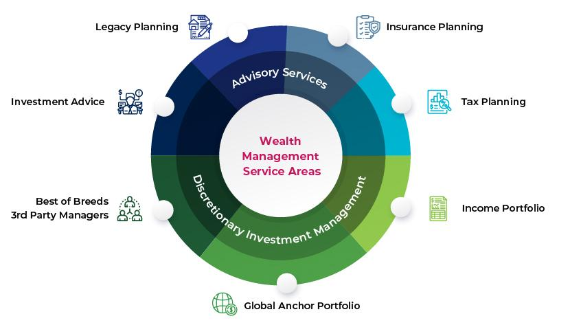

## Table of Contents

## What is wealth management and financial advisory?

Wealth management and financial advisory are services that help people manage their money and plan for their financial future. Wealth management often involves working with a professional who helps you make decisions about investing, saving, and spending your money. This can include creating a personalized investment portfolio, planning for retirement, and managing taxes. The goal is to grow your wealth over time and make sure your money is working as hard as possible for you.

Financial advisory, on the other hand, is a broader term that includes wealth management but also covers other aspects of personal finance. A financial advisor can help you with budgeting, debt management, and insurance planning, in addition to investment and retirement planning. They provide guidance and advice to help you make smart financial decisions and achieve your financial goals. Both services are important for anyone looking to improve their financial health and secure their future.

## Who typically uses wealth management and financial advisory services?

People who use wealth management and financial advisory services often have a good amount of money or want to plan their finances carefully. These services are popular with people who have high incomes, like business owners, doctors, or lawyers. They might also be used by people who have come into a lot of money suddenly, like from an inheritance or selling a business. These folks want to make sure their money grows and lasts for a long time.

Retired people or those close to retirement also use these services a lot. They want to make sure their savings last through their retirement years. Younger people might use financial advisors too, especially if they want to start planning early for big goals like buying a house or saving for their kids' education. Overall, anyone who wants to make smart choices with their money can benefit from these services, no matter their age or how much money they have.

## What are the basic services offered by wealth management firms?

Wealth management firms offer a bunch of services to help people with their money. They help you make a plan for your investments. This means they pick different ways to invest your money, like in stocks, bonds, or real estate, to help it grow over time. They also keep an eye on these investments and make changes if needed to make sure they're doing well. Another big part of what they do is planning for retirement. They help you figure out how much money you'll need when you stop working and how to save enough to live comfortably.

Besides investments and retirement, wealth management firms also help with taxes. They look for ways to save you money on taxes, which can be really helpful. They also help with estate planning, which is about making sure your money and things you own go to the right people after you're gone. Sometimes, they even help with other stuff like insurance or planning for big purchases like a house. All these services are meant to make sure your money works hard for you and helps you reach your financial goals.

## How does financial advisory differ from wealth management?

Financial advisory and wealth management are both about helping people with their money, but they have some differences. Financial advisory is a broader service that covers a lot of things. It can help you with making a budget, paying off debts, and [picking](/wiki/asset-class-picking) the right insurance. A financial advisor will look at your whole financial situation and give you advice on how to manage your money better. They can help you set goals, like saving for a house or paying for your kids' school, and make a plan to reach those goals.

Wealth management, on the other hand, is more focused on people who already have a good amount of money. It's all about growing that money and making it last. Wealth managers help you invest your money in things like stocks, bonds, and real estate. They also help with planning for retirement and making sure you have enough money when you stop working. They look at ways to save on taxes and plan for what happens to your money after you're gone. So, while financial advisory is about managing your overall finances, wealth management is more about making your money grow and planning for the future.

## What are the key trends driving the growth of the wealth management industry?

One big trend driving the growth of the wealth management industry is technology. More and more, people are using apps and online tools to manage their money. This makes it easier for them to keep track of their investments and make changes quickly. Wealth management firms are using technology too, like robo-advisors, which use computers to give advice and manage investments. This helps them reach more people, even those who don't have a lot of money to invest. Technology also makes it easier for firms to give personalized advice and keep their clients happy.

Another trend is that more people are getting interested in sustainable and responsible investing. This means they want to invest their money in companies that are good for the environment or society. Wealth management firms are paying attention to this and offering more options for people who want to invest this way. It's not just about making money anymore; it's also about making a positive impact. This trend is attracting younger investors who care a lot about these issues, which is helping the industry grow.

## How do regulations impact the wealth management and financial advisory industry?

Regulations have a big impact on the wealth management and financial advisory industry. They are rules that firms have to follow to make sure they are doing things the right way and keeping their clients' money safe. These rules can be about how firms give advice, how they handle investments, and how they keep their clients' information private. For example, in the United States, the Securities and Exchange Commission (SEC) and the Financial Industry Regulatory Authority (FINRA) set rules that firms must follow. These regulations help make sure that people can trust their wealth managers and financial advisors to act in their best interest.

Sometimes, new regulations can make it harder for firms to do business. They might have to spend more money to make sure they are following all the rules, which can be expensive. But regulations also help the industry grow in a good way. They make people feel more confident about using wealth management and financial advisory services because they know there are rules in place to protect them. This trust can lead to more people using these services, which helps the industry grow. So, while regulations can be a challenge, they also play an important role in making the industry stronger and more trustworthy.

## What role does technology play in modern wealth management?

Technology is changing the way wealth management works. It makes things easier for both the people who manage money and the people who have money to invest. For example, there are now apps and websites where you can check your investments anytime you want. This means you don't have to wait to talk to your wealth manager to see how your money is doing. Also, there are robo-advisors, which are computer programs that can give you advice and manage your investments without a human doing it. This helps wealth management firms reach more people, even those who don't have a lot of money to invest.

Another big way technology helps is by making things more personal. Wealth management firms can use data and computer programs to understand what their clients want and need. This means they can give advice that fits each person better. Technology also makes it easier to keep track of everything and make sure clients are happy. Overall, technology is making wealth management faster, easier, and more tailored to each person's needs.

## How do wealth managers and financial advisors get compensated?

Wealth managers and financial advisors get paid in different ways. One common way is through fees. They might charge a percentage of the money they are managing for you. For example, if they manage $100,000 for you and their fee is 1%, they would get $1,000 a year. Another way they get paid is by charging a flat fee for their services. This could be a set amount of money for making a financial plan or giving advice. Some advisors also charge by the hour, like a lawyer or a doctor might.

Another way wealth managers and financial advisors make money is through commissions. This happens when they sell you certain investments, like stocks or insurance. They get a little bit of money from the company that sells the investment. But, this can sometimes lead to a problem because they might suggest investments that pay them more, even if those aren't the best for you. That's why it's important to know how your advisor is getting paid and to make sure they are looking out for your best interests.

## What are the challenges faced by the wealth management industry?

One big challenge for the wealth management industry is keeping up with technology. As more people use apps and online tools to manage their money, wealth management firms need to find ways to use technology too. They have to make sure their services are easy to use and can be accessed online. This can be hard because it means spending a lot of money on new systems and training people to use them. Also, they have to compete with robo-advisors, which are computer programs that can give advice and manage investments without a human doing it. These robo-advisors can be cheaper and reach more people, so traditional wealth managers need to find ways to stay ahead.

Another challenge is meeting the needs of different kinds of clients. Some people want to invest in ways that are good for the environment or society, and wealth managers need to offer these options. Younger people might also want different things from their wealth managers than older people do. This means wealth managers have to be flexible and offer personalized services. It can be hard to keep everyone happy and still make money. Plus, they have to follow a lot of rules and regulations, which can make it harder to do business. But if they can meet these challenges, they can build trust and grow their business.

## How can one become a certified financial advisor or wealth manager?

To become a certified financial advisor or wealth manager, you need to get the right education and certifications. Most people start by getting a degree in finance, economics, business, or something similar. After that, you can get certifications like the Certified Financial Planner (CFP) or Chartered Financial Analyst (CFA). These certifications need you to pass exams and have some work experience. The CFP is good if you want to help people with their overall finances, while the CFA is more about investing and managing money.

Once you have your education and certifications, you need to get some experience. Many people start by working at a bank, an investment firm, or a financial planning company. This helps you learn how to work with clients and manage their money. You might also need to keep learning and getting more certifications to stay up to date with new rules and ways of doing things. It takes hard work and time, but becoming a certified financial advisor or wealth manager can be a rewarding career where you help people reach their financial goals.

## What advanced strategies do wealth managers use to optimize client portfolios?

Wealth managers use advanced strategies to help their clients' money grow and stay safe. One way they do this is by diversifying the portfolio. This means they spread the money across different kinds of investments, like stocks, bonds, and real estate. By doing this, they lower the risk because if one investment does badly, the others might do well and balance it out. They also use something called asset allocation, where they decide how much money to put into each type of investment based on the client's goals and how much risk they are okay with taking.

Another strategy wealth managers use is called tax optimization. This means they look for ways to help clients pay less in taxes. They might put some money into investments that have tax benefits or use strategies like tax-loss harvesting, where they sell investments that have gone down in value to reduce the client's taxes. Wealth managers also keep an eye on the market and make changes to the portfolio when needed. They might use techniques like rebalancing, where they adjust the investments to keep the right mix, or they might use more advanced strategies like options and derivatives to protect the portfolio from big drops in the market.

## How do global economic conditions affect the scope and strategies of wealth management?

Global economic conditions have a big impact on what wealth managers do and how they do it. When the world economy is doing well, wealth managers might feel more confident about taking risks with their clients' money. They might put more money into stocks or other investments that could grow a lot. But if the economy is not doing so well, like during a recession, they might be more careful. They might move money into safer investments like bonds to protect their clients' money from losing value. Wealth managers also have to keep an eye on things like interest rates, inflation, and what's happening in different countries because all these things can change how they manage their clients' portfolios.

Another way global economic conditions affect wealth management is by changing what clients want. When the economy is strong, people might want to grow their money faster and be okay with taking more risks. But when things are uncertain, clients might want to focus more on keeping their money safe. Wealth managers need to talk to their clients about these changes and adjust their strategies to match what their clients need and want. This means they have to be flexible and always ready to change their plans based on what's happening in the world.

## References & Further Reading

[1]: Bergstra, J., Bardenet, R., Bengio, Y., & Kégl, B. (2011). ["Algorithms for Hyper-Parameter Optimization."](https://dl.acm.org/doi/10.5555/2986459.2986743) Advances in Neural Information Processing Systems 24.

[2]: ["Advances in Financial Machine Learning"](https://www.amazon.com/Advances-Financial-Machine-Learning-Marcos/dp/1119482089) by Marcos Lopez de Prado

[3]: ["Evidence-Based Technical Analysis: Applying the Scientific Method and Statistical Inference to Trading Signals"](https://books.google.com/books/about/Evidence_Based_Technical_Analysis.html?id=jbD47VkOHAEC) by David Aronson

[4]: ["Machine Learning for Algorithmic Trading"](https://github.com/stefan-jansen/machine-learning-for-trading) by Stefan Jansen

[5]: ["Quantitative Trading: How to Build Your Own Algorithmic Trading Business"](https://www.amazon.com/Quantitative-Trading-Build-Algorithmic-Business/dp/1119800064) by Ernest P. Chan