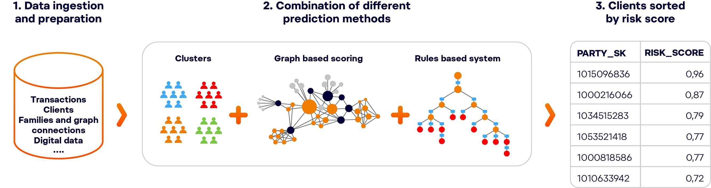

## Table of Contents

## What is scoring in the context of machine learning?

Scoring in machine learning is the process of using a trained model to make predictions on new data. When you train a machine learning model, you teach it to recognize patterns and make decisions based on the data it has seen. Once the model is trained, you can use it to score new data, which means applying the model to new, unseen data to get predictions or scores. For example, if you have a model that predicts house prices, you can score new data by giving the model information about a new house, and it will predict the price of that house.

The scoring process is important because it allows you to use the model in real-world situations. After training, the model's performance is often evaluated using a scoring metric, such as accuracy for classification tasks or mean squared error for regression tasks. These metrics help you understand how well the model is likely to perform on new data. Scoring is not just about making predictions; it's also about understanding how confident the model is in its predictions, which can be crucial in applications like medical diagnoses or financial forecasting.

## Why is scoring important in machine learning models?

Scoring is important in machine learning because it lets us use the models we've built to make predictions on new data. When we train a model, we're teaching it to find patterns in the data we give it. But the real test comes when we use that model on new, unseen data. Scoring is how we do that. It's like asking the model, "What do you think about this new piece of data?" The model then gives us a prediction, which could be a number, a category, or even a probability.

Scoring also helps us understand how good our model is. We use scoring metrics, like accuracy or error rates, to see if our model is making good predictions. For example, if we're trying to predict whether it will rain, we want our model to be right most of the time. By scoring new data, we can see how often the model gets it right or how far off its predictions are. This helps us trust the model more and use it confidently in real situations, like deciding whether to [carry](/wiki/carry-trading) an umbrella.

## How does scoring help in evaluating the performance of a model?

Scoring helps in evaluating the performance of a [machine learning](/wiki/machine-learning) model by giving us a way to measure how well the model predicts on new data. When we score new data, we compare the model's predictions to the actual outcomes. This comparison tells us if the model is doing a good job or if it needs more work. For example, if we're using a model to predict if it will rain, we can score the model's predictions against the actual weather and see how often it gets it right. This helps us trust the model more because we can see how accurate it is.

Scoring also lets us use different metrics to understand the model's performance better. For instance, we might use accuracy, which tells us the percentage of correct predictions out of all predictions. Or we might use the mean squared error, which measures how far off the predictions are on average. These metrics give us a clear picture of the model's strengths and weaknesses. By scoring the model on new data and using these metrics, we can decide if the model is ready to use in real situations or if we need to improve it more.

## What are some common scoring metrics used in classification problems?

In classification problems, we use scoring metrics to see how well our model can tell different categories apart. One common metric is accuracy, which tells us the percentage of correct predictions out of all predictions. For example, if our model correctly predicts whether it will rain 90 out of 100 times, the accuracy is 90%. Accuracy is easy to understand but can be misleading if the data is not balanced. Another important metric is precision, which measures how many of the positive predictions were actually correct. If our model says it will rain 50 times and it actually rains 45 of those times, the precision is 90%.

Recall, also known as sensitivity, is another key metric. It tells us how many of the actual positive cases were correctly identified by the model. If it rains 60 times and our model predicts rain for 50 of those times, the recall is about 83%. The F1 score is a way to combine precision and recall into one number. It's the harmonic mean of precision and recall, calculated as $$F1 = 2 \times \frac{\text{precision} \times \text{recall}}{\text{precision} + \text{recall}}$$. The F1 score is useful when we want to balance the importance of precision and recall. Lastly, the area under the receiver operating characteristic curve (AUC-ROC) measures the model's ability to distinguish between classes at different thresholds. A higher AUC-ROC means the model is better at telling the classes apart.

These metrics help us understand different aspects of our model's performance. Accuracy gives us a general idea, but precision and recall help us focus on how well the model handles positive cases. The F1 score balances these two, and the AUC-ROC gives us a more complete picture of how well the model can separate classes. By looking at all these metrics, we can get a better sense of how our model is doing and where it might need improvement.

## What are the key scoring metrics for regression models?

In regression models, we use different scoring metrics to see how well the model can predict numbers. One common metric is the Mean Squared Error (MSE), which measures the average of the squared differences between the predicted and actual values. If our model predicts house prices, MSE tells us how far off those predictions are, on average. Another important metric is the Root Mean Squared Error (RMSE), which is just the square root of MSE. RMSE is useful because it's in the same units as the original data, making it easier to understand. For example, if we're predicting prices in dollars, RMSE will also be in dollars.

Another key metric is the Mean Absolute Error (MAE), which measures the average of the absolute differences between the predicted and actual values. MAE is simpler to understand than MSE because it doesn't square the errors, so it's less sensitive to large errors. The R-squared (R²) score is also very important. It tells us how much of the variability in the data our model can explain. R² ranges from 0 to 1, where 1 means the model explains all the variability, and 0 means it explains none. The formula for R² is $$R^2 = 1 - \frac{\sum (y - \hat{y})^2}{\sum (y - \bar{y})^2}$$ where $y$ is the actual value, $\hat{y}$ is the predicted value, and $\bar{y}$ is the mean of the actual values.

These metrics help us understand different aspects of our regression model's performance. MSE and RMSE focus on the size of the errors, while MAE gives us a straightforward measure of average error. R² tells us how well the model fits the data overall. By looking at all these metrics, we can get a better sense of how our model is doing and where it might need improvement.

## How can you interpret different scoring metrics?

Scoring metrics help us understand how well our machine learning models are doing. For classification problems, accuracy tells us the percentage of correct predictions out of all predictions. If our model correctly predicts whether it will rain 90 out of 100 times, the accuracy is 90%. Precision measures how many of the positive predictions were actually correct. If our model says it will rain 50 times and it actually rains 45 of those times, the precision is 90%. Recall, or sensitivity, tells us how many of the actual positive cases were correctly identified by the model. If it rains 60 times and our model predicts rain for 50 of those times, the recall is about 83%. The F1 score combines precision and recall into one number, calculated as $$F1 = 2 \times \frac{\text{precision} \times \text{recall}}{\text{precision} + \text{recall}}$$. The area under the receiver operating characteristic curve (AUC-ROC) measures how well the model can distinguish between classes at different thresholds. A higher AUC-ROC means the model is better at telling the classes apart.

For regression problems, the Mean Squared Error (MSE) measures the average of the squared differences between the predicted and actual values. If our model predicts house prices, MSE tells us how far off those predictions are, on average. The Root Mean Squared Error (RMSE) is the square root of MSE, which is useful because it's in the same units as the original data. For example, if we're predicting prices in dollars, RMSE will also be in dollars. The Mean Absolute Error (MAE) measures the average of the absolute differences between the predicted and actual values. MAE is simpler to understand than MSE because it doesn't square the errors, so it's less sensitive to large errors. The R-squared (R²) score tells us how much of the variability in the data our model can explain. R² ranges from 0 to 1, where 1 means the model explains all the variability, and 0 means it explains none. The formula for R² is $$R^2 = 1 - \frac{\sum (y - \hat{y})^2}{\sum (y - \bar{y})^2}$$ where $y$ is the actual value, $\hat{y}$ is the predicted value, and $\bar{y}$ is the mean of the actual values.

## What is the difference between accuracy and F1 score in classification?

Accuracy and F1 score are both used to measure how well a classification model is doing, but they look at different things. Accuracy is the simplest way to see how good a model is. It tells you the percentage of times the model got the right answer out of all the times it tried. For example, if your model correctly predicts whether it will rain 90 out of 100 times, the accuracy is 90%. But accuracy can be misleading if the data is not balanced. If most of your data says it won't rain, a model that always says it won't rain could still have high accuracy, even if it's not very useful.

The F1 score is a bit more complicated but gives you a better picture when the data is not balanced. It combines two other measures, precision and recall, into one number. Precision tells you how many of the times the model said it would rain, it actually did rain. Recall tells you how many of the times it actually rained, the model said it would rain. The F1 score is the harmonic mean of these two, calculated as $$F1 = 2 \times \frac{\text{precision} \times \text{recall}}{\text{precision} + \text{recall}}$$. This means the F1 score gives you a balanced view of how well the model is doing at predicting both positive and negative cases, which is especially useful when you care about both false positives and false negatives.

## How do you choose the right scoring metric for your machine learning problem?

Choosing the right scoring metric for your machine learning problem depends on what you care about most. If you're working on a classification problem where you want to know how often your model gets the right answer, accuracy might be a good choice. But if your data is not balanced, accuracy can be misleading. For example, if you're trying to predict rare events like fraud, a model that always says "no fraud" could have high accuracy but be useless. In these cases, you might want to use precision, recall, or the F1 score. Precision tells you how many of the times your model said "yes" were actually right, recall tells you how many of the actual "yes" cases your model caught, and the F1 score combines these two with the formula $$F1 = 2 \times \frac{\text{precision} \times \text{recall}}{\text{precision} + \text{recall}}$$. The F1 score is good when you want to balance both false positives and false negatives.

For regression problems, where you're predicting numbers like house prices, you might look at different metrics. Mean Squared Error (MSE) tells you how far off your predictions are on average, but it squares the errors, so big mistakes count a lot more. The Root Mean Squared Error (RMSE) is just the square root of MSE, which is easier to understand because it's in the same units as your data. Mean Absolute Error (MAE) is simpler and doesn't square the errors, so it's less sensitive to big mistakes. R-squared (R²) tells you how much of the variability in your data your model can explain, with a formula of $$R^2 = 1 - \frac{\sum (y - \hat{y})^2}{\sum (y - \bar{y})^2}$$ where $y$ is the actual value, $\hat{y}$ is the predicted value, and $\bar{y}$ is the mean of the actual values. R² is useful because it gives you a sense of how well your model fits the data overall. Choose the metric that best matches what you're trying to achieve with your model.

## What are the challenges in using scoring metrics across different datasets?

Using scoring metrics across different datasets can be tricky because each dataset might have different characteristics. For example, if one dataset is balanced and another is not, accuracy might work well for the first but not for the second. In a balanced dataset, where the number of positive and negative cases is about the same, accuracy can give a good overall picture. But in an unbalanced dataset, where one class is much more common, a model could get high accuracy just by always predicting the common class. This means you need to think carefully about which metric to use based on the dataset you're working with.

Another challenge is that different datasets might need different metrics to really show how well the model is doing. For example, if you're predicting rare events like fraud, you might care more about catching all the actual fraud cases than about the overall accuracy. In this case, using recall, which measures how many of the actual positive cases your model catches, could be more important than accuracy. The F1 score, which combines precision and recall with the formula $$F1 = 2 \times \frac{\text{precision} \times \text{recall}}{\text{precision} + \text{recall}}$$, might be a better choice here because it balances both false positives and false negatives. So, choosing the right metric depends a lot on what you're trying to achieve with your model and the nature of your data.

## How can cross-validation improve the reliability of scoring in machine learning?

Cross-validation helps make sure your machine learning model's scores are reliable by testing it on different parts of your data. Imagine you have a big box of toys, and you want to see if a toy-sorting robot works well. Instead of using all the toys at once, you could split them into smaller groups, let the robot sort one group, and then check how well it did. Then, you'd switch to another group of toys and do the same thing. By doing this over and over with different groups, you get a better idea of how the robot works with all kinds of toys, not just one set. In machine learning, this is called cross-validation, and it helps you see if your model's scores are good across different pieces of your data, not just the part you used to train it.

One common way to do cross-validation is called k-fold cross-validation. You split your data into k equal parts, or "folds." Then, you train your model on k-1 of those folds and test it on the remaining fold. You do this k times, each time using a different fold for testing. After all k rounds, you average the scores from each round to get one overall score. This helps you get a more reliable picture of how your model will do on new data because it's been tested on different parts of your dataset. The formula for the average score in k-fold cross-validation is $$ \text{Average Score} = \frac{1}{k} \sum_{i=1}^{k} \text{Score}_i $$ where $\text{Score}_i$ is the score from the $i$-th fold. By using cross-validation, you can trust your model's scores more because you've seen how it performs across different slices of your data.

## What advanced techniques can be used to optimize scoring in complex models?

To optimize scoring in complex models, one advanced technique is to use ensemble methods. Ensemble methods combine the predictions from multiple models to get a better overall prediction. For example, you might use a method called bagging, where you train many versions of the same model on different parts of your data and then average their predictions. Another ensemble method is boosting, which trains models one after the other, with each new model trying to fix the mistakes of the last one. By using these methods, you can often get more accurate scores because the combined wisdom of many models can be better than any single model.

Another technique is to use hyperparameter tuning. Hyperparameters are settings that you choose before training your model, like the number of layers in a [neural network](/wiki/neural-network) or the learning rate. To find the best hyperparameters, you can use a method called grid search, where you try out different combinations of hyperparameters and see which one gives the best score. Or you can use a more advanced method called Bayesian optimization, which smartly chooses which hyperparameters to try next based on what it's learned so far. The formula for Bayesian optimization often involves calculating the expected improvement, which can be expressed as $$ EI(x) = \mathbb{E}[\max(f(x) - f(x^+), 0)] $$ where $f(x)$ is the objective function, $x$ is the current set of hyperparameters, and $x^+$ is the best set of hyperparameters found so far. By carefully tuning hyperparameters, you can improve your model's performance and get better scores.

## How do you handle class imbalance when using scoring metrics in machine learning?

When dealing with class imbalance in machine learning, accuracy can be misleading because it might seem high if the model always predicts the majority class. For example, if you're trying to predict rare events like fraud, a model that always says "no fraud" could still have high accuracy but be useless. In these cases, you need to use different metrics that focus on the minority class. Precision tells you how many of the times your model said "yes" were actually right, which is important if false positives are a big problem. Recall tells you how many of the actual "yes" cases your model caught, which is crucial if you don't want to miss any important cases. The F1 score combines these two with the formula $$ F1 = 2 \times \frac{\text{precision} \times \text{recall}}{\text{precision} + \text{recall}} $$. It gives you a balanced view of how well the model is doing at predicting both positive and negative cases.

To handle class imbalance better, you can also use techniques like resampling. This means either oversampling the minority class by creating more copies of those examples or undersampling the majority class by removing some of those examples. Another approach is to use different weights for the classes during training, where the minority class gets more importance. You can also use specialized algorithms like SMOTE (Synthetic Minority Over-sampling Technique), which creates synthetic examples of the minority class to balance the dataset. By using these methods and focusing on metrics like precision, recall, and F1 score, you can get a more accurate picture of how well your model is doing with imbalanced data.

## References & Further Reading

[1]: Powers, D. M. W. (2011). ["Evaluation: From Precision, Recall and F-Measure to ROC, Informedness, Markedness & Correlation."](https://arxiv.org/abs/2010.16061) Journal of Machine Learning Technologies, 2(1), 37-63.

[2]: Sokolova, M., & Lapalme, G. (2009). ["A systematic analysis of performance measures for classification tasks."](https://www.sciencedirect.com/science/article/pii/S0306457309000259) Information Processing & Management, 45(4), 427-437.

[3]: Hanley, J. A., & McNeil, B. J. (1982). ["The Meaning and Use of the Area under a Receiver Operating Characteristic (ROC) Curve."](https://pubmed.ncbi.nlm.nih.gov/7063747/) Radiology, 143(1), 29-36.

[4]: Goodfellow, I., Bengio, Y., & Courville, A. (2016). ["Deep Learning"](https://link.springer.com/article/10.1007/s10710-017-9314-z) MIT Press.

[5]: Kuhn, M., & Johnson, K. (2013). ["Applied Predictive Modeling."](https://link.springer.com/book/10.1007/978-1-4614-6849-3) Springer.

[6]: Hastie, T., Tibshirani, R., & Friedman, J. (2009). ["The Elements of Statistical Learning: Data Mining, Inference, and Prediction."](https://link.springer.com/book/10.1007/978-0-387-84858-7) Springer.