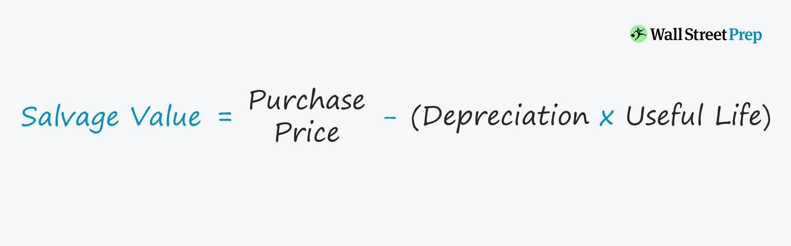

## Table of Contents

## What is scrap value depreciation?

Scrap value depreciation is a method used to calculate how much an asset loses value over time until it reaches its scrap value. Scrap value is the estimated amount of money you can get from selling the asset after it's no longer useful for its original purpose. This method helps businesses figure out the cost of using an asset over its useful life and plan their finances better.

In this method, you start with the original cost of the asset and subtract its scrap value. Then, you spread the remaining cost evenly over the number of years the asset is expected to be useful. For example, if a machine costs $10,000 and its scrap value is $1,000, you would spread the $9,000 difference over its useful life. If the useful life is 9 years, you would record a depreciation expense of $1,000 each year. This helps businesses keep track of the asset's value and plan for when they need to replace it.

## How does scrap value depreciation differ from other depreciation methods?

Scrap value depreciation is one way to figure out how much an asset loses value over time. It starts with the cost of the asset and subtracts what you can get for it when it's no longer useful, which is called the scrap value. The difference is then spread out evenly over the years the asset is expected to be used. This method is simple because it assumes the asset loses the same amount of value each year. For example, if a machine costs $10,000 and its scrap value is $1,000, you'd spread the $9,000 difference over its useful life.

Other depreciation methods, like straight-line or declining balance, work differently. Straight-line depreciation also spreads the cost evenly over the asset's life but doesn't consider scrap value. It's simpler and doesn't change even if the asset's value changes. Declining balance depreciation, on the other hand, assumes the asset loses more value at the beginning and less as time goes on. It's more complex but can be more accurate for assets that wear out quickly at first. Each method has its own way of calculating how much an asset is worth over time, and businesses choose the one that fits their needs best.

## What is the formula for calculating scrap value depreciation?

The formula for calculating scrap value depreciation is pretty straightforward. You start with the original cost of the asset. Then, you subtract the scrap value, which is what you think you can sell the asset for when it's no longer useful. The difference between the original cost and the scrap value is what you'll spread out over the years the asset will be used. For example, if a machine costs $10,000 and you think you can sell it for $1,000 when it's worn out, you'll spread the $9,000 difference over its useful life.

To figure out the annual depreciation expense, you divide the difference by the number of years the asset will be useful. So, if that $9,000 difference is spread over 9 years, you'd have a depreciation expense of $1,000 each year. This method helps businesses keep track of how much the asset is worth as it gets older and plan for when they need to replace it.

## Can you provide a simple example of how to apply the scrap value depreciation formula?

Let's say you bought a delivery van for your business. The van cost you $20,000, and you think you can sell it for $2,000 when it's too old to use anymore. That $2,000 is the scrap value. To figure out how much the van loses value each year, you subtract the scrap value from the original cost. So, $20,000 minus $2,000 leaves you with $18,000.

You expect to use the van for 6 years. To find out how much the van depreciates each year, you divide that $18,000 by 6 years. That comes out to $3,000 a year. So, every year, you'll record a depreciation expense of $3,000 for the van. This helps you keep track of how much the van is worth as it gets older and plan for when you'll need to buy a new one.

## What factors should be considered when determining the scrap value of an asset?

When figuring out the scrap value of an asset, you need to think about a few things. First, consider what the market is like for used or old versions of the asset. If there are a lot of people or businesses looking to buy second-hand items like the one you have, you might be able to sell it for more. On the other hand, if no one wants it, the scrap value could be lower. Also, think about the condition of the asset. If it's still in good shape and could be fixed up easily, it might be worth more than if it's falling apart and hard to repair.

Another important [factor](/wiki/factor-investing) is the material the asset is made from. Some materials, like metals, can be sold for recycling, which might give you a higher scrap value. For example, a steel machine could be worth more in scrap if the price of steel is high. You should also look at what similar items are selling for in the market. If you can find out what other people are getting for their old assets, it can help you guess what yours might be worth. By considering these things, you can come up with a more accurate scrap value for your asset.

## How does the estimated useful life of an asset affect scrap value depreciation?

The estimated useful life of an asset plays a big role in figuring out scrap value depreciation. When you know how long you can use an asset before it wears out, you can spread out the cost of the asset minus its scrap value over that time. For example, if a machine costs $10,000 and you think you can sell it for $1,000 when it's done, you'll spread the $9,000 difference over its useful life. If you expect to use the machine for 9 years, you'd record a depreciation expense of $1,000 each year. So, the longer the useful life, the smaller the yearly depreciation expense will be.

If you guess wrong about how long the asset will last, it can mess up your financial planning. If you think the asset will last longer than it actually does, you'll be spreading out the cost over too many years, making your yearly depreciation expense too low. On the other hand, if you think it won't last as long as it actually does, you'll be spreading the cost over too few years, making your yearly depreciation expense too high. Getting the useful life right helps you keep track of the asset's value accurately and plan for when you need to replace it.

## What are the tax implications of using scrap value depreciation?

Using scrap value depreciation can affect your taxes because it changes how much you can deduct each year. When you use this method, you figure out how much an asset loses value over time until it reaches its scrap value. This amount is your depreciation expense, which you can subtract from your income to lower your taxes. The more you can deduct, the less tax you have to pay. So, if you have a big asset with a high cost and a low scrap value, you might be able to deduct more each year, which could save you money on taxes.

However, the tax rules can be tricky. The IRS has rules about how you can depreciate assets, and they might not let you use scrap value depreciation for everything. Sometimes, they want you to use a different method, like straight-line depreciation, especially for certain types of assets. It's a good idea to talk to a tax professional to make sure you're doing it right and taking advantage of all the deductions you can. They can help you understand the rules and make sure you're not missing out on any tax savings.

## How can changes in market conditions impact the scrap value of an asset?

Changes in market conditions can really affect the scrap value of an asset. If the demand for used or old items like yours goes up, you might be able to sell it for more money. For example, if a lot of people suddenly want to buy second-hand machines because new ones are too expensive, the scrap value of your old machine could go up. On the other hand, if no one wants to buy used items, the scrap value could drop. Also, if the price of the materials your asset is made from, like steel or copper, goes up, you might get more money when you sell it for recycling.

The condition of the market for similar items also matters. If a lot of people are selling the same kind of asset at the same time, it might make the price go down because there's too much supply. But if there aren't many of those items available, the price could go up because people are willing to pay more for something that's hard to find. Keeping an eye on these market changes can help you guess what your asset might be worth when it's time to sell it as scrap.

## What are the limitations of using scrap value depreciation for financial reporting?

Using scrap value depreciation for financial reporting can have some limitations. One big problem is that it's hard to guess what the scrap value will be. The value of an old asset can change a lot depending on the market and how much people want to buy used items. If you guess wrong, your financial reports might not show the right value of your assets. This can make it hard for people looking at your reports to understand how much your business is really worth.

Another limitation is that scrap value depreciation assumes the asset loses the same amount of value each year. But in real life, some assets might lose value faster at first and then slow down. This method might not show the true value of your assets over time. Also, different countries or industries might have rules about how you can depreciate assets. If you use scrap value depreciation and it doesn't follow these rules, your financial reports might not be accepted. It's important to check the rules and see if this method works for your situation.

## How do companies typically account for scrap value depreciation in their financial statements?

Companies usually account for scrap value depreciation in their financial statements by figuring out the cost of the asset minus its scrap value and then spreading that amount evenly over the years the asset will be used. For example, if a machine costs $10,000 and they think they can sell it for $1,000 when it's worn out, they'll spread the $9,000 difference over its useful life. If the useful life is 9 years, they'll record a depreciation expense of $1,000 each year. This depreciation expense is shown on the income statement as an expense, which lowers the company's profit for the year.

On the balance sheet, the company will show the original cost of the asset and then subtract the total depreciation that's been recorded so far to find the asset's current value, also called its book value. So, after one year, the book value of the machine would be $10,000 minus $1,000, which is $9,000. This way, the financial statements show how much the asset is worth as it gets older. It helps the company and anyone looking at the financial statements understand the true value of the company's assets over time.

## What advanced methods can be used to more accurately predict scrap value over time?

To predict scrap value more accurately over time, companies can use advanced methods like regression analysis. This method looks at past data to find patterns and can help guess what the scrap value might be in the future. For example, if a company has records of what they got for old machines in the past, they can use that information to make better guesses about what they might get in the future. They can also look at things like how the market changes and what materials the asset is made from. By using regression analysis, companies can make more informed decisions and plan their finances better.

Another advanced method is [machine learning](/wiki/machine-learning). This involves using computers to learn from data and make predictions. Companies can feed the computer information about past sales of similar assets, market trends, and even the condition of the asset. The computer can then use this information to predict what the scrap value might be in the future. Machine learning can be really helpful because it can find patterns that people might miss and can update its predictions as new data comes in. This way, companies can have a more accurate idea of what their assets will be worth when they're done using them.

## How does scrap value depreciation integrate with overall asset management strategies?

Scrap value depreciation is a key part of managing assets in a business. It helps companies figure out how much an asset loses value over time until it's no longer useful. By knowing this, businesses can plan when to replace old assets and budget for new ones. It's like keeping a diary of how much each asset is worth as it gets older. This information is important for making smart decisions about buying, selling, and maintaining equipment.

Integrating scrap value depreciation into overall asset management strategies also helps with financial planning. Companies can use this method to spread out the cost of an asset over its useful life, which makes it easier to predict future expenses. This can help them set aside money for when they need to buy new assets or repair old ones. By keeping track of how much assets are worth and when they'll need to be replaced, businesses can run more smoothly and avoid surprises that could hurt their finances.

## What is the understanding of depreciation and scrap value?

Depreciation is a fundamental accounting technique utilized to allocate the cost of tangible assets over their useful lifespan. This method is essential for providing accurate financial reporting and for ensuring compliance with taxation authorities. The concept revolves around the systematic reduction of an asset's book value due to wear and tear, age, or obsolescence.

The calculation of depreciation is closely tied to the asset's scrap value, or residual value, which is the estimated value of an asset at the end of its useful life. Scrap value represents the recoverable amount from the asset's component parts when it is no longer functional. For instance, a manufacturing machine, when retired, might still have parts that can be sold or repurposed. These components add to the asset's scrap value.

In the context of calculating depreciation, the scrap value is significant because it reduces the asset’s depreciable base. The depreciable base is the portion of the asset's cost that is allocated over its useful life. The formula for establishing the total depreciation of an asset is given by:

$$
\text{Total Depreciation} = \text{Cost of Asset} - \text{Scrap Value}
$$

In financial planning, understanding scrap value is crucial in making informed decisions regarding asset purchasing and disposal. An accurate estimation of scrap value assists businesses in setting deprecation rates that reflect the true economic use of an asset. Moreover, it influences decisions on when to replace assets, how to evaluate new asset investments, and when to consider asset retirement.

Calculating scrap value involves professional judgment and estimation, often relying on historical data, industry standards, and market analysis. Companies frequently review these estimates to reflect changes in technology, market conditions, or usage patterns. As scrap value directly impacts financial statements, meticulous management of this valuation helps maintain financial transparency and operational efficiency.

## What are Depreciation Formulas and Methods?

Different depreciation methods are employed by businesses to match how an asset's value is expected to decline over time. Each method offers unique advantages and is suitable for different types of assets or business strategies. Here, we outline several popular depreciation methods: the Straight-Line method, the Declining Balance method, the Double-Declining Balance method, the Sum-of-the-Years' Digits method, and the Units of Production method. 

### Straight-Line Method

The Straight-Line method is the most straightforward and commonly used depreciation approach. It spreads an asset's depreciable value evenly across its useful life. The formula for the Straight-Line depreciation is:

$$
\text{Annual Depreciation} = \frac{\text{Cost of Asset} - \text{Scrap Value}}{\text{Useful Life}}
$$

This method is ideal for assets that incur wear and tear evenly over time.

### Declining Balance Method

The Declining Balance method is an accelerated depreciation technique. It allows for higher depreciation expenses in the initial years of an asset's life. The formula typically used is:

$$
\text{Depreciation for the Year} = \text{Book Value at Beginning of Year} \times \text{Depreciation Rate}
$$

The Depreciation Rate here is often a multiple of the Straight-Line rate, allowing for rapid expense recognition early in the asset's service. This method suits assets that rapidly lose value, such as technology.

### Double-Declining Balance Method

The Double-Declining Balance is a specific type of the Declining Balance method that doubles the Straight-Line rate, thus further accelerating depreciation. The formula is:

$$
\text{Depreciation for the Year} = 2 \times \frac{1}{\text{Useful Life}} \times \text{Book Value at Beginning of Year}
$$

It is effective for assets that are quickly outdated or lose efficacy, typically seen in technological or machinery investments.

### Sum-of-the-Years' Digits Method

The Sum-of-the-Years' Digits method is another accelerated depreciation strategy. Instead of a constant rate, this method applies a fraction derived from the sum of the asset's useful life years. The depreciation fraction decreases over time, which is calculated as follows:

$$
\text{Depreciation} = \left(\frac{\text{Remaining Life of Asset}}{\text{Sum of the Years' Digits}}\right) \times (\text{Cost} - \text{Scrap Value})
$$

For an asset with a useful life of 5 years, the sum of the years' digits would be $1 + 2 + 3 + 4 + 5 = 15$.

### Units of Production Method

The Units of Production method ties depreciation costs directly to the asset's usage, making it variable based on output. This is calculated as:

$$
\text{Depreciation Expense} = \frac{\text{Actual Production}}{\text{Estimated Total Production}} \times (\text{Cost} - \text{Scrap Value})
$$

The method is useful for manufacturing equipment where wear and tear are better matched with production levels rather than time.

Each method is selected based on the type of asset, business strategy, and financial reporting objectives. Proper understanding and application ensure that asset values are accurately reflected in financial statements, aiding in strategic financial planning and compliance.

## What is an Example of Using the Depreciation Formula and Scrap Value?

Consider a scenario where a company purchases machinery for $75,000. The machinery has an anticipated useful life of 8 years, and it is subjected to a 12% depreciation rate. To determine the annual depreciation expense using the Straight-Line method, the formula applied is:

$$
\text{Annual Depreciation} = \frac{\text{Cost} - \text{Scrap Value}}{\text{Useful Life}}
$$

Suppose the machinery’s scrap value at the end of its useful life is $3,000. The calculation would be as follows:

$$
\text{Annual Depreciation} = \frac{75,000 - 3,000}{8} = \frac{72,000}{8} = 9,000
$$

Therefore, the company allocates an annual depreciation expense of $9,000 to the financial statements over the equipment's life span. This expense reduces the book value of the asset each year, affecting both the balance sheet and the income statement. Accurate depreciation forecasts aid in making strategic financial decisions and planning for future costs associated with asset replacement.

Switching to a different method such as the Declining Balance could significantly impact the annual depreciation figures. The Declining Balance method applies a consistent depreciation rate to the declining book value, resulting in larger depreciation expenses in the initial years compared to the latter, thus reflecting rapid asset depreciation. Here's how this calculation might proceed if we apply cMost Common approach, the Double-Declining Balance (DDB):

First, determine the double of the straight-line rate, which is:

$$
\text{Double-Declining Rate} = 2 \times \frac{1}{\text{Useful Life}} = 2 \times \frac{1}{8} = 0.25
$$

Applying to the initial cost:

$$
\text{First Year Depreciation} = 0.25 \times 75,000 = 18,750
$$

The book value at the end of the first year becomes $75,000 - $18,750 = $56,250. This iterative process continues with subsequent calculations applied to the remaining book value. This method may be better suited for assets that lose value more quickly and thus require higher initial depreciation, impacting cash flow and tax obligations differently compared to the Straight-Line method.

In conclusion, the choice of depreciation method has a tangible effect on company financials, influencing reporting, taxation, and investment decisions. Understanding these differences is crucial for accurate asset management.

## What is the relationship between Algorithmic Trading and Asset Depreciation?

Algorithmic trading, a technology-driven approach to executing orders using automated pre-programmed trading instructions, relies significantly on technical infrastructure such as computer hardware and networking equipment. These tangible assets are subject to depreciation due to technological advancements and physical wear and tear, which impacts financial assessments and strategic planning for trading operations.

Managing these depreciating assets involves calculating their diminishing value to ensure accurate financial reporting. Depreciation accounting methods such as the straight-line or accelerated methods can be applied to [algorithmic trading](/wiki/algorithmic-trading) assets to reflect their usage and loss of value over time. This helps in determining the depreciation expense, which is critical for financial statements and tax purposes.

For instance, the straight-line method distributes the cost evenly over an asset's useful life. If a trading server is purchased for $20,000 with a useful life of five years and a scrap value of $5,000, the annual depreciation expense would be calculated as:

$$
\text{Annual Depreciation} = \frac{\text{Cost} - \text{Scrap Value}}{\text{Useful Life}} = \frac{20,000 - 5,000}{5} = 3,000
$$

This reflects an annual deduction of $3,000 against asset value, aiding financial predictability.

Aligning asset depreciation with financial models is crucial for maintaining operational efficiency in algorithmic trading. As technology evolves rapidly, trading entities must anticipate and budget for hardware upgrades, thus integrating depreciation insights into broader financial planning models. Anticipating such upgrades prevents unexpected disruptions and ensures sustained competitiveness in fast-paced trading environments.

By incorporating asset depreciation data, algorithmic trading firms can optimize their infrastructure investments and operational strategies. This alignment involves regularly reviewing depreciation schedules and revising them according to the latest technological advancements, facilitating smooth transitions to newer assets without compromising trading capabilities.

## References & Further Reading

Kimmel, P. D., Weygandt, J. J., & Kieso, D. E. have extensively covered financial accounting, providing foundational insights into depreciation and asset management. Their work can offer valuable information on various depreciation methods and their implications for financial reporting and tax compliance. It serves as a critical resource for understanding the theoretical underpinnings and applications of depreciation formulas, including how scrap value affects asset valuation over time. 

Chan, E. P.'s "Algorithmic Trading: Winning Strategies and Their Rationale" offers in-depth analysis of how algorithmic trading operates, emphasizing the significance of maintaining efficient technological infrastructure. This book illustrates how depreciating technology assets can impact trading strategies and operations, providing practical insights into aligning trading models with asset management.

Johnson, B.'s "Algorithmic Trading and DMA: An Introduction to Direct Access Trading Strategies" introduces readers to direct access trading strategies, providing a comprehensive look at how algorithmic trading functions. Understanding asset depreciation within the context of these strategies highlights the importance of forecasting technological upgrades and managing costs efficiently to remain competitive in the fast-paced trading environment.

