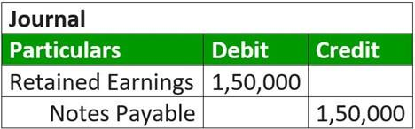

The world of financial trading is undergoing significant evolution with the integration of innovative technologies and financial instruments reshaping traditional approaches. Among the forefront of these advancements are the introduction and utilization of financial instruments such as scrip, the emergence of alternative currencies, and the increasing prevalence of algorithmic trading, commonly referred to as algo trading. These reforms are pivotal in redefining established practices, offering both improved efficiencies and presenting new challenges in the financial landscape.

The concept of scrip, once used historically as a replacement for legal tender in certain situations, now finds modern applications in loyalty programs and corporate incentives, demonstrating a shift in how value can be perceived and utilized. Similarly, alternative currencies, including cryptocurrencies or localized economic systems, provide innovative platforms outside traditional fiat systems, enhancing local economic sovereignty and presenting new paradigms for financial transactions.

Simultaneously, algorithmic trading has become a cornerstone of modern finance, leveraging real-time data and computational power to execute trades with unparalleled speed and precision. This technology-driven approach has not only increased market participation and liquidity but also introduced complexities related to risk management and technological dependency.

These elements collectively transform modern finance by creating opportunities through greater access, efficiency, and diversification in trading practices. Nonetheless, these innovations come with potential drawbacks and complexities, including regulatory challenges, ethical considerations, and the risk of system exploitation. For investors and market participants, understanding the nuances of these developments is crucial in navigating and optimizing their positions in this increasingly intricate financial environment.

## Table of Contents

## Understanding Financial Instruments: Scrip and Its Role

A scrip is an alternative form of currency that can replace traditional legal tender under certain circumstances. Historically, scrips have been employed in situations where access to official currency was limited or to facilitate transactions in specific settings. For example, during the 19th and early 20th centuries, coal companies in the United States issued their own currency (scrip) to pay workers, who could then use it at company-owned stores. Similar uses of scrip were observed in other industries and communities that were economically isolated or cash-poor.

In contemporary contexts, scrips manifest in various forms, such as loyalty programs, gift cards, and scrip dividends. Loyalty programs often use points, a type of scrip, to encourage repeat business by allowing customers to earn and redeem points for rewards. Gift cards serve as modern scrips by providing a fixed monetary value that can be exchanged for goods or services at specific retailers. Companies also issue scrip dividends, where shareholders can receive additional stock instead of cash dividends, effectively functioning as an alternate form of currency within that corporate system.

The advantages of using scrips are multifaceted. Companies can exert cost control by issuing scrips, as these tools often encourage reinvestment into the business through mechanisms like gift cards or loyalty points. Additionally, scrips can build customer loyalty by fostering habitual patronage. However, the use of scrips can restrict consumer freedom by limiting where and how the scrip can be spent, thus reducing the [liquidity](/wiki/liquidity-risk-premium) that typical cash transactions offer.

The evolution of scrip highlights both historical and modern applications that contribute to our understanding of alternative currencies within broader financial contexts. By examining the development and usage of scrip, we can discern its role in shaping financial practices and consider its implications in the balance between corporate interests and consumer autonomy. The historical and current utilization of scrip demonstrates its potential as a financial instrument for both facilitating commerce and influencing consumer behavior.

## Alternative Currencies: Expansion Beyond Traditional Money

Alternative currencies have emerged as significant tools for facilitating transactions outside of traditional fiat currency systems. These non-traditional currencies encompass a wide range of forms, including cryptocurrencies, local currencies, and community bartering systems, each contributing uniquely to the financial ecosystem.

Cryptocurrencies, such as Bitcoin and Ethereum, have revolutionized how transactions can be conducted online. These digital currencies rely on blockchain technology, which ensures transparent, secure, and decentralized transactions. The use of cryptocurrencies can reduce transaction costs and enable swift global transfers without the need for intermediary banks. However, they are also subject to high [volatility](/wiki/volatility-trading-strategies), sudden regulatory changes, and security concerns, such as hacking and fraud.

Local currencies serve community-based economic functions by enabling transactions within a defined geographical area. They promote local business engagement by encouraging residents to spend locally rather than opting for mainstream currency alternatives. Initiatives like the Totnes Pound in the UK, and BerkShares in the US highlight how local currencies can bolster regional economic resilience. However, these currencies face challenges, including limited acceptance outside their region and the complexity of managing a currency without a broader exchange system.

Community bartering systems offer creative avenues to bypass the use of money entirely. Participants trade goods or services directly, fostering a network of mutual benefit and trust. Bartering can enhance community ties and economic interaction without financial exchange. Nonetheless, bartering can be inefficient on a larger scale due to the double coincidence of wants—where each party must have what the other desires.

The role of alternative currencies in promoting a decentralized economic structure is gaining attention from global financial institutions. These currencies are reshaping how transactions are managed, offering insights into potential futures for money and trade. Decentralization may reduce the influence of traditional financial bodies and provide individuals and communities with greater control over their economic interactions.

In assessing the potential of alternative currencies, it becomes clear that they play a crucial role in the evolving landscape of financial transactions. While they offer substantial benefits such as enhancing local economies and reducing costs, they introduce challenges that must be critically addressed. Addressing regulatory, security, and volatility concerns will be vital for these currencies to gain widespread acceptance and stability. 

Ultimately, the exploration and integration of alternative currencies may well redefine how we perceive and conduct financial transactions, paving the way for a more diversified and potentially adaptable economic future.

## Algorithmic Trading: The Technological Backbone

Algorithmic trading, often referred to as algo trading, is transforming financial markets by using computer programs to execute trades at speeds and accuracies unachievable by human traders. This technology operates on pre-defined strategies that eliminate human intervention, leveraging the capabilities of modern computing to handle vast quantities of data and execute orders within microseconds. The adoption of [algorithmic trading](/wiki/algorithmic-trading) has led to a significant increase in the [volume](/wiki/volume-trading-strategy) of trades and liquidity in financial markets.

At its core, algorithmic trading draws on statistical and quantitative methods to identify trading opportunities. These algorithms use complex mathematical models to analyze market data in real-time and make decisions based on patterns, trends, and signals derived from historical data. For example, a typical algorithm might follow a mean reversion strategy, where it analyzes the historical average of a stock price and makes trades when the price deviates from this average.

Python has become a preferred language for developing algorithmic trading strategies due to its powerful libraries and frameworks. Libraries such as NumPy and pandas allow for efficient data manipulation, while libraries like SciPy and statsmodels provide statistical tools necessary for creating sophisticated trading models. Machine learning libraries such as scikit-learn and TensorFlow are increasingly being integrated into trading algorithms to enhance their predictive accuracy and adaptiveness.

Algorithmic trading platforms such as [Interactive Brokers](/wiki/interactive-brokers-api), TradeStation, and QuantConnect offer varying capabilities to traders. Interactive Brokers, for instance, provides API access allowing traders to automate their strategies, while TradeStation is known for its robust strategy-testing environment. QuantConnect offers a cloud-based platform where traders can write and backtest algorithms in multiple programming languages, with access to extensive datasets.

While algorithmic trading presents opportunities for high efficiency and potentially significant profits, it also carries risks inherent to its reliance on technology. Technical failures such as connectivity issues, bugs in the algorithm, or hardware failures can lead to substantial financial losses. There is also the risk associated with faulty algorithms which might misinterpret market data or respond inappropriately to unexpected market conditions.

The landscape of algorithmic trading is evolving with the incorporation of [artificial intelligence](/wiki/ai-artificial-intelligence) (AI) and [machine learning](/wiki/machine-learning). These technologies are being used to develop trading algorithms that can learn from data, improve over time, and even predictive model market behaviors. Machine learning techniques like [reinforcement learning](/wiki/reinforcement-learning) are particularly promising as they allow algorithms to optimize trading strategies based on historical success metrics.

In conclusion, algorithmic trading is reshaping the financial trading sector by increasing the speed and accuracy of transactions. Despite its advantages, it necessitates rigorous testing and robust risk management to mitigate the potential adverse effects of its risks. As AI and machine learning continue to develop, the future of algorithmic trading is expected to become even more sophisticated, offering a blend of opportunity and complexity to traders worldwide.

## Challenges and Risks of Integrating Alternative Financial Instruments

The integration of scrip, alternative currencies, and algorithmic trading into contemporary financial systems introduces several challenges and risks, chiefly revolving around regulation and security. The regulatory landscape for these financial instruments is often underdeveloped, struggling to keep pace with rapid advancements and innovations. The lack of clear regulatory frameworks can result in fragmented market practices and increase the risk of market manipulation. For example, the anonymity and decentralization inherent in many alternative currencies, particularly cryptocurrencies, can be exploited for illegal activities such as money laundering or fraud if not properly regulated. 

Security concerns are paramount, as these instruments often depend heavily on digital interfaces and networks. The digital nature of alternative currencies and algo trading systems makes them vulnerable to cyber-attacks, data breaches, and technical failures. A single vulnerability in a trading algorithm or a weakness in the blockchain technology underpinning a [cryptocurrency](/wiki/cryptocurrency) could lead to significant financial loss and market volatility. 

The potential for algorithmic trading systems to malfunction due to technical glitches or erroneous programming can have cascading effects on market stability. This was exemplified by incidents like the Flash Crash of 2010, where rapid sell-offs triggered by algorithms led to a brief but dramatic collapse in asset prices.

Ethical considerations are also vital. Ensuring the fair and responsible use of these technologies is crucial in order to avoid exploitation or further market disparities. For instance, high-frequency trading, a form of algorithmic trading, is often criticized for creating an uneven playing field where only technologically sophisticated traders can capitalize on microsecond market movements.

To address these challenges, robust risk management strategies must be applied. This includes developing comprehensive regulatory standards for new financial instruments, enhancing cybersecurity measures, and promoting transparency and accountability. Continuous testing and validation of algorithmic trading systems are necessary to prevent technical failures. Simultaneously, fostering collaboration among innovators, regulators, and market participants is essential to create a cohesive framework that supports sustainable market practices. 

Ultimately, mitigating the risks associated with integrating these alternative financial instruments involves a delicate balance of innovation, regulation, and ethical considerations, each playing a crucial role in shaping the stability and integrity of future financial ecosystems.

## Conclusion: The Future Landscape of Financial Trading

The interplay between scrip, alternative currencies, and algorithmic trading suggests a transformative shift in the future landscape of financial trading. These elements collectively democratize financial systems, offering broader market access and innovative value creation and measurement methods. As these instruments gain traction in the global financial ecosystem, there is an increasing need for education, rigorous testing, and ethical oversight to ensure their effective and fair implementation.

Scrip and alternative currencies challenge traditional notions of money and value exchange, potentially empowering communities through localized economies and reducing reliance on centralized financial systems. Algorithmic trading enhances market efficiency, providing rapid execution and precision that can optimize trading strategies.

As these components become more prevalent, stakeholders must remain informed and adaptable to leverage their potential. Financial institutions, regulators, and investors should prioritize developing robust frameworks that incorporate these technologies while addressing the associated risks. This involves fostering an understanding of the technical and ethical dimensions, ensuring that these innovations contribute positively to financial stability and economic growth.

Ultimately, the future success of modern financial systems hinges on the strategic integration and management of these emerging financial instruments. By harnessing their power and mitigating their risks, stakeholders can shape a more inclusive, efficient, and resilient financial environment.

## References & Further Reading

[1]: Bergstra, J., Bardenet, R., Bengio, Y., & Kégl, B. (2011). ["Algorithms for Hyper-Parameter Optimization."](https://dl.acm.org/doi/10.5555/2986459.2986743) Advances in Neural Information Processing Systems 24.

[2]: ["Advances in Financial Machine Learning"](https://www.amazon.com/Advances-Financial-Machine-Learning-Marcos/dp/1119482089) by Marcos Lopez de Prado

[3]: ["Evidence-Based Technical Analysis: Applying the Scientific Method and Statistical Inference to Trading Signals"](https://www.amazon.com/Evidence-Based-Technical-Analysis-Scientific-Statistical/dp/0470008741) by David Aronson

[4]: ["Machine Learning for Algorithmic Trading"](https://github.com/stefan-jansen/machine-learning-for-trading) by Stefan Jansen

[5]: ["Quantitative Trading: How to Build Your Own Algorithmic Trading Business"](https://www.amazon.com/Quantitative-Trading-Build-Algorithmic-Business/dp/1119800064) by Ernest P. Chan