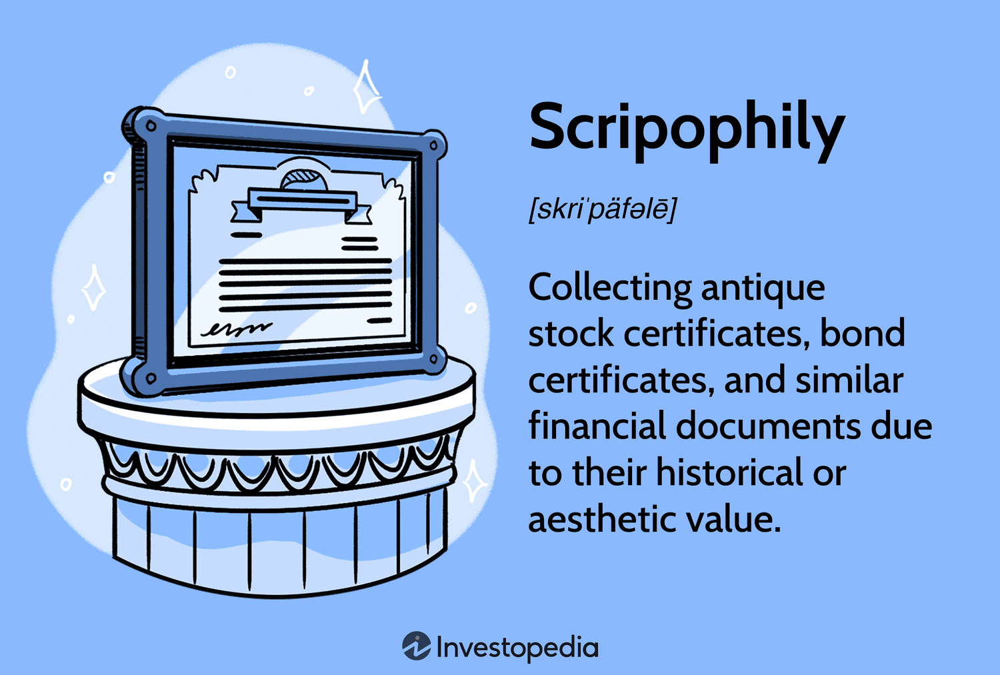

Scripophily is the burgeoning hobby of collecting stock certificates, which offers enthusiasts a unique glimpse into the financial history and artistry of past centuries. Essentially, it is the study and collection of old bonds and share certificates, imbuing them with new significance as tokens of a pre-digital era. The word "scripophily" itself derives from the English term "scrip," referring to a substitute for currency or shares, and the Greek word "philos," meaning love or fondness. This activity has garnered increasing interest as collectors seek tangible connections to historical financial documentation, often encapsulated within decorative and historic certificates.

As global reliance on digital trading platforms and electronic transactions intensifies, scripophily serves as a fascinating counterpoint to the ephemeral nature of modern finance. Investors and history aficionados alike are drawn to the physical artifacts of financial history, each certificate telling its own story and providing a historical bridge to the enterprises and financial practices of yesteryears. Unlike the instantaneous and algorithm-driven decisions characteristic of contemporary algorithmic trading, scripophily embodies patience, historical curiosity, and an appreciation for financial artistry.



Algorithmic trading represents a significant juxtaposition to scripophily, leveraging technology to execute orders at speeds and frequencies impossible for human traders alone. This method relies on complex algorithms to analyze market variables, devise strategies, and implement trades, highlighting the continual evolution of trading practices. Despite these advancements, the tangible satisfaction derived from holding a piece of financial history in one's hands continues to intrigue many collectors.

The intersections between scripophily and modern trading practices extend beyond mere contrast; they also offer intriguing potential synergies. For instance, the emergence of digital collectibles and non-fungible tokens (NFTs) presents opportunities to bridge physical and digital worlds. These innovations suggest possibilities for digital representations of historical stock certificates, blending nostalgia with sophisticated technology.

In essence, scripophily invites a broader understanding of financial heritage, providing modern collectors with an opportunity to explore financial narratives from a distinctly tactile perspective. This traditional hobby not only preserves a tangible past but also intersects with contemporary technology, posing intriguing questions about the future of trading and collecting alike.

## Table of Contents

## Understanding Scripophily

Scripophily is the practice of collecting old stock and bond certificates, deriving its name from the English word "scrip," which was historically used to denote a certificate of stock or a document certifying ownership, and the Greek word "philos," meaning "lover or enthusiast." This hobby has grown in popularity due to the unique confluence of historical, artistic, and financial interest. 

Historically, stock certificates served as proofs of ownership and investment in corporations before the digital age made such physical documentation largely redundant. Collectors are attracted to scripophily because these certificates represent significant moments in financial history, mark the evolution of major corporations, and often display the intricate artistry of their engravings. Each certificate carries a story, reflecting the socio-economic context in which it was issued. The artistic designs speak to historical trends in graphic art and printmaking, often incorporating ornate typography, detailed allegorical illustrations, and iconic corporate imagery, all of which hold aesthetic value for collectors.

Scripophily is akin to other collectible hobbies like philately (stamp collecting) and numismatics (coin collecting) in several ways. All three hobbies appeal to enthusiasts interested in the historical narratives and aesthetic qualities of the items. However, while stamp collectors may prioritize the rarity and postmark details of stamps, and coin collectors might focus on minting errors or provenance, scripophilists often emphasize the historical significance of the issuing company, the artwork, and whether the certificate bears the signatures of notable individuals. Unlike stamps and coins, which have official repositories (i.e., postal services or mints), stock certificates originate from a diverse array of private and public entities, adding another layer of complexity for collectors.

The nuanced stories behind each certificate, combined with their artistic appeal, make scripophily a rich and interesting field for those passionate about history, art, and finance.

## Historical Value of Stock Certificates

Stock certificates, historically significant as proofs of investment ownership, played a crucial role in the financial systems of the pre-digital era. They served not only as tangible evidence of an individual's stake in a company but also as a formal acknowledgment of the contractual obligations between corporations and their shareholders. These certificates contained vital information, including the name of the issuing corporation, the identity of the shareholder, the number of shares owned, and the par value of the shares. By embedding these details in a physical document, stock certificates reduced the risk of disputes and facilitated the transfer and verification of ownership.

The aesthetic value of stock certificates contributed significantly to their appeal and enduring collectibility. Beyond their financial utility, these certificates were often elaborate works of art, meticulously designed and printed using advanced engraving techniques of the time. The artistry involved in their creation often reflected the prestige and ambition of the issuing company. Elaborate borders, intricate engravings of company logos, allegorical figures, and detailed vignettes were common elements that enhanced the visual appeal and uniqueness of each certificate. The combination of complex artwork and precision printing helped prevent counterfeiting and added a layer of authenticity.

Several companies, particularly those with a storied history or significant cultural impact, have issued stock certificates highly prized by collectors today. Apple Inc., for instance, has certificates from its initial public offering (IPO) that are sought after due to the company's transformational role in technology and the prominence of its founders. Likewise, certificates from the Ford Motor Company are valued not only for their historical significance in revolutionizing transportation but also for their connection to Henry Ford, a pivotal figure in industrial history. Collectors often seek these certificates as symbols of innovation and legacy, encapsulating a tangible piece of financial and cultural history.

Overall, stock certificates from prominent companies serve as a bridge between financial history and art, narrating the evolution of business and economics. Their combination of historical significance, artistic design, and connection to influential figures enhances their value and interest among collectors.

## Factors Influencing the Value of Stock Certificates

Stock certificates hold intrinsic collectible value based on several factors. These include rarity, condition, and historical significance. Understanding these elements is key to appraising and appreciating the certificates' worth.

**Rarity** plays a significant role in the valuation of stock certificates. Similar to other collectibles, items that were issued in limited numbers or have a low survival rate tend to be more valuable. The rarity of a stock certificate could be due to the short-lived nature of the issuing company, limited issuances, or the passage of time during which most other certificates were lost or discarded. For example, a stock certificate from a defunct company that played a pivotal role in a historical economy, but issued few shares, would likely be rare and thus more valuable.

**Condition** is another crucial factor affecting value. Like any collectible, certificates in pristine condition—those without folds, tears, stains, or signs of wear—are valued more highly than those in poorer condition. Enthusiasts and investors often seek certificates that have been well-preserved, as these retain their original artistry and detail, which is often a key aspect of their appeal.

**Historical Significance** enhances a certificate's collectible value when it is connected to noteworthy figures, companies, or events. Certificates from influential companies, especially those that have made significant technological or industrial advancements, carry significant interest from collectors. For instance, the Apple Computer IPO certificate is a notable example. As Apple is a seminal company in the personal computing revolution, its stock certificate from the time it went public holds substantial historical importance and, consequently, a higher collectible value.

Additionally, **signatures** on stock certificates can increase their value. Certificates signed by well-known individuals, particularly founders or influential figures, are particularly sought after. A signature from a historic figure can transform an ordinary certificate into a highly prized artifact. For example, a certificate signed by Thomas Edison from one of his companies would [carry](/wiki/carry-trading) significant value due to Edison's lasting impact on technology and innovation.

Noteworthy sales highlight these valuation factors. The sale of an original Apple Computer stock certificate, signed by Steve Jobs and Steve Wozniak, exemplifies how rarity, historical significance, and notable signatures converge to elevate a certificate's value considerably.

In summary, the collectible value of stock certificates is significantly influenced by their rarity, condition, historical context, and the presence of significant signatures. Collectors and investors utilize these criteria to appraise the desirability and worth of these tangible pieces of financial history.

## Modern Re-Emergence of Stock Certificates

The modern re-emergence of stock certificates as collectible items reflects a unique intersection of nostalgia and investment interest. In an era dominated by digital transactions, these tangible artifacts connect collectors to the financial traditions of the past. Several companies have capitalized on this interest by issuing paper stock certificates specifically designed for the collector market. Unlike their predecessors, these modern certificates are typically non-redeemable, meaning they do not represent an actual financial stake in the company. This distinct feature follows specific regulations that classify them more as memorabilia than financial instruments.

Regulatory frameworks ensure that these collectible certificates clearly differentiate from actual stock certificates. This distinction is crucial to prevent confusion in financial markets and protect investors. Typically, these regulations require clear annotations or designations indicating that the certificates hold no redeemable value. Consequently, they are marketed primarily for their aesthetic and nostalgic value rather than as investment vehicles.

Examples of companies offering such collectible stock certificates include prominent technology and media firms. Meta, formerly known as Facebook, and Pixar, a leader in animation, are two examples. These companies leverage their strong brand identities to offer collectors a piece of their corporate story, devoid of financial claims. These certificates often feature intricate designs or imagery associated with the company's history or achievements, enhancing their appeal to collectors.

This modern approach not only rekindles interest in historical financial instruments but also aligns with broader collecting trends where physical artifacts hold cultural and emotional significance. As digital assets and transactions dominate the financial landscape, tangible stock certificates provide a nostalgic counterbalance, celebrating the art and history inherent in the world's economic development.

## Integrating Scripophily with Modern Trading Practices

Algorithmic trading utilizes computer algorithms to execute a large number of orders at high speed in modern financial markets. These algorithms can process data much quicker than humans, allowing for efficient execution of trades based on pre-determined criteria, such as timing, price, or [volume](/wiki/volume-trading-strategy). This form of trading is predominant in today's markets, where vast amounts of data and complex strategies are involved.

The contrast between [algorithmic trading](/wiki/algorithmic-trading) and the collecting of physical stock certificates, known as scripophily, highlights a fascinating intersection of past and present financial practices. Scripophily offers enthusiasts the opportunity to hold tangible pieces of financial history, representing both artistic and historical significance.

The juxtaposition of these two practices—one digital and forward-looking and the other physical and retrospective—creates intriguing potential for integration. As financial technology advances, digital collectibles or non-fungible tokens (NFTs) could represent historic stock certificates, offering a new way to engage with financial history. NFTs allow for the digital representation of any asset, providing a secure method of ownership verification and transfer through blockchain technology. This could enhance the appeal of scripophily by adding a digital layer to the collection of historical artifacts.

For instance, digital replicas of historic stock certificates could be created as NFTs, providing collectors with a means of preserving the aesthetic and historical elements of the original certificates while also participating in the modern blockchain economy. These digital collectibles can maintain a verifiable connection to their physical counterparts, ensuring authenticity and provenance.

Furthermore, as blockchain technology continues to evolve, the potential exists for integrating these digital collectibles within the framework of algorithmic trading. This integration could allow for new types of financial instruments that combine the historical and artistic value of scripophily with the analytical precision of algorithmic trading, paving the way for innovative investment strategies that meld the traditional and the contemporary.

## Getting Started with Stock and Bond Collecting

To begin a collection of stock and bond certificates, one must first become familiar with the process of identifying authentic certificates. Authenticity is a pivotal [factor](/wiki/factor-investing), as it determines both the historical and potential financial value of the certificates.

**Identifying Authentic Certificates:**

Authentic stock certificates have several distinguishing features:

1. **Watermarks:** Look for watermarks when holding the certificate up to light. These are often used to prevent forgery.

2. **Paper Quality:** Genuine certificates are typically printed on high-quality paper. The texture and weight of the paper can offer clues about authenticity.

3. **Ink and Printing:** Pay close attention to the ink and printing quality. Historical certificates often involve intricate designs and colors that may be difficult to reproduce accurately.

4. **Signatures and Stamps:** Verify the signatures and any company stamps. These can include endorsements or corporate seals that confirm authenticity.

**Sources for Acquiring Old Stock Certificates:**

1. **Auctions:** Auctions, both online and offline, provide an excellent opportunity to find rare and valuable stock certificates. Websites like eBay often list collectible certificates, but it's vital to research the seller's reputation.

2. **Specialized Shops:** There are physical and online shops dedicated to scripophily. These shops can offer both expertise and a wide range of certificates.

3. **Online Platforms and Forums:** Platforms such as Scripophily.com specialize in historical stock certificates, providing collectors with a marketplace that often includes authentication services.

**Appraising and Verifying Legitimacy and Value:**

Once a certificate is acquired, determining its legitimacy and appraising its value are crucial steps:

1. **Historical Research:** Investigate the issuing company’s history. Companies with historical significance or unique narratives often see higher collectible values. This also includes understanding the company's industry and any famous individuals related to it.

2. **Professional Appraisal Services:** Consider using a professional appraiser specializing in scripophily. They can provide accurate valuations and verifications, often necessary for insurance or sale purposes.

3. **Condition Assessment:** Assess the certificate’s physical condition. Factors such as tears, stains, and fading can affect value. Preservation in acid-free sleeves or frames is recommended to maintain condition over time.

Stock and bond collecting can provide a unique combination of art appreciation, historical exploration, and investment education. By understanding authenticity, utilizing diverse purchasing avenues, and implementing thorough appraisal processes, collectors can build a valuable and culturally enriching collection.

## Conclusion

Scripophily holds a distinctive niche, combining the worlds of financial history and artistic expression. This hobby not only allows enthusiasts to appreciate the aesthetic craftsmanship of stock certificates but also offers a portal into the past economic landscapes and the stories of businesses that have shaped industries. The intricate designs often found on these certificates reflect the artistry of a bygone era, serving as miniature works of art that tell captivating narratives about entrepreneurship and innovation.

Exploring scripophily introduces collectors to the historical contexts and economic events that contributed to the rise of significant companies. Each stock certificate bears witness to a unique moment in history, encapsulating the pioneering spirit of its time. This tangible connection to the past enhances the appeal of collecting, providing individuals with a means to hold a piece of economic history.

In today's increasingly digital world, the tangible nature of stock certificates offers a refreshing contrast. As modern finance shifts towards digital platforms and algorithmic trading, these certificates stand as enduring representations of an older financial system, where physical documentation served as a primary record of ownership. This juxtaposition highlights the enduring allure of owning physical artifacts amidst the growing intangibility of digital financial transactions.

Embracing scripophily not only enriches one's understanding of financial heritage but also invites collectors to appreciate the artistry and stories embedded within these documents. As the world continues to digitize, the appeal of physical stock certificates is likely to grow, standing as testament to both the evolution of commerce and the beauty of its documentation. Collectors are encouraged to immerse themselves in the rich narratives and historical significance embodied by these certificates, discovering the stories that lie within their intricate designs and understanding the profound impact of the economic events they represent.

## FAQs

Old stock certificates often spark curiosity among collectors and investors, prompting several common questions about their validity and worth.

### Are Old Stock Certificates Still Valid?

The primary question many have is whether old stock certificates still hold any monetary value as a representation of ownership. Typically, the validity of a certificate as a claim to equity in a company depends on whether the issuing company still exists and, if so, whether it has undergone any significant corporate changes such as mergers, acquisitions, or dissolutions. If the issuing company has been dissolved or acquired, the certificate may no longer hold investment value but could be collectible.

### What Factors Determine the Worth of Old Stock Certificates?

Several factors contribute to the collectible value of an old stock certificate:

- **Rarity**: Certificates issued in limited quantities or from defunct companies with historical significance generally hold higher value.
- **Condition**: The physical state of the certificate is critical; collectors prefer certificates that are well-preserved with minimal wear, tears, or discoloration.
- **Historical Significance**: Certificates from historically important companies or events can fetch higher prices. For instance, an original Apple Computer IPO certificate may be of significant interest.
- **Artistic Value**: The design and artistry, including elaborate borders and imagery, can enhance a certificate's appeal to collectors.
- **Signatures**: Certificates bearing the signatures of prominent individuals are more valuable. For example, a certificate signed by a renowned industrialist could be highly prized.

### How Can One Check the Potential Current Investment Value of a Certificate?

To determine whether an old stock certificate retains any current investment value, follow these steps:

1. **Company Status Verification**: Verify whether the company is still operational and what corporate actions have impacted it. This can often be done by searching online databases or company registries.

   ```python
   import requests

   def check_company_status(company_name):
       url = f"https://company_registry_api.com/{company_name}"
       response = requests.get(url)
       if response.status_code == 200:
           return response.json()  # Returns company status and details
       else:
           return "Company not found"

   # Example usage
   status = check_company_status("Old Company Inc.")
   print(status)
   ```

2. **Consult Financial Institutions**: Contact the company's investor relations department or a financial institution to check if the shares still have monetary value.

3. **Seek Expertise**: Consult a professional scripophilist or a stock certificate appraisal service to get an expert opinion on both its financial and collectible worth.

By understanding these aspects, collectors and enthusiasts can better appreciate the multifaceted value that old stock certificates can hold.

## References & Further Reading

[1]: Rinaldi, A. (2003). Scripophily: Collecting Bonds and Share Certificates. London: Portfolio Press. 

[2]: Ball, A. (2014). ["Scripophily Revival: Stocks as Works of Art"](https://fastercapital.com/content/Scripophily--The-Art-and-History-of-Collecting-Stock-and-Bond-Certificates.html). Financial Times.

[3]: ["Collectible Stocks and Bonds from North American Railroads: Antiquities of the American Railroads"](https://www.amazon.com/Collectible-Stocks-Bonds-American-Railroads/dp/0974648515) by Terry Cox

[4]: Fisher, M. (2005). Collecting Paper Money and Bonds. Oxford University Press.

[5]: ["Old Stocks and Bonds: The Collectible Art"](https://www.glabarre.com/category/Stocks_and_Bonds/c1) on Kotak.com.