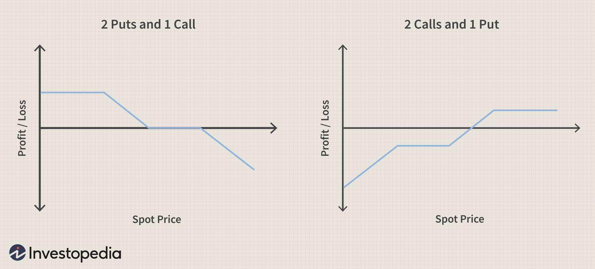

In today’s complex financial markets, options trading has gained prominence as a viable method for hedging and speculation. This has urged traders and investors to explore a diverse array of financial derivatives. Among these, the seagull option strategy stands out as it merges different elements of options, particularly a mix of call and put options, to effectively manage both risk and potential returns.

The seagull option is constructed using a combination of two long positions and one short position in options, or vice versa, to achieve a balanced risk-return profile. This article examines the intricacies of the seagull option, detailing its structure, underlying benefits, and comparisons with other trading strategies within algorithmic trading. Algorithmic trading, which relies on automated trading systems, allows for the optimization of such strategies in a highly dynamic market environment.



Automated trading strategies, when applied to seagull options, offer the flexibility to respond swiftly to market changes. By aligning algorithmic tools with seagull options, traders can dynamically manage their portfolios, optimizing risk and return across various market conditions. We will investigate how these strategies contribute to modern financial markets.

Key concepts surrounding seagull options, such as their strategic construction, potential benefits, and associated risks, will be discussed throughout this article. Moreover, examples will be provided to illustrate the application of seagull options, empowering traders to incorporate this strategy into their trading practices effectively.

## Table of Contents

## What Are Financial Derivatives and Options?

Financial derivatives are financial instruments that derive their value from an underlying asset, index, or rate. They serve a crucial role in financial markets by allowing traders to hedge against potential risks or speculate on price movements. Among the most widely used financial derivatives are options, which offer flexibility and strategic possibilities.

Options are contracts that grant the holder the right, but not the obligation, to buy or sell an underlying asset at a predetermined price, known as the strike price, before or on a specified expiration date. This unique feature distinguishes options from other financial instruments, as it enables option holders to capitalize on favorable price movements while limiting potential losses to the premium paid for the option.

There are two primary types of options: call options and put options. A call option provides the holder with the right to purchase the underlying asset at the strike price, whereas a put option grants the right to sell the asset at the strike price. This ability to selectively engage in buying or selling activities makes options a valuable tool for both hedging and speculation.

In hedging scenarios, options are often used to protect against adverse price movements in existing positions. For instance, an investor holding a stock might purchase a put option to set a floor on potential losses if the stock price declines. Conversely, speculators may use options to leverage their market positions, aiming to profit from anticipated price movements without the need to initially invest large amounts of capital.

The mechanics of options trading involve key elements such as the option premium, which is the price paid by the buyer to the seller (writer) for acquiring these rights. The premium is influenced by several factors, including the underlying asset's [volatility](/wiki/volatility-trading-strategies), time remaining until expiration, and the difference between the current market price and the strike price.

Understanding these fundamental aspects of options is essential for traders looking to employ more advanced strategies, such as the seagull option. This strategy combines various option positions to potentially enhance returns while managing risk, exemplifying the versatility of options as financial instruments. Overall, options as a subset of financial derivatives provide traders with a powerful mechanism to navigate the complexities of financial markets.

## Exploring the Seagull Option Strategy

A seagull option strategy is a composite options trading approach that involves three distinct positions, incorporating a combination of call and put options. Specifically, it consists of taking positions in two call options and one put option or, alternatively, two put options and one call option. The primary goal of this strategy is to manage downside risk while optimizing the potential returns under specific market conditions.

### Bullish and Bearish Configurations

The seagull option strategy can be tailored to reflect either bullish or bearish market perspectives. 

- **Bullish Configuration:** In a bullish setup, a trader would typically purchase a call spread and simultaneously sell an out-of-the-money put option. This configuration allows the trader to benefit from upward market movements while capping potential losses should the market trend downward. The sale of the put option often funds the call spread, aiming for a zero net premium structure.

- **Bearish Configuration:** Conversely, in a bearish scenario, the trader might buy a put spread and sell an out-of-the-money call option. This arrangement is beneficial when a market downturn is anticipated, as it allows the trader to capture gains from a decline in asset prices while mitigating risk exposure from adverse upward movements.

### Zero Net Premium Construction

A notable feature of the seagull option strategy is its capacity to be structured for zero net premium. This means the premiums collected from writing options (either calls or puts) offset the costs of purchasing options, ideally resulting in no initial capital outlay. This is particularly advantageous in environments where volatility is anticipated to decrease, as the premium collected can effectively cover the initial costs of establishing the options positions.

To achieve zero net premium, traders strategically select and manipulate strike prices and expiration dates. The key is to balance the premiums gained and paid in such a way that they offset each other, maintaining a neutral initial cost. This involves careful market analysis and tactical decision-making to ensure the chosen options align with the trader's market outlook and risk tolerance.

Overall, the seagull option strategy provides a nuanced method for engaging with financial markets, offering flexibility in exposure and the potential to capitalize on directional movements with controlled risk.

## Constructing a Seagull Option: A Step-by-Step Guide

The construction of a seagull option involves careful planning and execution of three different options positions. This strategy enables traders to limit potential downside risk while potentially benefiting from favorable market movements. Here's a step-by-step guide to constructing a seagull option:

1. **Selection of Strike Prices and Expiration Dates**: Start by determining the appropriate strike prices and expiration dates for the options involved. The choice of strike prices should align with market expectations and the trader's outlook on potential price movements of the underlying asset.

2. **Create a Bull or Bear Spread**: Begin by setting up either a bull or bear spread. In a bullish scenario:
   - **Buy a Call Option**: Purchase a call option with a lower strike price, which establishes the right to buy the asset at this price.
   - **Sell a Call Option**: Simultaneously, sell another call option with a higher strike price. This creates a vertical spread that limits the maximum potential profit, but also reduces the cost of the initial option purchase.

   In a bearish scenario, the process is similar, but applied to put options:
   - **Buy a Put Option**: Purchase a put option with a higher strike price.
   - **Sell a Put Option**: Sell a put option with a lower strike price.

3. **Sell an Out-of-the-Money Option**: After setting up the initial bull or bear spread, sell an out-of-the-money (OTM) option in the opposite direction:
   - In the bullish version, sell an OTM put option. This generates additional premium income, helping to offset the costs of the purchased options.
   - Conversely, in a bearish strategy, sell an OTM call option.

4. **Minimize or Achieve Zero Cost**: The goal is to adjust the strike prices and manage the positions in such a way that the net premium cost is minimized, ideally achieving a near-zero or zero-cost structure. This involves carefully balancing the premiums received and paid out to ensure that the setup aligns with the trader's financial objectives and risk tolerance.

**Example of a Bullish Seagull Option**:
- **Buy a Call Spread**: Assume the underlying asset is currently priced at $50.
  - Buy a call option with a $50 strike price.
  - Sell a call option with a $55 strike price.
- **Sell a Put Option**: Sell a put option with a $45 strike price, which is below the current market price and considered out-of-the-money.

In this example, the trader benefits if the underlying asset's price rises, with profit potential capped at the higher call's strike price ($55). Selling the put option provides additional premium that aids in reducing the overall cost of constructing the strategy.

By systematically combining these option positions, traders can capitalize on anticipated market movements while maintaining a structured approach to risk management.

## Advantages and Risks of the Seagull Option

Seagull options present traders with a nuanced strategy that balances risk and potential reward, making them suitable in various market environments. The strategy stands out by capping both the potential gains and losses, hence offering a controlled exposure to market movements. When structured correctly, the upfront costs of executing a seagull option can be minimal, often achieving a zero net premium. This economical approach allows traders to engage with market movements without a significant initial capital outlay.

One of the primary advantages of the seagull option is this chance to participate in upside movements without significant initial costs. By structuring a position where the net premium is zero, traders can effectively manage their cash flow, reallocating resources while still maintaining market exposure. This becomes particularly beneficial in markets where volatility is anticipated to decline, allowing traders to benefit from price movements with limited capital commitment.

However, the seagull option is not devoid of risks. The significant risk arises when there is a sharp market movement contrary to the direction of the sold option. In such scenarios, the potential losses become apparent if the market moves against the predefined positions, and these losses might not be adequately offset by the gains from the other legs of the strategy. Traders must remain vigilant and prepared for conditions that diverge significantly from their expectations.

A critical aspect of optimizing the effectiveness of seagull options lies in the trader's awareness of current market conditions and potential volatility. Market outlooks heavily influence the strategy's success. Monitoring these conditions will empower traders to adjust their positions dynamically, ensuring that the risk-reward balance remains favorable.

In summary, while the seagull option offers an appealing balance of risk and reward with minimal initial costs, its effective management requires a keen understanding of market dynamics, necessitating continuous observation and adaptive strategies to mitigate inherent risks.

## Algorithmic Trading and Seagull Options

Algorithmic trading plays a crucial role in the modern financial landscape, utilizing automated systems to facilitate the execution of trades based on predefined criteria. This approach offers considerable advantages, particularly when applied to options strategies like the seagull option, which involve multiple positions to balance risk and return.

Automated trading systems enable traders to efficiently implement seagull options across diverse market conditions. By programming specific conditions under which buy and sell decisions are made, these systems can swiftly respond to market dynamics, optimizing the strategy's performance. For example, algorithms can be designed to recognize patterns indicative of reduced volatility, an ideal scenario for deploying a seagull option strategy aimed at minimizing premium costs.

Moreover, [algorithmic trading](/wiki/algorithmic-trading) platforms can dynamically adjust positions in response to real-time market data. This capability is essential for maintaining the balance between risk and return, a core objective of the seagull strategy. By continuously evaluating market indicators, automated systems can recalibrate the positions involved in the seagull option, such as shifting between call and put options to better align with changing market sentiment.

To ensure these systems operate effectively, integrating robust risk management tools is vital. Key components might include stop-loss orders, position limits, and volatility filters, which serve to protect against adverse price movements that could undermine the strategy's efficacy. Furthermore, continuous monitoring ensures that the algorithms adapt to evolving market conditions and remain aligned with the trader's strategic objectives.

In Python, for example, a basic setup for automating a seagull option strategy might involve libraries like pandas for data manipulation, NumPy for numerical computations, and a brokerage API for executing trades. By setting up a framework where market data inputs are continuously analyzed, predefined criteria can trigger the appropriate options transactions, allowing traders to capitalize on potential market opportunities with minimal manual intervention.

```python
import pandas as pd
import numpy as np
from some_brokerage_api import BrokerageAPI

# Sample data (in actual scenario, real-time data should be fetched)
market_data = pd.DataFrame({'price': [100, 102, 104]})

# Criteria for executing a seagull option trade
def should_execute_seagull(current_price):
    strike_call, strike_put = 103, 97  # Hypothetical strike prices
    vol_threshold = 0.2  # Example volatility threshold
    current_volatility = np.std(market_data['price'])/np.mean(market_data['price'])

    return current_volatility < vol_threshold and strike_call > current_price > strike_put

# Brokerage API for executing trades
api = BrokerageAPI(api_key='YOUR_API_KEY')

for index, row in market_data.iterrows():
    if should_execute_seagull(row['price']):
        # Execute seagull options strategy
        api.place_order('buy', 'call', strike=103)
        api.place_order('sell', 'call', strike=105)
        api.place_order('sell', 'put', strike=97)

```

Implementing algorithmic strategies like seagull options not only enhances the efficiency of trade execution but also leverages computational power to manage complex trades seamlessly, adjusting dynamically to achieve optimal outcomes.

## Conclusion

The seagull option strategy, known for its nuanced composition of call and put options, offers a sophisticated means of navigating financial markets. By striking a balance between potential risks and returns, it provides traders with a robust mechanism to manage market uncertainties while still capitalizing on profitable opportunities. This strategy's versatility becomes particularly evident when integrated within algorithmic trading frameworks, where automation enhances its effectiveness. Algorithmic systems can swiftly adapt to market fluctuations, thereby optimizing the deployment of seagull options by adhering to predetermined conditions and risk levels.

Utilizing seagull options effectively necessitates a comprehensive understanding of both their structural composition and the market dynamics in which they operate. This includes awareness of the potential scenarios where the options may result in losses or limited gains, and crafting strategies that mitigate such outcomes. The inherent risks, such as adverse market movements that surpass the protection strategies, emphasize the importance of continuous monitoring and adjustment.

As financial markets evolve, the ability to adapt trading strategies likewise becomes critical. Embracing continuous learning and updates to one's trading approach ensures that the strategic deployment of seagull options remains aligned with current market conditions. By doing so, traders can not only protect their investments but also seize the opportunities presented in a rapidly changing financial landscape, thereby achieving their trading objectives.

## References & Further Reading

[1]: Nassim Nicholas Taleb. ["Dynamic Hedging: Managing Vanilla and Exotic Options"](https://www.amazon.com/Dynamic-Hedging-Managing-Vanilla-Options/dp/0471152803), Wiley.

[2]: Espen Gaarder Haug. ["The Complete Guide to Option Pricing Formulas"](https://www.amazon.com/Complete-Guide-Option-Pricing-Formulas/dp/0071389970), McGraw-Hill.

[3]: John C. Hull. ["Options, Futures, and Other Derivatives"](https://www.amazon.com/Options-Futures-Other-Derivatives-11th/dp/B0B9JS99C2), Pearson.

[4]: Marcos López de Prado. ["Advances in Financial Machine Learning"](https://www.amazon.com/Advances-Financial-Machine-Learning-Marcos/dp/1119482089), Wiley.

[5]: Ernest P. Chan. ["Algorithmic Trading: Winning Strategies and Their Rationale"](https://www.amazon.com/Algorithmic-Trading-Winning-Strategies-Rationale-ebook/dp/B00CY5HC0U), Wiley.

[6]: David Aronson. ["Evidence-Based Technical Analysis: Applying the Scientific Method and Statistical Inference to Trading Signals"](https://www.amazon.com/Evidence-Based-Technical-Analysis-Scientific-Statistical/dp/0470008741), Wiley.