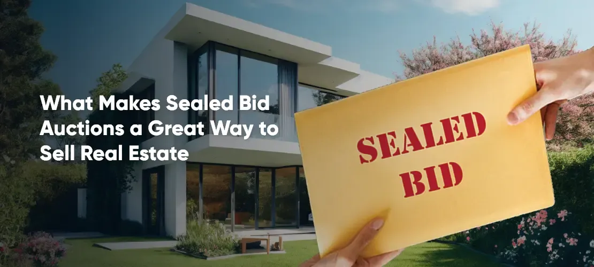

## Table of Contents

## What is a sealed-bid auction in real estate?

A sealed-bid auction in real estate is a way to sell a property where people write down their highest price they want to pay and put it in a sealed envelope. They give these envelopes to the person selling the property, and no one knows what anyone else offered. This is different from a regular auction where people can see and react to each other's bids.

In a sealed-bid auction, everyone submits their bids at the same time, and then the seller opens all the envelopes together. The person who offered the most money usually gets the property, but sometimes the seller can choose a different offer if they like it better for other reasons. This method can be good for sellers because it might get them a higher price since people might bid more when they don't know what others are bidding.

## How does a sealed-bid auction differ from other types of auctions?

A sealed-bid auction is different from other types of auctions because the bids are secret. In a sealed-bid auction, everyone writes down their highest offer and puts it in an envelope. No one knows what anyone else offered until all the bids are opened at the same time. This is different from an open auction, where people can see each other's bids and keep raising their offers. In an open auction, people might bid more because they see others bidding, but in a sealed-bid auction, they have to guess what others might offer.

Another difference is how the winner is chosen. In a sealed-bid auction, the person who offered the most money usually wins, but the seller can sometimes choose a different offer if they like it better for other reasons. In contrast, in an open auction, the highest bidder always wins because everyone can see the bids and the highest one is clear. Also, in some other types of auctions, like a Dutch auction, the price starts high and goes down until someone buys it, which is very different from the sealed-bid method where everyone submits their best offer at once.

## What are the advantages of using a sealed-bid auction for selling property?

Using a sealed-bid auction to sell property can help the seller get a higher price. Since people can't see what others are offering, they might bid more than they would in an open auction. They have to guess what others might offer, so they might go higher to make sure they win. This can lead to the seller getting more money for their property than they would in a different kind of auction.

Another advantage is that it can be faster and less stressful for the seller. In an open auction, the bidding can go on for a long time, and it can be hard for the seller to watch. With a sealed-bid auction, everyone submits their bids at the same time, and the seller can open them all at once. This makes the process quicker and can be less nerve-wracking for the seller. Plus, it can be more private, since no one knows what anyone else offered until the bids are opened.

## What are the potential disadvantages of a sealed-bid auction for buyers?

One disadvantage for buyers in a sealed-bid auction is that they don't know what other people are bidding. This can make it hard to decide how much to offer. If they bid too low, they might not get the property. If they bid too high, they might pay more than they need to. It's like guessing a number without any hints, which can be stressful and risky.

Another disadvantage is that the highest bidder doesn't always win. Sometimes, the seller can choose a different offer if they like it better for other reasons. This means even if a buyer offers the most money, they might not get the property. It can feel unfair and frustrating for buyers who thought they had the best bid.

## How can a buyer prepare for participating in a sealed-bid auction?

To prepare for a sealed-bid auction, a buyer should start by doing their homework on the property. They should find out everything they can about the property, like its condition, location, and any potential issues. It's also a good idea to look at similar properties that have sold recently to get an idea of what the property might be worth. This research will help the buyer decide how much they are willing to pay.

Once they have a good understanding of the property's value, the buyer needs to decide on their maximum bid. This can be tricky because they don't know what others will offer. They should think about how much they want the property and how much they can afford to spend. It's important to set a limit and stick to it, so they don't end up paying more than they should. After deciding on a bid, they should write it down clearly on the form provided by the seller, put it in a sealed envelope, and submit it by the deadline.

## What factors should be considered when setting a bid in a sealed-bid auction?

When setting a bid in a sealed-bid auction, one of the first things to think about is the value of the property. Buyers should look at recent sales of similar properties in the area to get an idea of what the property might be worth. They should also consider the condition of the property and any potential costs for repairs or improvements. Knowing the market value helps buyers set a realistic bid that reflects what the property is actually worth.

Another important [factor](/wiki/factor-investing) is the buyer's budget and how much they are willing to spend. Since they won't know what others are bidding, they need to decide on a maximum amount they are comfortable with. This means thinking about their financial situation and how much they can afford without stretching too far. Buyers should also consider how much they want the property. If it's their dream home, they might be willing to bid a bit higher, but they should still be careful not to go over their limit.

Lastly, buyers should think about the competition. Even though they can't see other bids, they can guess how many people might be interested in the property. If it's a popular property in a good location, there might be more competition, and buyers might need to bid higher to win. But they should also remember that the highest bidder doesn't always win, so they shouldn't feel pressured to bid too much more than the property is worth.

## How is the winner determined in a sealed-bid auction?

In a sealed-bid auction, the winner is usually the person who offers the most money. Everyone writes down their highest offer and puts it in a sealed envelope. They give these envelopes to the person selling the property, and all the bids are opened at the same time. The seller looks at all the bids and usually picks the one with the highest number. This means the person who guessed the highest amount that they thought others might offer usually wins.

However, sometimes the seller can choose a different offer if they like it better for other reasons. For example, if one buyer offers a bit less money but can close the deal faster, the seller might pick that offer instead. So, even if someone bids the highest amount, they might not always win. The seller has the final say and can decide based on what's best for them.

## What happens if there is a tie in the bids during a sealed-bid auction?

If there is a tie in the bids during a sealed-bid auction, it means two or more people offered the same amount of money for the property. When this happens, the seller has to decide what to do next. They might have a rule set up beforehand, like choosing the bid that was submitted first, or they might ask the tied bidders to submit new bids to break the tie.

In some cases, the seller might choose to negotiate with the tied bidders. They could ask if anyone is willing to offer a bit more money or offer better terms, like a faster closing date. If the seller doesn't have a clear way to break the tie, they might even decide to hold another round of bidding or choose a different offer that was close to the tied bids but had other advantages.

## Can a bidder retract their bid in a sealed-bid auction, and under what conditions?

In a sealed-bid auction, it's usually hard for a bidder to take back their bid once they've put it in the envelope and given it to the seller. Most of the time, when you submit your bid, it's final, and you can't change your mind. This is because the whole point of a sealed-bid auction is that everyone's bids are secret and opened at the same time, so letting someone take back their bid could be unfair to others.

However, there might be some special situations where a bidder can retract their bid. For example, if there's a big mistake in the bid, like writing the wrong number by accident, the seller might let the bidder fix it. But this would depend on the rules set by the seller for the auction. It's important for bidders to read the auction rules carefully before they submit their bid, so they know if there's any chance they can take it back.

## How does the confidentiality of bids affect the strategy in a sealed-bid auction?

The confidentiality of bids in a sealed-bid auction means that no one knows what others are offering. This changes how people decide what to bid. Since bidders can't see what others are doing, they have to guess what others might offer. This can make them bid higher than they might in an open auction, where they can see and react to other bids. They might think, "If I want this property, I need to offer more than I think others will," which can push their bid up.

On the other hand, the secrecy can also make people more cautious. They might be worried about bidding too much and paying more than the property is worth. So, they might stick closer to what they think the property is really worth, hoping their guess is good enough to win. The lack of information can make bidding feel like a big gamble, and how much someone is willing to risk can really affect their strategy.

## What legal considerations should be taken into account when participating in a sealed-bid auction?

When participating in a sealed-bid auction, it's important to understand the legal rules that come with it. Each auction might have its own set of rules, so it's a good idea to read them carefully before you put in your bid. These rules can tell you things like if you can take back your bid, what happens if there's a tie, and how the winner is chosen. If you don't follow these rules, you might lose your chance to buy the property or even face legal problems.

Another thing to think about is the contract you'll have to sign if you win the auction. This contract will say what you need to do to buy the property, like how much money you need to pay and when you need to pay it. It's important to make sure you understand this contract and can follow its rules. If you can't, you might lose the property and any money you've already paid. It's always a good idea to talk to a lawyer if you're not sure about any part of the auction or the contract.

## How have sealed-bid auctions evolved in the real estate market, and what trends are emerging?

Sealed-bid auctions have changed a lot in the real estate market over time. At first, they were mostly used for selling special or hard-to-sell properties, like those that were very expensive or in bad shape. But now, more and more sellers are using sealed-bid auctions because they can get a higher price for their property. With the internet, it's easier to reach more people who might want to buy, so sealed-bid auctions have become more popular and common.

New trends are also showing up in sealed-bid auctions. One trend is using technology to make the process easier and faster. Some auctions now let people submit their bids online, which can make it simpler for buyers to join in from anywhere. Another trend is that sellers are sometimes using sealed-bid auctions for regular homes, not just special ones. This means more people might see sealed-bid auctions as a normal way to buy a house. As the market keeps changing, sealed-bid auctions might keep growing and changing too.

## References & Further Reading

[1]: Milgrom, P. R. (2004). ["Putting Auction Theory to Work."](https://assets.cambridge.org/97805215/51847/frontmatter/9780521551847_frontmatter.pdf) Cambridge University Press.

[2]: Vickrey, W. (1961). ["Counterspeculation, Auctions, and Competitive Sealed Tenders."](https://www.cramton.umd.edu/market-design-papers/vickrey-counterspeculation-auctions-and-competitive-sealed-tenders.pdf) Journal of Finance, 16(1), 8-37.

[3]: Varian, H. R. (1995). ["Economic Mechanism Design for Computerized Agents."](https://jmvidal.cse.sc.edu/library/varian95a.pdf) In Proceedings of the First USENIX Workshop on Electronic Commerce.

[4]: Lopez de Prado, M. (2018). ["Advances in Financial Machine Learning."](https://www.amazon.com/Advances-Financial-Machine-Learning-Marcos/dp/1119482089) Wiley.

[5]: Jansen, S. (2020). ["Machine Learning for Algorithmic Trading."](https://github.com/stefan-jansen/machine-learning-for-trading) Packt Publishing.

[6]: Chan, E. P. (2009). ["Quantitative Trading: How to Build Your Own Algorithmic Trading Business."](https://github.com/ftvision/quant_trading_echan_book) Wiley Trading.