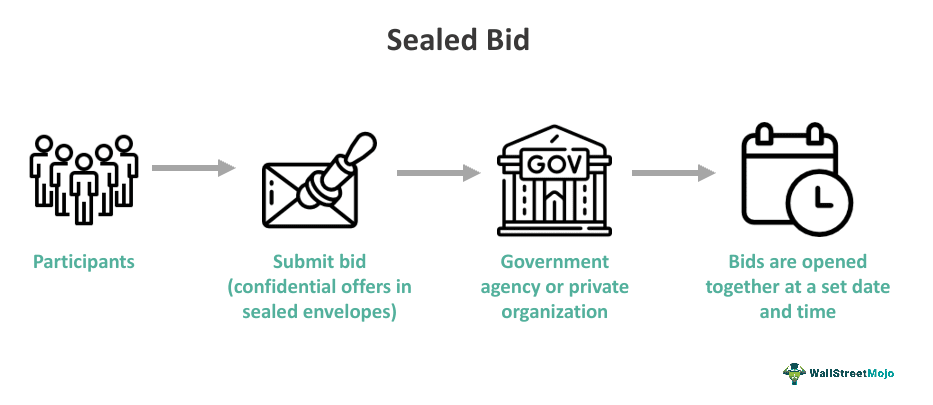

The intersection of sealed-bid auctions and algorithmic trading is transforming the landscape of real estate sales. Sealed-bid auctions, a traditional mechanism where bidders submit confidential bids with the highest offer securing the asset, have been a staple in various markets. However, their application in real estate has historically been limited due to inherent complexities and a preference for open auction systems, which offer more transparency. The advent of algorithmic trading, characterized by executing complex mathematical models and strategies, is redefining this landscape, positioning technology as a crucial catalyst for change.

The integration of algorithmic trading strategies into sealed-bid auctions marks a significant shift in the approach to real estate transactions. This development leverages the precision and efficiency of algorithms to handle vast datasets, enabling participants to make more informed decisions in competitive bidding scenarios. This transformation promises to unlock new potential for maximizing asset value through strategic insights drawn from real-time data analysis.



This article serves as a comprehensive guide for industry professionals, real estate investors, and algorithmic trading enthusiasts. The focus will be on how to effectively navigate the sealed-bid auction processes by leveraging algorithmic trading techniques. Through this exploration, readers will gain an understanding of how technology is streamlining transactions, enhancing competitive edge, and potentially increasing asset value.

As the digital age continues to influence real estate markets, embracing algorithmic approaches offers significant advantages. These technologies support improved decision-making processes through enhanced data analysis and predictive capabilities, ultimately fostering a dynamic and efficient market environment. The need for continuous adaptation and the investment in technology becomes apparent, urging stakeholders to engage actively in these advancements for future growth and success.

## Table of Contents

## Overview of Sealed-Bid Auctions

Sealed-bid auctions are a distinctive auction method in which all participants submit their bids independently and in isolation, ensuring that no bidder knows the bid amount placed by any other participant. This auction format is particularly relevant in real estate transactions, where confidentiality and strategic considerations often play a crucial role.

A sealed-bid auction in real estate typically begins with sellers inviting interested buyers to submit bids by a specified deadline. Each bid is made without any disclosure to other bidders, and the bids are only revealed after all submissions are received. The property is usually sold to the highest bidder unless a reserve price is set and not achieved.

Comparatively, traditional open-auction systems operate differently. In open auctions, bidding is public, and participants can adjust their offers in response to the bids of others. This tends to lead to competitive bidding and can drive up the final sale price through visible increments. In contrast, sealed-bid auctions eliminate the possibility of reactive bidding since each bidder submits their offer in isolation.

One of the notable advantages of utilizing sealed-bid auctions, especially in high-stakes property deals, is the level of discretion it offers. Buyers can make their best offer based on their valuation of the property, free from the pressure or influence of competitive bidding. Moreover, this format can prevent the so-called "winner's curse," which occurs when a buyer overbids due to competitive pressure. For sellers, sealed-bid auctions can result in highly competitive bids if the property is attractive, as bidders tend to offer their maximum willingness to pay.

However, sealed-bid auctions are not without challenges. A significant issue is transparency, as bidders lack information on competing bids, leading to potential distrust in the process. Strategic bidding is another hurdle; without knowing others’ bids, bidders must rely on estimation and intuition, which can lead to suboptimal bidding strategies. Due to these challenges, sealed-bid auctions require careful design to ensure fairness and trustworthiness, often incorporating mechanisms that prevent collusion or undisclosed side agreements.

Real estate-specific case studies illustrate the application of sealed-bid auctions. For example, in a competitive urban market, a prime commercial property might be sold through a sealed-bid auction to attract serious buyers who value the confidentiality and exclusivity of the process. In one instance, a New York City office building was sold to the highest bidder in a sealed-bid auction, highlighting the method's utility in high-value real estate transactions where both the buyer and seller prioritized confidentiality and efficiency over traditional auction dynamics.

In summary, sealed-bid auctions present a compelling alternative to traditional auction systems by maximizing discretion and potentially enhancing final sale values in real estate transactions. Despite inherent challenges like transparency and strategic complexity, this auction format continues to be a valuable tool in the real estate domain, especially for high-value properties where these attributes are paramount.

## Understanding the Auction Process in Real Estate Sales

The auction process in real estate sales is a structured and sequential series of events that facilitate the transfer of property ownership from seller to buyer, efficiently and transparently. The process generally follows these steps:

1. **Listing the Property**: The first step in the auction process involves listing the property for auction. This encompasses appraising the property to determine its market value, setting auction terms, and marketing the property to potential bidders through various channels. A detailed property description, imagery, and legal documentation are provided.

2. **Pre-Auction Activities**: Potential buyers are given an opportunity to inspect the property and conduct due diligence. During this period, they may review property reports, engage in financial planning, and arrange for any necessary professional consultations, such as surveys or legal advice.

3. **Registration of Bidders**: Interested buyers must register to participate in the auction. This typically requires submitting identification, proof of financial capability (such as a bank statement or letter from a financial institution), and sometimes an initial deposit.

4. **Auction Day**: The actual auction can be conducted in person, online, or through a hybrid model. Bidders submit their offers, either verbally or through an electronic platform, until a winning bid is determined. The highest bidder meets the seller’s reserve price, if applicable, wins the auction.

5. **Post-Auction Process**: Following the auction, the successful bidder is required to sign a contract of sale and pay a deposit, usually a percentage of the purchase price. This is typically done within a short timeframe to secure the sale.

6. **Closing**: The final step involves completing the transaction. This includes settling the remaining balance, transferring the title, and ensuring all legal documentation is in order. The process may be facilitated by real estate agents and legal professionals to ensure compliance with jurisdictional laws and regulations.

### Key Stakeholders Involved

Critical participants in this process include:

- **Sellers**: Owners or entities looking to transfer property ownership for various reasons, such as liquidating assets or moving locations.
- **Buyers**: Individuals or entities seeking to acquire real estate for personal use, investment, or development.
- **Real Estate Agents**: Professionals managing the logistics of the auction, ensuring effective marketing, and facilitating communications between buyers and sellers.
- **Legal Advisors**: Provide necessary legal guidance, ensuring the auction's legal compliance, protecting stakeholder interests, and managing contracts.

### Legal Frameworks

Real estate auctions are subject to varying legal frameworks depending on the jurisdiction. In the United States, for example, the Uniform Commercial Code (UCC) often governs auction practices, protecting against unfair practices and ensuring that all actions are legally binding. Other considerations include consumer protection laws, zoning regulations, and anti-discrimination policies.

### Auction Procedures Across Different Real Estate Types

- **Residential Real Estate**: Auctions for residential properties tend to involve individual buyers and are often advertised directly to the public. They focus heavily on the property's livability and location.
- **Commercial Real Estate**: These auctions might involve corporate entities or investors, with evaluations emphasizing profitability and business potential.
- **Industrial Real Estate**: These properties are auctioned with considerations of logistical advantages, infrastructure, and potential operational costs.

### Recent Trends in Real Estate Auctions

Technological advancements have significantly influenced recent trends in real estate auctions. The growing prevalence of online auction platforms has increased accessibility and participation in auctions globally. Data analytics and [artificial intelligence](/wiki/ai-artificial-intelligence) are increasingly utilized to assess market trends and valuation forecasts, improving decision-making accuracy. Furthermore, the integration of blockchain technology is being explored to enhance transparency and security in transactions.

These developments mark an evolution from traditional auction methods to more modern, tech-driven approaches that offer enhanced efficiencies and potential for broader market engagement.

 to Algorithmic Trading

Algorithmic trading refers to the use of computer algorithms to automate trading decisions in financial markets. These algorithms analyze a multitude of data points, execute trades, and manage portfolios more efficiently than human traders. Originally developed for equity markets, [algorithmic trading](/wiki/algorithmic-trading) now encompasses a wide array of financial instruments, including futures, options, and foreign exchange.

At its core, algorithmic trading relies on advanced technology and specific types of algorithms to execute trades at optimal speeds and prices. The fundamental components often include historical and real-time market data, mathematical models, and trading signals. These elements are integrated to formulate strategies that react instantaneously to market changes. Popular strategies include [trend following](/wiki/trend-following), [arbitrage](/wiki/arbitrage), and market-making algorithms. For instance, moving average crossovers might indicate trading signals in trend-following strategies, while [statistical arbitrage](/wiki/statistical-arbitrage) exploits price differentials between correlated securities.

The primary advantages of algorithmic trading are speed, efficiency, and precision. Algorithms can execute trades within milliseconds, a feat impossible for human traders. This speed minimizes latency and maximizes the opportunity to capitalize on short-lived trading signals. Efficiency is achieved through the automation of complex tasks, allowing firms to handle large volumes of trades without human intervention. Precision refers to the algorithm’s ability to execute trades at exact price levels and times, reducing the likelihood of human error.

Despite these advantages, algorithmic trading is not without misconceptions and challenges. One common misconception is that algorithmic trading always guarantees profitable outcomes. In reality, these algorithms are only as good as the models and data they are built upon. Market [volatility](/wiki/volatility-trading-strategies) and unforeseen events can lead to substantial losses if not adequately accounted for. Moreover, the "black box" nature of some sophisticated algorithms raises concerns over transparency and accountability. Additionally, [backtesting](/wiki/backtesting) algorithms on historical data can lead to overfitting, where the strategy performs well on past data but fails under real market conditions.

The tech industry plays a pivotal role in the advancement of algorithmic trading. Innovations in hardware, such as high-frequency trading systems and cloud computing, have enhanced computational power and reduced latency. Software advancements, including [machine learning](/wiki/machine-learning) and artificial intelligence (AI), offer more sophisticated data analysis and predictive modeling capabilities. These tools enable traders to process vast datasets, identify patterns, and optimize strategies more effectively.

In summary, algorithmic trading is a dynamic field combining technology, finance, and data science, transforming how trades are executed and portfolios managed. As technology evolves, further integration of AI and machine learning is likely to drive innovation, offering new possibilities and challenges in financial markets.

## Application of Algorithmic Trading in Real Estate Auctions

Algorithmic trading, traditionally associated with financial markets, has found a novel application in optimizing sealed-bid auction outcomes in real estate. By leveraging advanced algorithms, property firms can enhance precision in bidding and strategic decision-making, ultimately seeking to maximize value for buyers and sellers.

Algorithmic trading strategies involve the use of mathematical models to determine optimal bidding prices and timings. One key approach is the use of predictive analytics to forecast property values based on historical data and real-time market conditions. This can be achieved through machine learning models like linear regression, decision trees, or neural networks, which analyze vast data sets to identify patterns and predict outcomes.

For instance, consider a property firm that uses a machine learning algorithm to predict the closing price of a real estate auction. This algorithm might take into account factors such as location, property size, recent sales in the area, and current market trends. Here's a simple example of how a linear regression model could be implemented in Python to predict property prices:

```python
from sklearn.model_selection import train_test_split
from sklearn.linear_model import LinearRegression
import pandas as pd

# Load historical auction data
data = pd.read_csv('real_estate_data.csv')

# Feature selection: you might use location, size, market trends, etc.
features = data[['location', 'property_size', 'recent_sales', 'market_trend']]
target = data['closing_price']

# Split data into training and testing sets
X_train, X_test, y_train, y_test = train_test_split(features, target, test_size=0.2, random_state=42)

# Implement linear regression model
model = LinearRegression()
model.fit(X_train, y_train)

# Predicting the closing prices
predictions = model.predict(X_test)
```

This approach not only helps in setting competitive bids but also in assessing risks associated with the auction.

AI-driven tools and software are also playing a pivotal role in leveling the playing field in real estate auctions. By removing the element of human bias and facilitating data-driven decisions, these tools offer participants a fairer auction environment. Technologies such as natural language processing and sentiment analysis provide deeper insights into market dynamics, which can be critical in competitive bidding scenarios.

However, integrating algorithmic trading strategies into real estate transactions is not without challenges. Market manipulation is a significant risk, as sophisticated algorithms could potentially be used to artificially inflate property values. Ensuring compliance and transparency is crucial in mitigating these risks. Additionally, there is the potential for technological failures, which could result in significant financial consequences for stakeholders.

Looking to the future, the prospects of algorithm-driven bidding in real estate markets are promising. As technology continues to evolve, we can expect more sophisticated algorithms capable of processing extensive data sets with greater accuracy, enabling more informed and strategic auction participation. Innovations in AI, such as [reinforcement learning](/wiki/reinforcement-learning), hold particular promise in enhancing the adaptability and intelligence of algorithmic trading systems in real estate.

As the digital transformation of real estate auctions continues, embracing technology and innovation while addressing the accompanying risks and ethical considerations will be key to unlocking the full potential of algorithmic trading within this sector.

## Benefits and Risks Involved

The integration of algorithm-driven systems in sealed-bid auctions presents both substantial benefits and certain risks for participants in real estate markets.

For sellers, algorithm-driven systems can enhance sale outcomes by optimizing bid strategies to maximize property values. These systems can process vast amounts of data quickly, generating insightful patterns and predictions that human analysis might overlook. Consequently, sellers can achieve higher sale prices by leveraging the precision and speed of algorithms—translating into optimized asset liquidation.

Buyers benefit from algorithm-driven systems through increased transparency and efficiency in auction processes. Algorithms can analyze historical bidding data and market trends to inform buyers’ decisions, enhancing their ability to place competitive bids without exceeding personal financial thresholds. Additionally, buyers gain from fairer competition, as algorithmic tools level the playing field by reducing information asymmetry often present in traditional auctions.

However, the use of algorithm-driven auctions also introduces risks. One concern is the potential for market manipulation. Algorithms can be designed to artificially inflate bids or create non-competitive environments, skewing auction outcomes. Moreover, technological failures pose a risk; system glitches or latency issues could lead to incorrect bids or untimely submissions, impacting auction integrity.

Regulatory considerations are paramount to address these risks. Compliance with regulations governing algorithmic systems is crucial to ensure fairness and transparency in auctions. Regulatory bodies may impose strict guidelines on the development and deployment of these systems to prevent unethical practices and maintain market stability.

To mitigate risks, market participants can adopt several strategies. Implementing robust testing and validation protocols for algorithmic systems helps prevent unforeseen technological failures. Regular audits and updates of algorithms ensure continued compliance with prevailing legal and ethical standards. Collaborating with legal experts can further enhance compliance efforts, safeguarding against potential manipulation or regulatory infractions.

Data privacy and security are central to the successful execution of tech-driven real estate deals. With the increasing use of digital platforms, safeguarding sensitive client data against breaches is critical. Secure encryption methods and adherence to data protection regulations are vital in ensuring that personal and financial information remain confidential and protected.

Overall, while algorithm-driven sealed-bid systems offer tangible benefits by enhancing decision-making and auction outcomes, they necessitate careful management of inherent risks. Market stakeholders must prioritize compliance, data security, and ethical practice to fully leverage the advantages of technology in real estate auctions.

## Conclusion

The integration of sealed-bid auctions with algorithmic trading in real estate marks a significant shift in how property transactions are conducted. This fusion leverages technology to streamline processes, improve efficiency, and potentially maximize asset value. By employing algorithmic strategies, the traditionally opaque sealed-bid auction system gains enhanced transparency and strategic clarity, making it more attractive to both buyers and sellers. Algorithmic trading allows for quick analysis and decision-making, facilitated by vast data processing and real-time market insights, reshaping the real estate landscape.

Looking ahead, the impact of digital transformation on real estate transactions appears promising. Real estate markets are progressively incorporating technological solutions, transforming how properties are bought and sold. As algorithms continue to evolve, they offer the potential to further refine auction strategies, enabling greater precision and effectiveness. Digital innovations may also democratize access to auctions, allowing broader participation through accessible platforms and reducing geographical constraints.

To fully harness these benefits, a call to action is warranted for industry stakeholders to invest in technology and innovation. Real estate firms, investors, and policymakers should collaborate to deploy and scale advanced algorithmic solutions. This requires not only financial commitment but also a cultural shift towards embracing technological advancements. By prioritizing investment in innovative software and tools, stakeholders can drive significant improvements in operational processes and market outcomes.

Ongoing research and development at the intersection of real estate and algorithmic trading are crucial. There is a continuous need to explore how emerging technologies such as artificial intelligence and machine learning can further augment auction processes. Research initiatives should focus on optimizing algorithms for real estate-specific challenges and enhancing the predictability and stability of market behaviors. Furthermore, fostering a collaborative environment between technologists and real estate experts will be key to unlocking future potential.

Maintaining ethical practices is paramount as technology reshapes real estate transactions. Ethical considerations include ensuring fairness, preventing market manipulation, and safeguarding data privacy. As algorithm-driven approaches gain traction, establishing robust regulatory frameworks and ethical guidelines is essential to protect all parties involved. Stakeholders must engage in transparent dialogues to address concerns and reinforce trust in these technologically advanced systems.

In conclusion, combining sealed-bid auctions with algorithmic trading is poised to transform real estate transactions significantly. This evolution presents both opportunities and challenges, urging industry participants to commit to technological advancement while adhering to ethical standards. By adopting a forward-thinking approach focused on research, development, and collaboration, the real estate sector can thrive in the digital age.

## References & Further Reading

[1]: Milgrom, P. R. (2004). ["Putting Auction Theory to Work."](https://assets.cambridge.org/97805215/51847/frontmatter/9780521551847_frontmatter.pdf) Cambridge University Press.

[2]: Vickrey, W. (1961). ["Counterspeculation, Auctions, and Competitive Sealed Tenders."](https://www.cramton.umd.edu/market-design-papers/vickrey-counterspeculation-auctions-and-competitive-sealed-tenders.pdf) Journal of Finance, 16(1), 8-37.

[3]: Varian, H. R. (1995). ["Economic Mechanism Design for Computerized Agents."](https://jmvidal.cse.sc.edu/library/varian95a.pdf) In Proceedings of the First USENIX Workshop on Electronic Commerce.

[4]: Lopez de Prado, M. (2018). ["Advances in Financial Machine Learning."](https://www.amazon.com/Advances-Financial-Machine-Learning-Marcos/dp/1119482089) Wiley.

[5]: Jansen, S. (2020). ["Machine Learning for Algorithmic Trading."](https://github.com/stefan-jansen/machine-learning-for-trading) Packt Publishing.

[6]: Chan, E. P. (2009). ["Quantitative Trading: How to Build Your Own Algorithmic Trading Business."](https://github.com/ftvision/quant_trading_echan_book) Wiley Trading.