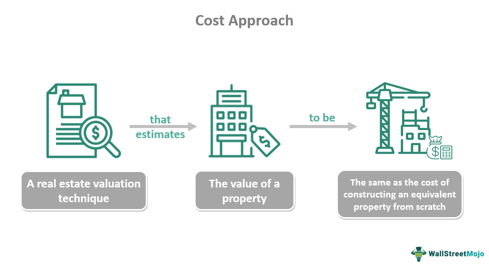

In the complex world of economics and finance, multiple factors influence consumer behavior and market dynamics. Understanding these factors is essential for comprehending the broader economic environment in which individuals, businesses, and governments operate. This article aims to highlight the interconnections between economic theory, consumer behavior, search costs, and algorithmic trading, each playing a pivotal role in shaping modern economies.

Economic theory offers a fundamental framework to explain how consumers make decisions, considering their preferences, budget constraints, and external factors such as prices and income levels. Meanwhile, consumer behavior reflects these theories in practice, revealing how individuals allocate resources to maximize utility and satisfaction. It is important for businesses to grasp consumer behavior dynamics to better meet customer needs and maintain a competitive edge.

Search costs, another critical component, represent the resources and effort expended by consumers to find desirable products or services. Although the digital era has significantly diminished these costs via technological advancements, they still heavily influence the decision-making process and market competition. Consequences of search costs can be observed in various consumer activities, such as online shopping and job searching, impacting their choices and satisfaction levels.

Algorithmic trading introduces a technological dimension to financial markets, employing sophisticated algorithms to execute trades at rapid speeds. This innovation has transformed trading activities by improving efficiency and reducing transaction costs. However, it also presents challenges such as potential market manipulation and heightened volatility, requiring careful regulatory oversight.

Exploring the interactions among economic theory, consumer behavior, search costs, and algorithmic trading provides invaluable insights into modern economic landscapes. These interactions significantly affect how consumers make decisions, how businesses strategize, and how markets evolve. By examining these connections, stakeholders can better anticipate changes, make informed decisions, and adapt strategies to thrive in dynamic economic environments.

## Table of Contents

## Economic Theory and Consumer Behavior

Economic theory provides a crucial framework for understanding consumer behavior, central to which is the assumption that consumers aim to maximize their utility. Utility maximization implies that individuals make decisions to achieve the highest level of satisfaction given their available resources. Consumers consider their preferences and budget constraints when making purchasing decisions. In mathematical terms, this can be represented as consumers attempting to maximize their utility function $U(x_1, x_2, ..., x_n)$ subject to a budget constraint $\sum_{i=1}^{n} p_i x_i = I$, where $p_i$ is the price and $x_i$ is the quantity of good $i$, and $I$ is the consumer's income.

Price, income, and preferences are major factors driving consumer choices. A change in the price of a good affects its demand due to the substitution and income effects. The substitution effect occurs when consumers switch from relatively expensive goods to cheaper alternatives, while the income effect reflects changes in consumer purchasing power due to price changes. As income increases, consumer choices expand, often leading to higher consumption of normal goods and less of inferior goods. Preferences, shaped by factors such as demographics, cultural influences, and personal tastes, also significantly impact consumption patterns.

Understanding consumer behavior is critical for businesses aiming to meet consumer needs effectively. By analyzing and predicting consumer preferences and behaviors, businesses can tailor their offerings, optimize pricing strategies, and enhance customer satisfaction, thereby sustaining competitive advantage. This understanding also assists in market segmentation, allowing businesses to adopt targeted marketing approaches that resonate with different consumer groups.

Behavioral economics offers insights into the psychological factors influencing consumer decisions, challenging the traditional economic assumption of rational behavior. It acknowledges that consumers sometimes act irrationally due to cognitive biases, emotions, and social influences. For instance, heuristics such as anchoring, where individuals rely heavily on an initial piece of information, can significantly affect decision-making. Behavioral economists study how these psychological factors can lead consumers to make decisions that deviate from those predicted by classical economic models and develop interventions, such as nudging, to promote better decision-making.

Incorporating these behavioral insights helps economists and businesses understand real-world consumer behaviors more accurately, improving predictions and strategies. This holistic approach is vital for comprehensively understanding the dynamics of consumer decision-making and effectively responding to market demands.

## The Role of Search Costs

Search costs are the time, effort, and resources that consumers invest while searching for the optimal product or deal. These costs, categorized under transaction costs, exert influence over both consumers and sellers prior to any transaction taking place. The presence of high search costs can discourage consumers from purchasing altogether or force them into less than ideal choices, as the expenditure of more resources than the perceived benefit of the search yields diminishing returns. 

In a traditional market setting, search costs may include transportation expenses, the time taken to visit multiple stores, and the effort expended in comparing products. For example, someone shopping for a car might visit numerous dealerships, each trip incurring fuel costs and taking substantial time without a guarantee of a better deal. The psychological effort in evaluating extensive information also contributes to search costs, adding to overall buyer fatigue.

The advent of digital technology has notably reduced search costs, with the internet playing a pivotal role in this transformation. Online platforms and marketplaces provide easy access to product information, enabling consumers to compare prices, features, and reviews from a vast array of options far more efficiently than before. A prospective car buyer can now use online tools to compare prices from various dealers, read reviews, and even get quotes, all from the comfort of their home. This enhancement in accessibility and information reduces the traditional barriers imposed by high search costs.

Despite the digital reduction of some search costs, they remain significant in consumer decision-making. The sheer amount of information available can lead to a phenomenon known as "information overload," where the abundance of options actually complicates decision-making rather than simplifying it. Consumers might spend excessive time filtering through unnecessary or irrelevant information, which, paradoxically, can increase the effective search costs if not managed properly.

Search costs are also present in labor markets, where job seekers must sift through multiple job listings, prepare numerous tailored applications, and potentially travel for interviews. While digital platforms such as LinkedIn and Indeed simplify these tasks, the challenge of matching the right job with the right candidate remains partly unresolved due to the intangible nature of job and skill fit which can't be fully captured digitally.

In summary, while technology has significantly lowered search costs in many areas, its role in consumer decision-making remains crucial. Both consumers and businesses must effectively manage these costs to make informed purchasing or strategic decisions, taking advantages of the efficiencies technology offers without falling prey to the complexities of excessive information.

## Algorithmic Trading and Its Impact

Algorithmic trading utilizes complex algorithms and advanced computational techniques to execute trading decisions at high speeds in financial markets. This technology offers numerous advantages, including increased efficiency, reduced human error, and the ability to rapidly respond to market fluctuations. These algorithms analyze a multitude of market variables and execute trades based on predetermined strategies.

**Efficiency and Error Reduction**  
Algorithmic trading enhances efficiency by automating the process of trade execution, which allows for quicker transactions that humans cannot compete with in terms of speed. This automation reduces the likelihood of errors typically associated with manual trading. The reliance on quantitative analysis and stringent back-testing also helps to minimize risks. Using algorithms, traders can parse through vast datasets, identify patterns, and act on investment opportunities almost instantaneously.

**Challenges and Risks**  
Despite the benefits, [algorithmic trading](/wiki/algorithmic-trading) is not without its challenges. One primary concern is the risk of market manipulation, where traders might use algorithms to create misleading market conditions. This could involve tactics like spoofing, where large orders are placed and then canceled to falsely influence stock prices. Increased market [volatility](/wiki/volatility-trading-strategies) is another concern; swift and large-scale trading driven by algorithms can lead to dramatic price swings. An example is the "Flash Crash" of 2010, where the Dow Jones Industrial Average plunged nearly 1,000 points in minutes before recovering just as swiftly. Such incidents have raised questions about the stability of algorithm-driven markets.

**Consumer Impact and Regulatory Considerations**  
For consumers, algorithmic trading enhances market [liquidity](/wiki/liquidity-risk-premium), making it easier to buy and sell assets without causing significant price changes. This increased liquidity can lead to lower transaction costs as bid-ask spreads narrow. However, it necessitates robust regulatory oversight to prevent malpractice and protect market integrity. Regulatory bodies such as the U.S. Securities and Exchange Commission (SEC) are tasked with creating frameworks that ensure fair play, often requiring firms to review the impact of their algorithms before implementation.

**Debate on Investment Strategies**  
The shift towards algorithmic trading has sparked debate about its effect on traditional investment strategies. While algorithms provide unmatched speed and efficiency, they also lack the intuition and adaptability that human traders possess. Some argue that this could lead to a homogenization of trading strategies, as different algorithms might react similarly to market stimuli. Others suggest that the human element remains indispensable for strategic decision-making, especially in scenarios that require nuanced judgment beyond quantitative data.

In conclusion, algorithmic trading represents a profoundly transformative force in financial markets, offering both opportunities and challenges. As technological sophistication continues to evolve, so too will the regulatory landscapes and strategic considerations that accompany it, making it a critical area of focus for market participants.

## Interconnections and Implications

The interplay between consumer behavior, search costs, and algorithmic trading creates a dynamic economic environment. As search costs decrease due to advancements in technology and the increasing accessibility of digital platforms, consumers gain access to a wealth of information. This access empowers them to make more informed decisions, potentially altering traditional buying behaviors. For instance, consumers can now compare prices and product features quickly, leading to an increased demand for transparency and value from businesses. This empowerment shifts the balance of power slightly towards consumers, who can leverage the abundance of information to optimize their purchasing decisions.

Algorithmic trading, a revolutionary force in financial markets, influences consumer investment decisions and behaviors by affecting market dynamics. The use of complex algorithms allows trades to be executed at incredibly high speeds, often in response to real-time data and market conditions. This capability increases market liquidity and can reduce transaction costs for consumers. However, the rapid pace of algorithmic trading can also lead to increased market volatility, which may pose risks for individual investors who could find themselves exposed to unexpected market shifts.

Businesses must navigate these interconnected factors strategically. The reduction in search costs means that consumers are less tolerant of inefficiencies and inaccuracies, forcing companies to enhance their value propositions continually. To stay competitive, businesses must incorporate advanced technologies, such as data analytics and AI, to understand consumer needs and preferences more precisely. Moreover, firms engaged in financial markets need to adapt their investment strategies to account for the influences of algorithmic trading. This could involve adopting similar technologies or seeking niche markets less affected by these algorithmic methods.

Understanding these interconnections is vital for various stakeholders, including regulators, consumers, and businesses, aiming to thrive in the digital era. Regulators must balance fostering innovation while protecting market integrity and ensuring fair practices. Consumers, equipped with better tools and information, must remain vigilant about their financial decisions. Meanwhile, businesses must innovate relentlessly to meet the evolving demands of well-informed consumers. The continuous evolution of these dynamics necessitates that stakeholders remain adaptable and informed, leveraging technological advancements to drive economic growth and stability.

## Conclusion

The interrelatedness of economic theory, consumer behavior, search costs, and algorithmic trading highlights the complexity inherent in modern economies. Traditional approaches to understanding consumer and market behavior are increasingly challenged by these interconnected factors. Economic theory provides the groundwork for anticipating consumer choices, yet real-world behavior often deviates due to various influences such as search costs and technological advances in trading. 

As technology progresses, the economic landscape will continue to evolve, with significant impacts expected from innovations such as algorithmic trading and digital marketplaces. These developments can lower search costs and alter consumer behavior, necessitating a new regulatory framework to address contemporary challenges and opportunities. Regulatory responses must balance fostering innovation and protecting market participants to ensure a fair and efficient market environment.

For stakeholders—be they businesses, consumers, or regulators—adaptability and information are key. Staying informed of technological and regulatory trends allows these groups to leverage changes for economic growth and innovation. Businesses, in particular, can harness insights from these dynamics to fine-tune their strategies, aligning offerings with consumer preferences and improving competitive positioning.

Understanding these complexities is crucial for all economic actors to make well-informed decisions. As technology continues to disrupt traditional models, the ability to respond and adapt is paramount for achieving success and sustainability in the rapidly changing economic milieu of the future.

## References & Further Reading

[1]: Bergstra, J., Bardenet, R., Bengio, Y., & Kégl, B. (2011). ["Algorithms for Hyper-Parameter Optimization."](https://dl.acm.org/doi/10.5555/2986459.2986743) Advances in Neural Information Processing Systems 24.

[2]: ["Advances in Financial Machine Learning"](https://www.amazon.com/Advances-Financial-Machine-Learning-Marcos/dp/1119482089) by Marcos Lopez de Prado

[3]: ["Evidence-Based Technical Analysis: Applying the Scientific Method and Statistical Inference to Trading Signals"](https://www.amazon.com/Evidence-Based-Technical-Analysis-Scientific-Statistical/dp/0470008741) by David Aronson

[4]: ["Machine Learning for Algorithmic Trading"](https://github.com/stefan-jansen/machine-learning-for-trading) by Stefan Jansen

[5]: ["Quantitative Trading: How to Build Your Own Algorithmic Trading Business"](https://github.com/LucindaYa/quant-resources/blob/master/Quantitative%20Trading%20How%20to%20Build%20Your%20Own%20Algorithmic%20Trading%20Business.pdf) by Ernest P. Chan