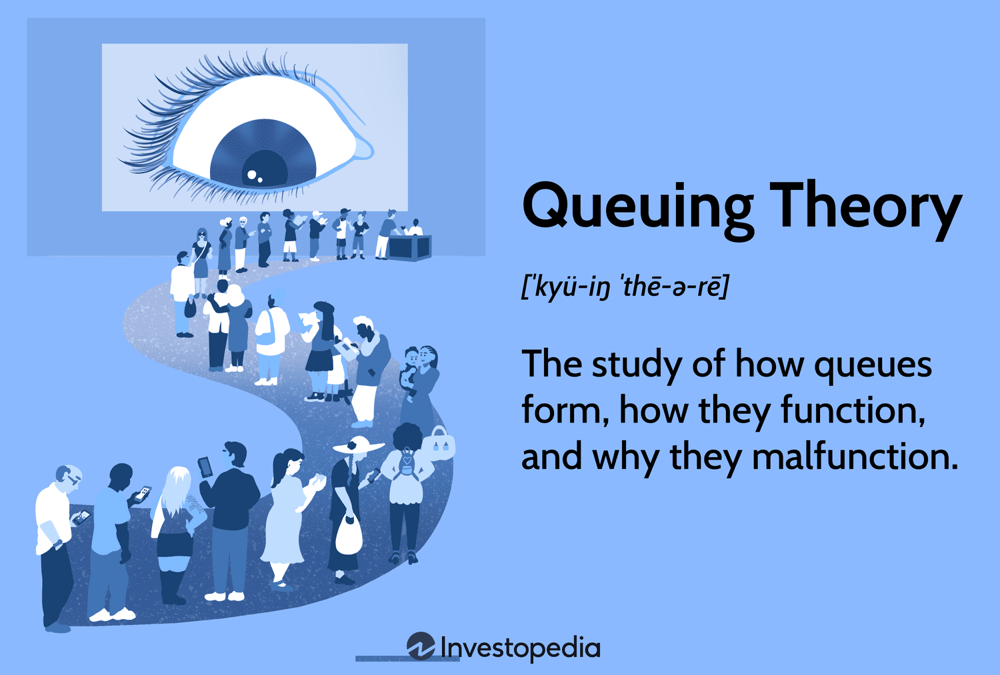

Search theory is a cornerstone of economic thought that addresses the intricacies of decision-making in situations characterized by incomplete information and transactional frictions. Primarily, it examines how individuals and firms allocate resources and time to search for desirable outcomes, such as products, jobs, or trading partners. The economic significance of search theory lies in its ability to model and provide insights into various types of markets where traditional assumptions of perfect knowledge do not hold.

Transactional frictions, a key concept within search theory, refer to the obstacles that impede smooth exchanges in markets. These frictions can take many forms, including time delays, costs associated with acquiring information, and other barriers that prevent immediate and perfect exchanges. For instance, job seekers often face frictions in the form of time spent searching for employment and asymmetrical information about job opportunities, which can lead to mismatches and unemployment.



Search theory plays a crucial role in understanding markets by highlighting how these frictions affect economic efficiency and allocations. It brings to light the dynamic processes involved in matching buyers with sellers, employees with employers, and traders in financial markets. Moreover, it provides a framework to address questions about optimal search strategies and the effects of policy changes on market outcomes.

In recent years, the intersection of search theory and algorithmic trading has attracted substantial attention. Algorithmic trading involves the use of computer programs to execute trades at high speed and volume, often leveraging complex mathematical models and economic theories. The integration of search theory into algorithmic trading strategies allows for more sophisticated decision-making, accounting for real-world frictions and uncertainties that can impact trading activities. By considering factors such as price dispersion and informational asymmetries, search-based algorithms can enhance the effectiveness and profitability of trading operations. 

As financial markets continue to advance technologically, the relevance of search theory in facilitating intelligent trading systems cannot be overstated. Understanding and modeling the search behaviors of market participants enable the design of algorithms that can navigate and capitalize on the inherent inefficiencies in these markets. This fusion of traditional economic theory with cutting-edge technology underscores the evolving nature of economics as a discipline and its application in modern finance.

## Table of Contents

## Understanding Search Theory

Search theory, within the context of economics, is a framework used to analyze the process through which individuals or firms seek to find optimal matches for complex decisions, such as employment, purchasing goods, or choosing investments. At its core, search theory examines how limitations in information and other market frictions impact the efficiency of finding satisfactory matches. The theory is fundamentally concerned with decision-making under uncertainty, where the cost of obtaining information and the time taken to search are integral considerations.

A fundamental aspect of search theory is information asymmetry. This concept describes situations where there is an unequal distribution of information between parties involved in a transaction. For example, in the job market, employers may know less about a potential employee's capabilities than the employee themselves, while the employee may have limited knowledge about the working conditions or future prospects within a company. This asymmetry can lead to suboptimal hiring decisions or mismatch in job placements.

Transactional frictions refer to obstacles that impede the smooth exchange of goods or services in a market. These can be physical, like transportation costs, or more abstract, such as the time and effort required to secure information about potential market opportunities. Transactional frictions necessitate search efforts because they increase the cost of engaging in trades. Search theory provides a structured way to assess these costs and develop strategies to mitigate their impact.

Beyond its initial applications to labor markets, where it was developed to understand the search process of workers for jobs and employers for employees, search theory extends to numerous other markets. In housing markets, for instance, buyers and sellers engage in a search process to find suitable price and quality matches. In financial markets, investors use search strategies to select portfolios that optimize return against risk, which can be significantly influenced by the quality and timeliness of information.

The mathematical backbone of search theory often involves optimization techniques. A typical problem might include determining the optimal "reservation price" or the minimum acceptable result an individual is willing to settle for during their search. This is often expressed in models as a dynamic programming problem, where the objective is to maximize expected utility over a given time horizon.

In a simple mathematical model, the expected cost $C$ of continue searching can be represented as:

$$
C = S + \beta E[V]
$$

where $S$ is the cost per search, $\beta$ is the discount factor reflecting the time cost, and $E[V]$ is the expected value of the next search outcome. The decision to continue searching or to accept a given offer hinges on whether $C$ is greater or less than the reservation price.

The integral tools of search theory continue to find new applications as markets evolve and technology advances, providing critical insights into misunderstanding mechanisms, reducing search costs, and improving market efficiencies. Understanding and utilizing these principles allow for better-informed decisions for both individuals and firms, ultimately contributing to more efficient and functioning markets.

## Economic Models Rooted in Search Theory

Search theory has provided a foundational basis for several economic models, contributing significantly to our understanding of market dynamics, particularly transaction processes and market inefficiencies. At the forefront of these developments are esteemed economists such as Peter Diamond, Dale T. Mortensen, and Christopher A. Pissarides, whose combined efforts have profoundly shaped the field.

**1. The Diamond-Mortensen-Pissarides (DMP) Model:**

The Diamond-Mortensen-Pissarides framework, often referred to as the DMP model, is a cornerstone in search theory. It addresses the complexities of labor markets by incorporating frictions that affect the job matching process. A key insight of the DMP model is the concept of *market tightness*, which is a ratio reflecting the number of job vacancies to the number of job seekers. This is expressed as:

$$
\theta = \frac{V}{U}
$$

where $V$ represents the number of job vacancies and $U$ indicates the number of unemployed workers. 

The model delineates how wages are determined through a bargaining process between firms and workers, accounting for the costs and frictions inherent in searching. Diamond's work introduced the idea of frictions in equilibrium, showcasing that even with rational [agents](/wiki/agents) and market equilibrium, unemployment can persist due to these frictions. Mortensen and Pissarides expanded on these ideas, exploring how such frictions influence job creation and destruction, business cycles, and wage [dispersion](/wiki/dispersion-trading).

**2. Implications on Market Inefficiencies:**

The DMP model provides several critical insights into market inefficiencies. One is the presence of unemployment even when there are vacancies, attributed to the time and costs associated with matching workers to jobs. This mismatch exemplifies the frictional unemployment that search theory seeks to address. It also explains wage dispersion, as differing job search experiences and matching frictions result in varied wage outcomes for similar roles.

Moreover, these models have implications beyond labor markets, influencing the understanding of other search-based scenarios like housing and financial markets. For instance, the principles of the DMP model have been adapted to explain price dispersion across different market platforms due to search costs and information asymmetries.

**3. Broader Economic Impact:**

The recognition of search and matching frictions has prompted policymakers to devise interventions that reduce these inefficiencies. For example, initiatives aimed at improving job matching processes through technology platforms or subsidizing job training programs are direct results of insights gained from search theory models.

In conclusion, the models developed by Diamond, Mortensen, and Pissarides are pivotal in comprehending how market features like search costs and frictions induce inefficiencies. These theoretical constructs not only enhance economic knowledge but also inform policy and practical applications across various sectors.

## Application of Search Theory in Algorithmic Trading

Algorithmic trading is a method of executing trades using pre-programmed instructions that take into account variables such as price, timing, and [volume](/wiki/volume-trading-strategy). This technology-driven approach is heavily reliant on economic theories to discern market behaviors and optimize trading strategies. Search theory, a crucial economic theory, plays a vital role in [algorithmic trading](/wiki/algorithmic-trading) due to its focus on finding optimal solutions under conditions of uncertainty and information asymmetry.

Search theory can aid algorithmic trading strategies by allowing traders to formulate models that predict the best times to enter or [exit](/wiki/exit-strategy) a trade. The theory's concept of search frictions—obstacles that make it difficult to find the ideal trading partner—are particularly relevant here. In trading, search frictions can stem from limited information about market conditions or the availability of trade counterparts. By understanding these frictions, algorithms can be designed to minimize their impact, leading to more efficient trading decisions.

For instance, consider the model of task assignment in markets, where traders seek to match buy and sell orders. The process of matching these orders in an optimal manner can bear resemblance to job matching models in search theory. Traders can employ algorithms that use data analysis to reduce search frictions by gathering insights into the market, assessing [liquidity](/wiki/liquidity-risk-premium), and predicting price movements.

In practical terms, this might involve using [machine learning](/wiki/machine-learning) techniques to enhance the predictive capacity of search algorithms. For example, an algorithm might be programmed to identify patterns in historical data that indicate the optimal points for transaction execution, factoring in search frictions such as latency and transaction costs. Here is a simple illustration:

```python
import numpy as np

def find_optimal_trade_point(price_data):
    # Calculate the moving average as a predictor of optimal trade points
    moving_avg = np.convolve(price_data, np.ones(5)/5, mode='valid')
    optimal_points = []

    # Identify optimal points where current price is lower or higher by a threshold than the average
    for i in range(len(moving_avg)):
        if price_data[i] < moving_avg[i] * 0.95:  # Example buy signal
            optimal_points.append((i, 'Buy', price_data[i]))
        elif price_data[i] > moving_avg[i] * 1.05:  # Example sell signal
            optimal_points.append((i, 'Sell', price_data[i]))

    return optimal_points

# Sample price data
price_data = [100, 102, 101, 105, 107, 109, 108, 110, 115, 117]
print(find_optimal_trade_point(price_data))
```

In this example, a simple moving average is used to determine points at which a trade might be optimally executed based on the past price data trends, effectively mitigating informational frictions.

Moreover, the anticipation of search frictions in algorithmic trading can lead to more sophisticated strategies. Algorithms can be programmed with capabilities to reroute orders if latency is detected or to redistribute trades across multiple exchanges to hedge against price discrepancies.

In conclusion, search theory provides foundational insights into improving decision-making in algorithmic trading by highlighting the nature and impact of various search frictions. By implementing strategies to minimize these impediments, traders can enhance the efficiency and profitability of their trading algorithms.

## Behavioral Insights and Search Theory in Trading

Search theory and behavioral economics together provide profound insights into trading behavior, particularly in algorithmic trading environments. The integration of psychological factors into economic models reveals nuances in how traders make decisions under uncertainty and constraints, leading to a deeper understanding of market dynamics.

Reservation prices, a key concept in search theory, represent the maximum price a buyer is willing to pay or the minimum a seller is willing to accept. This concept is inherently linked to behavioral economics as it encapsulates the subjective valuation traders place on assets based on their risk preferences and market expectations. When individuals set reservation prices, they consider their level of risk aversion—how much risk they are willing to tolerate. In trading, where prices fluctuate constantly, reservation prices are crucial. Traders adjust their reservation prices based on perceived risks, leading to varying demand and supply curves which can cause market price [volatility](/wiki/volatility-trading-strategies). If a trader is risk-averse, they might set a lower reservation price for buying and a higher one for selling, potentially leading to more conservative trading behavior.

Algorithmic trading systems are designed to simulate human decision-making processes, incorporating behavioral insights such as risk aversion. These systems use algorithms that adjust trading strategies based on historical data and real-time market analysis, attempting to mirror the behavioral tendencies of human traders. For instance, algorithms can incorporate prospect theory, developed by Daniel Kahneman and Amos Tversky, which describes how people make decisions in risky situations. According to this theory, traders are more sensitive to potential losses than gains, which can be reflected in algorithms that prioritize minimizing losses. 

The implementation of psychological aspects in trading algorithms can be exemplified through trend-following strategies or mean-reversion strategies. In a trend-following strategy, algorithms might exploit the tendency of traders to follow recent price trends, driven by herd behavior, to predict asset price movements and execute trades. Conversely, mean-reversion strategies might capitalize on the overreactions of risk-averse traders who deviate from fundamental asset values, assuming that prices will eventually revert to their mean. 

Here is a simplified Python example of a basic trading algorithm incorporating risk aversion and reservation prices:

```python
def trading_strategy(prices, reservation_price_buy, reservation_price_sell, risk_aversion):
    positions = []
    for price in prices:
        if price < reservation_price_buy * (1 - risk_aversion):
            positions.append('Buy')
        elif price > reservation_price_sell * (1 + risk_aversion):
            positions.append('Sell')
        else:
            positions.append('Hold')
    return positions

# Example usage
prices = [100, 102, 99, 105, 98]
reservation_price_buy = 100
reservation_price_sell = 104
risk_aversion = 0.05

actions = trading_strategy(prices, reservation_price_buy, reservation_price_sell, risk_aversion)
print(actions)
```

In the above script, the algorithm decides to 'Buy', 'Sell', or 'Hold' based on the input prices, reservation prices, and a risk aversion parameter. By modifying the `risk_aversion` [factor](/wiki/factor-investing), the trader's sensitivity to risk is modeled, influencing the decision to engage with or withdraw from the market at specific price points.

Ultimately, the incorporation of behavioral economics into search theory enhances the predictive power of trading models, allowing them to better capture the complexity of human decision-making. This synergy offers potential improvements in optimizing trading strategies, highlighting the continuous evolution and application of these theories in modern financial markets.

## Challenges and Considerations

Search theory, despite its robust framework for understanding market interactions and transactional frictions, faces several limitations in practical application. Its assumptions often simplify complex market dynamics, which can hinder its direct application to real-world scenarios. One prominent limitation is the assumption of rational behavior and complete information, which rarely holds true in unpredictable market environments.

The integration of economic models based on search theory into trading algorithms introduces additional complexities. These algorithms need to process vast amounts of data in real time, requiring a precise calibration of search models that may not adequately capture the nuances of market behaviors. For example, algorithms grounded in search theory may not fully account for sudden market shifts prompted by geopolitical events, leading to inefficiencies or even losses.

Moreover, translating the theoretical constructs of search theory into algorithmic strategies necessitates simplifying assumptions that can limit their effectiveness. Consider the problem of information asymmetry, where traders operate with varying access to information. Standard search models might struggle to incorporate this variability accurately, resulting in strategies that are less adaptive to real-time changes in the trading environment.

The real-world integration of these models also demands consideration of computational limitations. High-frequency trading systems leverage algorithmic models that must balance speed with analytical depth, often requiring trade-offs that can diminish the search model's theoretical robustness. For instance, optimizing trading algorithms for speed might lead to less comprehensive analysis, potentially ignoring complex market signals.

Further research is needed to enhance the practical application of search theory in trading. This involves the development of advanced algorithms that can more accurately model the unpredictable nature of markets, incorporating elements such as machine learning to better predict and respond to market changes. Also, interdisciplinary studies that combine insights from behavioral economics and computational finance could lead to more nuanced search-based trading models.

Additionally, examining the role of information technology advancements in improving data processing capabilities could play a crucial role in overcoming the current limitations. Increased computational power and machine learning techniques offer promising avenues for refining search-theoretical models in algorithmic trading. By exploring these areas, we can potentially mitigate the constraints faced by search theory when applied to complex market environments.

## Conclusion

Search theory holds a fundamental position in the development of economic models and the enhancement of algorithmic trading strategies. By addressing the core challenges of information asymmetry and transactional frictions, search theory provides crucial insights into how different market participants interact and make decisions. Its significance extends beyond theoretical implications, proving impactful in real-world applications across various sectors.

The evolution of search theory in finance has seen it transform from a purely theoretical construct to a practical tool for optimizing trading strategies. Innovations in computational tools and algorithmic techniques have propelled the integration of search theory into trading models, allowing traders to better navigate market inefficiencies and capitalize on opportunities arising from frictional environments. Algorithmic trading, which relies heavily on the predictive and adaptive capabilities of economic theories, benefits immensely from incorporating search theory to improve the efficiency and effectiveness of transaction executions.

Moreover, the continuous merging of search theory with behavioral economics has opened new avenues for understanding trader behavior, thereby enabling the development of more robust trading algorithms that take into account human psychological factors such as risk aversion and reservation prices. This interdisciplinary approach ensures a nuanced understanding of market dynamics, ultimately leading to more informed and strategic trading decisions.

Looking ahead, the potential for search theory to further optimize trading strategies remains vast. As financial markets grow increasingly complex and integrated, the need for economic theories that can accurately model and predict market behavior becomes ever more critical. Future research and development efforts could focus on enhancing the adaptability and precision of search theory applications, ensuring they remain relevant and effective in a rapidly changing financial landscape.

In summation, search theory not only provides a foundational framework for economic analysis but also represents a pivotal tool for the advancement of algorithmic trading. Its ongoing evolution promises significant contributions to the field of finance, encouraging continued exploration and innovation to harness its full potential.

## References & Further Reading

[1]: Diamond, P. A., Mortensen, D. T., & Pissarides, C. A. (2010). ["Unemployment, Vacancies, and Wages."](https://www.jstor.org/stable/23016835) Nobel Prize in Economic Sciences Lecture.

[2]: Duffie, D., Malamud, S., & Manso, G. (2009). ["Information Percolation in Large Markets."](https://onlinelibrary.wiley.com/doi/epdf/10.3982/ECTA8160) The Review of Financial Studies, 23(6), 2723-2763.

[3]: Varian, H. R. (1992). ["Microeconomic Analysis."](https://archive.org/details/microeconomicana0000vari_g1b1) W.W. Norton & Company.

[4]: Kwoka, J. E., & White, L. J. (Eds.). (1999). ["The Antitrust Revolution: Economics, Competition, and Policy."](https://archive.org/details/antitrustrevolut0000unse_l7e7) Oxford University Press.

[5]: Mortensen, D. T. (1982). ["Search Theory and Labor Markets: An Overview."](https://www.sciencedirect.com/science/article/pii/S1573446386020059) Journal of Economic Literature, 20(4), 1575-1628.

[6]: Khandani, A. E., & Lo, A. W. (2007). ["What Happened to the Quants in August 2007?"](https://web.mit.edu/Alo/www/Papers/august07.pdf) National Bureau of Economic Research Working Paper No. 14465.