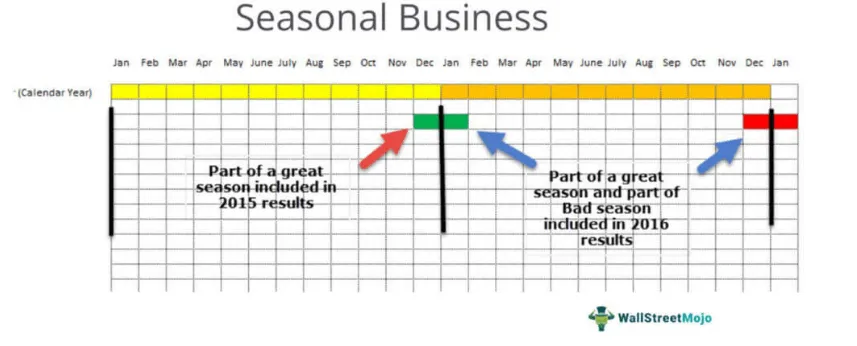

In today's fast-paced financial markets, understanding economic data is crucial for informed trading decisions. Economic data analysis helps market participants interpret nuanced information that impacts the health of economies and influences investor behavior. This article focuses on the application of seasonal adjustment methods, a critical tool for extracting meaningful insights from economic data, particularly in the context of algorithmic trading.

Seasonal adjustments are statistical techniques designed to remove periodic fluctuations in time series data, providing a clearer view of the underlying trends. These adjustments help strip away the noise introduced by recurring patterns, such as holiday spending spikes or seasonal employment changes, making it easier to discern genuine economic trends. In practice, seasonal adjustments enhance the accuracy of economic forecasts by ensuring the data reflects the long-term trends without the distortions caused by seasonal variations.



Incorporating seasonally adjusted data into algorithmic trading strategies allows traders to refine their decision-making processes. By accounting for cyclical patterns, trading algorithms can more accurately predict market movements and reduce the risks associated with seasonal biases. This integration is particularly relevant in automated trading systems, where real-time data-driven insights are used to execute trades with precision.

Understanding how seasonal adjustment techniques refine economic forecasts and improve algorithmic trading outcomes is critical for market participants aiming to maintain a competitive edge. The methodologies discussed provide foundational knowledge to ensure trading strategies are robust and effective in capturing true market signals.

## Table of Contents

## What is Seasonal Adjustment?

Seasonal adjustment is a statistical technique designed to remove the regular and predictable fluctuations occurring at fixed intervals in time series data. These periodic fluctuations are typically due to seasonal factors such as holidays, weather variations, and institutional activities. By smoothing out these variations, seasonal adjustment provides a clearer view of the underlying economic trends and helps in making accurate economic forecasts and informed business decisions.

The primary goal of seasonal adjustment is to isolate and remove seasonal effects, thereby enabling analysts to identify genuine trends and patterns in economic indicators. For instance, retail sales data might show high sales volumes during the end-of-year holiday period, which does not necessarily indicate an upward trend in consumer spending. Seasonal adjustment helps mitigate such misinterpretations by providing a steady trend line, thus enhancing the interpretability of data.

Several methods are commonly used for seasonal adjustments, with X-13ARIMA-SEATS and STL decomposition being notable examples. 

1. **X-13ARIMA-SEATS**: This method, utilized by organizations such as the U.S. Census Bureau, combines Autoregressive Integrated Moving Average (ARIMA) modeling with signal extraction in the presence of noise. It uses an iterative process to estimate seasonal components and trend-cycle components separately, providing extensive diagnostic tools and options for outlier detection, model comparisons, and robust forecasting.

2. **STL Decomposition (Seasonal-Trend decomposition using Loess)**: STL is a flexible and robust method for decomposing time series data into seasonal, trend, and remainder components. It is particularly effective when the seasonal pattern changes over time. Unlike traditional methods, STL can handle a variety of seasonal patterns and is resistant to outliers, making it suitable for complex datasets. STL uses Loess (Locally Estimated Scatterplot Smoothing), a non-parametric technique, to model both trend and seasonal components.

These seasonal adjustment methods significantly enhance forecasting accuracy by refining data inputs, leading to clearer economic indicators. They are crucial tools for economists and analysts when interpreting datasets that are subject to regular seasonal variations. Employing these methods allows for the extraction of true economic signals from the noise generated by recurrent seasonal effects, providing a more reliable basis for decision-making and policy formulation.

## Methods of Seasonal Adjustment

Several statistical techniques exist for calculating seasonal adjustments, each with distinct features, applications, and challenges. Among the most widely used are X-13ARIMA-SEATS and STL decomposition, which are integral to refining the understanding of economic data.

**X-13ARIMA-SEATS Method**

The X-13ARIMA-SEATS method is a sophisticated statistical tool employed predominantly by major institutions, including the U.S. Bureau of Labor Statistics, to perform seasonal adjustments. This approach combines two distinct models: X-12-ARIMA and SEATS (from the Bank of Spain), offering comprehensive features for handling various components of time series data, such as trends, seasonality, and irregularities.

The method extends the ARIMA (AutoRegressive Integrated Moving Average) model, predominantly used for forecasting by identifying autoregressive and moving average parameters within the data. Coupled with SEATS, the method focuses on both pre-adjustment for calendar effects and model-based decomposition. This dual functionality allows it to effectively handle trading day variations, holiday effects, and other non-stationary elements in economic data. Consequently, it is highly effective in ensuring that the seasonal adjustment captures only the essential patterns, resulting in more accurate forecasting and trend analysis.

**STL Decomposition**

STL decomposition, short for Seasonal-Trend decomposition using Loess, offers an alternative approach by decomposing time series into three components: seasonal, trend, and residual. One of its primary advantages is its flexibility, allowing for robust detection and separation of seasonal and trend components regardless of the complexity or irregularity of patterns present in the data.

Implemented using locally weighted regression (Loess), STL effectively smooths the data over time, which aids in distinguishing non-linear trends and seasonal variations. This adaptability makes it particularly useful for time series that display complex and evolving seasonal behaviors, as observed in retail sales data or stock market indices.

In Python, STL decomposition can be implemented using the `statsmodels` library. Here is a simple example:

```python
import pandas as pd
from statsmodels.tsa.seasonal import STL

# Sample time series data
example_data = pd.Series([your_data_here])

# STL decomposition
stl = STL(example_data, seasonal=13)
result = stl.fit()

# Plotting the results
result.plot()
```

**Applications**

Exploring these methods highlights their diverse applicability across economic contexts. X-13ARIMA-SEATS is preferred in structured institutional environments where standardized data sets with significant calendar effects are involved. STL, due to its flexibility and simplicity, finds favor among analysts dealing with less structured and more dynamic data environments, enabling more intuitive interpretation and visualization of underlying trends.

Overall, the selection of a seasonal adjustment method should reflect the specific characteristics of the data, consideration of the end-users' needs, and the analytical objectives. Understanding their respective methodologies enhances one's ability to interpret and leverage seasonally adjusted data effectively in economic forecasting and analysis.

## Significance in Economic Data Analysis

Seasonal adjustments play a pivotal role in refining economic forecasts by enabling analysts to filter out predictable fluctuations, thereby isolating genuine economic signals. These adjustments are vital for accurately interpreting macroeconomic variables, as they allow analysts to discern between cyclical patterns that recur at specific times of the year and actual economic changes.

For instance, in the housing sector, sales volumes may naturally rise during certain months due to favorable weather conditions or cyclical events such as the start of the school year. Without seasonal adjustments, raw housing data could misleadingly suggest a stronger economic condition than actually exists. By applying seasonal adjustment techniques, analysts can correct for these predictable patterns, revealing underlying trends such as changes in housing market strength or consumer behavior shifts.

In labor [statistics](/wiki/bayesian-statistics), seasonal adjustments provide clarity amid the natural ebb and flow of employment patterns. Retail businesses, for example, typically hire more staff during the holiday season, leading to temporary spikes in employment figures. By adjusting the data to account for these seasonal employment trends, analysts gain insights into the true state of the job market, including long-term employment trends and the health of the labor economy.

Retail sector data also benefit significantly from seasonal adjustment. Retail sales experience regular seasonal ebbs and flows influenced by holidays and cultural events. Without adjustments, the data would be dominated by seasonal noise, obscuring actual growth or contraction trends. Seasonal adjustments facilitate a clearer comparison across different time periods, supporting more accurate strategic business decisions and policy-making.

In summary, seasonal adjustments are indispensable in filtering out recurrent noise within economic data, allowing for the identification of authentic economic insights. This enables analysts to compute net economic trends with greater precision, ensuring that policy decisions and market strategies are based on sound interpretations of underlying economic conditions.

## Algorithmic Trading and Seasonal Adjustments

Algorithmic trading relies heavily on precise and timely data analysis to inform automated trading decisions. Integrating seasonally adjusted economic data into these systems can substantially improve the accuracy and reliability of predictive models. By addressing the inherent seasonal biases present in raw data, trading algorithms can avoid making erroneous decisions influenced by predictable, yet misleading, periodic fluctuations.

One of the significant advantages of using seasonally adjusted data in [algorithmic trading](/wiki/algorithmic-trading) is its ability to filter out noise caused by predictable seasonal variations. This enables traders to focus on the underlying trends and make more informed forecasts. For instance, retail sales figures often surge during the holiday season; however, seasonally adjusted data can provide a more accurate picture of the overall economic growth, unmasking the genuine performance of a sector beyond the holiday spike.

The rise of [artificial intelligence](/wiki/ai-artificial-intelligence) (AI) and [machine learning](/wiki/machine-learning) (ML) in financial markets has further enhanced the capacity to model complex seasonal patterns dynamically. Machine learning algorithms, particularly those that learn from vast datasets, are adept at identifying intricate patterns that may not be evident through conventional seasonal adjustment techniques alone. For example, ensemble methods like Random Forests or sophisticated neural networks can model intricate relationships within the data, capturing nuances in seasonal changes and their impact on financial instruments’ price movements.

Python, a popular language for algorithmic trading, provides various libraries such as `pandas`, `statsmodels`, and `scikit-learn`, which are particularly useful for performing seasonal adjustments and implementing machine learning models. Below is a simple demonstration of how Python can be used to prepare and analyze seasonally adjusted data for trading purposes:

```python
import pandas as pd
from statsmodels.tsa.seasonal import seasonal_decompose
from sklearn.ensemble import RandomForestRegressor

# Load time series data
data = pd.read_csv('economic_data.csv', index_col='date', parse_dates=True)

# Seasonal decomposition
result = seasonal_decompose(data['sales'], model='multiplicative')
seasonally_adjusted = data['sales'] / result.seasonal

# Prepare data for machine learning model
X = seasonally_adjusted.values.reshape(-1, 1)
y = data['target_variable'].values

# Train a Random Forest model
model = RandomForestRegressor()
model.fit(X, y)

# Make predictions
predictions = model.predict(X)
```

The integration of seasonally adjusted data into algorithmic trading systems not only refines the input data quality, reducing errors, but also empowers these systems to exploit patterns with greater precision. As markets continue to evolve, the use of AI and ML in processing seasonally adjusted data represents a cutting-edge approach, enabling traders to gain a significant competitive advantage. This synergy of advanced statistical techniques and computing technology paves the way for more sophisticated trading strategies that can adeptly respond to the complexities of modern financial markets.

## Practical Implementation for Traders

Traders aiming for precision in algorithmic trading should prioritize high-quality data and carefully selected models that account for seasonal variations. The integration of seasonal adjustments ensures that trading strategies are not skewed by predictable seasonal patterns. 

Foremost, data quality stands as a fundamental pillar in developing reliable trading strategies. High-fidelity data reduces the risk of inaccuracies, allowing for better model performance. The selection of appropriate models is equally critical, as these should incorporate mechanisms to adjust for seasonality. Common statistical techniques such as X-13ARIMA-SEATS or STL decomposition can be employed to achieve this.

Backtesting is a vital tool in this process. It allows traders to simulate their models using historical data to validate the effectiveness of strategies before actual deployment. By [backtesting](/wiki/backtesting), traders can assess the model's performance over various market conditions, identifying any potential vulnerabilities or biases that may arise from seasonal fluctuations.

Moreover, model optimization is essential. This step involves tuning model parameters to enhance prediction accuracy and capitalize on market opportunities. Optimization techniques, such as grid search or randomized search in machine learning, can be implemented to find the best set of hyperparameters that maximize the model’s performance while accounting for seasonality.

Preprocessing steps, like normalization and data cleaning, are crucial to prepare data for analysis. They ensure that any noise or outliers that may obscure seasonal patterns are mitigated. Furthermore, continuous validation of the models ensures their reliability over time. Regularly updating the models and retraining them with the latest data helps traders adapt to evolving market conditions and maintains the effectiveness of their seasonally adjusted strategies.

In Python, preprocessing and validation might look like this:

```python
import pandas as pd
from sklearn.model_selection import train_test_split, GridSearchCV
from sklearn.preprocessing import StandardScaler
from statsmodels.tsa.seasonal import seasonal_decompose

# Load data
data = pd.read_csv('market_data.csv')
# Seasonal decomposition
decomposed = seasonal_decompose(data['price'], model='additive', period=12)

# Preprocessing
X = decomposed.trend.dropna().values.reshape(-1, 1)
y = data['target'][decomposed.trend.dropna().index]

scaler = StandardScaler()
X_scaled = scaler.fit_transform(X)

X_train, X_test, y_train, y_test = train_test_split(X_scaled, y, test_size=0.2, random_state=42)

# Model Optimization
from sklearn.linear_model import LinearRegression
model = LinearRegression()

param_grid = {'fit_intercept': [True, False], 'normalize': [True, False]}
grid_search = GridSearchCV(estimator=model, param_grid=param_grid, cv=5)

grid_search.fit(X_train, y_train)
best_model = grid_search.best_estimator_

# Continuous validation
y_pred = best_model.predict(X_test)
```

By maintaining a focus on data quality, appropriate seasonal models, and continuous validation, traders can enhance their algorithmic trading strategies, ensuring they remain robust and effective despite evolving market dynamics.

## Conclusion

Seasonal adjustment methods are invaluable in economic analysis and algorithmic trading, serving as crucial tools in refining data interpretation and decision-making processes. These techniques effectively eliminate recurring seasonal fluctuations, allowing analysts to focus on the underlying trends that truly reflect economic realities. For algorithmic trading, this clarity translates into more accurate inputs for trading models, minimizing the risk of misinterpretations due to predictable seasonal patterns.

In the rapidly evolving financial markets, implementing advanced strategies is essential for maintaining competitiveness. The integration of artificial intelligence (AI) into seasonal adjustment models can further enhance this process, enabling traders to capitalize on complex, dynamic patterns that traditional models might overlook. AI-driven methods allow for adaptive learning, improving the precision of seasonal adjustments and, consequently, the predictive accuracy of trading algorithms.

As financial market dynamics continue to change, the adoption and adaptation of advanced seasonal adjustment techniques will play an increasingly important role. Traders and analysts who effectively harness these methodologies can anticipate and react to market shifts with greater agility, securing a competitive advantage. Embracing these techniques not only clarifies economic data but also affirms the pivotal role of technology in trading strategy development.

## Further Reading

For those interested in expanding their expertise on algorithmic trading and seasonal adjustment methods, several key resources are recommended. Programming AI for trading strategies can vastly enhance traders' ability to capitalize on market opportunities. Incorporating advanced algorithms, machine learning, and data analysis techniques into trading systems can improve their predictive capabilities and adaptability to market conditions.

1. **Programming AI for Trading Strategies**:
   - **Books**: "Hands-On Machine Learning for Algorithmic Trading" by Stefan Jansen provides a comprehensive guide to applying machine learning techniques in financial markets. It covers topics from data retrieval and preprocessing to developing models for strategy backtesting and performance measurement.
   - **Online Courses**: Udacity's "AI for Trading" nanodegree offers an extensive curriculum that includes portfolio optimization, sentiment analysis, and deploying predictive models using AI tools.
   - **Research Papers**: The paper "Machine Learning in Automated Trading Systems: A Survey" offers an academic perspective on the latest methodologies and technologies in AI-driven trading.

2. **Integrating Fundamental Analysis into Trading Algorithms**:
   - **Books**: "Algorithmic and High-Frequency Trading" by Álvaro Cartea, Sebastian Jaimungal, and José Penalva explores the integration of quantitative and fundamental elements in algorithmic trading strategies.
   - **Online Resources**: Investopedia provides articles and courses on fundamental analysis that form a solid foundation for understanding this aspect's integration into algorithmic models.
   - **Research Papers**: Articles like "Fundamental Analysis and Algorithmic Trading: A Fusion for Accessing Market Efficiency" discuss combining qualitative and quantitative analyses to build more robust trading strategies.

3. **Practical Implementation and Code Repositories**:
   - **GitHub Projects**: Explore repositories focusing on algorithmic trading models. For instance, "Awesome Algo Trading" is a curated list of useful resources for algorithmic trading.
   - **Python Libraries**: Libraries like `Pandas` for data manipulation, `NumPy` for numerical computations, and `scikit-learn` for implementing machine learning models are essential for developing algorithmic trading systems.

By engaging with these resources, traders can significantly enhance their skills and understanding, allowing them to create sophisticated, adaptable algorithms that respond effectively to ever-changing market scenarios.

## References & Further Reading

[1]: Bergstra, J., Bardenet, R., Bengio, Y., & Kégl, B. (2011). ["Algorithms for Hyper-Parameter Optimization."](https://papers.nips.cc/paper/4443-algorithms-for-hyper-parameter-optimization) Advances in Neural Information Processing Systems 24.

[2]: ["Advances in Financial Machine Learning"](https://www.amazon.com/Advances-Financial-Machine-Learning-Marcos/dp/1119482089) by Marcos Lopez de Prado

[3]: ["Evidence-Based Technical Analysis: Applying the Scientific Method and Statistical Inference to Trading Signals"](https://books.google.com/books/about/Evidence_Based_Technical_Analysis.html?id=jbD47VkOHAEC) by David Aronson

[4]: ["Machine Learning for Algorithmic Trading"](https://github.com/stefan-jansen/machine-learning-for-trading) by Stefan Jansen

[5]: ["Quantitative Trading: How to Build Your Own Algorithmic Trading Business"](https://github.com/LucindaYa/quant-resources/blob/master/Quantitative%20Trading%20How%20to%20Build%20Your%20Own%20Algorithmic%20Trading%20Business.pdf) by Ernest P. Chan