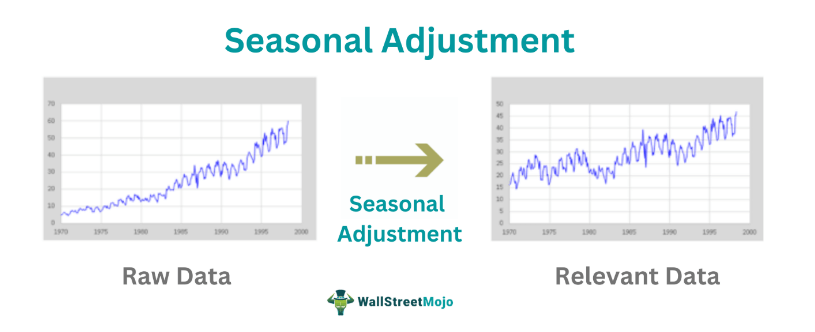

## Table of Contents

## What is seasonal adjustment and why is it important?

Seasonal adjustment is a way to make data more accurate by removing patterns that happen at the same time every year. For example, ice cream sales go up in the summer and down in the winter. If we want to see the real trend of ice cream sales, we need to take out the summer and winter effects. This helps us see what's really happening, not just what happens because of the time of year.

It's important because it helps us understand data better. Without seasonal adjustment, we might think ice cream sales are doing great just because it's summer, but maybe they're not doing as well as last summer. By taking out the seasonal patterns, we can see if sales are really going up or down over time. This is useful for businesses, economists, and anyone who needs to make decisions based on data.

## Can you explain the difference between seasonality and trend in time series data?

Seasonality in time series data refers to patterns that repeat at regular intervals, usually within a year. For example, if you look at the sales of umbrellas, you might see that they go up every year during the rainy season and then go down again. This up-and-down pattern that happens every year is what we call seasonality. It's like a cycle that you can predict because it happens at the same time every year.

On the other hand, a trend in time series data is the overall direction that the data is moving over a long period of time. It could be going up, going down, or staying flat. For instance, if the number of people using smartphones keeps increasing year after year, that's a trend. Trends show us the big picture of what's happening over time, not just the ups and downs that happen every year.

Understanding the difference between seasonality and trend is important because it helps us see what's really going on with the data. If we only look at the seasonal patterns, we might miss the bigger trend. And if we only look at the trend, we might not see the regular ups and downs that happen every year. By looking at both, we get a fuller picture of the data.

## What are the common methods used for seasonal adjustment?

One common method for seasonal adjustment is the moving average method. This method smooths out the data by taking the average of a certain number of data points over time. For example, if you want to see the trend in monthly sales without the seasonal ups and downs, you could take the average of three months at a time. This helps to remove the seasonal patterns and show the overall trend more clearly.

Another method is called the X-12-ARIMA method, which is more complex but very popular, especially among economists. This method uses a special kind of math called ARIMA (AutoRegressive Integrated Moving Average) to predict and remove the seasonal patterns from the data. It's good at handling different kinds of data and can adjust for things like holidays and trading days, making it very useful for detailed analysis.

Lastly, there's the method called STL (Seasonal and Trend decomposition using Loess). This method breaks down the time series into three parts: the seasonal part, the trend part, and the rest, which is called the residual. It's good because it can handle data that has a lot of ups and downs and can adjust to changes in the seasonal patterns over time. This makes it flexible and useful for many different kinds of data.

## How does the X-13ARIMA-SEATS method work for seasonal adjustment?

The X-13ARIMA-SEATS method is a way to take out the seasonal patterns from data so we can see the real trend. It's like a special tool that uses math to predict what the seasonal ups and downs will be, and then it takes those predictions away from the data. This method is good because it can handle different kinds of data and can even adjust for things like holidays and the number of trading days in a month. It's like having a smart helper that knows how to clean up the data to show you what's really going on.

The method works by first figuring out what the seasonal pattern looks like. It does this by looking at past data and using a special kind of math called ARIMA to make a guess about what the seasonal pattern will be in the future. Once it has a good idea of the seasonal pattern, it takes that pattern away from the original data. What's left is the data without the seasonal ups and downs, so you can see the trend more clearly. This helps people make better decisions because they can see the real changes in the data, not just the changes that happen every year.

## What is the TRAMO/SEATS method and how does it differ from X-13ARIMA-SEATS?

The TRAMO/SEATS method is another way to take out the seasonal patterns from data so you can see the real trend. It's like a two-step process. First, TRAMO (Time Series Regression with ARIMA noise, Missing values, and Outliers) looks at the data and figures out if there are any unusual things, like missing numbers or big jumps that don't usually happen. It then cleans up the data by fixing these problems. After that, SEATS (Signal Extraction in ARIMA Time Series) steps in and uses math to break down the cleaned-up data into different parts: the seasonal part, the trend part, and the rest, which is called the residual. This helps you see the trend without the seasonal ups and downs.

The main difference between TRAMO/SEATS and X-13ARIMA-SEATS is how they handle the data before taking out the seasonal patterns. TRAMO/SEATS focuses a lot on fixing any unusual things in the data before it even starts looking at the seasonal patterns. This makes it good for data that might have a lot of problems. On the other hand, X-13ARIMA-SEATS is more of an all-in-one tool that can handle different kinds of data and can adjust for things like holidays and the number of trading days in a month. Both methods use ARIMA to predict and remove the seasonal patterns, but they go about it in slightly different ways, depending on what the data needs.

## Can you describe the steps involved in applying the Census X-12-ARIMA method?

The Census X-12-ARIMA method is a way to take out the seasonal patterns from data so you can see the real trend. First, it uses a special kind of math called ARIMA to guess what the seasonal ups and downs will be. It looks at past data to figure this out. Once it has a good idea of what the seasonal pattern will be, it takes that pattern away from the original data. This helps to smooth out the data and show the trend more clearly. The method also checks for things like holidays and the number of trading days in a month, and it can adjust for these too.

After the seasonal pattern is taken out, the X-12-ARIMA method looks at the data again to make sure it did a good job. It checks to see if there are any unusual jumps or drops in the data that don't fit the seasonal pattern. If it finds any, it tries to fix them so the trend is even clearer. This step is important because it helps to make sure the data is as accurate as possible. By the end of this process, you're left with data that shows the real trend, without the seasonal ups and downs getting in the way.

## What are the advantages and limitations of using moving averages for seasonal adjustment?

Using moving averages for seasonal adjustment has some good points. It's easy to understand and use, even if you're not a math expert. You just take the average of a few numbers at a time, and this helps smooth out the ups and downs in the data. This can make it easier to see the overall trend without getting distracted by the seasonal changes. It's also quick to do, so you can adjust your data and make decisions faster.

But moving averages also have some problems. They can make it hard to see sudden changes in the data because they smooth everything out. If something important happens, like a big drop in sales, you might not see it right away because the moving average will spread it out over time. Also, moving averages can be too simple for some kinds of data. If the seasonal patterns change a lot from year to year, a moving average might not be able to keep up and could give you a wrong picture of what's really going on.

## How do you determine the appropriate seasonal adjustment model for a specific dataset?

Choosing the right seasonal adjustment model for a specific dataset can feel a bit like [picking](/wiki/asset-class-picking) the right tool for a job. You need to look at what kind of data you have and what you want to do with it. If your data has a lot of ups and downs that happen at the same time every year, like more ice cream sales in the summer, you might want to use a model that's good at handling regular patterns, like the X-13ARIMA-SEATS method. This method is smart at predicting and removing these seasonal patterns, and it can also adjust for things like holidays and the number of trading days in a month.

But if your data has a lot of unusual things, like missing numbers or big jumps that don't usually happen, you might want to use the TRAMO/SEATS method. This method first cleans up the data by fixing these problems before it even starts looking at the seasonal patterns. This can be really helpful if your data is messy and needs a lot of work before you can see the trend clearly. Both methods use math to predict and remove the seasonal patterns, but they go about it in slightly different ways, depending on what your data needs.

## What are some common challenges faced when applying seasonal adjustment techniques?

One of the main challenges when applying seasonal adjustment techniques is dealing with unusual data. Sometimes, the data has missing numbers, big jumps, or other strange things that don't fit the usual pattern. These can make it hard for the seasonal adjustment method to work properly. For example, if a big event like a holiday sale causes a sudden spike in sales, the method might think this is part of the seasonal pattern and adjust it wrongly. This can lead to a wrong picture of what's really happening with the data.

Another challenge is that seasonal patterns can change over time. What used to happen every year might not happen the same way anymore. If the method you're using doesn't keep up with these changes, it might take out the wrong seasonal patterns and leave you with data that doesn't show the real trend. This can make it hard to make good decisions based on the data. It's important to keep checking and updating the seasonal adjustment to make sure it's still working well with the latest data.

## How can one assess the quality of a seasonal adjustment?

Assessing the quality of a seasonal adjustment means checking if it did a good job at taking out the seasonal ups and downs from the data. One way to do this is by looking at the data after it's been adjusted. If the seasonal patterns are gone and you can see the overall trend clearly, that's a good sign. Another way is to compare the adjusted data with other data that you know is right. If they match up well, it means the seasonal adjustment worked well.

Another important thing to check is if the seasonal adjustment method can handle changes in the data. Sometimes, the seasonal patterns can change over time, and a good method should be able to keep up with these changes. You can test this by using the method on different parts of the data and seeing if it still works well. If it can adjust to new patterns and still show the real trend, then you know it's a high-quality seasonal adjustment.

## What advanced techniques can be used to handle irregular or complex seasonal patterns?

When dealing with irregular or complex seasonal patterns, one advanced technique that can be used is called STL (Seasonal and Trend decomposition using Loess). STL is good at handling data that has a lot of ups and downs and can adjust to changes in the seasonal patterns over time. It breaks down the time series into three parts: the seasonal part, the trend part, and the rest, which is called the residual. This makes it flexible and useful for many different kinds of data. If the seasonal patterns in your data change a lot from year to year, STL can keep up with these changes and still give you a clear picture of the trend.

Another technique is the use of [machine learning](/wiki/machine-learning) methods, like neural networks. These methods can learn from the data and figure out even the most complex seasonal patterns. They can handle data that has a lot of unusual things, like missing numbers or big jumps that don't usually happen. By training the [neural network](/wiki/neural-network) on past data, it can predict and remove the seasonal patterns, leaving you with data that shows the real trend. This is helpful when the seasonal patterns are hard to predict using simpler methods.

## Can you provide an example of how seasonal adjustment has been applied in economic forecasting?

Seasonal adjustment is often used in economic forecasting to make sure the numbers we look at are as accurate as possible. For example, let's say we want to predict how many cars will be sold next year. Car sales usually go up in the summer because more people are out and about, and they go down in the winter because it's cold and people stay inside more. If we just look at the raw numbers, we might think car sales are doing great in the summer and bad in the winter. But by using seasonal adjustment, we can take out these summer and winter effects and see the real trend in car sales. This helps us make better predictions about what will happen next year.

In another example, economists use seasonal adjustment to look at unemployment rates. Unemployment can go up in January because a lot of seasonal jobs, like working at holiday stores, end after the holidays. If we don't adjust for this, we might think the unemployment rate is getting worse every January. But by using seasonal adjustment, we can take out the effect of these seasonal jobs ending and see the real trend in unemployment. This helps economists and policymakers make better decisions about how to help people find jobs and keep the economy strong.

## References & Further Reading

[1]: Bergstra, J., Bardenet, R., Bengio, Y., & Kégl, B. (2011). ["Algorithms for Hyper-Parameter Optimization."](https://papers.nips.cc/paper/4443-algorithms-for-hyper-parameter-optimization) Advances in Neural Information Processing Systems 24.

[2]: ["Advances in Financial Machine Learning"](https://www.amazon.com/Advances-Financial-Machine-Learning-Marcos/dp/1119482089) by Marcos Lopez de Prado

[3]: ["Evidence-Based Technical Analysis: Applying the Scientific Method and Statistical Inference to Trading Signals"](https://books.google.com/books/about/Evidence_Based_Technical_Analysis.html?id=jbD47VkOHAEC) by David Aronson

[4]: ["Machine Learning for Algorithmic Trading"](https://github.com/stefan-jansen/machine-learning-for-trading) by Stefan Jansen

[5]: ["Quantitative Trading: How to Build Your Own Algorithmic Trading Business"](https://github.com/LucindaYa/quant-resources/blob/master/Quantitative%20Trading%20How%20to%20Build%20Your%20Own%20Algorithmic%20Trading%20Business.pdf) by Ernest P. Chan