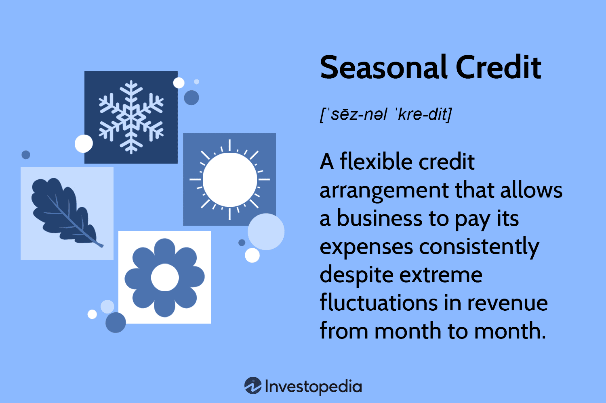

## Table of Contents

## What is seasonal credit?

Seasonal credit is a type of loan that the Federal Reserve offers to banks. It helps banks that need extra money during certain times of the year. For example, a bank might need more money during the holiday season when people are doing more shopping and borrowing.

This type of credit is important because it helps banks manage their money better. Banks can borrow money at a lower interest rate than they might get from other places. This way, they can keep serving their customers without running out of money during busy times.

## Why is seasonal credit important for businesses?

Seasonal credit is important for businesses because it helps them manage their money during busy times of the year. For example, a toy store might need more money during the holiday season to buy extra toys and hire more workers. If the store can borrow money easily, it can keep up with the extra demand and make more sales.

This type of credit also helps businesses avoid running out of money when they need it most. Without seasonal credit, a business might have to turn away customers or miss out on sales because it doesn't have enough money to buy more stock or pay its bills. By having access to seasonal credit, businesses can keep running smoothly and take advantage of peak seasons to grow and succeed.

## How does seasonal credit differ from other types of credit?

Seasonal credit is different from other types of credit because it is designed to help businesses and banks during certain times of the year. For example, a bank might need more money during the holiday season when people are doing more shopping and borrowing. Seasonal credit helps them borrow money at a lower interest rate during these busy times, so they can keep serving their customers without running out of money.

Other types of credit, like personal loans or business loans, are not tied to specific times of the year. They can be used for any purpose, like buying a car or expanding a business. These loans often have different interest rates and repayment terms compared to seasonal credit. Seasonal credit is more flexible and focused on helping businesses manage their money during peak seasons, while other types of credit are more general and can be used anytime.

## What are the typical sources of seasonal credit?

Seasonal credit often comes from banks and financial institutions. These places understand that businesses need extra money during busy times of the year, like the holiday season. So, they offer loans that businesses can use to buy more stock, hire extra workers, or cover other costs during these peak times. The interest rates on these loans might be lower than other types of loans because they are meant to help businesses manage their money better during busy seasons.

Another source of seasonal credit is the Federal Reserve. The Federal Reserve offers seasonal credit to banks that need extra money to meet the demands of their customers during certain times of the year. This helps banks keep serving their customers without running out of money. The Federal Reserve's seasonal credit program is designed to be flexible and help banks manage their money better during peak seasons.

## Who qualifies for seasonal credit?

Businesses that need extra money during busy times of the year can qualify for seasonal credit. For example, a toy store might need more money during the holiday season to buy more toys and hire extra workers. To get seasonal credit, the business needs to show that it has a clear pattern of higher sales or expenses during certain times of the year. This helps the bank or lender understand why the business needs the extra money.

Banks can also qualify for seasonal credit from the Federal Reserve. The Federal Reserve offers this type of credit to help banks manage their money better during busy times. A bank might need more money during the holiday season when people are doing more shopping and borrowing. To qualify, the bank needs to show that it has a history of needing more money during certain times of the year. This helps the Federal Reserve understand why the bank needs the extra money.

## How is the amount of seasonal credit determined?

The amount of seasonal credit a business can get is based on how much extra money it needs during busy times of the year. For example, a toy store might need more money during the holiday season to buy more toys and hire extra workers. The business has to show the bank or lender how much more money it needs by looking at past sales and expenses during those busy times. This helps the bank or lender decide how much seasonal credit to give the business.

For banks, the Federal Reserve decides the amount of seasonal credit based on the bank's history of needing more money during certain times of the year. The bank has to show the Federal Reserve how much extra money it needs by looking at past data. This helps the Federal Reserve understand how much seasonal credit the bank needs to keep serving its customers during busy times.

## What are the terms and conditions usually associated with seasonal credit?

Seasonal credit usually comes with specific terms and conditions that businesses and banks need to follow. For businesses, the main condition is that they need to show a clear pattern of higher sales or expenses during certain times of the year. This helps the bank or lender understand why the business needs the extra money. The interest rate on seasonal credit might be lower than other types of loans because it's meant to help businesses manage their money better during busy seasons. Businesses also need to repay the loan within a certain time, usually after the busy season is over.

For banks, the Federal Reserve sets the terms and conditions for seasonal credit. Banks need to show a history of needing more money during certain times of the year. This helps the Federal Reserve understand how much seasonal credit the bank needs to keep serving its customers during busy times. The interest rate on this credit is usually lower than other types of loans, and banks need to repay the loan within a set time frame, often after the busy season ends. Both businesses and banks need to follow these terms and conditions to get and use seasonal credit effectively.

## How does the application process for seasonal credit work?

The application process for seasonal credit starts with a business or bank figuring out how much extra money they need during busy times of the year. They look at past sales and expenses to see how much more money they needed before. Then, they go to a bank or the Federal Reserve and fill out an application. The application asks for details about the business or bank, like how much money they need and when they need it. The business or bank also has to show that they have a clear pattern of higher sales or expenses during certain times of the year.

Once the application is submitted, the bank or the Federal Reserve reviews it. They check the business or bank's history to make sure they really need the extra money during busy times. If everything looks good, the bank or the Federal Reserve approves the loan and gives the business or bank the money they need. The business or bank then uses the money to buy more stock, hire extra workers, or cover other costs during the busy season. After the busy season is over, they repay the loan according to the terms and conditions set by the lender.

## What are the risks associated with using seasonal credit?

Using seasonal credit can be helpful, but it also comes with some risks. One big risk is that a business might borrow too much money and not be able to pay it back. If the busy season isn't as good as expected, the business might not make enough money to cover the loan. This can lead to financial problems and even bankruptcy if the business can't find other ways to pay back the loan.

Another risk is that the interest rates on seasonal credit might go up. Even though seasonal credit usually has lower interest rates, they can still change. If the rates go up, it can make the loan more expensive for the business. This means the business will have to pay more money back, which can be hard if they are already struggling to make enough money during the busy season.

## How can businesses manage seasonal credit effectively?

Businesses can manage seasonal credit effectively by carefully planning how much money they need during busy times. They should look at past sales and expenses to figure out how much extra money they needed before. This helps them ask for the right amount of credit, so they don't borrow too much or too little. It's also important for businesses to use the money wisely, like buying more stock or hiring extra workers to meet the higher demand during the busy season.

Another way to manage seasonal credit well is to keep a close eye on the business's finances during the busy season. Businesses should track their sales and expenses to make sure they are making enough money to pay back the loan. If they see that they might not make enough money, they can find other ways to save money or make more sales. This helps them avoid financial problems and make sure they can pay back the loan on time.

## What are the economic impacts of seasonal credit on a broader scale?

Seasonal credit can help the economy by making it easier for businesses to handle busy times. When businesses can borrow money to buy more stock or hire extra workers, they can meet the higher demand during peak seasons. This means more people can buy what they need, and more workers can get jobs. It's good for the economy because it keeps money moving and helps businesses grow. If businesses can't get seasonal credit, they might not be able to meet the demand, and this can slow down the economy.

On the other hand, there can be some risks if too many businesses rely on seasonal credit. If a lot of businesses borrow money but can't pay it back because the busy season isn't as good as they expected, it can cause problems. Banks might lose money, and this can make them less willing to lend in the future. This can slow down the economy too. So, while seasonal credit can help keep the economy running smoothly during busy times, it's important for businesses to use it carefully and make sure they can pay it back.

## How have recent financial regulations affected the availability and terms of seasonal credit?

Recent financial regulations have changed how easy it is for businesses and banks to get seasonal credit. New rules from the government and financial watchdogs want to make sure that lending is safe and fair. This means banks have to check more carefully before they give out loans, even seasonal credit. They have to make sure that businesses can pay back the money they borrow. Because of these rules, it might be harder for some businesses to get seasonal credit, especially if they don't have a strong history of paying back loans.

These regulations also affect the terms of seasonal credit. Interest rates might be different now, and banks might ask for more information before they give out loans. They might also set stricter rules about when and how the money has to be paid back. Even though these rules can make it harder to get seasonal credit, they are meant to protect businesses and the economy from big problems. By making sure that loans are given out carefully, the rules help keep the financial system stable during busy times of the year.

## References & Further Reading

[1]: Bergstra, J., Bardenet, R., Bengio, Y., & Kégl, B. (2011). ["Algorithms for Hyper-Parameter Optimization."](https://dl.acm.org/doi/10.5555/2986459.2986743) Advances in Neural Information Processing Systems 24.

[2]: ["Advances in Financial Machine Learning"](https://www.amazon.com/Advances-Financial-Machine-Learning-Marcos/dp/1119482089) by Marcos Lopez de Prado

[3]: ["Evidence-Based Technical Analysis: Applying the Scientific Method and Statistical Inference to Trading Signals"](https://www.amazon.com/Evidence-Based-Technical-Analysis-Scientific-Statistical/dp/0470008741) by David Aronson

[4]: ["Machine Learning for Algorithmic Trading"](https://github.com/stefan-jansen/machine-learning-for-trading) by Stefan Jansen

[5]: ["Quantitative Trading: How to Build Your Own Algorithmic Trading Business"](https://www.amazon.com/Quantitative-Trading-Build-Algorithmic-Business/dp/1119800064) by Ernest P. Chan