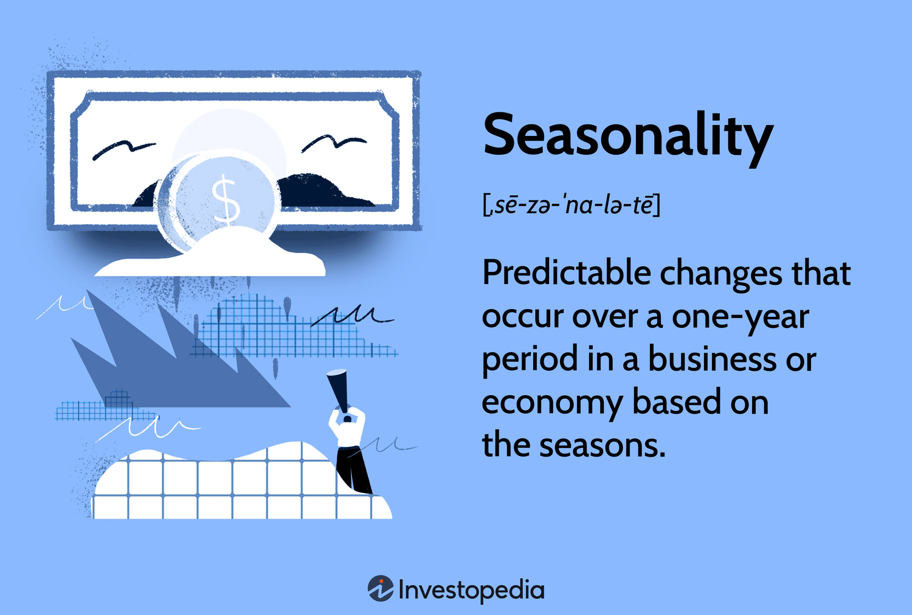

## Table of Contents

## What is a seasonal industry?

A seasonal industry is a type of business that has more work and sales during certain times of the year. These times are called seasons. For example, a ski resort is busy in the winter but quiet in the summer. People who work in seasonal industries often have jobs that start and end with the season.

These industries can be found in many different areas. For example, farming is a seasonal industry because different crops are harvested at different times of the year. Another example is tourism, where places like beaches are more popular in the summer. Businesses in seasonal industries need to plan carefully to make enough money during their busy times to last through the quieter periods.

## Can you provide examples of seasonal industries?

Seasonal industries are businesses that do better at certain times of the year. For example, a company that makes and sells Christmas decorations will be very busy in the months leading up to December. They might hire more workers and work longer hours during this time. But after the holidays, their business slows down a lot. They might even close for a few months until it's time to start making decorations again for the next year.

Another example is the ice cream industry. Ice cream shops and companies that make ice cream see a big increase in sales during the summer when it's hot outside. People want to cool off with ice cream, so these businesses are very busy. But when it gets cold in the winter, fewer people buy ice cream, and these businesses might have to cut back on hours or even close for the season.

Farming is also a seasonal industry. Farmers plant different crops at different times of the year, and they harvest them when they're ready. For example, in many places, strawberries are picked in the spring, while apples are picked in the fall. Farmers have to work hard during these times to get their crops in, but there might be quieter times in between when they're not as busy.

## How do seasonal industries affect the economy?

Seasonal industries can have a big impact on the economy. When these industries are busy, they create a lot of jobs and make a lot of money. This is good for the economy because more people are working and spending money. For example, during the summer, tourism businesses like hotels and restaurants hire more workers and see more customers. This helps the local economy grow because people are [earning](/wiki/earning-announcement) and spending more money.

But when the busy season ends, these industries can slow down a lot. This can be bad for the economy because fewer people are working and spending money. For example, after the summer, many tourism businesses might close or cut back on hours, and workers might lose their jobs or have less money to spend. This can make the economy slow down in those areas. So, seasonal industries can make the economy go up and down throughout the year.

## What are the main challenges faced by businesses in seasonal industries?

Businesses in seasonal industries face a big challenge with their money. When the busy season comes, they need to make enough money to last through the quiet times. This can be hard because they have to pay for things like rent and supplies even when they're not making much money. They might need to save a lot during the busy times or borrow money to get through the slow times. If they don't plan well, they could run out of money and have to close down.

Another challenge is finding and keeping workers. During the busy season, these businesses need a lot of workers, but it can be hard to find enough people who want to work for just a short time. Some workers might leave for other jobs that last all year. When the busy season ends, businesses might have to let workers go, which can make it hard to find good workers again the next year. This can make it tough to keep the business running smoothly.

Overall, seasonal industries have to deal with ups and downs in their business. They need to be good at planning and managing their money and workers. If they can do this well, they can keep their business going strong, even when the seasons change.

## How do companies in seasonal industries manage their workforce?

Companies in seasonal industries often hire temporary workers to help during their busy times. For example, a ski resort might hire extra staff in the winter to handle all the visitors. These workers know they will only have a job for a short time, so they might be students or people looking for extra work. The companies need to find enough of these workers quickly when the busy season starts. They might advertise the jobs in different places or work with staffing agencies to find the right people.

When the busy season ends, these companies usually have to let go of their temporary workers. This can be hard because the workers need to find new jobs, and the companies need to start planning for the next busy season. Some companies try to keep their best workers by offering them jobs in other parts of the business or giving them priority for the next season. This helps the companies keep experienced workers and makes it easier to start up again when the busy time comes back.

Overall, managing the workforce in seasonal industries is all about planning and flexibility. Companies need to make sure they have enough workers during the busy times and enough money to keep going during the slow times. They also need to treat their workers well so they want to come back the next year. By doing these things, companies in seasonal industries can keep their business running smoothly, even when the seasons change.

## What strategies can be used to extend the season of a seasonal business?

One way to make a seasonal business last longer is to offer new products or services that people want at different times of the year. For example, a beach shop that sells swimsuits in the summer could start selling warm clothes in the winter. This way, the shop can stay open and make money all year. Another idea is to use the slow times to get ready for the next busy season. A ski resort could offer summer activities like hiking or mountain biking to keep people coming even when there's no snow.

Another strategy is to use the internet to reach more people. A seasonal business can sell its products online to customers all over the world, not just the ones who can visit in person. This can help the business make money even when the local season is over. For example, a Christmas decoration company could sell online all year and ship to customers who want to buy decorations early or in different countries. By doing these things, a seasonal business can keep making money and stay open for more of the year.

## How do seasonal industries adapt to climate change?

Seasonal industries have to change the way they work because of climate change. The weather is getting warmer, and this can make the seasons different from what they used to be. For example, ski resorts need snow to stay open, but if it's too warm and there's not enough snow, they might have to close earlier than usual. To deal with this, some ski resorts are making their own snow with machines. They might also start offering other activities like hiking or mountain biking in the summer to make money when there's no snow.

Farming is another seasonal industry that is affected by climate change. Farmers need the right amount of rain and the right temperatures to grow their crops. But with climate change, the weather can be too hot or too dry, which can hurt the crops. To adapt, some farmers are planting different types of crops that can handle the new weather. They might also use new technology like better irrigation systems to make sure their crops get enough water. By making these changes, farmers can keep growing food even when the climate is changing.

## What role does technology play in managing seasonal industry operations?

Technology helps seasonal businesses a lot. It can make their work easier and help them make more money. For example, a ski resort can use computers to check the weather and make snow when it's needed. They can also use the internet to sell tickets and tell people about their resort. This way, they can reach more people and keep making money even when it's not busy. Technology can also help with keeping track of money and planning for the future. This is important because seasonal businesses need to save money during the busy times to use during the slow times.

Another way technology helps is by making things more efficient. For example, farmers can use machines to plant and harvest crops faster. They can also use special tools to check the soil and water their crops just the right amount. This helps them grow more food and make more money. Technology can also help with finding and managing workers. Seasonal businesses can use apps and websites to find temporary workers quickly when they need them. By using technology, seasonal businesses can work better and make more money, even when the seasons change.

## How do seasonal industries forecast demand and manage inventory?

Seasonal industries use different ways to guess how much people will want their products or services. They look at what happened in past years to see how many people bought things or came to visit during certain times. They also use computers and special programs to help them make better guesses. These programs can look at a lot of information, like the weather or what people are searching for online, to predict what will happen. By doing this, seasonal businesses can get ready for busy times and make sure they have enough of what people want.

Managing inventory is also important for seasonal businesses. They need to have enough products to sell during the busy times but not too much that they can't sell it all. To do this, they use the guesses they made about demand to decide how much to buy or make. They might also use technology to keep track of their inventory and make sure they always have the right amount. If they have too much, they might have sales to get rid of it. If they don't have enough, they might need to order more quickly. By managing their inventory well, seasonal businesses can make more money and keep their customers happy.

## What are the financial planning considerations specific to seasonal industries?

Seasonal industries have to be very careful with their money because they make most of it during certain times of the year. They need to save enough during the busy times to pay for everything during the slow times. This can be hard because they still have to pay for things like rent and supplies even when they're not making much money. They might need to borrow money to get through the slow times, but this can be risky if they can't pay it back. So, they need to plan well and make sure they have enough money saved up.

Another important thing for seasonal businesses is to manage their money carefully all year. They need to keep track of how much they're spending and making, so they know if they're doing okay. They might use special programs on computers to help them with this. By doing this, they can see if they need to cut back on spending or if they can afford to spend more on things like advertising or new equipment. Good financial planning helps seasonal businesses stay open and make money, even when the seasons change.

## How do seasonal industries leverage marketing during their peak seasons?

Seasonal industries use marketing a lot during their busy times to get more people to buy their products or visit their business. They might put ads on TV, radio, or the internet to tell people about special deals or new things they're offering. They could also use social media to show off what they have and get people excited. By doing this, they can bring in more customers and make more money during the peak season.

Another way they use marketing is by working with other businesses or events that happen during their busy time. For example, a beach shop might team up with a local festival to sell their products there. They might also offer discounts or special packages to make people want to buy more. By using these marketing strategies, seasonal businesses can make the most of their peak season and keep their customers coming back.

## What are the long-term sustainability strategies for businesses in seasonal industries?

Seasonal businesses need to think about the future and how they can keep going strong. One way to do this is by diversifying what they offer. Instead of just selling one thing during one time of the year, they could start selling different things at different times. For example, a Christmas tree farm could also sell pumpkins in the fall or offer tours in the summer. By doing this, they can make money all year and not just during their busy season. Another way is to use technology to reach more people. By selling online, they can get customers from all over the world and not just the ones who can visit in person. This can help them make money even when the local season is over.

Another important strategy is to be good at managing money. Seasonal businesses need to save enough during their busy times to pay for everything during the slow times. They might need to borrow money to get through the quiet periods, but this can be risky if they can't pay it back. So, they need to plan well and make sure they have enough money saved up. They should also keep track of how much they're spending and making, so they know if they're doing okay. By managing their money carefully, they can stay open and make money, even when the seasons change.

## Is there seasonality in financial markets?

Seasonality in financial markets refers to predictable patterns that occur at specific times of the year. These patterns are derived from historical trends and behavioral finance, where market participants exhibit certain behaviors at recurring times. Recognizing these patterns can provide traders and investors with a strategic edge, enabling them to anticipate and capitalize on likely market movements.

### Common Seasonality Trends

1. **January Effect**:
   The January Effect is a seasonal increase in stock prices during January. This phenomenon is often attributed to tax-loss selling in December, where investors sell off losing stocks to claim capital losses on taxes. Once the new year begins, investors reinvest in the market, driving up prices. It is particularly noticeable in small-cap stocks, which tend to exhibit higher [volatility](/wiki/volatility-trading-strategies) and returns during this period.

2. **Santa Claus Rally**:
   Occurring in the last week of December through the first two trading days of January, the Santa Claus Rally is characterized by a rise in stock prices. This rally is attributed to various factors such as holiday optimism, increased consumer spending, and institutional investors' end-of-year portfolio adjustments.

3. **Summer Rally**:
   The Summer Rally refers to the tendency for the stock market to perform well during the early summer months. It is often driven by improved economic activities and the release of favorable corporate earnings reports during this period. However, this rally is sometimes followed by a market downturn in late summer or early autumn.

### Impact of Seasonal Patterns

#### Stock Markets

Seasonal patterns can significantly affect stock markets, influencing both volatility and price movements. For example, during the January Effect and Santa Claus Rally, increased buying activity can lead to higher stock prices. Conversely, periods following these rallies might see corrections as the market stabilizes. Recognizing these trends can help investors time their buy and sell decisions more effectively.

#### Commodity Markets

Commodity markets also exhibit seasonality, driven by factors such as harvest cycles, weather conditions, and geopolitical events. For instance, agricultural commodities like wheat and corn have specific planting and harvesting periods, affecting supply and demand dynamics. Traders in these markets often use seasonal patterns to predict price movements and adjust their positions accordingly.

#### Currency Markets

In currency markets, seasonality may be influenced by macroeconomic indicators, fiscal year-end effects, and international trade cycles. For example, certain currencies may strengthen during specific quarters or financial reporting periods. Understanding these patterns allows traders to better manage their foreign exchange holdings and devise effective hedging strategies.

### Mathematical Representation

To model seasonality in financial markets, one could utilize time series analysis techniques, such as seasonal decomposition or Fourier transformation, to extract and analyze seasonal components. A simple model to identify seasonality is:

$$
Y_t = T_t + S_t + e_t
$$

Where:
- $Y_t$ is the observed value at time $t$,
- $T_t$ is the trend component,
- $S_t$ is the seasonal component, and
- $e_t$ is the random error term.

Implementing such models in Python could involve using libraries like `statsmodels` or `pandas` to detect and remove seasonality, allowing for more accurate forecasts and analysis. For trended time series `ts`:

```python
import pandas as pd
from statsmodels.tsa.seasonal import seasonal_decompose

decomposition = seasonal_decompose(ts, model='additive', period=12)
seasonal_component = decomposition.seasonal
```

In summary, while seasonality patterns provide valuable insights into potential market movements, they should be considered alongside other analytical tools and market indicators to make informed trading decisions.

## References & Further Reading

[1]: Poterba, J. M., & Shleifer, A. (2000). ["The January Effect"](https://onlinelibrary.wiley.com/doi/full/10.1111/0022-1082.00328). Journal of Law, Economics, & Organization, 16(2), 303-328.

[2]: Malkiel, B. G. (2003). ["A Random Walk Down Wall Street"](https://yourknowledgedigest.org/wp-content/uploads/2020/04/a-random-walk-down-wall-street.pdf). W. W. Norton & Company.

[3]: De Prado, M. L. (2018). ["Advances in Financial Machine Learning"](https://www.amazon.com/Advances-Financial-Machine-Learning-Marcos/dp/1119482089). Wiley.

[4]: Chan, E. P. (2009). ["Quantitative Trading: How to Build Your Own Algorithmic Trading Business"](https://github.com/egorpe/EPChan-QuantitativeTrading/blob/master/example7_6.m). Wiley.

[5]: Aronson, D. R. (2007). ["Evidence-Based Technical Analysis: Applying the Scientific Method and Statistical Inference to Trading Signals"](https://onlinelibrary.wiley.com/doi/book/10.1002/9781118268315). Wiley.

[6]: Jansen, S. (2020). ["Machine Learning for Algorithmic Trading"](https://github.com/stefan-jansen/machine-learning-for-trading). Packt Publishing.

[7]: Thaler, R. H. (1987). ["Anomalies: The January Effect"](https://pubs.aeaweb.org/doi/pdfplus/10.1257/jep.1.1.197). Journal of Economic Perspectives, 1(1), 197-201.