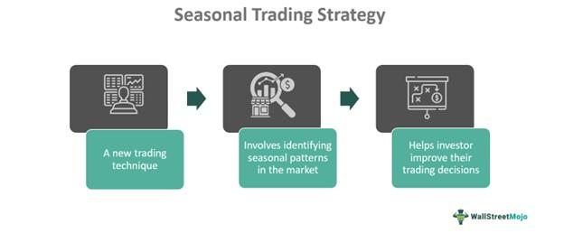

## Table of Contents

## What is a seasonal trading strategy?

A seasonal trading strategy is a way of buying and selling things like stocks or commodities based on the time of year. People who use this strategy believe that certain times of the year are better for making money because of patterns that happen every year. For example, they might buy more ice cream company stocks in the spring because they think people will buy more ice cream in the summer.

These patterns can come from holidays, weather changes, or how people act at different times of the year. For instance, retail stocks might do well around Christmas because people buy more gifts. But, it's important to know that these patterns don't always work. Sometimes, other things like the economy or big news can change how well the strategy works. So, people need to be careful and do a lot of research before they start using a seasonal trading strategy.

## How does seasonality affect different markets?

Seasonality can affect different markets in many ways. For example, in the stock market, some companies do better at certain times of the year. Retail stores might see more sales around the holidays like Christmas, so their stocks might go up in value during that time. On the other hand, companies that make things like snow shovels or winter clothes might do better in the winter months. This is because people need these things more when it's cold outside. So, investors might buy these stocks in the fall, expecting to sell them at a higher price in the winter.

In the commodity market, seasonality can also play a big role. For instance, the price of natural gas might go up in the winter because more people use it to heat their homes. Farmers might plant certain crops at specific times of the year, which can affect the supply and price of those crops. For example, corn prices might be lower after the harvest in the fall because there's a lot of corn available. Knowing these patterns can help people decide when to buy or sell commodities.

Overall, understanding how seasonality works in different markets can be really helpful. But it's not a sure thing. Other things like the economy, big news, or unexpected events can change how well a seasonal pattern works. So, it's important for people to do a lot of research and be ready to change their plans if things don't go as expected.

## What are some common seasonal patterns in stock markets?

In the stock market, one common seasonal pattern is the "Santa Claus Rally." This happens around the end of December and the beginning of January. Many people believe that stocks go up during this time because investors are in a good mood over the holidays and might want to buy stocks before the new year starts. Another pattern is the "January Effect," where stocks, especially smaller ones, tend to do better in January. People think this happens because investors sell losing stocks at the end of the year for tax reasons and then buy them back in January.

Another seasonal pattern is the "Sell in May and Go Away" strategy. This saying means that stocks might not do as well from May to October, so some investors sell their stocks in May and buy them back in the fall. This could be because people go on vacation during the summer and might not pay as much attention to the market. In the fall, especially around September and October, there can be a "Autumn Slump" where stocks might go down. This could be because companies start reporting their earnings and investors might not like what they see.

These patterns can help investors decide when to buy or sell stocks, but they don't always work. Other things like the economy, big news, or unexpected events can change how well these seasonal patterns work. So, it's important for investors to do a lot of research and be ready to change their plans if things don't go as expected.

## Can you explain the concept of 'Sell in May and go away'?

The saying 'Sell in May and go away' is a common advice in the stock market. It means that some people think stocks don't do as well from May to October. So, they sell their stocks in May and wait until the fall to buy them back. This idea comes from looking at past years and seeing that stocks sometimes don't grow as much during the summer months. People think this might happen because others go on vacation and don't pay as much attention to the market, or because there's less big news happening in the summer.

But, this saying doesn't always work. Sometimes, stocks can do really well in the summer too. Other things like the economy, big news, or unexpected events can change how well the stock market does. So, it's important for investors to do a lot of research and not just follow this saying without thinking. They should be ready to change their plans if things don't go as expected.

## How can historical data be used to identify seasonal trends?

Historical data is really helpful for finding seasonal trends. By looking at past years, you can see if certain times of the year are better or worse for things like stocks or commodities. For example, if you see that a company's stock goes up every December for the last ten years, that could be a seasonal trend. People use computers and special software to look at a lot of old data quickly. This helps them find patterns that they might not see just by looking at the numbers themselves.

But, it's important to be careful when using historical data. Just because something happened in the past doesn't mean it will happen again. Other things like the economy, big news, or unexpected events can change how well a seasonal trend works. So, people need to look at a lot of data from different years and think about what else might affect the market. This way, they can make better guesses about what might happen in the future, but they still need to be ready to change their plans if things don't go as expected.

## What are the risks associated with seasonal trading?

Seasonal trading can be risky because it's based on the idea that things will happen the same way every year. But, the world doesn't always work like that. For example, if you buy stocks in a company that usually does well in the summer, but then there's a big heatwave and people don't go outside as much, the company might not do as well as you thought. This means you could lose money if the seasonal pattern doesn't happen like it did in the past.

Another risk is that other big things can change how the market works. For instance, if there's a big economic problem or a new law that affects a certain industry, the seasonal patterns you were counting on might not happen. Also, a lot of people know about common seasonal patterns, so they might all try to buy or sell at the same time. This can make the market move in ways that are hard to predict, and you might end up buying high and selling low, which is not good for making money.

So, it's important to do a lot of research and not just follow seasonal patterns without thinking. You need to look at a lot of data and think about what else might affect the market. Even then, there's no sure thing in trading, so you need to be ready to change your plans if things don't go as expected.

## How do holidays and events influence seasonal trading strategies?

Holidays and events can really change how well seasonal trading strategies work. For example, around Christmas, people buy a lot of gifts, so stores might sell more stuff. If you know this, you might buy stocks in these stores before Christmas, hoping to sell them for more money after the holiday. But, if something big happens, like a new law that makes things more expensive, people might not buy as many gifts. This means the stores might not do as well as you thought, and you could lose money.

Also, big events like sports games or festivals can make some companies do better. For instance, if there's a big football game, companies that make sports stuff might sell more. So, you might buy their stocks before the game, thinking they'll go up in value. But, if the game gets canceled because of bad weather, those companies might not sell as much as expected. This shows that while holidays and events can help with seasonal trading, they can also make things more unpredictable. You need to be ready to change your plans if things don't go the way you thought they would.

## What tools and indicators are useful for analyzing seasonal trends?

To analyze seasonal trends, people use special tools and indicators that help them see patterns in the data. One popular tool is seasonal charts, which show how prices or sales change over time, like every year. These charts can help you see if there's a pattern, like if a stock always goes up in December. Another useful tool is moving averages, which smooth out the data and make it easier to see trends. For example, a 12-month moving average can show you how a stock or commodity has done over the past year, helping you spot any seasonal ups and downs.

Indicators like the Relative Strength Index (RSI) or the Moving Average Convergence Divergence (MACD) can also be helpful. These indicators can tell you if a stock is overbought or oversold at certain times of the year, which can be a sign of a seasonal trend. For instance, if the RSI is high in the summer every year, it might mean that's a good time to sell. Software and computer programs are really important too. They can look at a lot of data quickly and find patterns that you might not see just by looking at numbers. This makes it easier to spot seasonal trends and make better trading decisions.

But, it's important to remember that these tools and indicators are just helpers. They can't predict the future perfectly because other big things can change how the market works. So, it's a good idea to use these tools along with a lot of research and thinking about what else might affect the market. This way, you can make smarter choices and be ready to change your plans if things don't go as expected.

## How can one backtest a seasonal trading strategy?

Backtesting a seasonal trading strategy means checking if it would have worked well in the past. You do this by using old data to see how your strategy would have done if you used it before. First, you need to gather a lot of historical data about the stocks or commodities you want to trade. Then, you use a computer program to pretend you're trading with this old data. The program will show you if you would have made money or lost money by following your seasonal strategy over many years. This helps you see if the strategy is good or if it needs to be changed.

It's important to backtest your strategy carefully. You should use data from many years to make sure the seasonal patterns you see are real and not just happening by chance. Also, you need to think about other things that could have affected the market during those years, like big news or economic changes. By doing a thorough backtest, you can feel more confident about your strategy. But remember, even a good backtest doesn't guarantee the strategy will work in the future. Markets can change, so always be ready to adjust your plans if things don't go as expected.

## What are some advanced techniques for optimizing seasonal trading strategies?

One advanced technique for optimizing seasonal trading strategies is using machine learning. This means using computers to look at a lot of data and find patterns that might be hard for people to see. Machine learning can help you see not just the big seasonal trends, but also smaller patterns that happen every year. By using these patterns, you can make your trading strategy even better. But, it's important to have a lot of good data and to keep checking that the machine learning model is working right, because the market can change.

Another technique is called multi-factor analysis. This means looking at more than just the time of year when you're making trading decisions. You might look at things like how the economy is doing, what big news is happening, or even what the weather is like. By thinking about all these things together, you can make smarter choices about when to buy or sell. This can help you make more money and lose less, but it takes a lot of research and thinking to do it right.

Lastly, using risk management tools can really help. This means setting up rules for how much money you're willing to lose on a trade. For example, you might decide to sell a stock if it goes down by a certain amount, even if it's still in the middle of a seasonal trend. This can help you protect your money and not lose too much if the market doesn't do what you expected. By combining these advanced techniques, you can make your seasonal trading strategy work even better.

## How do macroeconomic factors interact with seasonal trading?

Macroeconomic factors can really change how well seasonal trading works. Things like the economy growing or shrinking, interest rates going up or down, and big news about the world can all affect the market. For example, if the economy is doing great, people might spend more money around the holidays, which could make retail stocks go up even more than usual. But, if there's a big economic problem, like a recession, people might not spend as much, and the seasonal patterns you were counting on might not happen.

So, when you're using a seasonal trading strategy, it's important to keep an eye on these macroeconomic factors. They can make the market move in ways that you didn't expect, even if it's usually a good time of year for certain stocks or commodities. By thinking about both the seasonal patterns and what's happening in the bigger picture, you can make better choices about when to buy or sell. This way, you can be ready to change your plans if the economy or other big things start to affect the market differently than you thought.

## Can seasonal trading strategies be effectively combined with other trading approaches?

Yes, seasonal trading strategies can be effectively combined with other trading approaches to make your trading plan even better. For example, you might use a seasonal strategy to know when to buy or sell, but then use technical analysis to figure out the best time to actually do it. Technical analysis looks at things like stock charts and numbers to find good times to trade. By combining these, you can take advantage of seasonal patterns while also using other signs from the market to make smarter choices.

Another way to combine seasonal trading with other approaches is to use fundamental analysis. This means looking at a company's money situation, like how much they're making or spending, to decide if their stock is a good buy. If you see a seasonal trend that says a stock should go up in the winter, you can check the company's financials to make sure they're strong enough to support that trend. By doing this, you can feel more confident about your trades because you're using more than just one kind of information.

## References & Further Reading

[1]: Bergstra, J., Bardenet, R., Bengio, Y., & Kégl, B. (2011). ["Algorithms for Hyper-Parameter Optimization."](https://papers.nips.cc/paper/4443-algorithms-for-hyper-parameter-optimization) Advances in Neural Information Processing Systems 24.

[2]: ["Advances in Financial Machine Learning"](https://www.amazon.com/Advances-Financial-Machine-Learning-Marcos/dp/1119482089) by Marcos Lopez de Prado

[3]: ["Evidence-Based Technical Analysis: Applying the Scientific Method and Statistical Inference to Trading Signals"](https://www.amazon.com/Evidence-Based-Technical-Analysis-Scientific-Statistical/dp/0470008741) by David Aronson

[4]: ["Machine Learning for Algorithmic Trading"](https://github.com/stefan-jansen/machine-learning-for-trading) by Stefan Jansen

[5]: ["Quantitative Trading: How to Build Your Own Algorithmic Trading Business"](https://books.google.com/books/about/Quantitative_Trading.html?id=j70yEAAAQBAJ) by Ernest P. Chan