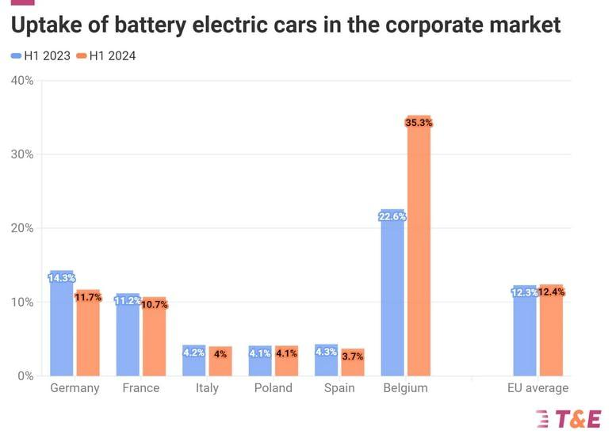

## Table of Contents

## What are seasonal trends in the automotive industry?

Seasonal trends in the automotive industry are patterns that happen at certain times of the year. These trends affect how many cars are sold and what types of cars people want to buy. For example, in the spring and summer, more people go outside and travel, so they might want to buy new cars. Car dealers often have special sales during these times to attract more customers. Also, at the end of the year, like in December, car sales can go up because people want to buy cars before the new year starts.

Another important seasonal trend happens in the fall, especially in September and October. This is when new car models come out. Car companies show off their new designs and features, which can make people excited to buy the latest models. During this time, dealers might offer good deals on last year's models to clear out old stock. Weather also plays a role in seasonal trends. In places with cold winters, fewer people might go to car dealerships during snowy months, so sales can drop. But when spring comes, sales can pick back up as the weather gets better.

## How do sales of new cars typically vary by season?

Sales of new cars go up and down throughout the year because of the seasons. In spring and summer, more people want to buy cars. This is because the weather is nice, and people like to travel more. Car dealers know this, so they often have big sales during these months to get more customers. It's a good time for people to buy cars because there are lots of deals.

In the fall, especially in September and October, new car models come out. This can make people excited to buy the newest cars. Dealers might offer good prices on last year's models to sell them quickly. But in winter, especially in places with cold and snowy weather, fewer people visit car dealerships. This can make car sales go down. When spring comes again, sales start to pick up as the weather gets better.

## What are the peak seasons for car sales and why?

The peak seasons for car sales are usually in the spring and summer months, like March to August. During this time, the weather is nice and people want to go outside and travel more. This makes them more likely to buy a new car. Car dealers know this, so they have big sales and special deals to attract more customers. It's a good time for people to buy cars because there are lots of choices and good prices.

Another peak season for car sales is in the fall, especially in September and October. This is when new car models come out. People get excited about the new designs and features, so they want to buy the latest cars. Car dealers also offer good deals on last year's models to clear out old stock. This makes it a good time to buy a car if you want a deal on a slightly older model or the newest one on the market.

## How does weather influence car buying behavior?

Weather plays a big role in when people decide to buy cars. In the winter, especially in places where it's cold and snowy, fewer people go to car dealerships. The bad weather makes it hard to get around, and people don't want to go out in the cold. This means that car sales can drop during these months. People wait until the weather gets better before they start thinking about buying a new car.

When spring comes and the weather starts to get warmer, more people visit car dealerships. The nicer weather makes it easier and more fun to go out and look at cars. People also start thinking about summer trips and want a new car for their travels. This is why car sales go up in the spring and summer. The good weather makes people feel more ready to buy a new car.

## What types of vehicles see increased demand during different seasons?

In the winter, people often look for cars that can handle snow and ice. They want vehicles with four-wheel drive or all-wheel drive because these cars are safer and easier to drive in bad weather. SUVs and trucks become more popular because they are bigger and can handle rough winter roads better. People also like cars with heated seats and good heating systems to stay warm.

In the spring and summer, people start thinking about fun and travel. Convertibles and sports cars become more popular because the weather is nice and people want to enjoy the sunshine. Also, families often buy minivans or bigger SUVs for summer vacations and road trips. These vehicles have more space for luggage and kids, making them perfect for long drives.

In the fall, when new car models come out, people get excited about the latest designs and features. This can increase demand for all types of vehicles, especially the newest models. But at the same time, people might also look for good deals on last year's models, which can boost sales of a wide range of cars, from sedans to luxury vehicles.

## How do automotive marketing strategies adapt to seasonal trends?

Automotive marketing strategies change with the seasons to match what people want at different times of the year. In the winter, car companies focus on advertising vehicles that are good in snow and ice. They show ads for SUVs and trucks with four-wheel drive, and they talk about features like heated seats and strong heating systems. This is because people want cars that keep them safe and warm during cold months.

In the spring and summer, marketing shifts to show off cars that are fun for warm weather. Car companies advertise convertibles and sports cars, showing people enjoying the sunshine. They also promote minivans and bigger SUVs for family trips and vacations. During these months, there are lots of sales and special deals to attract more customers because people are more likely to buy cars when the weather is nice.

In the fall, when new car models come out, marketing strategies focus on the latest designs and features. Car companies create excitement around these new models with big ad campaigns. At the same time, they offer good deals on last year's models to clear out old stock. This way, they can appeal to people who want the newest cars and those looking for a good deal.

## What impact do holidays and special events have on car sales?

Holidays and special events can really change how many cars people buy. During big holidays like Christmas and New Year's, car sales often go up. This is because people get holiday bonuses or want to buy a new car as a gift. Car dealers know this, so they have big sales and special deals during these times to get more people to buy cars. It's a good time for people to find a good deal on a new car.

Special events like car shows and auto expos also affect car sales. When these events happen, car companies show off their new models and cool features. This can make people excited to buy a new car. Car dealers might offer special prices during these events to sell more cars. So, if someone goes to a car show, they might decide to buy a car because they see something they really like and there's a good deal on it.

## How do seasonal trends affect inventory management in dealerships?

Seasonal trends make a big difference in how car dealerships manage their inventory. In the winter, when fewer people buy cars because of the cold weather, dealerships might not get as many new cars. They want to keep their stock low because they know not many people will come to the dealership. But they still keep some cars with four-wheel drive and good heating systems because those are the ones people want in the winter.

When spring and summer come, dealerships get ready for more customers. They order more cars because they know people will be coming in to buy. They make sure they have lots of convertibles, sports cars, and family vehicles like minivans and SUVs. This is because people want these types of cars for fun and trips during the warmer months. Dealerships also have big sales during this time to sell as many cars as they can.

In the fall, when new car models come out, dealerships need to manage their inventory carefully. They bring in the new models to excite customers and sell them quickly. At the same time, they offer good deals on last year's models to clear them out. This way, they can make room for the new cars and still sell the old ones. It's a busy time, but if they manage their inventory well, they can sell a lot of cars.

## What are the economic implications of seasonal trends in the automotive industry?

Seasonal trends in the automotive industry have a big impact on the economy. When car sales go up in the spring and summer, it's good for the economy. More people are buying cars, so car companies make more money. This also means more jobs at car factories and dealerships because they need more workers to make and sell the cars. The money people spend on cars also helps other businesses, like car part makers and service centers. So, when car sales are high, it can make the whole economy grow.

But when car sales go down in the winter, it can be bad for the economy. Fewer people are buying cars, so car companies make less money. This can lead to fewer jobs at car factories and dealerships because they don't need as many workers. When people spend less money on cars, it can also hurt other businesses that depend on the car industry. So, when car sales are low, it can slow down the economy. That's why seasonal trends in the automotive industry are important to watch.

## How do global market trends influence seasonal patterns in different regions?

Global market trends can change how seasonal patterns work in different parts of the world. For example, if there's a big demand for electric cars in Europe during the summer, car companies might make more of those cars and send them to Europe. This can make it harder for people in other places, like the United States, to buy electric cars because there are fewer of them available. Also, if the economy is doing well in one part of the world, people might buy more cars, which can affect how many cars are made and where they are sent.

In some countries, global trends can make seasonal patterns stronger or weaker. If there's a big car show in Japan in the fall, it might make more people want to buy cars during that time. But if there's a global shortage of car parts, it can make it hard for dealerships to have enough cars in stock, no matter what season it is. So, what happens in the global market can change how many cars people buy and what kinds of cars are available in different seasons.

## What advanced data analytics are used to predict and capitalize on seasonal trends?

Car companies and dealerships use advanced data analytics to figure out when people will buy the most cars and what kinds of cars they will want. They look at lots of information, like past car sales, the weather, holidays, and even what people are searching for online. This helps them see patterns and predict when more people will come to buy cars. For example, they might see that sales go up in the spring and summer, so they can get ready by ordering more cars and planning big sales during those times.

These companies also use special computer programs to look at all this data and make smart guesses about the future. They can use these guesses to decide how many cars to make, what types of cars to focus on, and when to offer the best deals. By using data analytics, car companies can make sure they have the right cars at the right time, which helps them sell more cars and make more money. It's like using a big, smart tool to plan ahead and do better business.

## How might future trends like electric vehicles and autonomous cars alter traditional seasonal patterns?

As more people start buying electric vehicles and autonomous cars, the usual times when people buy cars might change. Electric cars might become more popular in the summer because people can drive them on long trips without worrying about gas. Also, if the weather is nice, people might want to try out new technology like self-driving cars. This could make car sales go up in the warmer months more than before. On the other hand, if there are problems with charging stations in the winter, fewer people might buy electric cars during that time.

These new types of cars could also change how car companies plan their sales and what kinds of cars they make. If more people want electric cars in the summer, car companies might make more of them during that time. They might also have special deals on electric cars to get more people to buy them. Autonomous cars might be more popular when new technology comes out, no matter what season it is. So, car companies will need to watch these trends closely and change how they do business to keep up with what people want.

## References & Further Reading

[1]: Bergstra, J., Bardenet, R., Bengio, Y., & Kégl, B. (2011). ["Algorithms for Hyper-Parameter Optimization."](https://dl.acm.org/doi/10.5555/2986459.2986743) Advances in Neural Information Processing Systems 24.

[2]: ["Advances in Financial Machine Learning"](https://www.amazon.com/Advances-Financial-Machine-Learning-Marcos/dp/1119482089) by Marcos Lopez de Prado

[3]: ["Evidence-Based Technical Analysis: Applying the Scientific Method and Statistical Inference to Trading Signals"](https://www.amazon.com/Evidence-Based-Technical-Analysis-Scientific-Statistical/dp/0470008741) by David Aronson

[4]: ["Machine Learning for Algorithmic Trading"](https://github.com/stefan-jansen/machine-learning-for-trading) by Stefan Jansen

[5]: ["Quantitative Trading: How to Build Your Own Algorithmic Trading Business"](https://www.amazon.com/Quantitative-Trading-Build-Algorithmic-Business/dp/1119800064) by Ernest P. Chan