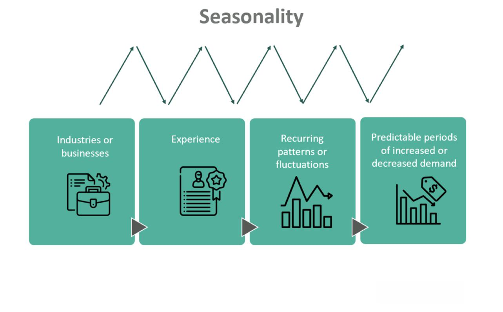

The automotive market is a dynamic and multifaceted industry that plays a crucial role in the global economy. As one of the largest sectors worldwide, it encompasses the manufacturing, distribution, retail, and maintenance of motor vehicles. The industry's complexity is underscored by its dependence on a variety of factors, including technological advancements, regulatory changes, consumer preferences, and economic conditions.

A key aspect of understanding the automotive market landscape is analyzing seasonal trends, market dynamics, and the increasing influence of algorithmic trading. Seasonal trends in the automotive sector refer to predictable patterns that emerge over specific periods of the year, impacting sales, production, and consumer behavior. These trends are influenced by a variety of factors such as weather conditions, holidays, and economic cycles, which can significantly affect purchasing decisions. For instance, the peaks in sales typically observed during spring and fall are often tied to consumer readiness to invest in new vehicles or take advantage of holiday promotions.



Market dynamics refer to the forces that affect the supply and demand of vehicles, ultimately influencing the overall success and direction of the automotive industry. This includes the introduction of new models, technological innovations, shifts in consumer preferences, and external economic factors like inflation or pandemics. In recent years, the rise of electric vehicles, increasing environmental awareness, and advancements in autonomous driving technology have reshaped the market dynamics significantly.

The integration of algorithmic trading into the automotive market illustrates an evolving dimension where data-driven techniques and algorithms are employed to predict market trends and optimize trading strategies. This approach, which has proven successful in financial markets, is becoming increasingly relevant in the automotive sector, allowing stakeholders to make informed decisions based on complex datasets that capture seasonal and market dynamics.

Understanding these elements is vital for stakeholders in the automotive industry, including manufacturers, dealers, investors, and consumers. For manufacturers and dealers, recognizing and adapting to seasonal trends can lead to optimized inventory management and improved sales strategies. Investors gain insight into market viability and potential investment opportunities, while consumers can make informed decisions about purchasing or leasing vehicles.

The purpose of this article is to provide a comprehensive analysis of the aforementioned elements—seasonal trends, market dynamics, and algorithmic trading—within the automotive industry. The structure of the article is designed to first offer an understanding of seasonal trends in the automotive sector, followed by an exploration of key influences on these trends. Subsequent sections will discuss the interplay of these trends with broader market dynamics and the impact of algorithmic trading. Finally, strategic approaches for stakeholders to navigate these complexities will be examined, concluding with reflections on the future of the automotive market in light of ongoing technological advancements.

## Table of Contents

## Understanding Seasonal Trends in the Automotive Sector

Seasonal trends in the automotive market are patterns of variation in consumer demand and sales that occur regularly at specific times of the year. These trends are influenced by various factors such as weather conditions, economic cycles, and social habits.

Sales in the automotive market typically peak in spring and fall. In spring, tax refunds often provide consumers with disposable income, encouraging purchases of new or used vehicles. This influx of funds acts as a catalyst for higher sales volumes. In the fall, automotive sales are boosted by the introduction of new model releases. Automakers traditionally unveil new models in the late summer and fall, generating consumer interest and prompting purchases of both the latest models and discounted outgoing generations.

Weather also plays a critical role in shaping seasonal trends. For instance, harsh winter conditions increase the demand for vehicles suited to adverse weather, such as all-wheel-drive models. Conversely, warmer months witness a spike in the purchase of convertibles and vehicles that cater to road trips and leisurely drives.

Consumer behavior is significantly influenced by these seasonal variations. Individuals tend to purchase vehicles in anticipation of specific weather needs or to coincide with lifestyle changes, such as the onset of vacation periods in summer or the start of school in fall. Such predictable patterns enable car dealers to strategically time promotions and inventory to match consumer demand.

In the U.S., the receipt of tax refunds in spring contributes to seasonal purchasing patterns. According to the Internal Revenue Service (IRS), substantial refunds can result in a noticeable uptick in discretionary spending, including vehicle purchases. This regular financial boost supports increased market activity, often leading to heightened sales figures in the months following tax season.

The introduction of new models in the fall not only attracts buyers interested in the latest features and designs but also stimulates the market by encouraging trade-ins of older models. This cycle of renewal benefits both consumers, who gain access to new technology and design, and dealers, who capitalize on increased foot traffic and inventory turnover.

In summary, understanding these seasonal trends is crucial for stakeholders in the automotive sector, as it allows for more informed decision-making regarding inventory management, marketing strategies, and sales forecasting. Recognizing the interplay between seasonal factors and consumer behavior can lead to optimized operational outcomes and enhanced market performance.

## Key Influences on Seasonal Automotive Trends

Understanding the key influences on seasonal automotive trends involves examining a variety of factors, including weather conditions, holidays, and economic cycles. Each of these elements plays a significant role in shaping consumer behavior and ultimately impacting the automotive market.

**Weather Conditions**

Weather has a direct and observable impact on automotive sales. In colder climates, the demand for all-wheel-drive vehicles and SUVs peaks during winter months. These vehicles offer better handling and safety on snow-covered or icy roads, making them more appealing when winter weather is a concern. Conversely, in warmer areas where winter weather is less severe, the spike in demand for such vehicles may not be as pronounced.

**Regional Variations**

Different regions experience seasonal demand differently due to variations in climate and consumer preferences. For instance, areas that experience harsh winters may see a substantial increase in SUV sales during the colder months due to their utility in adverse weather conditions. In contrast, regions with milder climates may not show such sharp seasonal variations but may have other patterns, such as increased travel during summer, which can boost sales of fuel-efficient cars.

**Holiday Influence**

Holidays often coincide with promotions that can significantly influence car sales. Dealerships frequently offer discounts and incentives during major holiday periods like the end of the year, leading to a surge in purchases. These promotions capitalize on the consumers' psychological readiness to spend during festive times, as well as on available holidays when potential buyers have more free time to visit dealerships.

**Economic Cycles**

Economic conditions are a profound influence on automotive market trends. During periods of economic growth, consumers are more confident in their financial stability and may be more willing to make significant investments, such as purchasing a new vehicle. Conversely, economic downturns tend to suppress car sales as consumers prioritize saving over expenditure. The availability of financing options can also be affected by economic conditions, further influencing consumer purchasing patterns.

**Car Value**

Car value is highly susceptible to the influences of seasonal trends and economic cycles. For instance, economic downturns typically lead to depreciation in car values, as demand weakens and buyers become more price-sensitive. On the other hand, during times of economic prosperity, car values may stabilize or even increase, reflecting increased consumer confidence and demand.

Understanding these factors is crucial for stakeholders within the automotive industry as they craft strategies to optimize their operations in alignment with these seasonal and economic influences. This knowledge empowers car dealers to adjust inventory levels, marketing strategies, and pricing to align with anticipated demand fluctuations, ultimately enhancing profitability and market positioning.

## Seasonal Trends and Car Market Dynamics

Seasonal trends significantly impact the dynamics of the car market, influencing both new and used car sales. Understanding these patterns is crucial for automotive stakeholders, such as manufacturers, dealers, and consumers, to strategically navigate the market.

The correlation between seasonal trends and sales is evident in the varying demand for new versus used cars throughout the year. Typically, new car sales experience peaks in spring and late summer to early fall. This pattern coincides with the release of new models by manufacturers, which often occurs in the fall, sparking consumer interest and driving up new car purchases. Conversely, the used car market tends to benefit from tax refund season in early spring, as consumers have extra funds available and consider upgrading their vehicles.

Car dealers leverage these seasonal trends to optimize sales by aligning promotions and inventories with consumer behaviors. For instance, dealers might offer incentives for purchasing new models in fall when the demand is naturally higher. They may also boost their used car inventory in spring, anticipating the influx of consumers with tax refunds. Marketing campaigns are often tailored to take advantage of holidays and changing seasons, aligning promotions with consumer sentiment.

External economic factors, such as the COVID-19 pandemic, have had a profound impact on automotive market trends. During the pandemic, there was a notable shift toward used cars as consumers became more budget-conscious and sought less expensive alternatives. Moreover, supply chain disruptions and semiconductor shortages led to reduced availability of new cars, further driving demand for used vehicles. This shift highlighted the market's adaptability to economic shocks and the importance of understanding seasonal variations to anticipate market needs.

Technological advancements, particularly the rise of electric vehicles (EVs), are reshaping the market dynamics. The demand for EVs tends to be less influenced by traditional seasonal trends, as environmentally conscious consumers may prioritize sustainability over seasonality. However, government incentives and policy changes can cause sporadic spikes in EV sales, adding a layer of complexity to market predictions. Manufacturers are increasingly integrating technologies such as data analytics and [machine learning](/wiki/machine-learning) to forecast demand and optimize production schedules based on these emerging patterns.

With these dynamics in mind, it becomes clear that recognizing and adapting to seasonal trends is paramount for maximizing opportunities in the automotive market. Through strategic planning and the adoption of new technologies, industry stakeholders can enhance their responsiveness to market fluctuations and secure a competitive edge.

## Algo Trading and Its Impact on the Automotive Market

Algorithmic trading (algo trading) involves the use of computer algorithms to automate trading decisions. These algorithms are designed to follow a set of instructions, which might include parameters like price, timing, and [volume](/wiki/volume-trading-strategy), to execute trades at speeds and frequencies that are impossible for a human trader. Algo trading has become increasingly prominent across various financial markets due to its efficiency and precision. In the automotive market, algo trading offers substantial potential for stakeholders, particularly when linked with an analysis of seasonal trends.

Seasonal trends are patterns that regularly occur at specific times of the year. In the automotive industry, these trends can include increased car sales during certain months or a rise in the demand for specific vehicle types during particular seasons. For example, demand for convertibles may spike in the spring, while SUVs and all-wheel-drive vehicles might see an uptick in winter months. By integrating these seasonal trends into trading algorithms, investors and manufacturers can make more informed predictions and decisions regarding inventory and stock valuations.

### Integration of Seasonal Trends into Trading Algorithms

To integrate seasonal trends into trading algorithms, data scientists and analysts first need to collect and analyze extensive historical sales data. This data is used to identify patterns and predict future trends. The algorithms can then be customized to trigger buy or sell orders based on these predictions. Here is a simple Python example that outlines how one might begin to structure such an algorithm:

```python
import pandas as pd
import numpy as np

# Assume data is preloaded into a DataFrame with date, sales columns
data = pd.read_csv('automotive_sales_data.csv')
data['Date'] = pd.to_datetime(data['Date'])
data.set_index('Date', inplace=True)

# Calculate rolling averages to identify trends
data['12_month_avg'] = data['sales'].rolling(window=12).mean()

def trading_signal(data, threshold=1.05):
    signals = []
    for i in range(len(data)):
        if data['sales'].iloc[i] > data['12_month_avg'].iloc[i] * threshold:
            signals.append('buy')
        elif data['sales'].iloc[i] < data['12_month_avg'].iloc[i] / threshold:
            signals.append('sell')
        else:
            signals.append('hold')
    return signals

data['Signal'] = trading_signal(data)
```

### Benefits and Challenges of Using Algo Trading

The primary benefit of algo trading in the automotive market is the ability to swiftly adapt to changing conditions in the market, particularly those influenced by seasonal trends. For manufacturers and dealers, the integration of seasonal data can optimize inventory levels, ensuring the right types of vehicles are available at the right times. Additionally, financial entities that invest in automotive stocks can optimize their portfolios by predicting stock movements linked to these seasonal sales patterns.

However, challenges persist in the reliable implementation of algo trading. The accurate prediction of seasonal trends relies heavily on high-quality, comprehensive data. Fluctuations due to unexpected events, such as economic downturns or pandemics, can also disrupt anticipated patterns. Furthermore, while the automation of trades can increase efficiency, it also reduces the degree of human oversight, potentially leading to significant unintended consequences in volatile markets.

### Case Studies and Successful Implementation

There are notable examples where the inclusion of seasonal trends in algo trading has yielded successful outcomes. For instance, some automotive manufacturers have leveraged algo trading to predict the optimal times for fleet renewals, correlating these periods with favorable market conditions. Likewise, hedge funds and investment firms have utilized algorithmic strategies to anticipate fluctuations in automotive stock prices, driven by predictable seasonal changes.

In conclusion, while [algorithmic trading](/wiki/algorithmic-trading) offers significant advantages in the automotive sector by harnessing seasonal trends, its successful deployment requires meticulous data analysis and model tuning. These algorithms enable stakeholders to make data-driven decisions with increased precision, although potential challenges and irregularities in the market underscore the need for careful management and continuous refinement of these systems.

## Strategic Approaches to Navigating Seasonal Trends

Car dealers can optimize their sales strategies by capitalizing on seasonal trends. During peak seasons, when sales volumes typically rise, dealerships can implement targeted promotional campaigns, offer time-limited incentives, and enhance their inventory selection to meet consumer demand efficiently. Advertising efforts should focus on the vehicles that align with seasonal preferences, such as all-wheel-drive vehicles in winter or convertibles in summer. Additionally, leveraging data analytics can help in forecasting demand and efficiently managing stock levels to ensure popular models are available when customer interest is highest.

For consumers, timing purchases can significantly influence the value of their investment. Typically, buying a new vehicle at the end of a model year or just before the release of new models can result in lower prices. This is because dealers are eager to clear out older inventory to make space for new arrivals. Similarly, purchasing during slower sales months, such as late summer or winter, can provide buyers with more negotiation power due to reduced dealership foot traffic. Consumers should also monitor seasonal promotions and take advantage of holiday sales events often held around significant holidays like Memorial Day or Black Friday.

Maintaining car value retention amidst seasonal fluctuations involves strategic care and awareness. Consumers should prioritize regular maintenance and timely repairs to keep their vehicles in optimal condition, preserving their resale value. Geographic-specific actions also play a role; for example, using rust protection in colder, snow-prone regions can prevent long-term damage. Additionally, selecting vehicles known for their reliability and durable performance history can further ensure stronger value retention over time.

Geographic strategies for different regions are essential, as seasonal demand can vary significantly across locations. In northern areas, dealers might focus on rugged SUVs and 4x4 trucks during winter, while coastal or southern dealerships might highlight fuel-efficient sedans or electric vehicles. By analyzing local consumer preferences and environmental conditions, dealerships can tailor their promotions and inventory to reflect genuine regional demand. This approach not only aligns with consumers' immediate needs but also enhances customer satisfaction and dealership reputation.

In conclusion, successfully navigating the automotive industry's seasonal trends requires strategic planning and adaptation from both dealers and consumers. By understanding and leveraging these patterns, stakeholders can maximize benefits and maintain steady market performance throughout the year.

## Conclusion

In this analysis of the automotive industry's seasonal trends, several key points have been outlined to understand the complexities of market dynamics and the relevance of adapting to these patterns. Recognizing seasonal trends plays a crucial role in optimizing sales strategies and aligning production schedules with consumer demands. The cyclical nature of the automotive market, affected by factors such as weather conditions, tax refunds, and consumer behavior, requires stakeholders to remain vigilant and adaptable.

Understanding and leveraging seasonal trends offer significant opportunities for car dealers to maximize sales, especially during peaks driven by various influences like holiday promotions and economic cycles. Moreover, the impact of these trends extends beyond mere sales figures, affecting pricing strategies and car value retention. The advent of technological advancements, including algorithmic trading, has further complicated the predictive modeling of seasonal trends, offering both challenges and benefits.

Looking ahead, the automotive market is poised for transformation driven by new technologies such as electric vehicles and automated trading strategies. These innovations promise to reshape market dynamics by enhancing efficiency and accuracy in predicting consumer demand. For stakeholders, this underscores the necessity of both flexibility and strategic foresight in navigating an evolving landscape.

Adapting to these trends is not merely beneficial but essential for sustained success in the automotive industry. By understanding the interplay between traditional market cycles and emerging technological impacts, market participants can better position themselves to capitalize on future opportunities. As the industry continues to evolve, the ability to integrate insights from seasonal trends into strategic planning will remain a critical component of competitive advantage.

## References & Further Reading

[1]: Bergstra, J., Bardenet, R., Bengio, Y., & Kégl, B. (2011). ["Algorithms for Hyper-Parameter Optimization."](https://dl.acm.org/doi/10.5555/2986459.2986743) Advances in Neural Information Processing Systems 24.

[2]: ["Advances in Financial Machine Learning"](https://www.amazon.com/Advances-Financial-Machine-Learning-Marcos/dp/1119482089) by Marcos Lopez de Prado

[3]: ["Evidence-Based Technical Analysis: Applying the Scientific Method and Statistical Inference to Trading Signals"](https://www.amazon.com/Evidence-Based-Technical-Analysis-Scientific-Statistical/dp/0470008741) by David Aronson

[4]: ["Machine Learning for Algorithmic Trading"](https://github.com/stefan-jansen/machine-learning-for-trading) by Stefan Jansen

[5]: ["Quantitative Trading: How to Build Your Own Algorithmic Trading Business"](https://www.amazon.com/Quantitative-Trading-Build-Algorithmic-Business/dp/1119800064) by Ernest P. Chan