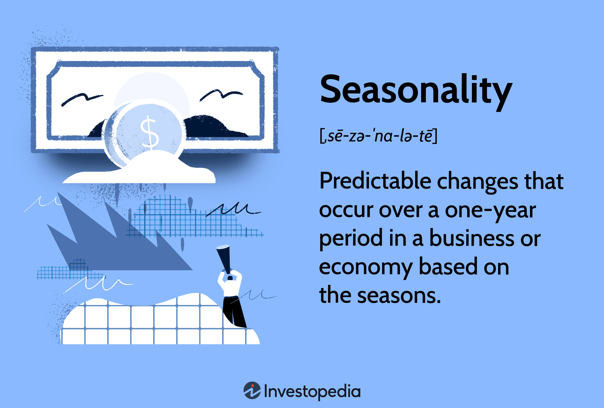

## Table of Contents

## What is seasonality in the context of business and economics?

Seasonality in business and economics refers to regular changes in activity that happen at the same time every year. These changes can affect sales, production, and other business activities. For example, many stores see higher sales during the holiday season in December. This is because people buy more gifts and decorations at that time of year. Businesses need to prepare for these seasonal changes to make sure they have enough products and staff to meet demand.

Understanding seasonality is important for making good business plans and decisions. Companies can use past data to predict when their busy and slow times will be. This helps them manage their inventory, staffing, and marketing efforts more effectively. For instance, a company might hire extra workers during its busy season or offer special sales during slower times to boost business. By recognizing and planning for seasonality, businesses can improve their performance and better meet customer needs throughout the year.

## Can you provide examples of seasonal businesses?

Some businesses are very busy at certain times of the year and quiet at other times. For example, a ski resort is a seasonal business. It makes most of its money during the winter when people want to ski and snowboard. In the summer, the resort might have fewer visitors because there is no snow. The owners need to plan for this by saving money during the busy winter months to cover costs during the slower summer months.

Another example is an ice cream shop. These shops usually see more customers in the summer when it's hot outside. People want to cool off with ice cream, so the shop is busy. But in the winter, fewer people come in because it's cold. The shop might close for the season or stay open with fewer hours and staff. The owners need to manage their money carefully to make sure they can keep the business running all year.

A third example is a pumpkin patch. These businesses are busy in the fall, especially around Halloween. Families come to pick pumpkins and enjoy fall activities. But after Halloween, the pumpkin patch has no customers until the next fall. The owners need to make enough money during the busy season to last them through the rest of the year when they are closed.

## How does seasonality affect demand and supply in different industries?

Seasonality affects demand and supply in different industries by causing regular changes in how much people want to buy and how much businesses need to produce. For example, in the toy industry, demand goes up a lot around Christmas time. Parents and families buy more toys as gifts, so toy stores and manufacturers need to make and stock more toys during this time. But after the holidays, demand drops, and toy companies might cut back on production and have sales to get rid of extra stock. This pattern happens every year, so businesses try to plan for it.

In the agriculture industry, seasonality is also important. Farmers plant and harvest crops at certain times of the year, which affects how much fresh produce is available. For example, strawberries are usually in season during the spring and summer. During these months, there are a lot of strawberries, so the supply is high and prices might be lower. But in the winter, there are fewer strawberries, so the supply is low and prices can go up. Farmers and grocery stores need to think about these seasonal changes when they decide how much to grow and how much to charge.

## What are the common methods used to identify seasonality in data?

One common way to identify seasonality in data is by looking at historical patterns. People can do this by making charts or graphs that show data over time, like sales numbers or temperature readings. If they see that the same pattern happens every year, like higher sales in December or colder temperatures in January, they can say that seasonality is at work. This method is simple and does not need special tools, but it can be hard to spot small patterns just by looking at the data.

Another method is using statistical tools like time series analysis. This method uses math to find patterns in data. For example, a tool called seasonal decomposition can break down data into different parts, like a trend, a seasonal part, and random changes. This helps people see clearly if there is a seasonal pattern. This method is more detailed and can find patterns that are hard to see just by looking at a chart. However, it needs some knowledge of [statistics](/wiki/bayesian-statistics) and special software.

A third way to identify seasonality is by using regression analysis. This method looks at how different things affect the data, like the time of year. By including a seasonal [factor](/wiki/factor-investing) in the regression model, people can see if it makes a big difference in the data. This can help confirm that seasonality is important. Like time series analysis, regression analysis needs some understanding of statistics and the right tools, but it can give a clear picture of how seasonality affects the data.

## How can businesses prepare for seasonal fluctuations?

Businesses can prepare for seasonal fluctuations by looking at past data to see when they are busy and when they are slow. They can use this information to plan ahead. For example, if a store knows it will be busy in December, it can order more products and hire extra workers in advance. This helps the store meet the higher demand without running out of items or having long lines. By planning like this, businesses can make sure they are ready for their busy times and can keep their customers happy.

Another way businesses can prepare is by saving money during their busy seasons to use during the slower times. For example, a ski resort might make a lot of money in the winter, so it can save some of that money to pay for costs during the summer when fewer people come. This helps the business stay open all year, even when it is not making as much money. By managing their money carefully, businesses can avoid financial problems and keep running smoothly through all the seasons.

## What are the financial implications of seasonality for a business?

Seasonality can have big effects on a business's money. When a business is busy, like in the holiday season, it can make a lot more money. This is good because the business can pay for things like new products and workers. But, businesses need to be careful not to spend all this money right away. They should save some of it to use during the slower times of the year. If they don't save enough, they might not have money to pay for things when they are not busy, and this can cause problems.

On the other hand, when business is slow, like in the off-season, a business might not make enough money to cover all its costs. This can be hard because the business still has to pay for things like rent and salaries. To deal with this, businesses need to plan ahead. They can use the money they saved from busy times to help them through the slow times. By doing this, they can keep running smoothly all year and avoid money troubles.

## How do economists use seasonality to forecast economic trends?

Economists use seasonality to forecast economic trends by looking at patterns that happen every year. They study things like how much people spend during the holiday season or how many tourists visit a place in the summer. By looking at this data over many years, economists can see if the same patterns keep happening. This helps them predict what might happen in the future. For example, if spending always goes up in December, economists can guess that it will go up again next December. This helps them make better guesses about what the economy will do.

To make these forecasts, economists use special tools and math. They might use time series analysis to break down the data into different parts, like trends and seasonal changes. This helps them see the seasonal patterns more clearly. They can also use regression analysis to see how much the time of year affects the data. By understanding these patterns, economists can make more accurate predictions about things like how fast the economy will grow or how many jobs will be created. This information is very important for businesses and governments to plan for the future.

## What are the challenges businesses face due to seasonality?

Seasonality can make things hard for businesses. One big problem is that they might not have enough money during the slow times of the year. When business is slow, like in the off-season, a company might not make enough money to pay for things like rent and salaries. This can be tough because the business still has to keep running. To deal with this, businesses need to save money during their busy times to use when things are slow. If they don't save enough, they might run into money problems and have a hard time staying open all year.

Another challenge is planning for the busy times. When business is busy, like during the holiday season, a company needs to have enough products and workers to meet the higher demand. If they don't plan right, they might run out of things to sell or have long lines because they don't have enough workers. This can make customers unhappy and hurt the business. So, businesses need to look at past data to see when they will be busy and plan ahead by ordering more products and hiring extra help. By doing this, they can make sure they are ready for their busy times and keep their customers happy.

## How can technology and data analytics help manage seasonality?

Technology and data analytics can help businesses manage seasonality by making it easier to see patterns in their data. Businesses can use special software to look at their sales numbers over time. This software can show them when they are usually busy and when they are slow. By understanding these patterns, businesses can plan better. For example, they can order more products before their busy season starts, so they don't run out. They can also hire extra workers to help during the busy times. This helps the business meet the higher demand without making customers wait too long.

Data analytics can also help businesses save money during their slow times. By looking at past data, businesses can see how much money they need to save during their busy times to cover costs when things are slow. This helps them avoid money problems. Technology can also help businesses make better guesses about the future. For example, they can use data to predict how many customers they will have next year during their busy season. This helps them plan even better and make sure they are ready for whatever comes their way.

## What strategies can businesses employ to mitigate the negative impacts of seasonality?

Businesses can use different strategies to deal with the problems that come with seasonality. One way is to save money during the busy times to use when things are slow. For example, if a store makes a lot of money in December, it can put some of that money aside to pay for costs during the quieter months. This helps the business keep running smoothly all year, even when it's not making as much money. Another strategy is to plan ahead for the busy times. By looking at past data, a business can see when it will be busy and order more products and hire extra workers in advance. This way, the business can meet the higher demand without running out of things to sell or making customers wait too long.

Another way to handle seasonality is to find new ways to make money during the slow times. For example, a ski resort might offer summer activities like hiking or mountain biking to bring in customers when there's no snow. This can help the business make money all year round. Businesses can also use special sales or promotions during the slow times to get more customers in the door. By doing this, they can keep their business going strong even when things are not as busy. Using technology and data analytics can also help businesses see patterns in their data and plan better for the future, making it easier to deal with the ups and downs of seasonality.

## How does global trade influence seasonality in local markets?

Global trade can change how seasonality affects local markets. When a country can import things from other places, it might not have to wait for certain times of the year to get them. For example, if strawberries are only in season in the summer in one country, but that country can import strawberries from another country where it's always strawberry season, then people can buy strawberries all year round. This can make the demand for strawberries more even throughout the year in the local market, instead of having big peaks and drops.

But global trade can also make seasonality more complicated. Sometimes, the demand for certain products in one country can affect the supply in another country. For example, if a lot of people in one country want to buy pumpkins for Halloween, they might import them from another country. This can lead to fewer pumpkins available in the country they came from, making the supply there go down during that time. So, while global trade can help smooth out some seasonal changes, it can also create new seasonal patterns that businesses need to think about.

## What advanced statistical models are used to analyze and predict seasonal patterns?

One advanced statistical model used to analyze and predict seasonal patterns is called ARIMA, which stands for AutoRegressive Integrated Moving Average. This model looks at past data to find patterns and uses them to make guesses about the future. It can break down the data into different parts, like trends and seasonal changes, to see how each part affects the whole. By understanding these parts, businesses can predict when they will be busy or slow and plan better. ARIMA is good at dealing with data that changes over time and can help businesses see the seasonal patterns more clearly.

Another model is called SARIMA, which stands for Seasonal AutoRegressive Integrated Moving Average. This model is like ARIMA but is even better at finding seasonal patterns. It adds a special part to the model that looks just at the seasonal changes. This helps businesses see how the time of year affects their data and make more accurate predictions. For example, a store can use SARIMA to guess how many customers it will have next December based on past Decembers. By using these advanced models, businesses can plan for the future and manage the ups and downs of seasonality more effectively.

## References & Further Reading

1. **Books and Articles:**
   - Mankiw, N. (2019). *Principles of Economics*. This book provides a comprehensive overview of economic principles, including discussions on business cycles and economic patterns. 
   - Shiller, R. J. (2015). *Irrational Exuberance*. A detailed examination of market dynamics and the factors influencing stock market bubbles, relevant for understanding economic cycles and seasonality.
   - Murphy, J. J. (1999). *Technical Analysis of the Financial Markets*. This is a foundational text for understanding technical analysis, which is critical for developing algorithmic trading strategies.

2. **Research Papers:**
   - Fama, E.F. (1970). "Efficient Capital Markets: A Review of Theory and Empirical Work", *Journal of Finance*. This paper presents the Efficient Market Hypothesis, a key concept in understanding market patterns and algorithmic trading.
   - Taylor, A. M., & Schneider, H. (2018). “Forecasting Seasonal Patterns in Economic Data Using Long-Run Restrictions”, *Journal of Empirical Finance*. It covers methodologies in forecasting seasonal economic patterns.

3. **Online Resources:**
   - Investopedia's Algorithmic Trading Page [Investopedia](https://www.investopedia.com/terms/a/algorithmictrading.asp). A helpful resource for beginners to understand the basics and advancements in algorithmic trading.
   - The National Bureau of Economic Research (NBER) [NBER](https://www.nber.org/). They provide extensive studies and papers on business cycles and economic patterns.

4. **Courses and Tutorials:**
   - Coursera offers a course titled "Algorithmic Trading & Quantitative Analysis Using Python". This course covers Python programming applied in algorithmic trading.
   - Khan Academy Economics and Finance [Khan Academy](https://www.khanacademy.org/economics-finance-domain). A free resource providing a solid grounding in economics and finance principles.

5. **Programming and Analysis Tools:**
   - *Python for Finance: Analyze Big Financial Data* by Yves Hilpisch (2014). This book investigates into the use of Python for financial data analysis, suitable for implementing algorithmic trading strategies.
   - *Quantitative Finance in Python* by Masum Billah (2022). A guide for creating quantitative models and strategies using Python, with applications in seasonal patterns.

These resources are curated to provide a multifaceted understanding of economic patterns, seasonality, and [algorithmic trading](/wiki/algorithmic-trading) strategies, catering to both beginners and experienced professionals seeking to enhance their knowledge and applications in financial markets.

