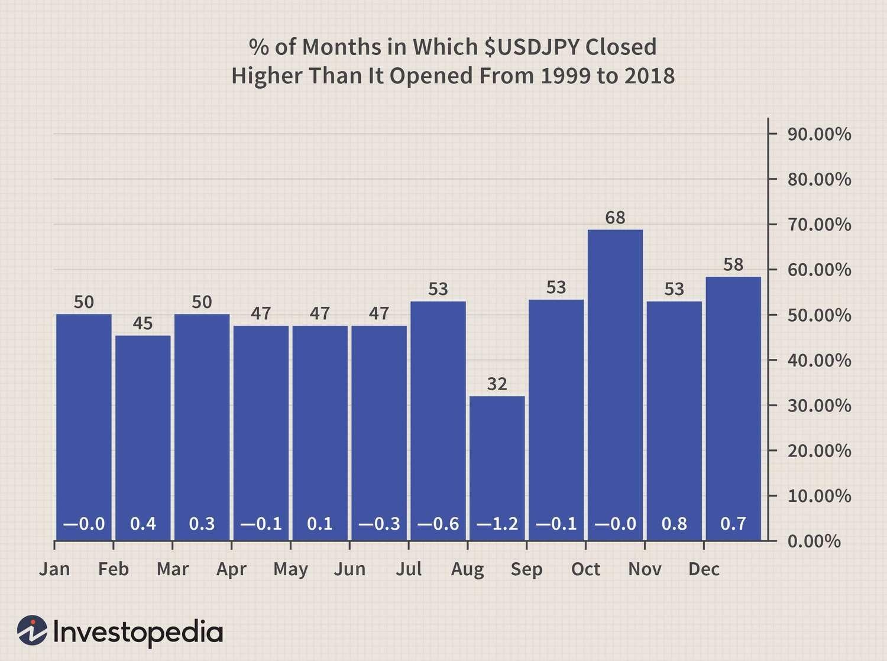

The foreign exchange market, commonly referred to as the forex market, is the largest and most liquid financial market in the world. It facilitates the exchange of currencies, enabling international trade and investment. With a daily trading volume exceeding $6 trillion, the forex market operates 24 hours a day across key financial centers around the world, including London, New York, Tokyo, and Sydney. The forex market is vital to global economics because it determines the relative value of currencies, impacting global trade balances, capital flows, and economic policy decisions. 

Seasonal trends in currency trading refer to patterns or tendencies that occur at specific times of the year. These trends are influenced by recurring events and behaviors linked to economic cycles, geopolitical events, and even climatic conditions. For instance, certain currencies may strengthen at the end of the financial year as companies repatriate earnings or during major holiday seasons due to increased consumer spending. Identifying these patterns allows traders to anticipate currency movements and align their strategies accordingly.



Algorithmic trading, or algo trading, has emerged as a pivotal tool for traders seeking to capitalize on these seasonal trends. By leveraging technology and computational tools, algo trading systems can process enormous datasets and identify patterns that might be missed by human traders. These algorithms can be programmed to execute trades automatically when certain seasonal indicators are met, thus reducing the emotional biases common in manual trading and increasing the speed and efficiency of trade execution. Advances in machine learning and artificial intelligence further enhance the capability of these algorithms to analyze historical data and predict future trends, ensuring that traders remain competitive in an ever-evolving market environment. 

In summary, understanding the forex market's significance and the concept of seasonal trends is crucial for traders aiming to enhance their strategies. The integration of algorithmic trading into this framework has revolutionized how traders exploit seasonal currency trends, offering a sophisticated approach to navigating the complexities of the forex market.

## Table of Contents

## Understanding Seasonal Trends in Forex

Seasonal trends in the forex market, often termed "forex seasonality," refer to predictable patterns that occur at specific times of the year, influenced by recurring economic, political, and financial factors. These patterns are observed over long periods and provide insights into how certain currency pairs tend to perform during particular months or quarters. Forex seasonality is rooted in historical behaviors where traders anticipate similar events or economic conditions, thereby influencing the trade [volume](/wiki/volume-trading-strategy) and price movements of currencies.

Examples of seasonality in currency markets include the tendency of the U.S. dollar (USD) to strengthen towards the end of the calendar year, driven by factors such as repatriation of funds by U.S. businesses and year-end portfolio adjustments by investors. Similarly, the Japanese yen (JPY) often appreciates during the Japanese fiscal year-end in March, due to increased capital inflows as companies close their [books](/wiki/algo-trading-books).

Key factors influencing seasonal trends in [forex](/wiki/forex-system) include:

1. **Economic Cycles**: The natural ebb and flow of economic cycles impact currency strength and demand. For instance, harvest periods can influence the currencies of agricultural-based economies, affecting demand for exports and impacting currency values.

2. **Monetary Policies**: Central bank policies, such as interest rate announcements, often follow regular schedules and can create seasonal patterns in currency volatility.

3. **Trade Balances and Commodity Prices**: Cyclical variations in trade balances, driven by demand for commodities like oil and gold, affect currencies of exporting and importing countries. For example, oil-exporting countries may see currency appreciation during periods of high oil prices.

4. **Tourism and Travel**: Seasonal tourism boosts demand for certain currencies as travelers exchange money, influencing forex markets during peak travel seasons.

5. **Fiscal Calendars**: The end of fiscal quarters and years often trigger financial flows related to tax payments, repatriation of profits, and rebalancing of investment portfolios, impacting currency volumes and values.

Global events and economic cycles significantly affect currency performance. For instance, geopolitical tensions, such as trade wars or military conflicts, can disrupt trade flows and provoke risk aversion, prompting capital flight to safe-haven currencies like the USD and Swiss franc (CHF). Moreover, economic cycles, such as recessions or periods of growth, impact investor confidence and demand for riskier assets or defensive holdings. For example, during global economic downturns, investors might flock to the [liquidity](/wiki/liquidity-risk-premium) and perceived safety of major currencies, leading to cyclical strength or weakness.

Understanding these factors and their influence on currency movements is crucial for forex traders to anticipate potential opportunities and risks associated with seasonal trends. Analyzing historical patterns, combined with current economic indicators, can provide a strategic edge in identifying favorable trading periods and making informed decisions in the forex market.

## Key Seasonal Patterns in Major Currency Pairs

The foreign exchange (forex) market exhibits distinct seasonal patterns in major currency pairs such as USD/JPY and EUR/USD. These trends arise from consistent and predictable factors, including trade cycles, fiscal policies, and economic activities tied to specific times of the year. Analyzing these patterns helps traders to anticipate market movements and adjust their strategies accordingly.

For USD/JPY, the yen traditionally appreciates against the U.S. dollar in the first quarter of the year, particularly in January. This movement can be attributed to the end-of-year repatriation of funds by Japanese corporations, a phenomenon where companies convert foreign earnings into yen. Furthermore, the Japanese fiscal year ends in March, often leading to significant currency movements as companies adjust their balance sheets.

Conversely, in the second half of the year, particularly around September, the pattern may reverse as Japanese investors diversify their portfolios, often resulting in yen depreciation against the dollar. These seasonal tendencies can be calculated through historical price data analysis, employing statistical models to quantify expected return deviations in these periods.

The EUR/USD pair, the most traded currency pair globally, also showcases notable seasonal behavior. For instance, the U.S. dollar frequently weakens in the second quarter (April to June), influenced by the so-called "sell in May and go away" stock market adage, while the euro strengthens due to favorable economic activity in the Eurozone. During the end of summer, particularly in August, EUR/USD can experience [volatility](/wiki/volatility-trading-strategies) attributable to reduced market liquidity as traders and institutions traditionally take summer breaks.

A case study illustrating the seasonal pattern of USD/JPY might consider the historical data for January from 1990 to 2020. By applying statistical tests such as the Kruskal-Wallis H-test or conducting a Python-based time series analysis, one could demonstrate the significance of yen appreciation tendencies during this period. Here's an example of how a Python script could analyze seasonal patterns in USD/JPY:

```python
import pandas as pd
import numpy as np
from statsmodels.tsa.seasonal import seasonal_decompose
import matplotlib.pyplot as plt

# Load historical USD/JPY exchange rate data
data = pd.read_csv('USD_JPY_historical_data.csv', parse_dates=['Date'], index_col='Date')

# Resample data to monthly averages (if daily data was provided)
data_monthly = data['Close'].resample('M').mean()

# Decompose the time series to see seasonal component
decomposition = seasonal_decompose(data_monthly, model='multiplicative')
decomposition.plot()
plt.show()

# Extract and analyze the seasonal component
seasonal_pattern = decomposition.seasonal['1990-01':'2020-12'].groupby(lambda x: x.month).mean()
print(seasonal_pattern)
```

This decomposition provides insight into the inherent seasonal trend, isolating it from cyclic and random variations. Similarly, for EUR/USD, analyzing historical patterns through similar methods can offer an edge in predicting potential currency fluctuations in specific months or quarters. Understanding these trends supports traders in forming more robust, seasonally-adjusted trading strategies.

## Algo Trading: Leveraging Technology in Forex

Algorithmic trading, commonly referred to as algo trading, represents a significant transformation in forex markets by utilizing computer algorithms to execute trades at speeds and frequencies that are impossible for human traders. This approach offers several advantages, primarily enhancing efficiency, precision, and the ability to capture market opportunities in real-time without human intervention.

Algorithms are designed to analyze large datasets and identify patterns in historical price movements and economic indicators. A key advantage of algo trading lies in its ability to eliminate emotional bias from trading decisions. It operates under pre-set rules and criteria, ensuring consistent execution of trades based on statistical analysis rather than human intuition. This efficiency can lead to improved performance, as trades are executed swiftly and accurately, reducing transaction costs and slippage.

**Designing Algorithms to Exploit Seasonal Trends**

Seasonal trends in forex refer to predictable patterns that occur in currency markets at specific times of the year. These patterns may be influenced by factors such as fiscal year-end activities, agricultural cycles, or tourist seasons, which impact currency supply and demand. Algorithms can be programmed to recognize such trends by analyzing historical data and detecting recurring cycles.

For example, an algorithm could be trained to spot a particular currency pair's tendency to appreciate during the first quarter of the year due to specific macroeconomic activities. This involves training [machine learning](/wiki/machine-learning) models or developing rule-based systems that recognize these seasonal patterns and trigger buy or sell orders when certain conditions are met.

Python, with its rich ecosystem of financial libraries such as pandas, NumPy, and scikit-learn, provides an ideal platform for developing such algorithms. A Python script could start by importing historical currency data and then analyzing seasonal trends using statistical methods:

```python
import pandas as pd
import numpy as np
from sklearn.model_selection import train_test_split
from sklearn.ensemble import RandomForestClassifier

# Load data
data = pd.read_csv('forex_data.csv')

# Feature engineering for seasonal trends
data['month'] = pd.to_datetime(data['date']).dt.month

# Define inputs and outputs
X = data[['open', 'high', 'low', 'close', 'month']]
y = data['trend']  # Binary outcome for trend

# Train-test split
X_train, X_test, y_train, y_test = train_test_split(X, y, test_size=0.2, random_state=42)

# Train model
model = RandomForestClassifier()
model.fit(X_train, y_train)

# Predictions
predictions = model.predict(X_test)
```

This code snippet illustrates a basic framework for training a machine learning model to predict forex trends based on seasonal data patterns.

**Examples of Successful Algo Trading Strategies**

Several successful algo trading strategies have emerged through the exploitation of seasonal trends. One example is the "January Effect," where certain currencies, such as the U.S. dollar, historically show strength in January due to capital inflows and rebalancing activities by large institutional investors.

Another strategy involves the "Carry Trade," which takes advantage of differences in interest rates between countries. When seasonality affects [interest rate](/wiki/interest-rate-trading-strategies) announcements or policies in predictable ways, algorithms can be designed to adjust [carry](/wiki/carry-trading) trades accordingly, optimizing profit potential.

Moreover, some algo trading systems incorporate multi-layered strategies that combine seasonal patterns with technical indicators like moving averages or RSI (Relative Strength Index). Such composite strategies enable traders to exploit both the time-based patterns and the [momentum](/wiki/momentum) of currency pairs.

In conclusion, [algorithmic trading](/wiki/algorithmic-trading) leverages technology to enhance forex trading strategies by capitalizing on seasonal trends. By utilizing historical data and employing sophisticated algorithms, traders can improve their chances of success while mitigating risks associated with human errors and emotional decision-making. These strategies continue to evolve, offering new opportunities to harness the power of technology in dynamic currency markets.

## Historical Analysis and Data Interpretation

Analyzing historical data is essential in understanding past seasonal trends in forex trading. By examining the historical performance of currency pairs, traders can discern patterns that may repeat over specific periods. This analysis provides valuable insights into potential future movements, enabling traders to make informed decisions.

Historical data can be applied to predict currency movements and seasonal trends in key forex pairs. Data sets spanning multiple years often reveal recurring patterns, such as stronger performance of the USD/JPY during the end of the fiscal year in Japan or the EUR/USD fluctuations corresponding to European Central Bank meetings. These patterns can be linked to various seasonal factors, including fiscal policies, economic cycles, and even climatic influences.

### Tools and Techniques for Seasonal Data Analysis

The process of analyzing forex seasonal patterns involves several methodological tools and techniques:

1. **Time Series Analysis**: Time series data of currency pairs provide a chronological sequence of price values. Statistical methods, including moving averages and autoregressive models, help in smoothing out noise and highlighting underlying trends.

2. **Seasonal Decomposition of Time Series (STL)**: This technique separates the time series data into trend, seasonal and irregular components. By isolating the seasonal component, traders can better understand repeated annual patterns.

   ```python
   from statsmodels.tsa.seasonal import seasonal_decompose
   import pandas as pd

   # Load historical currency pair data
   data = pd.read_csv('forex_data.csv', parse_dates=['Date'], index_col='Date')
   result = seasonal_decompose(data['Exchange Rate'], model='multiplicative', period=12)

   # Plot seasonal component
   result.seasonal.plot()
   ```

3. **Regression Analysis**: Applying regression models can quantify the relationship between seasonal factors and currency fluctuations. Independent variables, including macroeconomic indicators or seasonal dummies, might predict currency movements better during specific months.

4. **Technical Analysis Tools**: Using indicators such as Moving Average Convergence Divergence (MACD) or Bollinger Bands, traders can identify patterns and confirmations during seasonal phases.

5. **Machine Learning Algorithms**: Algorithms such as random forests and support vector machines are increasingly used to analyze historical patterns and predict future trends in seasonal forex trading.

### Interpreting Data Patterns

Interpreting data patterns involves assessing the continuity and anomalies within historical trends. Seasonal patterns, while consistent, may vary due to external shocks or economic policy changes. Recognizing these fluctuations helps in adjusting strategies.

The interpretation process includes examining the statistical significance of identified trends. For instance, a p-value analysis determines if an observed seasonal pattern is not due to random chance. Furthermore, [backtesting](/wiki/backtesting) strategies using historical data validates the robustness of inferred patterns:

```python
import numpy as np
from sklearn.model_selection import train_test_split
from sklearn.ensemble import RandomForestRegressor
from sklearn.metrics import mean_squared_error

# Example backtesting strategy
X_train, X_test, y_train, y_test = train_test_split(X, y, test_size=0.3, random_state=42)
model = RandomForestRegressor()
model.fit(X_train, y_train)

predictions = model.predict(X_test)
mse = mean_squared_error(y_test, predictions)
print(f'Mean Squared Error: {mse}')
```

By leveraging these historical analysis techniques and statistical methods, traders can enhance their forex trading strategies, ensuring more accurate forecasting and ultimately improving their decision-making in the complex forex market.

## Optimizing Trading Strategies with Seasonality

Incorporating seasonal trends into forex trading strategies involves identifying patterns in currency movements that recur at specific times of the year. These patterns can be leveraged alongside other analysis methods to enhance trading strategies. A balanced approach combining seasonal analysis with technical and [fundamental analysis](/wiki/fundamental-analysis) is essential for effective decision-making.

Technical analysis involves using statistical tools to interpret past price data and predict future movements. Traders can overlay seasonal patterns on historical price charts to identify periods where a currency pair typically strengthens or weakens. For instance, moving averages, Bollinger Bands, and RSI (Relative Strength Index) can be employed to confirm seasonal trends. By analyzing historical data, traders might find that certain currency pairs exhibit regular increases in volatility at the beginning of the fiscal year, potentially aligning with corporate budget cycles.

Fundamental analysis, on the other hand, considers economic indicators, geopolitical events, and fiscal policies that influence currency values. It's crucial to look at seasonal economic reports such as GDP data, employment figures, and interest rate announcements. For example, a currency may historically strengthen after an annual summit where critical economic policies are announced, making it a part of the seasonal strategy. Recognizing that fundamental factors can sometimes override seasonal trends is important—events like economic crises or major policy shifts can disrupt established patterns.

Here's an example using Python to visualize a seasonal trend:

```python
import pandas as pd
import matplotlib.pyplot as plt

# Load historical forex data
data = pd.read_csv('currency_data.csv', parse_dates=['Date'], index_col='Date')

# Assume 'Close' is the column containing closing prices
data['Month'] = data.index.month
seasonal_mean = data.groupby('Month')['Close'].mean()

# Plotting the seasonal trend
plt.figure(figsize=(10, 6))
seasonal_mean.plot(kind='bar')
plt.title('Average Monthly Exchange Rates')
plt.xlabel('Month')
plt.ylabel('Average Close Price')
plt.show()
```

This script demonstrates how to compute and visualize the average monthly exchange rate for a given currency pair, assisting in identifying potential seasonal patterns.

Risk management is paramount when relying on seasonal data. Seasonal trends can offer insights, but forex markets are highly influenced by unforeseen geopolitical or macroeconomic changes. Traders should set stop-loss orders to limit potential losses and use position sizing to manage risk effectively. Diversifying currency pairs in a portfolio can also mitigate the impact of an incorrect seasonal prediction. Additionally, the use of trailing stops and hedging strategies can further protect against adverse market movements.

Integrating seasonal trends with robust technical and fundamental analysis and employing a disciplined risk management strategy allows traders to utilize seasonal insights more effectively. As a result, they can make informed trading decisions that are well-balanced and adaptable to changing market conditions.

## Challenges and Risks of Seasonal Forex Trading

Seasonal forex trading, while potentially lucrative, comes with its own set of challenges and risks. Traders who depend solely on seasonal patterns may often encounter pitfalls that could undermine their effectiveness and profitability. Understanding these risks and implementing robust risk management strategies is crucial for navigating the uncertainties of forex markets.

One common pitfall in relying on seasonal patterns is the assumption that past trends will invariably predict future performance. While historical data can reveal valuable insights, it does not guarantee future outcomes. Markets are dynamic, influenced by an ever-changing array of factors that can disrupt established patterns. Traders who strictly adhere to historical seasonality without considering the current market context risk missing out on significant opportunities or incurring unexpected losses.

The unpredictability of geopolitical and macroeconomic influences poses a significant challenge to seasonal forex trading. Geopolitical events such as elections, conflicts, and changes in trade policies can have immediate and profound impacts on currency values. Similarly, macroeconomic indicators like GDP growth rates, inflation, and employment figures can fluctuate in ways that deviate from historical norms. These influences can disrupt seasonal patterns, leading to sudden swings in currency pairs that are difficult to anticipate.

To manage the risks and uncertainties associated with seasonal trading, traders should adopt a comprehensive strategy that balances historical analysis with real-time data and diligent risk management. One effective approach is integrating seasonal trends with technical and fundamental analysis. By incorporating technical indicators such as moving averages, RSI (Relative Strength Index), or Fibonacci retracements, traders can gain additional confirmation for their seasonal predictions.

Risk management strategies are also essential when trading based on seasonal trends. Traders should utilize techniques such as stop-loss orders and position sizing to limit potential losses. Diversification across different currency pairs can help spread risk and reduce the impact of one position moving unfavorably. Moreover, traders should remain flexible, ready to adjust their strategies in response to new information and changing circumstances.

Computational approaches further enhance the ability to adapt to market changes. Python, for example, can be employed to analyze large datasets and identify emerging patterns. The following Python code snippet illustrates how one might begin analyzing the correlation between geopolitical risk indices and historical currency performance:

```python
import pandas as pd
import numpy as np

# Load your historical currency data and geopolitical risk data
currency_data = pd.read_csv('currency_data.csv')
geo_risk_data = pd.read_csv('geo_risk_data.csv')

# Merge datasets on a common date index
merged_data = pd.merge(currency_data, geo_risk_data, on='Date')

# Calculate correlation between currency prices and geopolitical risk
correlations = merged_data.corr()

print("Correlation matrix:")
print(correlations)
```

This code provides a framework for quantitatively assessing the impact of geopolitical risks on currency trading patterns. By leveraging data analytics tools, traders can enhance their understanding of how external factors influence market behavior beyond seasonal trends.

In conclusion, while seasonal trends offer valuable insights for forex traders, reliance solely on these patterns is fraught with challenges. By complementing seasonal observations with comprehensive market analysis and employing robust risk management techniques, traders can better navigate the complex landscape of forex trading, enhancing their chances for success.

## Conclusion

Understanding and utilizing seasonal trends in the forex market offers significant advantages for traders. Recognizing patterns that recur at certain times of the year can enhance forecasting accuracy and strategic planning. This enables traders to anticipate potential movements and adjust their positions accordingly, thereby optimizing returns. Historical analyses consistently demonstrate that currencies often exhibit predictable behaviors that align with economic cycles, fiscal year-end activities, and geopolitical events. Such insights provide a robust framework for informed decision-making.

Algorithmic trading, or algo trading, represents a significant evolution in leveraging these seasonal trends. With advancements in technology, algorithms can more efficiently analyze vast datasets to identify and act upon seasonal patterns. The future of algo trading is promising, as it will likely incorporate machine learning and [artificial intelligence](/wiki/ai-artificial-intelligence) to further refine predictive capabilities. These technologies can adapt to emerging market trends with increased precision, offering traders a competitive edge.

Leveraging seasonal trends in forex trading necessitates a comprehensive strategy that combines historical analysis, algorithmic tools, and risk management. While seasonal patterns offer valuable insights, they should be integrated with technical and fundamental analysis to create a balanced approach. Effective risk management remains crucial, as external factors such as geopolitical shifts can disrupt expected trends.

In conclusion, the understanding and utilization of forex seasonality offer substantial benefits, enabling more strategic and informed trading decisions. As algorithmic trading continues to evolve, it holds the potential to enhance adaptability and accuracy in responding to market trends. By integrating seasonal insights with advanced trading technologies, traders can position themselves for greater success in the forex market.

## References & Further Reading

[1]: ["Seasonality in Stock Index Futures"](https://tradethatswing.com/seasonal-patterns-of-the-stock-market/) by Wachtel, M. (2000). Journal of Financial Markets.

[2]: ["Advances in Financial Machine Learning"](https://www.amazon.com/Advances-Financial-Machine-Learning-Marcos/dp/1119482089) by Marcos Lopez de Prado

[3]: ["Algorithmic Trading and DMA"](https://www.amazon.com/Algorithmic-Trading-DMA-introduction-strategies/dp/0956399207) by Barry Johnson

[4]: ["Evidence-Based Technical Analysis: Applying the Scientific Method and Statistical Inference to Trading Signals"](https://www.amazon.com/Evidence-Based-Technical-Analysis-Scientific-Statistical/dp/0470008741) by David Aronson

[5]: ["Quantitative Trading: How to Build Your Own Algorithmic Trading Business"](https://www.amazon.com/Quantitative-Trading-Build-Algorithmic-Business/dp/1119800064) by Ernest P. Chan