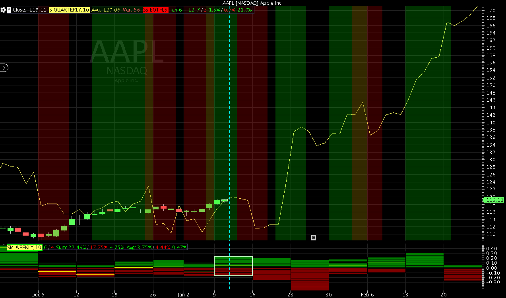

## Table of Contents

## What is seasonality in trading?

Seasonality in trading refers to the patterns and trends that occur in the market at certain times of the year. These patterns can be influenced by factors like holidays, weather changes, and seasonal business cycles. For example, retail stocks might perform better during the holiday season because people buy more gifts, while energy stocks might see changes due to seasonal temperature shifts.

Traders use seasonality to make predictions and plan their investments. By looking at historical data, they can see when certain stocks or markets tend to go up or down. This information helps them decide the best times to buy or sell. However, seasonality is just one tool and it doesn't always work perfectly because other unexpected events can affect the market too.

## How does seasonality affect different financial markets?

Seasonality can affect different financial markets in various ways. In the stock market, certain sectors might see more activity at specific times of the year. For example, retail stocks often do well around the holidays because people spend more on shopping. On the other hand, companies that sell things like sunscreen or swimsuits might see their stocks go up in the summer. This happens because people buy more of these products during warmer months.

In the commodities market, seasonality can be very clear. For instance, natural gas prices might go up in the winter because more people use it to heat their homes. Farmers also plant and harvest crops at certain times of the year, which can affect the prices of grains like wheat or corn. These seasonal changes can help traders predict when prices might go up or down.

In the bond market, seasonality can be seen in things like the demand for municipal bonds. These bonds might be more popular at the end of the year because people want to lower their taxes. Also, interest rates can change with the seasons, which affects how much people want to borrow or invest. Understanding these patterns can help investors make better choices about when to buy or sell.

## Can you give examples of seasonal patterns in stock markets?

In the stock market, one common seasonal pattern is the "Santa Claus Rally." This happens around the end of December and the beginning of January. Many people think that stocks go up during this time because of the holiday spirit and because investors want to make their portfolios look good at the end of the year. Studies show that the stock market often does better during these last five trading days of the year and the first two days of the new year.

Another pattern is the "January Effect." This is when stocks, especially small-cap stocks, tend to do better in January than in other months. People think this happens because investors sell stocks at a loss in December to save on taxes and then buy them back in January. This buying can push stock prices up. Even though the January Effect isn't as strong as it used to be, many traders still watch for it.

Seasonality can also affect specific sectors. For example, the energy sector often sees changes with the seasons. In the winter, energy stocks might go up because people use more heating oil and natural gas. On the other hand, in the summer, companies that sell things like air conditioners or sunscreen might see their stocks rise because people buy more of these products. Understanding these patterns can help investors decide when to buy or sell stocks in these sectors.

## What are the key seasonal periods traders should be aware of?

Traders should know about a few key times of the year when the stock market often acts in certain ways. One important time is the end of December and the start of January, known as the "Santa Claus Rally." During these days, the stock market often goes up because people feel happy about the holidays and want their investments to look good at the end of the year. Another key time is January, when the "January Effect" happens. This is when small company stocks tend to do better because people sell them at a loss in December to save on taxes and then buy them back in January, pushing prices up.

There are also seasonal periods that affect specific parts of the market. For example, in the winter, energy stocks might go up because people use more heating oil and natural gas. In the summer, companies that sell things like air conditioners or sunscreen might see their stocks rise because people buy more of these products. Knowing about these seasonal times can help traders decide when to buy or sell stocks to make the most of these patterns.

## How can traders identify seasonal trends in market data?

Traders can identify seasonal trends in market data by looking at historical price movements over time. They can use charts and graphs to see if there are patterns that happen at the same time each year. For example, they might notice that a certain stock goes up every December or that the whole market tends to do well in January. By studying past data, traders can spot these trends and use them to help make decisions about when to buy or sell.

Another way to find seasonal trends is by using special tools and software. These tools can analyze lots of data quickly and show traders where the seasonal patterns are. They might use things like seasonal indexes or moving averages to see if there are regular ups and downs in the market at certain times of the year. This can help traders be more sure about the patterns they see and use this information to plan their trades better.

## What tools or software can help in analyzing seasonal patterns?

Traders can use different tools and software to find seasonal patterns in the market. One popular tool is a seasonal chart, which shows how a stock or market has moved over the same period each year. This helps traders see if there are regular ups and downs that happen at the same time every year. Another useful tool is a seasonal index, which measures the average performance of a stock or market during different times of the year. By looking at this index, traders can see if there are certain months or seasons when the market tends to do better or worse.

Software like MetaTrader or TradingView can also help traders analyze seasonal patterns. These platforms have special features that let traders look at historical data and see if there are any repeating trends. For example, they can use moving averages to smooth out price data and make it easier to spot seasonal changes. These tools can also show traders how strong these seasonal patterns are, which helps them decide if they should trade based on these patterns.

## How reliable are seasonal patterns in predicting market movements?

Seasonal patterns can help traders guess what might happen in the market, but they are not always right. These patterns look at what happened in the past to predict the future. For example, if a stock goes up every December, traders might think it will go up again this December. But, the market can be tricky, and lots of other things can change what happens. Things like big news events, changes in the economy, or even surprises in the weather can make the market act differently than expected.

Because of these other factors, traders should not rely only on seasonal patterns to make their decisions. It's a good idea to use seasonal patterns along with other tools, like looking at the news or studying the economy. This way, traders can have a better chance of making good guesses about the market. Even though seasonal patterns can give helpful clues, they are just one piece of the puzzle in figuring out what the market might do next.

## What are the risks associated with trading based on seasonality?

Trading based on seasonality can be risky because the market does not always follow the same patterns every year. Even if a stock or market has gone up in December for the past few years, it might not do the same this year. Unexpected things like big news events, changes in the economy, or even the weather can make the market act differently than what the seasonal patterns predict. If traders rely too much on these patterns and the market does something different, they could lose money.

Another risk is that traders might focus too much on seasonal patterns and ignore other important information. It's important to look at the whole picture, including what's happening in the news, the economy, and other parts of the market. If traders only use seasonality to make their decisions, they might miss out on important signs that the market is going to change. Using seasonal patterns along with other tools can help, but traders need to be careful and not depend on them too much.

## How can seasonality be integrated into a broader trading strategy?

Seasonality can be a helpful part of a bigger trading plan, but it should not be the only thing traders look at. Traders can use seasonal patterns to guess when certain stocks or markets might go up or down. For example, if a stock usually goes up in December, a trader might decide to buy it at the end of November and sell it in January. But, because the market can be unpredictable, it's important to also pay attention to other things like news, the economy, and what other traders are doing. By using seasonality along with these other pieces of information, traders can make smarter choices about when to buy and sell.

It's also a good idea to use tools like seasonal charts and software to help spot these patterns. These tools can show traders when a stock or market has moved in the same way at the same time each year. But, even with these tools, traders should not rely only on seasonality. They should always be ready for surprises and have a plan for what to do if the market does not follow the expected pattern. By mixing seasonality with other trading strategies and staying flexible, traders can better handle the ups and downs of the market.

## What advanced statistical methods can be used to refine seasonal trading strategies?

Advanced statistical methods can help traders make their seasonal trading strategies better. One method is called time series analysis. This looks at data over time to find patterns. Traders can use this to see if there are regular ups and downs in the market at certain times of the year. Another method is regression analysis. This helps traders see how different things, like the economy or news events, affect stock prices during different seasons. By using these methods, traders can make more accurate guesses about what the market might do next.

Another useful method is the use of seasonal autoregressive integrated moving average (SARIMA) models. These models take into account both the seasonal patterns and other changes in the data. They help traders predict future price movements more accurately by considering both the regular patterns and the unexpected changes. Traders can also use machine learning algorithms to find and use seasonal patterns. These algorithms can look at a lot of data quickly and find patterns that might be hard for people to see. By using these advanced methods, traders can make their seasonal trading strategies stronger and more reliable.

## How do global events and economic cycles influence seasonal trading patterns?

Global events and economic cycles can change how seasonal trading patterns work. For example, if there is a big news event like a war or a natural disaster, it can make the stock market go up or down in ways that are different from what usually happens at that time of year. Also, if the economy is doing really well or really badly, it can affect how much people want to buy and sell stocks. This means that even if a stock usually goes up in December, it might not do that if there is a big economic problem happening.

Traders need to think about these things when they are using seasonal patterns to make their trading plans. They should not just look at what happened in the past, but also at what is happening right now in the world and the economy. By mixing seasonal patterns with information about global events and economic cycles, traders can make better guesses about what the market might do next. This way, they can be ready for surprises and make smarter choices about when to buy and sell.

## Can you discuss case studies where seasonality played a crucial role in trading outcomes?

One case where seasonality played a big role was in the retail sector during the holiday season. A trader noticed that a certain retail stock always went up in December because people bought more gifts. So, the trader bought the stock at the end of November and sold it in January. The stock did go up as expected, and the trader made a good profit. But, in another year, there was a big economic problem happening at the same time, and the stock did not go up like it usually did. The trader lost money because they did not think about the economic problem along with the seasonal pattern.

Another case study involves the energy sector and its seasonal patterns. A trader saw that energy stocks often went up in the winter because people used more heating oil and natural gas. The trader bought energy stocks in late fall and sold them in early spring. Most years, this worked well, and the trader made money. But one winter, there was a big global event that affected energy prices, and the stocks did not go up as much as usual. The trader learned that even though seasonal patterns can help, they need to think about other things like global events too.

## References & Further Reading

[1]: Tharp, B. (1999). ["Trade Your Way to Financial Freedom"](https://www.amazon.com/Trade-Your-Way-Financial-Freedom/dp/B002AONAS8). McGraw-Hill Education.

[2]: Connor, R. D., & Rossiter, J. A. (2005). ["Seasonality of Stock Returns: International Evidence"](https://www.degruyter.com/document/doi/10.2202/1558-3708.1170/html). Journal of International Financial Markets, Institutions and Money.

[3]: "Algorithmic Trading and DMA: An Introduction to Direct Access Trading Strategies" by Barry Johnson. [Available on Amazon](https://www.amazon.com/Algorithmic-Trading-DMA-introduction-strategies/dp/0956399207).

[4]: Murphy, J. J. (1999). ["Technical Analysis of the Financial Markets: A Comprehensive Guide to Trading Methods and Applications"](https://archive.org/details/technicalanalysi0000murp). New York Institute of Finance.

[5]: "Seasonality: Systems, Strategies, Data, and Outlooks in Futures & Stocks" by Jake Bernstein. [Available on Amazon](http://www.jewishhumorcentral.com/2025/02/adam-sandler-captures-50-years-of.html).

[6]: Lucca, D. O., & Moench, E. (2015). ["The Pre-FOMC Announcement Drift"](https://onlinelibrary.wiley.com/doi/abs/10.1111/jofi.12196). Journal of Finance.