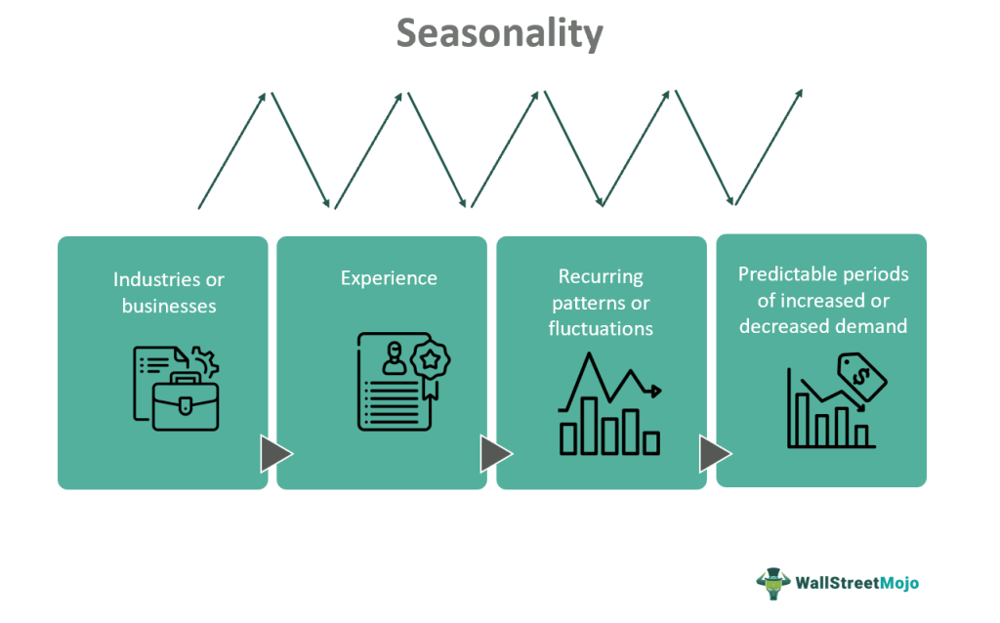

## Table of Contents

## What is seasonality?

Seasonality refers to the regular changes that happen at certain times of the year. These changes can affect many things, like the weather, what people buy, and how they behave. For example, in winter, people might buy more warm clothes and less ice cream. This pattern repeats every year, so businesses and people can plan for it.

Understanding seasonality is important for businesses because it helps them know when to expect more customers or when to stock up on certain products. For example, toy stores might prepare for higher sales around Christmas. By knowing these patterns, businesses can make better decisions about what to sell and when to sell it. This can help them make more money and keep customers happy.

## How does seasonality affect different industries?

Seasonality affects different industries in many ways. In the retail industry, stores see more customers during holiday seasons like Christmas or back-to-school time. They sell more toys, clothes, and school supplies during these times. This means they need to have enough stock and staff to handle the rush. If they don't plan well, they might run out of popular items or have too many leftovers after the season ends.

In the tourism industry, seasonality can make a big difference too. Places like beach resorts get a lot of visitors in the summer but fewer in the winter. This means hotels and restaurants need to plan for busy and quiet times. They might offer special deals during off-peak times to attract more visitors. On the other hand, during peak times, they need to make sure they have enough rooms and services to keep everyone happy.

The agriculture industry also feels the impact of seasonality. Farmers plant and harvest different crops at specific times of the year. For example, strawberries might be ready in the spring, while apples are ready in the fall. This affects what fruits and vegetables are available in stores and how much they cost. Farmers need to plan their planting schedules carefully to make the most of each season.

## Can you explain the difference between seasonal trends and seasonal patterns?

Seasonal trends and seasonal patterns are both about things that happen at certain times of the year, but they are a bit different. Seasonal trends are the big changes that happen over time. For example, if more people start buying electric cars in the winter each year, that's a seasonal trend. Trends show us how things are changing and growing over the years. They help businesses and people see where things might be going in the future.

Seasonal patterns, on the other hand, are the regular and predictable things that happen every year. For example, people buying more ice cream in the summer is a seasonal pattern. These patterns repeat year after year and don't change much. They help businesses plan for what they need to do each season, like stocking up on ice cream before summer starts. Understanding these patterns helps businesses know what to expect and prepare for it.

Both trends and patterns are important for planning. Trends help businesses see the big picture and prepare for the future, while patterns help them deal with the same things that happen every year. By knowing both, businesses can make better decisions and be ready for whatever the seasons bring.

## What are some common examples of seasonality in consumer behavior?

Seasonality in consumer behavior can be seen in many ways. One common example is how people buy more warm clothes and heaters in the winter. They want to stay warm, so stores sell more coats, gloves, and space heaters during this time. Another example is how people buy more ice cream and swimsuits in the summer. They want to cool off and enjoy the sun, so stores see a big increase in sales of these items during the warmer months.

Another way seasonality affects consumer behavior is during holiday seasons. For example, around Christmas, people buy more gifts, decorations, and holiday food. Stores prepare for this by stocking up on toys, wrapping paper, and special holiday treats. Similarly, during back-to-school time, parents buy more school supplies, backpacks, and new clothes for their kids. This is a busy time for stores that sell these items, as they need to have enough stock to meet the demand.

Seasonality also impacts travel and leisure activities. In the summer, more people go on vacations and visit places like beaches and amusement parks. This means hotels, airlines, and tourist spots see a lot more customers during these months. In contrast, during the winter, people might go skiing or visit places that have winter festivals. This affects where people travel and what activities they choose to do, depending on the time of year.

## How can businesses prepare for seasonal fluctuations?

Businesses can prepare for seasonal fluctuations by planning ahead. They need to look at past sales data to see when they get busy and when things slow down. For example, if a store knows it sells a lot of swimsuits in the summer, it can order more before the season starts. This way, they won't run out when customers want to buy them. Businesses also need to think about hiring more staff during busy times to help with the extra customers. If they don't have enough people to help, customers might get frustrated and go somewhere else.

Another way businesses can prepare is by offering special deals during slow times. For example, a hotel might offer lower prices in the winter to attract more visitors when fewer people are traveling. This can help keep the business going even when it's not the busy season. Businesses can also use advertising to let people know about these deals and remind them to come back during the off-peak times. By planning and being smart about how they handle different seasons, businesses can make the most of their busy times and still do well during the slow times.

## What statistical methods are used to identify seasonality in data?

To identify seasonality in data, one common statistical method is time series analysis. This method looks at data over time to see if there are patterns that happen at the same time each year. For example, if ice cream sales go up every summer, time series analysis can help spot that. One specific tool used in time series analysis is called seasonal decomposition. It breaks down the data into different parts, like the overall trend, the seasonal pattern, and any random changes. This helps businesses see clearly what parts of their sales are because of the season and what parts are because of other things.

Another method is the use of seasonal indices. These are numbers that show how much sales or other data go up or down at different times of the year. For example, if a store's sales are usually 20% higher in December than the average month, that month would have a seasonal index of 1.20. By calculating these indices, businesses can predict how much their sales might change in the future based on the time of year. Both time series analysis and seasonal indices help businesses understand and prepare for seasonal changes, making it easier to plan for busy and slow times.

## How does seasonality impact economic forecasting?

Seasonality impacts economic forecasting by making it important for economists to understand and predict regular changes that happen every year. For example, if more people buy things during the holiday season, economists need to know this to make good guesses about how the economy will do. They use past data to see these patterns and then use this information to predict what might happen in the future. By taking seasonality into account, economists can make more accurate forecasts, which helps businesses and governments plan better.

Seasonality can also make economic forecasting tricky because it can hide other important changes. If a business sees a big jump in sales every summer, it might be hard to tell if that's just because of the season or if something else is happening, like a new product becoming popular. Economists use special methods, like seasonal adjustment, to take out the seasonal effects from the data. This helps them see the real trends and changes in the economy more clearly. By doing this, they can give better advice on what might happen next and help everyone be ready for it.

## What are the challenges in predicting seasonal demand?

Predicting seasonal demand can be hard because many things can change from year to year. The weather might be different, which can affect what people want to buy. For example, if it's a warm winter, people might not buy as many coats as usual. Also, new trends can start suddenly, like a new toy becoming popular just before Christmas. This makes it tricky for businesses to guess how much of something they need to have in stock. If they order too much, they might have to sell it at a lower price later, but if they don't order enough, they could miss out on sales.

Another challenge is that different regions might have different seasonal patterns. What's popular in one place might not be the same in another. For example, people in a cold area might buy more snow shovels in winter, but in a warmer area, they might not need them at all. This means businesses that sell in many places have to think about a lot of different patterns at the same time. It's also hard because people's habits can change slowly over time, so what was popular last year might not be as popular this year. All these things make it tough to predict seasonal demand accurately.

## How can seasonality be integrated into inventory management strategies?

Seasonality can be integrated into inventory management strategies by using past sales data to predict when demand will go up or down. Businesses can look at what they sold in previous years during the same time and use that information to order the right amount of stock. For example, if a store knows it sells a lot of swimsuits in the summer, it can order more before the season starts. This helps make sure they have enough to sell without running out, which can make customers happy and keep sales high. By planning ahead and using data, businesses can manage their inventory better and avoid having too much or too little stock at the wrong times.

Another way to integrate seasonality into inventory management is by adjusting stock levels throughout the year. During busy times, like holidays or summer, businesses might need to keep more items in stock to meet the higher demand. They can also hire extra staff to help with the rush. On the other hand, during slower times, they might want to reduce the amount of stock they keep to avoid having too many unsold items. By being flexible and changing their inventory levels based on the season, businesses can save money and make sure they always have what customers want. This helps them run more smoothly and be ready for whatever the season brings.

## What role does seasonality play in financial markets?

Seasonality plays a big role in financial markets because it affects how people buy and sell things like stocks and commodities. For example, in the stock market, there are times of the year when more people might want to buy or sell stocks. This can happen around holidays or at the end of the year when people are thinking about taxes. Knowing these patterns can help investors make better decisions about when to buy or sell. They can look at past data to see when the market usually goes up or down and plan their moves based on that.

In the commodities market, seasonality can affect things like the price of oil or agricultural products. For instance, the demand for heating oil might go up in the winter, which can make its price go up too. Farmers also plant and harvest crops at certain times of the year, which affects how much of those crops are available and what they cost. Traders who know about these seasonal patterns can use them to predict price changes and make smarter trades. By understanding seasonality, people in financial markets can be more prepared and maybe make more money.

## How do global climate changes affect traditional seasonality?

Global climate changes are making traditional seasonality different. The weather is not as predictable as it used to be. Winters might be warmer, and summers might be hotter or longer. This means that the times when people usually buy certain things, like winter coats or summer swimsuits, are changing. For example, if it's not as cold in the winter, people might not need as many warm clothes. This can make it hard for businesses to plan because they can't rely on the same patterns they used to.

These changes also affect farming and the food we eat. Crops that used to grow at certain times of the year might not grow the same way anymore. Some places might get too much rain, while others might not get enough. This can make it hard for farmers to know when to plant and harvest. It also means that the fruits and vegetables we usually see in stores at certain times might not be there when we expect them. Businesses and farmers need to pay close attention to these changes and be ready to adjust their plans to keep up with the new patterns.

## What advanced models are used for decomposing time series data to analyze seasonality?

One common advanced model for decomposing time series data to analyze seasonality is the Seasonal-Trend decomposition using LOESS (STL). This model helps break down the data into three parts: the trend, the seasonal pattern, and any random changes. The trend shows the overall direction the data is going over time, the seasonal pattern shows the regular changes that happen at the same time each year, and the random changes are anything that doesn't fit into the other two parts. By using STL, businesses can see these parts clearly and understand how much of their data is because of the season.

Another model used is the SARIMA (Seasonal AutoRegressive Integrated Moving Average) model. This model is good at predicting future values based on past data and taking into account both the trend and the seasonal patterns. It works by looking at how past values relate to each other and how seasonal changes affect the data. This helps businesses not only see the seasonal patterns but also make guesses about what might happen in the future. Both STL and SARIMA help businesses make better plans by understanding and predicting seasonal changes.

## References & Further Reading

[1]: Jegadeesh, N., & Titman, S. (1993). ["Returns to Buying Winners and Selling Losers: Implications for Stock Market Efficiency."](https://onlinelibrary.wiley.com/doi/abs/10.1111/j.1540-6261.1993.tb04702.x) The Journal of Finance, 48(1), 65-91.

[2]: Thaler, R. H. (1987). ["Anomalies: The January Effect."](https://www.aeaweb.org/articles?id=10.1257/jep.1.1.197) The Journal of Economic Perspectives, 1(1), 197-201.

[3]: Chan, E. (2009). ["Quantitative Trading: How to Build Your Own Algorithmic Trading Business."](https://www.amazon.com/Quantitative-Trading-Build-Algorithmic-Business/dp/0470284889) Wiley Trading.

[4]: Lopez de Prado, M. (2018). ["Advances in Financial Machine Learning."](https://www.amazon.com/Advances-Financial-Machine-Learning-Marcos/dp/1119482089) Wiley.

[5]: Jansen, S. (2020). ["Machine Learning for Algorithmic Trading."](https://www.amazon.com/Machine-Learning-Algorithmic-Trading-intelligence/dp/9918608013) Packt Publishing.

[6]: Aronson, D. R. (2007). ["Evidence-Based Technical Analysis: Applying the Scientific Method and Statistical Inference to Trading Signals."](https://www.wiley.com/en-gb/Evidence+Based+Technical+Analysis:+Applying+the+Scientific+Method+and+Statistical+Inference+to+Trading+Signals-p-9780470008744) Wiley.
