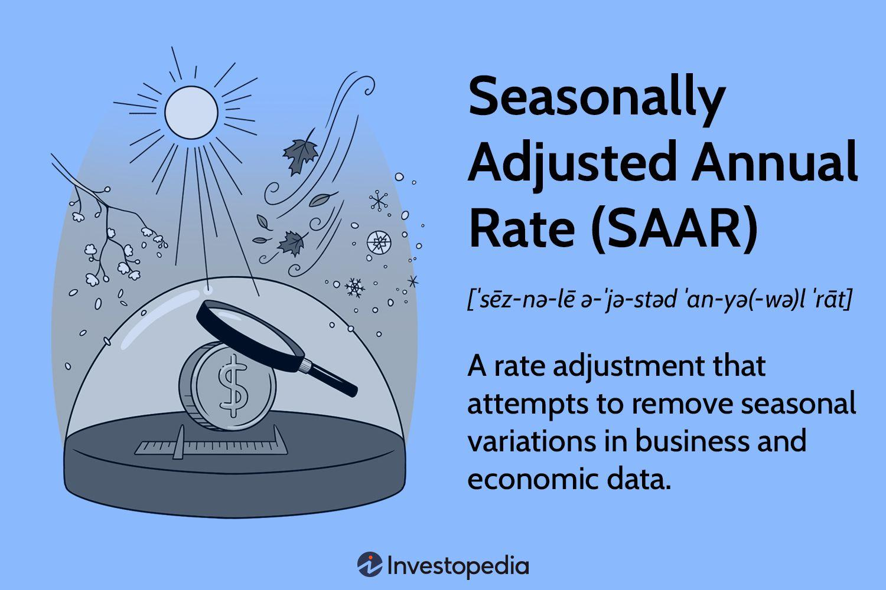

## Table of Contents

## What is a Seasonally Adjusted Annual Rate (SAAR)?

A Seasonally Adjusted Annual Rate, or SAAR, is a way to measure economic data over a year while taking out the ups and downs that happen at certain times of the year. For example, more people might buy cars in the summer than in the winter. SAAR helps to smooth out these seasonal changes so we can see the bigger picture of how the economy is doing over the whole year.

To calculate SAAR, economists look at the data for a shorter period, like a month or a quarter, and then adjust it to remove the effects of seasonal patterns. After that, they project what the whole year would look like if the adjusted rate continued for all 12 months. This gives a clearer idea of trends and helps businesses and policymakers make better decisions without being misled by seasonal fluctuations.

## Why is SAAR important in economic analysis?

SAAR is important in economic analysis because it helps us see the real trends in the economy without getting confused by seasonal changes. For example, if more people buy things during the holidays, that might make it look like the economy is doing better than it really is. By using SAAR, economists can take out these seasonal ups and downs and get a clearer picture of how the economy is doing over the whole year.

This clearer picture is really helpful for making decisions. Businesses can use SAAR to plan better because they can see if their sales are growing or shrinking over time, not just during busy seasons. Policymakers also use SAAR to make smart choices about things like interest rates or government spending. By understanding the true state of the economy, they can help keep it stable and growing.

## How does seasonal adjustment work in SAAR calculations?

Seasonal adjustment in SAAR calculations helps economists see the true trend in data by removing the regular ups and downs that happen every year. For example, if more cars are sold in the summer, that's a seasonal pattern. To adjust for this, economists look at past data to figure out what these patterns usually look like. They then use special math formulas to take out these seasonal effects from the current data. This way, they can see what the data would look like without the seasonal changes.

Once the data is adjusted, economists can then project it over a full year to get the SAAR. They take the adjusted data from a shorter time, like a month or a quarter, and imagine what the whole year would look like if that rate continued. This gives them a clear picture of the yearly trend, making it easier to understand if the economy is growing or shrinking, without the confusion of seasonal highs and lows. This method helps businesses and policymakers make better decisions based on a more accurate view of economic performance.

## What data is typically used to calculate SAAR?

To calculate SAAR, economists typically use data that shows how much of something is being produced or sold over a short period, like a month or a quarter. This could be data on car sales, housing starts, or other economic activities. They collect this data regularly and look at it to see if there are any patterns that happen at the same time every year, like more sales in the summer or fewer in the winter.

Once they have this data, economists use special math to take out the seasonal patterns. This means they adjust the numbers to see what they would look like without the usual ups and downs. After adjusting the data, they can then project it over a whole year to get the SAAR. This helps them understand the true trend in the economy, making it easier to see if things are getting better or worse over time.

## Can you provide a basic example of how to calculate SAAR?

Let's say you want to figure out the SAAR for car sales. First, you need to look at the number of cars sold in a specific month, like January. Let's say 100,000 cars were sold in January. But, you know that January usually has lower car sales because of the cold weather, so you need to adjust this number to remove the seasonal effect. Using past data, you find out that January car sales are usually about 10% lower than the average month. So, you adjust the 100,000 cars sold in January by adding 10% to get 110,000 cars. This is your seasonally adjusted number for January.

Next, to find the SAAR, you take this adjusted number and imagine what it would look like if the same rate continued for the whole year. You multiply the adjusted number of 110,000 cars by 12 (the number of months in a year) to get the annual rate. So, 110,000 cars times 12 equals 1,320,000 cars. This means that if the adjusted rate of car sales from January continued all year, you would expect to sell about 1,320,000 cars in a year. This is your Seasonally Adjusted Annual Rate for car sales.

## What are the common challenges faced when calculating SAAR?

One big challenge when calculating SAAR is getting the seasonal adjustments right. It's hard because the economy can change over time, so past patterns might not be the same in the future. For example, if people start buying more cars in the winter because of new technology, the old data won't help much. Economists have to keep updating their models to make sure they're still accurate, which can be a lot of work.

Another challenge is dealing with unexpected events that can mess up the data. Things like a big storm, a new law, or even a global event like a pandemic can make sales go up or down in ways that aren't normal. These events can make it tough to figure out what the real trend is. Economists have to be careful to spot these unusual changes and not let them affect their SAAR calculations too much.

## How do different industries apply SAAR in their analysis?

In the car industry, SAAR helps companies figure out how many cars they might sell in a whole year. They look at the number of cars sold in a month, adjust for things like holidays or bad weather, and then guess what the whole year might look like. This helps them plan how many cars to make, how much to spend on ads, and where to sell their cars. If they see the SAAR going up, they might decide to make more cars because they think more people will want to buy them.

In the housing market, builders and real estate companies use SAAR to see how many new homes are being started or sold each year. They take the number of homes started or sold in a month, adjust for seasonal changes like more sales in the spring, and then use that to predict the whole year. This helps them decide where to build new houses, how many to build, and how to price them. If the SAAR shows that more people are buying homes, builders might start more projects to meet the demand.

## What software tools are commonly used for SAAR calculations?

Economists and analysts often use special software to calculate SAAR. One popular tool is SAS (Statistical Analysis System), which has a lot of features for doing seasonal adjustments and projections. Another tool is R, a free software that many people use because it has lots of packages that can help with SAAR calculations. These packages can do the math to adjust the data for seasonal changes and then project it over a whole year.

Another commonly used tool is EViews, which is good for time series analysis and can handle the seasonal adjustments needed for SAAR. It's user-friendly and often used by economists in government and business. Excel can also be used for simpler SAAR calculations, especially with add-ons like the X-13ARIMA-SEATS, which is made by the U.S. Census Bureau to help with seasonal adjustments. These tools make it easier for people to take out the seasonal ups and downs and see the bigger picture of economic trends.

## How does SAAR affect forecasting and decision-making in businesses?

SAAR helps businesses see the big picture of their sales over a whole year, without getting mixed up by seasonal changes. For example, if a toy company sells a lot of toys around Christmas, that's normal. But if they use SAAR, they can see if their sales are really going up or down over time, not just during the holidays. This helps them plan better. If the SAAR shows that sales are going up, the company might decide to make more toys or spend more money on ads. If sales are going down, they might look for ways to save money or change their products.

Using SAAR also helps businesses make smarter decisions about the future. When they see the SAAR, they can guess how much they might sell in the coming year and plan their budgets and goals around that. For example, a car company might use SAAR to decide how many cars to make and where to sell them. If the SAAR shows that more people are buying cars, they might build a new factory or open more dealerships. This way, SAAR helps businesses stay ready for what might happen next and make choices that keep them growing and doing well.

## What are the limitations of using SAAR in economic data analysis?

One big problem with using SAAR is that it can be hard to get the seasonal adjustments right. The economy changes over time, so what happened in the past might not happen the same way in the future. For example, if people start buying more cars in winter because of new technology, the old data won't help much. Economists have to keep updating their models to make sure they're still accurate, which can be a lot of work. If they don't update their models, their SAAR might not show the real trend in the economy.

Another problem is that unexpected events can mess up the data. Things like a big storm, a new law, or even a global event like a pandemic can make sales go up or down in ways that aren't normal. These events can make it tough to figure out what the real trend is. Economists have to be careful to spot these unusual changes and not let them affect their SAAR calculations too much. If they don't, the SAAR might give a wrong idea of how the economy is doing.

## Can you explain an advanced SAAR calculation involving multiple seasonal factors?

When calculating SAAR with multiple seasonal factors, economists need to look at more than just one kind of seasonal change. For example, a company might sell more ice cream in the summer, but they might also sell more on weekends because people have more time to go out. To figure out the SAAR, economists would first collect data on ice cream sales for each month and each day of the week. They would then use special math to take out the effects of both the summer months and the weekends. This means they adjust the data to see what it would look like if there were no summer or weekend boosts in sales.

After adjusting for both seasonal factors, economists can then project the adjusted sales over a whole year to get the SAAR. They would take the adjusted number of ice cream sales from a month, imagine what it would look like if that rate continued for all 12 months, and then do the same for the weekend effect. By combining these adjustments, they get a clearer picture of how many ice creams might be sold in a year, without the confusion of seasonal highs and lows from both the summer and weekends. This helps businesses plan better because they can see the true trend in their sales over time.

## How have methodologies for calculating SAAR evolved over time and what are the latest trends?

The way economists calculate SAAR has changed a lot over time. In the past, they used simple math to take out the ups and downs that happen every year. They would look at old data to see what usually happens and then adjust the new data to make it look like those seasonal changes aren't there. But as computers got better, economists started using more advanced math and software to do these calculations. Now, they use special programs like SAS and R that can handle a lot of data and make more accurate adjustments. These programs can also look at more than one kind of seasonal change at the same time, like how sales might go up in the summer and on weekends.

The latest trends in SAAR calculations focus on making the adjustments even more accurate and dealing with unexpected events better. Economists are using [machine learning](/wiki/machine-learning) and other new technologies to find patterns in the data that they might have missed before. This helps them make better guesses about what might happen in the future. They're also working on ways to quickly spot and adjust for things like big storms or new laws that can mess up the data. By doing this, they can make sure the SAAR shows the real trend in the economy, even when something unusual happens.

## What is the method for calculating the SAAR?

The Seasonally Adjusted Annual Rate (SAAR) is a method used to estimate annual data from monthly or quarterly figures while eliminating the effects of seasonality. This process involves several key steps which are essential for ensuring that datasets accurately reflect underlying trends free from seasonal distortions.

To calculate SAAR, analysts begin with a dataset covering a complete year to establish a baseline. Here's a step-by-step breakdown of the process:

1. **Collect and Organize Data**: Gather data that spans at least one full year. This is vital for identifying and averaging out seasonal patterns.

2. **Calculate Monthly or Quarterly Averages**: Divide the total annual data by 12 for monthly data or by 4 for quarterly data to get a simple average. This provides a baseline for understanding each month's (or quarter's) contribution to the total.
$$
   \text{Average for period (month/quarter)} = \frac{\text{Total Annual Data}}{12 \text{ or } 4}

$$

3. **Determine Seasonal Factors**: Analyze each period's data over the year to establish seasonal factors. This involves comparing actual data from each period to the average calculated in the previous step.
$$
   \text{Seasonal Factor} = \frac{\text{Actual Data for the period}}{\text{Average for the period}}

$$

   These factors help to identify whether a particular time period typically shows higher or lower activity compared to what's expected based on the annual average.

4. **Adjust Data for Seasonality**: Using the seasonal factors, adjust the raw data for each period. This step normalizes the data by removing the seasonal effects.
$$
   \text{Seasonally Adjusted Data} = \frac{\text{Actual Data for the period}}{\text{Seasonal Factor}}

$$

5. **Annualize the Adjusted Data**: Once the data for each period has been adjusted, it needs to be annualized. This involves projecting the seasonal effect-corrected data across an entire year, providing an annual perspective on the data that factors out seasonal effects.

   For example, if you have a seasonally adjusted monthly figure, multiply it by 12 to get the SAAR.
$$
   \text{SAAR} = \text{Seasonally Adjusted Data} \times 12 \text{ or } 4

$$

By following these steps, analysts can gain a much clearer view of the long-term trends and underlying changes in data sets, allowing for more accurate financial models and predictions. Understanding these calculations not only aids in interpreting SAAR but also enhances the reliability of forecasting and strategic planning efforts.

## References & Further Reading

[1]: Ghysels, E., & Osborn, D. R. (2001). ["The Econometric Analysis of Seasonal Time Series."](https://www.cambridge.org/core/books/econometric-analysis-of-seasonal-time-series/11ED8F827CBA23E61D4D574062657887) Oxford University Press.

[2]: Marripudi, A., & Lee, N. (2019). ["Introduction to Algorithmic Trading Strategies."](https://onlinelibrary.wiley.com/doi/book/10.1002/9781119206033) Coursera.

[3]: Hyndman, R. J., & Athanasopoulos, G. (2018). ["Forecasting: Principles and Practice."](https://otexts.com/fpp3/) OTexts.

[4]: Franses, P. H., & Paap, R. (2001). ["Quantitative Models in Marketing Research."](https://www.semanticscholar.org/paper/Quantitative-Models-in-Marketing-Research-Franses-Paap/dad0820f287a8cf5a4e8039549e35fc111fd86e5) Cambridge University Press.

[5]: U.S. Census Bureau. ["X-13ARIMA-SEATS: Seasonal Adjustment Software."](https://www.census.gov/data/software/x13as.html)

[6]: Mills, T. C. (2019). ["Applied Time Series Analysis: A Practical Guide to Modeling and Forecasting."](https://www.sciencedirect.com/book/9780128131176/applied-time-series-analysis) Academic Press.